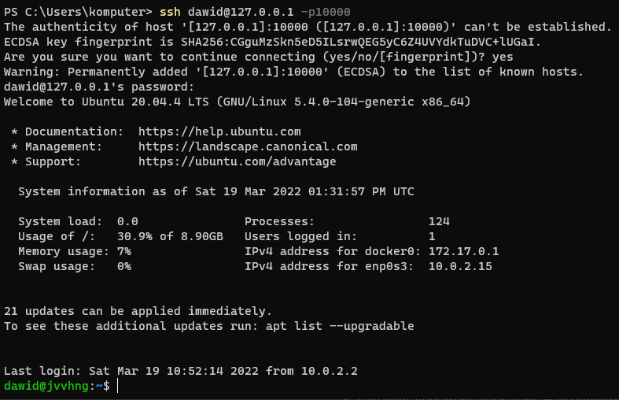
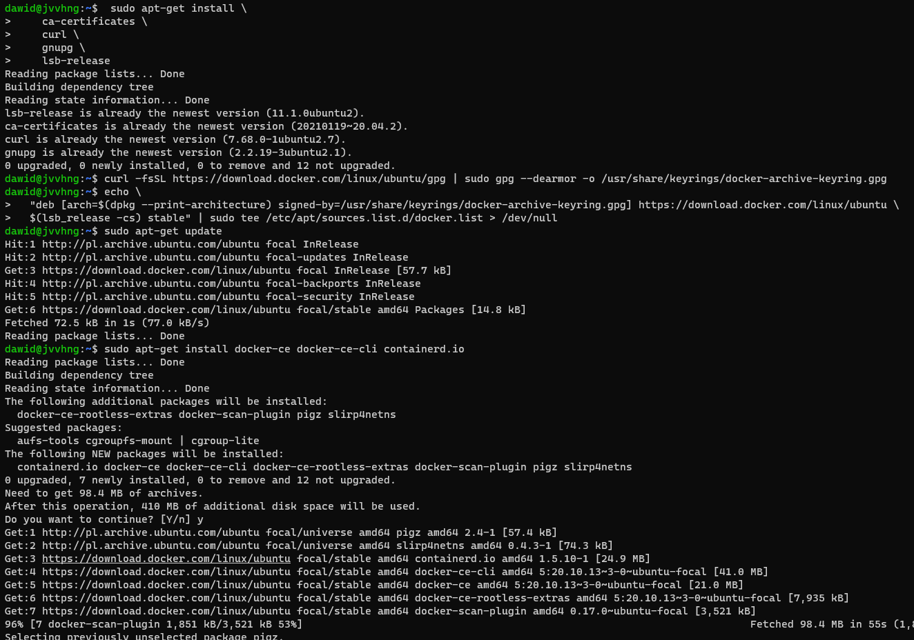
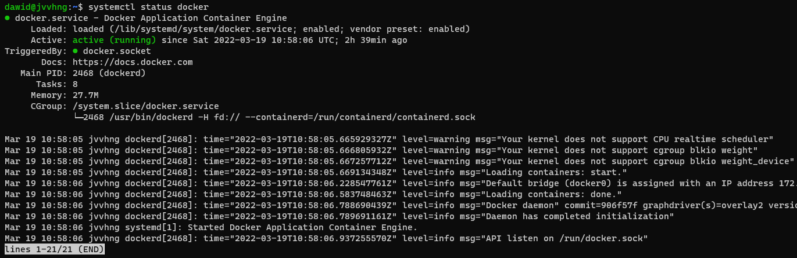
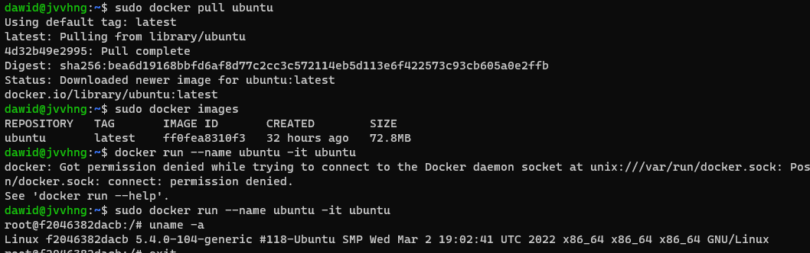
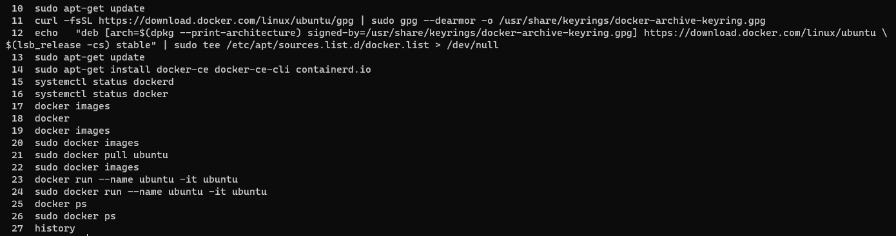

# Sprawozdanie Lab02, Dawid Skorupa

Postać skryptu dla git hook'a **commit-msg**  

  

---

Maszyna wirtualna (Linux), łączenie przez SSH  
Maszyna utworzona za pomocą VirtualBox, dostęp z poziomu systemu host'a.  

Instalacja Docker'a na maszynie wirtulanej:
* Ustawienie odpowiedniego repozytorium
* Instalacja niezbędnych komponentów  

W celu instalacji zreplikowano kroki opisane w dokumenacji Docker'a.

Sprawdzenie działania Docker'a

Utworzenie kontenera, sprawdzenie wersji systemu, który w nim działa

Historia poleceń maszyny wirtualnej, na której działa Docker:

