# Sprawozdanie Lab03, Dawid Skorupa

Do celów zadania wykorzystano własne repozytorium z projektem Javy,  
w którym znajdują się
implementacje różnych algorytmów wraz z testami jednostkowymi.  
Projekt funkcjonuje w oparciu o Maven'a.

Repozytorium dostępne jest pod adresem:  
https://github.com/Dawr82/Java-Algorithms  

Na potrzeby wykonania pierwszych kroków (przeprowadzanie budowy oraz testów aplikacji poza kontenerami) zainstalowano niezbędne narzędzia (JDK, Maven).  
W przypadku kontenerów, te komponenty znajdują się już w ramach obrazu, na którym bazują obrazy kontenerów budujących oraz testujących.

## Klonowanie repozytorium, build i testy  

1. Klonowanie (Git SSH)  
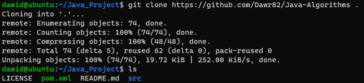  

2. Kompilacja (mvn compile), krok był wykonywany już wcześniej dlatego zależności nie są doinstalowywane  
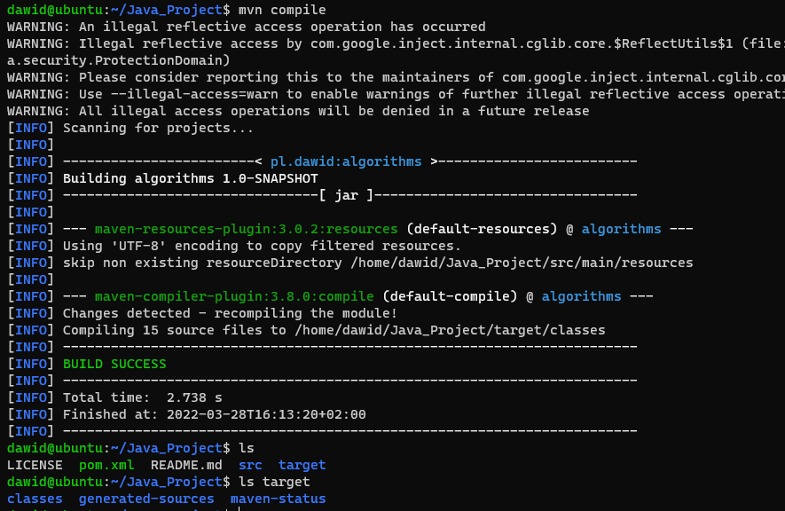  

3. Testy (mvn test)  
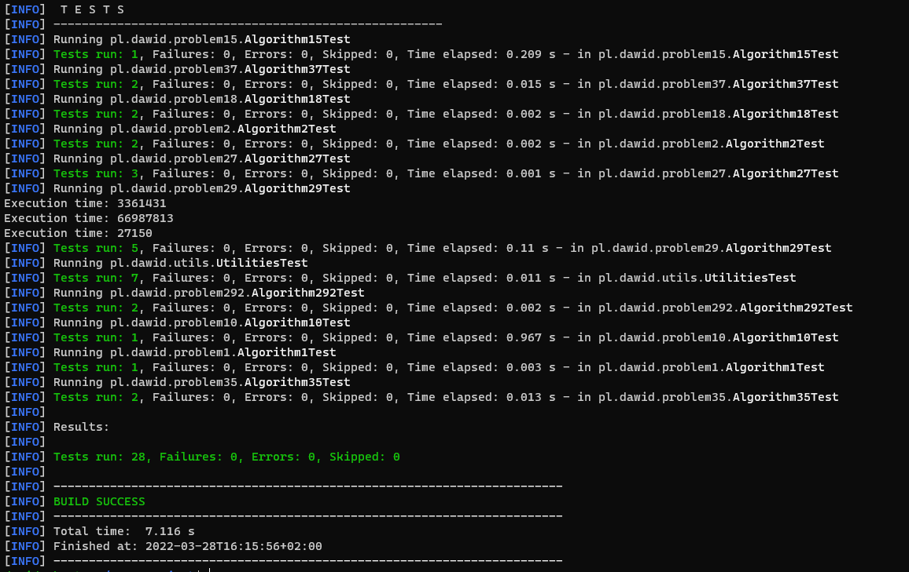  

## Budowa i testy aplikacji w kontenerze  

1. Uruchomienie kontenera (obraz: maven:3.8.4-jdk-11) z komendą /bin/bash oraz trybem interaktywnym (-it)  
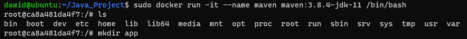  
2. Sklonowanie repozytorium (HTTPS)  
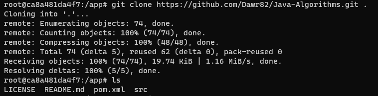  
3. Budowa projektu (mvn compile) - pomijam część wydruku, która dotyczy pobierania zależności  
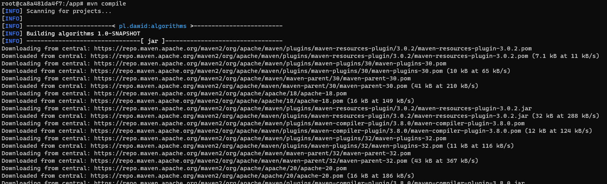  
... (Pobieranie zależności)  
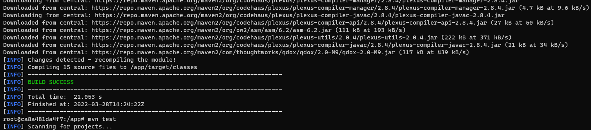  
4. Testy (mvn test)  
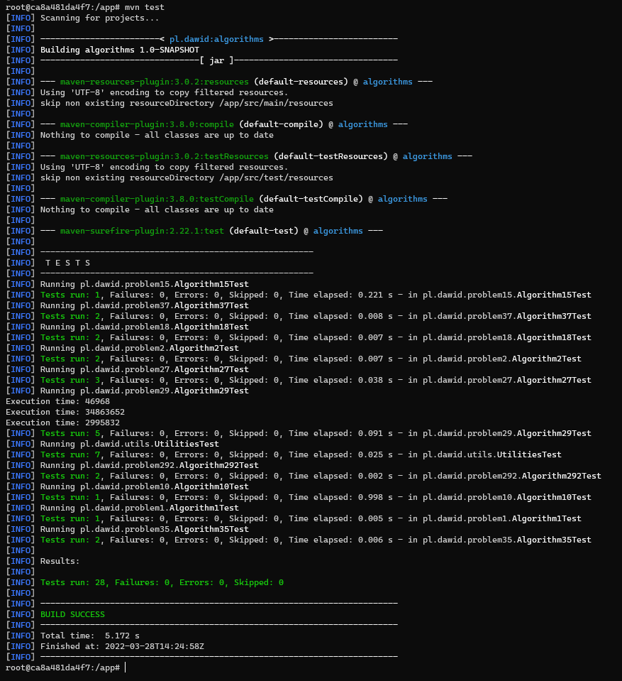  

## Podział pracy na dwa kontenery, definicja Dockerfile  

1. Definicja Dockerfile obrazu kontenera budującego  
  

2. Definicja Dockerfile obrazu testującego (Należy założyć, że obraz app-compile istnieje - został zbudowany przed obrazem, który definiuje poniższy Dockerfile)  
  

3. Budowa obrazu kontenera służącego do budowania projektu  
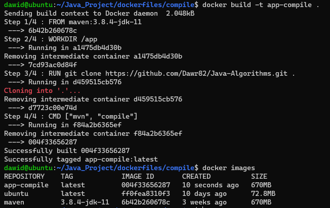  

4. Budowa obrazu kontenera służącego do testów  
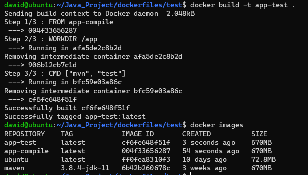  

5. Uruchomienie kontenera budującego (Pomijam część wydruku dotyczącą pobierania zależności)  
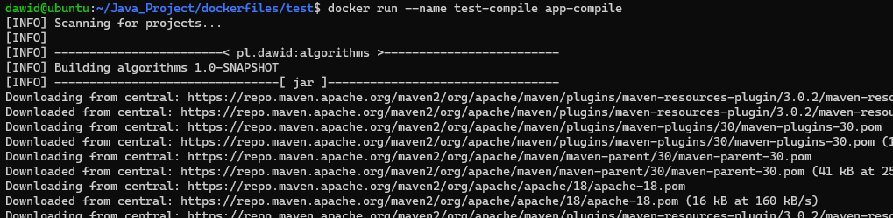  
... (Pobieranie zależności)  
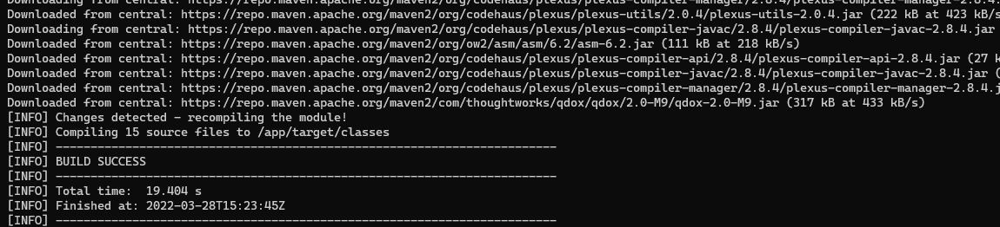  

6. Uruchomienie kontenera testującego  
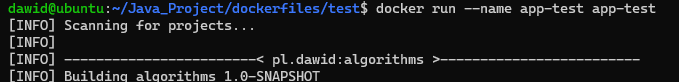  
...  
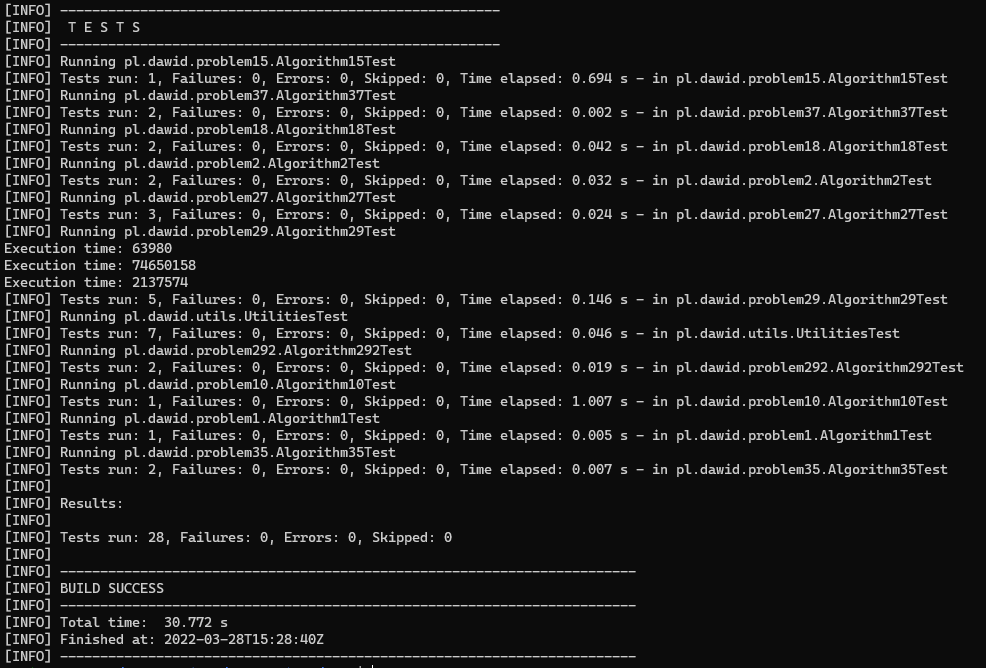  
Kontenery budujący i testujący kończą swoją pracę natychmiast po wykonaniu swoich zadań (build, testy)  
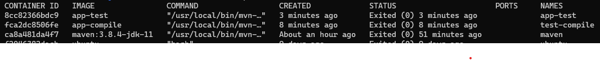  

## Docker compose  
1. Definicja pliku docker-compose.yml  
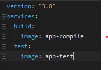  
2. Uruchomienie kompozycji  
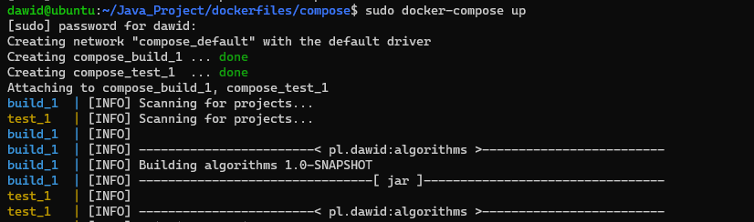  

## Historia poleceń  
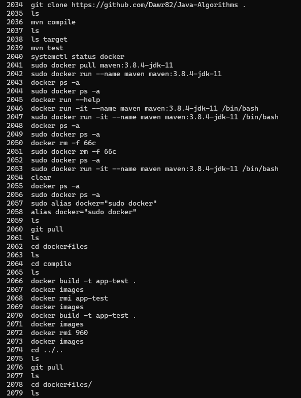  
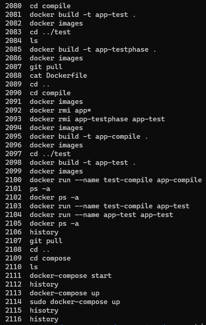  