# Sprawozdanie Lab04, Dawid Skorupa

Do celów zadania wykorzystano własne repozytorium z projektem Javy,  
w którym znajdują się
implementacje różnych algorytmów wraz z testami jednostkowymi.  
Projekt funkcjonuje w oparciu o Maven'a.

Repozytorium dostępne jest pod adresem:  
https://github.com/Dawr82/Java-Algorithms  

## Wykorzystanie woluminów do budowy projektu  

1. Utworzenie woluminu wejściowego i wyjściowego (docker volume create)  
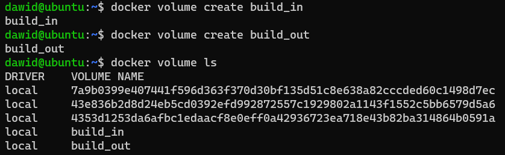
2. Sklonowanie repozytorium do woluminu wejściowego  
Sklonowano do katalogu, w którym Docker przechowuje dane woluminu, na Docker Host.  
Kontener dostaje na wejściu gotowe pliki projektu, nie musi ich pobierać.  
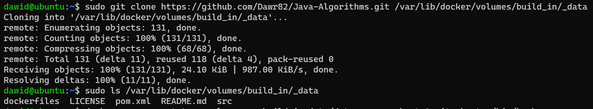
3. Uruchomienie kontenera, podpięcie woluminu (docker run --mount) wejściowego oraz wyjściowego
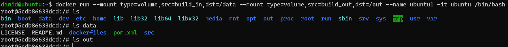
4. Instalacja niezbędnych zależności w kontenerze (JDK oraz Maven)
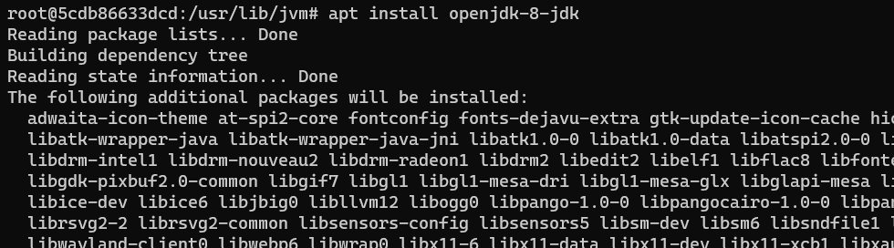
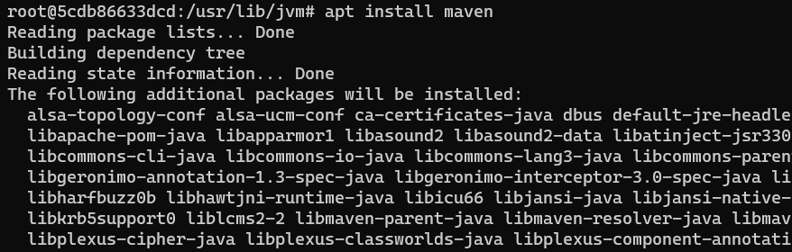
5. Budowa projektu (pominięto wydruk związany z pobieraniem zależności przez Mavena)
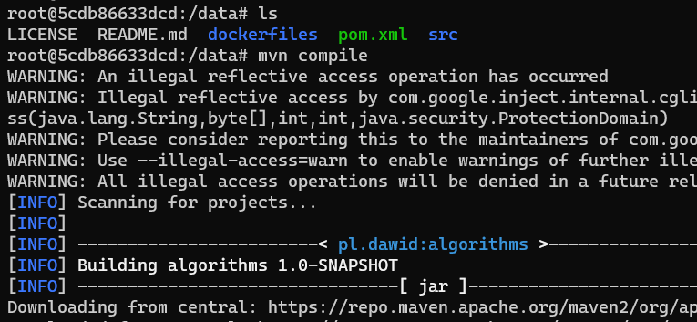
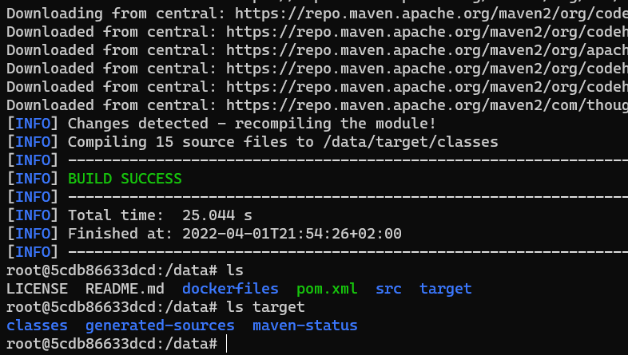
6. Umieszczenie rezultatów builda w woluminie wyjściowym
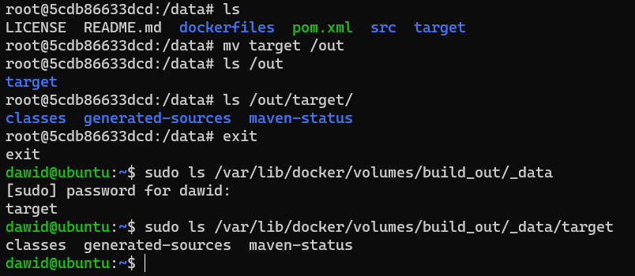

## Publikowanie portów

1. Wdrożenie kontenera z serwerem iperf3  
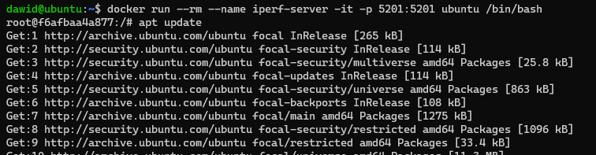  
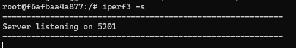  
2. Wdrożenie kolejnego kontenera, połączenie z serwerem iperf3 działającym w wyżej stworzonym kontenerze  
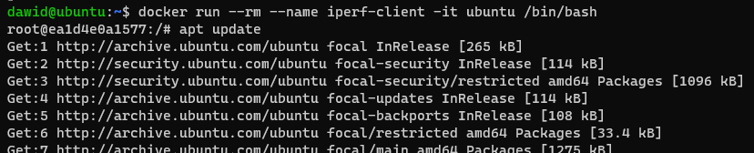  
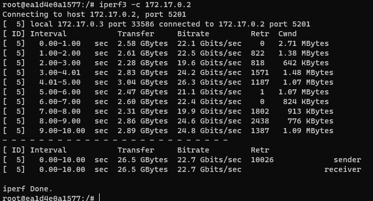  
Sieć, w której znajdują się kontenery (fragment outputu docker network inspect bridge)  

3. Połączenie z serwerem iperf3 (działającym w kontenerze) z poziomu Docker Hosta.  
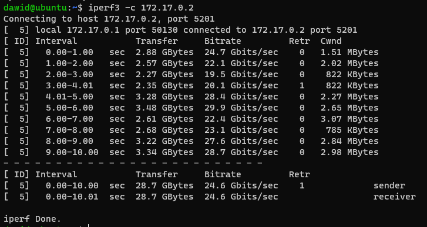
4. Połączenie z serwerem iperf3 (działającym w kontenerze) po adresie IP z sieci lokalnej, do której podłączona jest maszyna wirtualna, na której działa Docker. To ukazuje działanie mapowania portów.
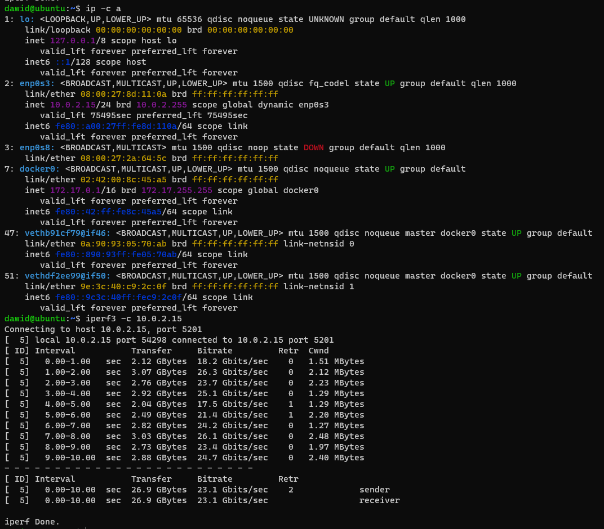
5. Logi serwera
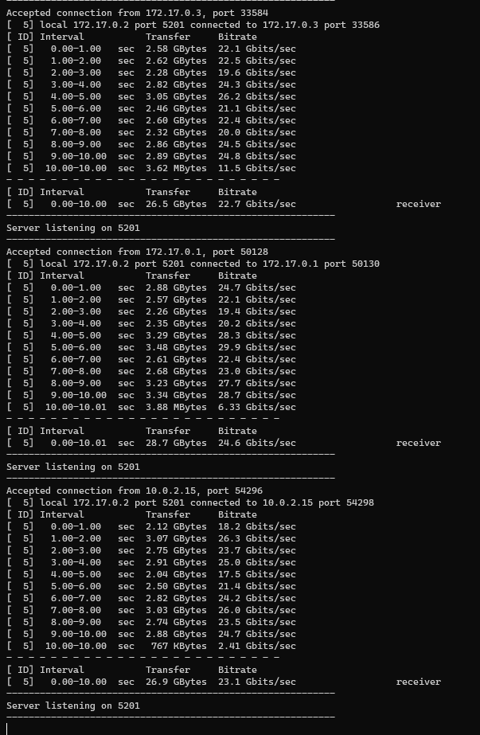

## Instalacja Jenkinsa  
1. Utworzenie sieci na potrzeby Jenkinsa (docker network create jenkins), wdrożenie konentenera DIND (Docker in Docker - Docker worker)  
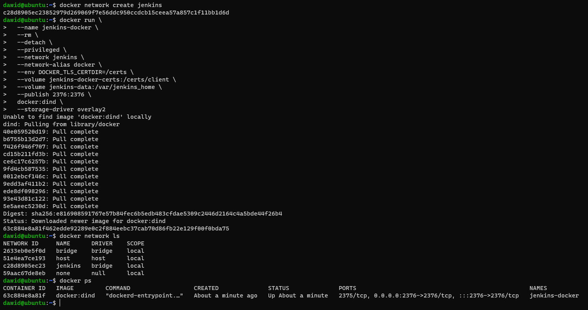  
2. Utworzenie Dockerfile obrazu Jenkinsa (zawartość przekopiowana z dokumentacji), zbudowanie obrazu  
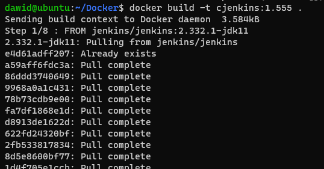  
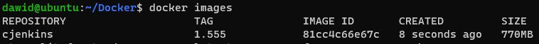  
3. Uruchomienie kontenera z Jenkinsem  
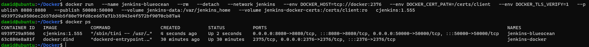  
4. Test działania - logowanie  
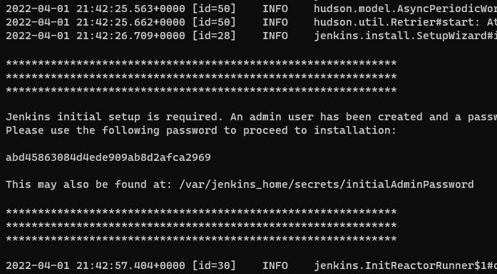  
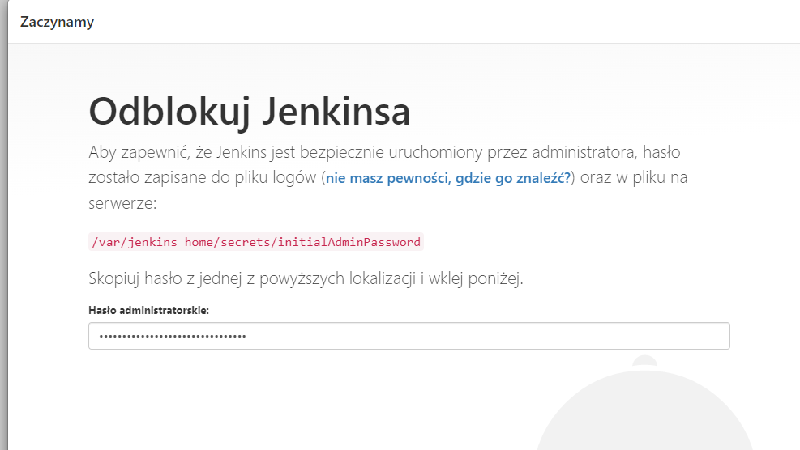  

## Wykorzystane polecenia  

1. docker volume create - tworzenie woluminów
2. docker volume ls - listowanie woluminów
3. docker run - uruchamianie kontenerów
4. docker run --mount - podpinanie woluminów
5. docker run -p - publikowanie portów
6. docker network create - tworzenie sieci
7. docker network ls - listowanie sieci
8. docker network inspect (nazwa_sieci) - szczegóły dotyczące sieci
9. docker build - budowanie obrazu na podstawie Dockerfile
10. docker images - lista pobranych obrazów
11. docker ps - działające kontenery (Up)

## Historia poleceń shella  

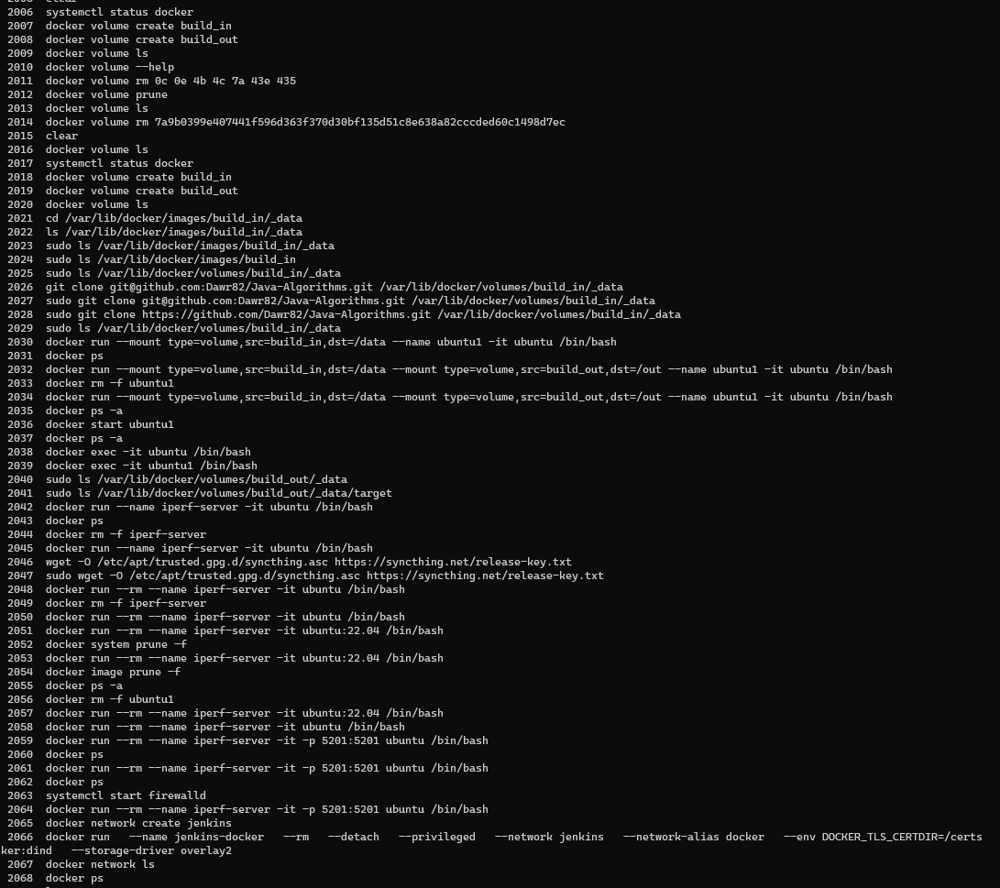  
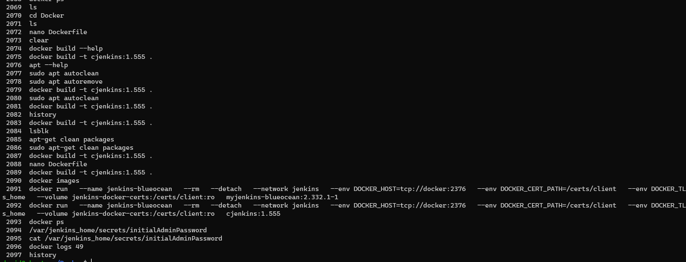  

