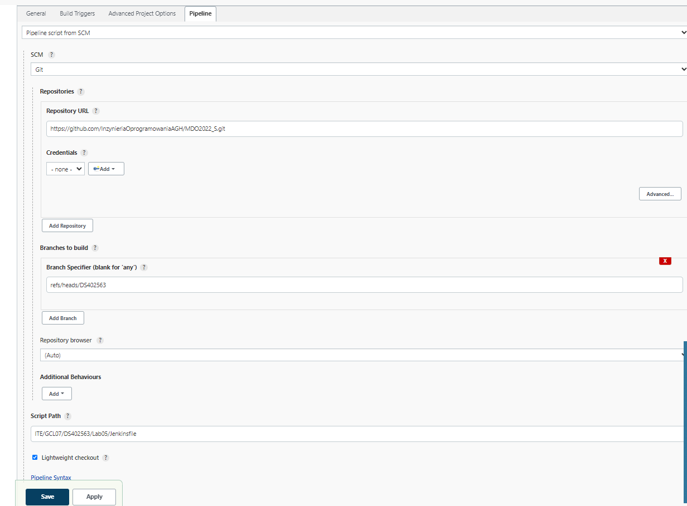
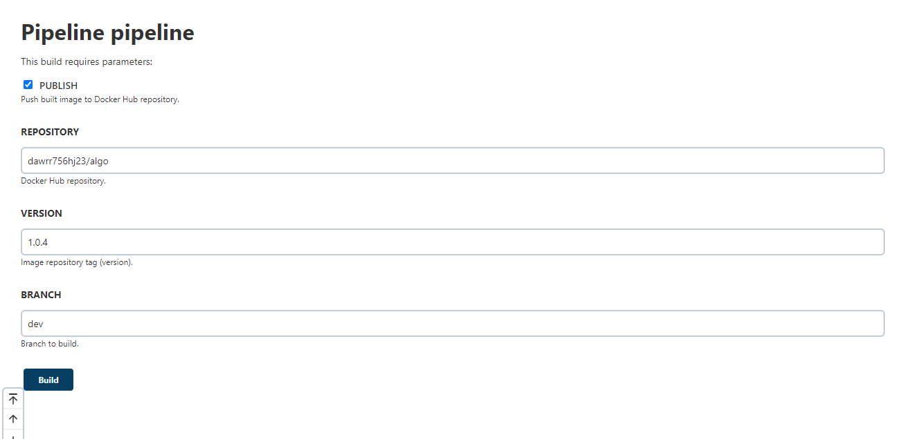
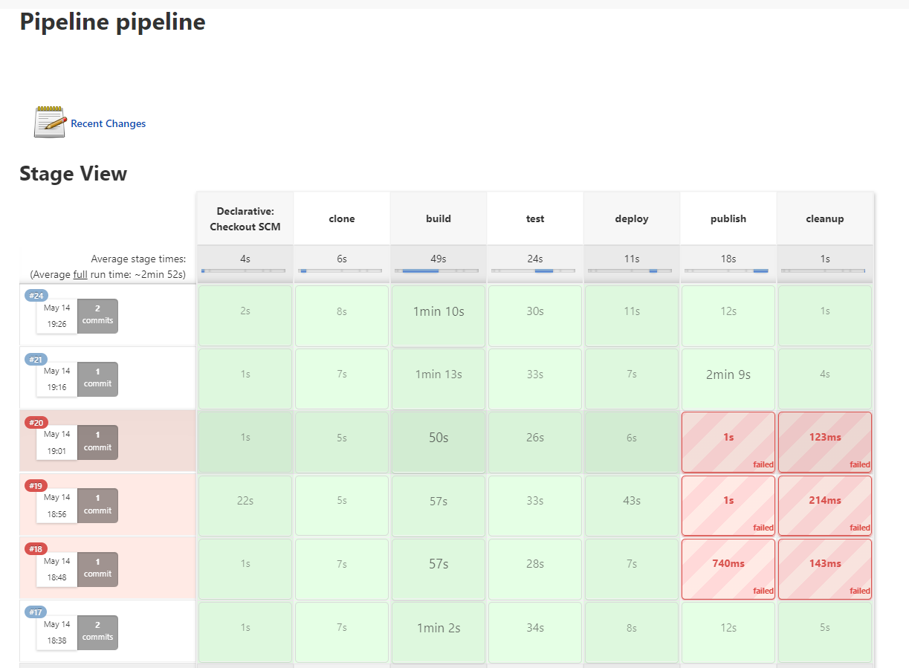

# Sprawozdanie - Jenkins

Do celów projektu wykorzystano repozytorium z własnym kodem (Java).  
Budowany jest prosty program, którego zadaniem jest wykonanie kilku algorytmów.  
Program startuje i po kilku sekundach kończy swoją pracę.

Repozytorium z kodem źródłowym budowanego projektu można znaleźć pod adresem:  
https://github.com/Dawr82/Java-Algorithms

Projekt oparty jest o Maven'a.

Pipeline Jenkins'a składa się z kilku faz (stages), które odpowiadają czynnościom
na drodze budowania i potencjalnie udostępniania oprogramowania.

Pipeline zdefiniowano za pomocą Jenkinsfile, który znajduje się w plikach na osobistym branch'u (DS402563)
w repozytorium przedmiotu.  
Jenkinsfile zawiera kilka parametrów, które pozwalają
na dostosowanie pracy pipeline'a. Większość etapów wykonywana jest przy pomocy kontenerów Docker'a.
Potrzeba do tego Dockerfiles, które również znajdują się w plikach na osobistym branch'u w repozytorium przedmiotu.

Rezultatem pracy pipeline może być (jeżeli zdecydowano się w ogóle publikować) udostępnienie nowego wydania oprogramowania w formie obrazu dostępnego  
na Docker Hub. W repozytorium Docker Hub znajduje się szereg wydań pod postacią tagów odpowiadających wersjom oprogramowania.

Poniżej opisano kolejne kroki, z których składa się cały pipeline.

## Klonowanie repozytorium
Na początek pipeline klonuje repozytorium do woluminu, który następnie zostanie podpięty 
do kontenera budującego. Klonowanie odbywa się poprzez kontener pomocniczy, do którego podpięty jest wolumin docelowy.
Powodem zastosowania takiej metodyki jest uniknięcie problemów związanych z uprawnieniami dostępu 
do danych woluminu.  
Do uruchomienia kontenera pomocniczego wykorzystano tutaj generyczny obraz z systemem Ubuntu dostępny
na Docker Hub.

```
stage('clone') {
            steps {
                sh "docker rm -f clone"
                sh "docker volume create clone"
                sh "docker run --mount source=clone,target=/app --name clone ubuntu"
                sh "rm -rf Java-Algorithms"
                sh "git clone -b ${BRANCH} https://github.com/Dawr82/Java-Algorithms.git"
                sh "docker cp ./Java-Algorithms clone:/app"
                sh "docker rm -f clone"
            }
        }
```  
  
## Budowa projektu
Etap budowy opiera się na obrazie maven:3.8.5-jdk-11 dostępnym na Docker Hub.
Powodem tego wyboru jest wymagana zależność w postaci Maven'a, którym budowany jest projekt. 
Obraz tę zależność posiada, a więc spełnia oczekiwania.

Napisano własny Dockerfile dla obrazu, który bazuje na obrazie maven:3.8.5-jdk-11.


Dockerfile obrazu kontenera budującego.  
```
FROM maven:3.8.5-jdk-11

WORKDIR /app/Java-Algorithms

CMD ["mvn", "package"]

```

Krok "build" w pipeline.
Do kontenera podpinane są dwa woluminy:
* zawierający sklonowany kod źródłowy projektu (wyjście poprzedniego etapu).
* wolumin przeznaczony na wyjście procesu budowania - plik .jar. Maven (poprzez plik pom.xml) skonfigurowany jest tak, aby generował plik .jar w odpowiednim katalogu. Do tego katalogu podpinany jest wolumin wyjściowy.
```
stage('build') {
            steps {
                sh "docker rm -f builder"
                sh "docker volume create build"
                sh "docker build -t builder ITE/GCL07/DS402563/Lab05/builder"
                sh "docker run --rm --mount source=clone,target=/app --mount source=build,target=/app/Java-Algorithms/build --name builder builder"
            }
        }
```

## Testowanie projektu
Etap testowania opiera się również o obraz maven:3.8.5-jdk-11.
Zdefiniowano odpowiedni Dockerfile do zbudowania obrazu, który wykona testy projektu.

Dockerfile obrazu kontenera testującego.
```
FROM maven:3.8.5-jdk-11

WORKDIR /app/Java-Algorithms

CMD ["mvn", "surefire:test"]

```

Do kontenera testującego podpinany jest wolumin, do którego sklonowano repozytorium.
Po procesie budowania zawiera on dodatkowo pliki w katalogu target.
Pozwala to na uruchomienie testów bez konieczności budowania całego projektu na nowo.

Krok "test" w pipeline.
```
stage('test') {
            steps {
                sh "docker rm -f tester"
                sh "docker build -t tester ITE/GCL07/DS402563/Lab05/tester"
                sh "docker run --rm --mount source=clone,target=/app --name tester tester"
            }
        }
```

## Wdrażanie
Wdrażanie polega na uruchomieniu wyjścia etapu budowania, czyli pliku .jar, w dedykowanym kontenerze.
Jeżeli uda się uruchomić kontener i praca działającego w nim programu zakończy się sukcesem (exit code 0), wdrożenie
uznawane jest za pomyślne. Zbudowany program wykonuje się jednorazowo i jego czas życia to (zazwczaj) kilka sekund.

Na potrzeby tego etapu utworzono Dockerfile dla obrazu, który opiera się na obrazie openjdk:11.
Nie jest to obraz z Maven'em jak dla poprzednich kroków, ponieważ Maven do uruchomienia programu potrzebny nie jest - wystarczy program java.

Dockerfile kontenera wdrażającego.
```
FROM openjdk:11

WORKDIR /app

COPY algorithms-1.0.jar .

CMD ["java", "-jar", "algorithms-1.0.jar"]

```

Kontener uruchamia aplikację zawartą w podpiętym do niego woluminie.
Jeżeli komenda docker run (a zatem wdrożenie aplikacji) powiedzie się, zostanie wykona kolejna, której
zadaniem jest wyjęcie katalogu z plikiem .jar z woluminu. Jest to robione po to, aby w kolejnym kroku
móc skopiować pliki programu do obrazu, który zostanie następnie wysłany jako produkt końcowy do Docker Hub.

Krok "deploy" w pipeline.

```
 stage('deploy') {
            steps {
                sh "docker rm -f deployer"
                sh "docker build -t deployer ITE/GCL07/DS402563/Lab05/deployer"
                sh "docker run --mount source=build,target=/app --name deployer deployer"
                sh "docker cp deployer:/app /var/jenkins_home/workspace/${env.JOB_BASE_NAME}/ITE/GCL07/DS402563/Lab05/publish"
                sh "docker rm -f deployer"
            }
        }
```

## Publikowanie
Jeżeli wszystkie poprzednie kroki zakończą się pomyślnie oraz użytkownik zaznaczył opcję PUBLISH
przy uruchamianiu pipeline'a, aplikacja jest publikowana. Publikowanie odbywa się poprzez wysłanie obrazu, którego zadaniem jest uruchamianie otrzymanej aplikacji.

Budowany jest obraz, który zostanie wysłany do Docker Hub pod określoną wersją.
Obraz bazuje na obrazie openjdk:11.

Dockerfile publikowanego obrazu.

```
FROM openjdk:11

WORKDIR /app

COPY ./app/algorithms-1.0.jar .

CMD ["java", "-jar", "algorithms-1.0.jar"]

```

Krok "publish" w pipeline.
```
stage('publish') {
            when {
                expression {
                    return params.PUBLISH
                }
            }
            steps {
                sh "docker build -t ${REPOSITORY}:${VERSION} ITE/GCL07/DS402563/Lab05/publish"
                sh "docker push ${REPOSITORY}:${VERSION}"
            }
        }
```


## Sprzątanie
Po wykonaniu całego pipeline'a, kasowane jest to co powstało w rezultacie jego działania, a więc m.in obrazy kontenerów dedykowanych poszczególnym krokom oraz woluminy.

```
stage('cleanup'){
            steps {
                sh "docker rmi builder"
                sh "docker rmi tester"
                sh "docker rmi deployer"
                sh "docker rmi ${REPOSITORY}:${VERSION}"
                sh "docker volume rm clone"
                sh "docker volume rm build"
            }
        }
```

## Podsumowanie
Całościowo pipeline prezentuje się następująco:  

```
pipeline {
    agent any
    parameters {
        booleanParam(name: 'PUBLISH', defaultValue: true, description: 'Push built image to Docker Hub repository.')
        string(name: 'REPOSITORY', description: 'Docker Hub repository.')
        string(name: 'VERSION', description: 'Image repository tag (version).')
        string(name: 'BRANCH', defaultValue: 'dev', description: 'Branch to build.')
    }

    stages {
        stage('clone') {
            steps {
                sh "docker rm -f clone"
                sh "docker volume create clone"
                sh "docker run --mount source=clone,target=/app --name clone ubuntu"
                sh "rm -rf Java-Algorithms"
                sh "git clone -b ${BRANCH} https://github.com/Dawr82/Java-Algorithms.git"
                sh "docker cp ./Java-Algorithms clone:/app"
                sh "docker rm -f clone"
            }
        }
        stage('build') {
            steps {
                sh "docker rm -f builder"
                sh "docker volume create build"
                sh "docker build -t builder ITE/GCL07/DS402563/Lab05/builder"
                sh "docker run --rm --mount source=clone,target=/app --mount source=build,target=/app/Java-Algorithms/build --name builder builder"
            }
        }
        stage('test') {
            steps {
                sh "docker rm -f tester"
                sh "docker build -t tester ITE/GCL07/DS402563/Lab05/tester"
                sh "docker run --rm --mount source=clone,target=/app --name tester tester"
            }
        }
        stage('deploy') {
            steps {
                sh "docker rm -f deployer"
                sh "docker build -t deployer ITE/GCL07/DS402563/Lab05/deployer"
                sh "docker run --mount source=build,target=/app --name deployer deployer"
                sh "docker cp deployer:/app /var/jenkins_home/workspace/${env.JOB_BASE_NAME}/ITE/GCL07/DS402563/Lab05/publish"
                sh "docker rm -f deployer"
            }
        }
        stage('publish') {
            when {
                expression {
                    return params.PUBLISH
                }
            }
            steps {
                sh "pwd"
                sh "docker build -t ${REPOSITORY}:${VERSION} ITE/GCL07/DS402563/Lab05/publish"
                sh "docker push ${REPOSITORY}:${VERSION}"
            }
        }
        stage('cleanup'){
            steps {
                sh "docker rmi builder"
                sh "docker rmi tester"
                sh "docker rmi deployer"
                sh "docker rmi ${REPOSITORY}:${VERSION}"
                sh "docker volume rm clone"
                sh "docker volume rm build"
            }
        }
    }
}
```

# Tworzenie pipeline w GUI Jenkins'a

Kreator tworzenie Pipeline


Uruchamianie Pipeline z wyborem wartości parametrów.


Pomyślny przebieg zadań w Pipeline
