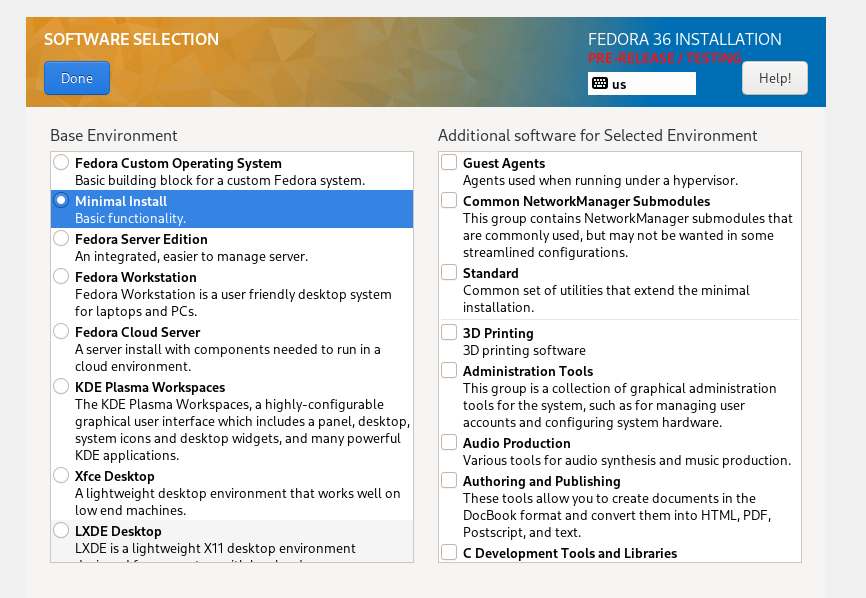
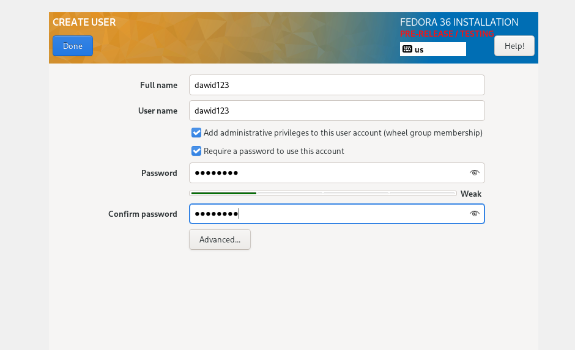
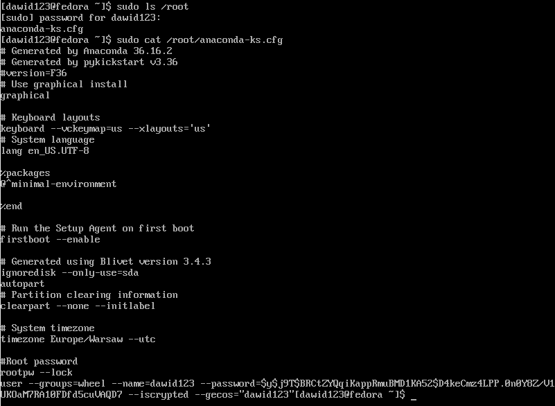
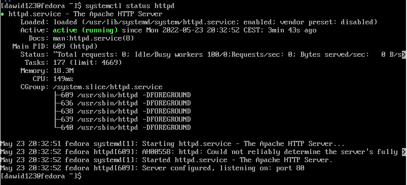
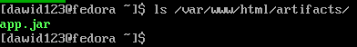
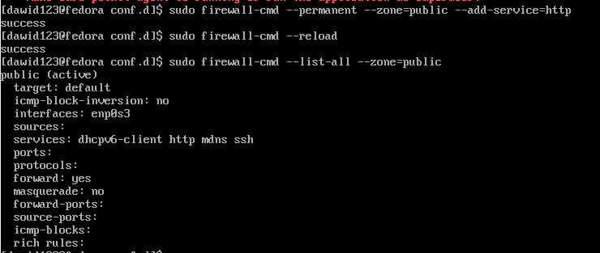
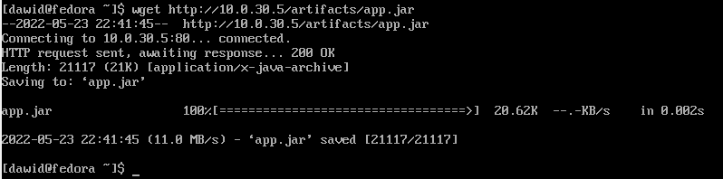

# Sprawozdanie Lab 9 - Dawid Skorupa

W ramach laboratorium wdrożono maszyny wirtualne z systemem Fedora. Dokonano tego w dwóch wariantach:
* Ręcznie przeklikując kolejne okna w menedżerze instalacji (anaconda)
* Wykorzystując plik Kickstart (anaconda-ks.cfg) wygenerowany po ręcznym zainstalowaniu systemu.

## Ręczne wdrożenie maszyny wirtualnej

1. Podczas instalacji wybrano wariant minimalny. Utworzono przykładowego użytkownika. Pozostałe opcje pozostawiono domyślne, ponieważ były satysfakcjonujące.


2. Po instalacji sprawdzono katalog /root w celu potwierdzenia, że plik odpowiedzi został wygenerowany prawidłowo.

3. Kroki powielono dla drugiej maszyny wirtualnej.
4. Na jednej z maszyn wirtualnych zainstalowano i skonfigurowano serwer HTTP (apache2).  

Utworzono katalog /var/www/html/artifacts dla artefaktów, które zwraca serwer. We wspomnianym katalogu umieszczono artefakt (połączenie za pomocą SFTP, Filezilla).

Dodano odpowiednie reguły firewall'd, aby umożliwić połączenia przychodzące HTTP.  

5. Z poziomu drugiej maszyny wirtualnej znajdującej się w tej samej sieci NAT w VirtualBox wykonano zapytanie za pomocą narzędzia wget w celu pobrania artefaktu.


## Instalacja nienadzorowana

1. Za pomocą program Filezilla skopiowano plik odpowiedzi z maszyny wirtualnej na maszynę hosta.
2. Zmodyfikowano plik odpowiedzi tak, aby zawierał niezbędne dependencje potrzebne do pobrania artefaktu z serwera HTTP, a zatem narzędzie wget.  
Zmodyfikowano sekcję %packages tak, aby poza instalacją minimalnego środowiska zainstalowane zostało również narzędzie wget.  

    ```
    %packages
    @^minimal-environment
    wget
    %end
    ```
3. Dodano repozytoria, z których będą pobierane:
   * pliki potrzebne do instalacji systemu
   * dodatkowe pakiety (menedżer pakietów)  

    Wykorzystano przy tym komendy url oraz repo.
4. Dodano sekcję post (czynności po instalacji systemu operacyjnego), w której wykonywane jest pobranie artefaktu z repozytorium.
    ```
    %post
    wget http://10.0.30.5/artifacts/app.jar
    %end
    ```
5. Zmodyfikowany plik odpowiedzi wysłano do repozytorium przedmiotowego na osobistego brancha (DS402563).
6. Przy pomocy pliku odpowiedzi wdrożono kolejną maszynę wirtualną. W tym celu, do komendy widocznej po starcie maszyny, dodano opcję inst.ks o wartości będącej źródłem pliku wyjścia.