# Sprawozdanie Lab10 - Dawid Skorupa

W ramach laboratorium zastosowano narzędzie Ansible do automatyzacji zarządzania konfiguracją maszyn wirtualnych.  

Finalny playbook oraz inventory są dostępne razem z plikiem sprawozdania na osobistym branchu (DS402563) w repozytorium przedmiotu.
## Przygotowanie maszyn wirtualnych
1. Wykorzystano trzy maszyny wirtualne z systemem Fedora wdrożone na poprzednich zajęciach. Jedna maszyna typu master oraz dwie maszyny typu slave. 
Maszyny wdrożono w VirtualBox. Umieszczono je w jednej sieci NAT działającej w ramach VirtualBox.

    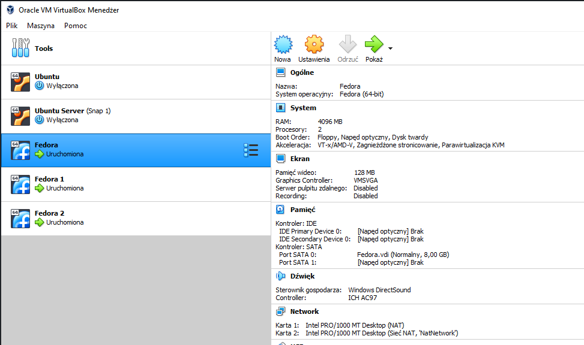

2. Instalacja narzędzia ansible na jednej z maszyn (master).

    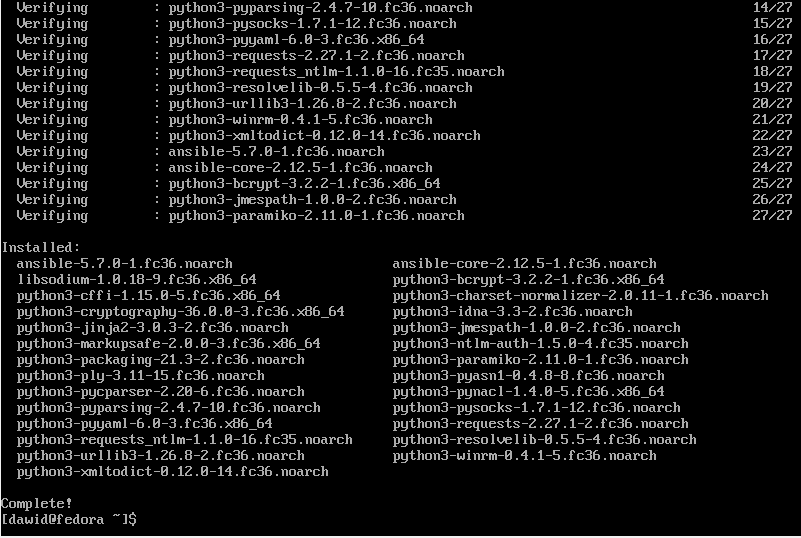

3. Utworzenie pliku inventory. W najprostszej formie jest to zaledwie listing adresów IP zarządzanych maszyn.

    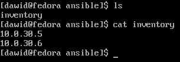

4. Wykonanie modułu ping na zarządzanych maszynach za pomocą polecenia ansible. Wykorzystano przy tym utworzony plik inventory.

    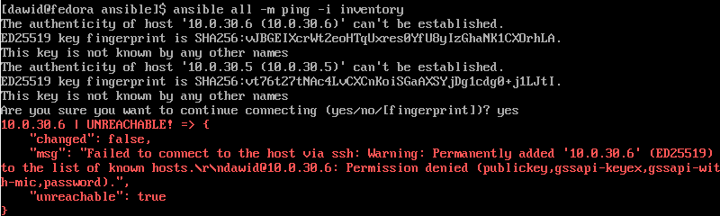

    W poleceniu wskazujemy plik inventory, moduł oraz cel z pliku inventory. W tym przypadku jest to all - moduł zostanie wykonany na wszystkich maszynach zdefiniowanych w pliku inventory.

    Niestety, wykonanie modułu nie powodzi się ze względu na brak konfiguracji połączenia SSH z zarządzanymi maszynami. Ansible potrzebuje się połączyć z maszynami przez SSH, aby wykonać moduł ping po ich stronie.

    Jednym z rozwiązań (aczkolwiek ułomnych) jest przekazanie nazwy użytkownika i jego hasła, do ktorego się połączyć, w pliku inventory.

    Wtedy zmodyfikowane inventory wygląda następująco:

    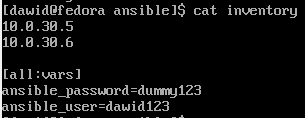

    Ponowne wykonanie modułu ping kończy się sukcesem

    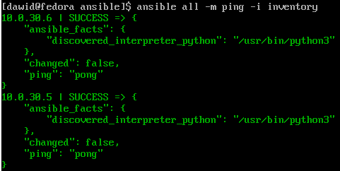

5. Konfiguracja połączenia za pomocą kluczy SSH. W tym celu wygenerowano dwie pary kluczy SSH i umieszczono klucze publiczne na maszynach zarządzanych.

    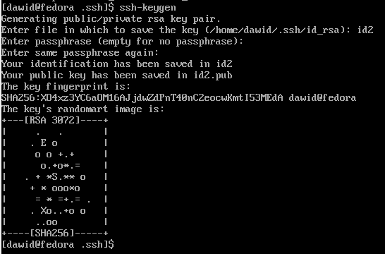

    Maszyna 1 - klucz publiczny

    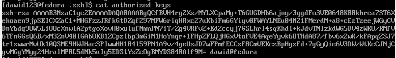

    Maszyna 2 - klucz publiczny

    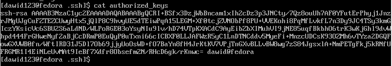

    Następnie, zmodyfikowano plik inventory tak, aby uwzględniał połączenie przez SSH. W tym celu wskazano ścieżki plików kluczy prywatnych.

    

    W tym przypadku zmienna ansible_ssh_private_key_file ma wartości charakterystyczna dla danego hosta. Nie można jej zatem zdefiniować w ramach sekcji all:vars.

    Wykonano moduł ping na maszynach wykorzystując nowe inventory.

    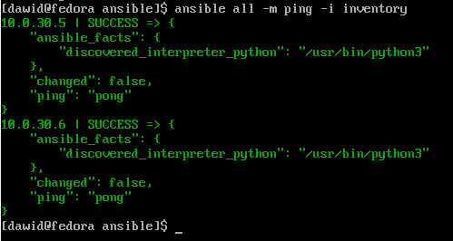

## Playbook

1. Zdefiniowano plik playbook z jednym play, który składa się z kilku zadań. Do zadań wliczają się:
    * Wykonanie modułu ping na maszynach docelowych
    * Instalacja oprogramowania - program ncdu
    * Instalacja dodatkowego repozytorium - rpmfusion

    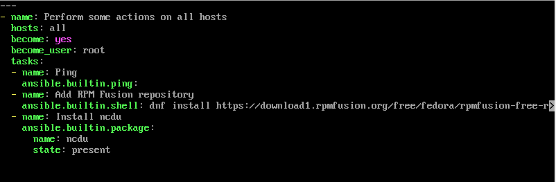
2. Wykonanie playbooka za pomocą narzędzia ansible-playbook.  

    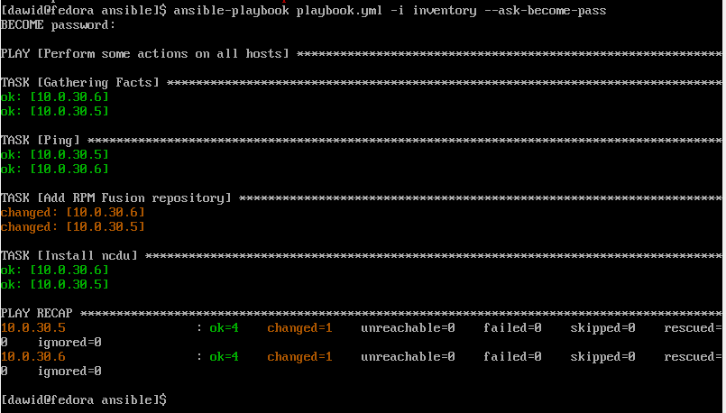

    Narzędzie ncdu było już zainstalowane przed wykonaniem playbooka dlatego stan nie uległ zmianie (status ok).

