# Sprawozdanie Kubernetes (LAB11 i LAB12)

W ramach laboratoriów 11 i 12 wdrożono aplikację kontenerową w klastrze Kubernetesa.

Obraz kontenera z aplikacją dostępny jest w DockerHub:  
https://hub.docker.com/repository/docker/dawrr756hj23/spring-boot-api

## Lab 11

### Instalacja minikube

1. Zainstalowano klaster Kubernetesa minikube. Węzły klastra wdrożono jako kontenery Dockera, co określa się za pomocą opcji --driver (inne możliwości to np. wirtualne maszyny w VirtualBox). Wykazano, że klaster działa, na kilka sposobów.  
Uruchomienie klastra wymagało obecności co najmniej dwóch vCPU w maszynie wirtualnej.

    
    
    
    
    

2. Zainstalowano narzędzie kubectl do wykonywania operacji na klastrze.
Sprawdzono czy narzedzie kubectl jest podłączone do właściwego klastra poprzez wykonanie komendy kubectl get nodes.

    
    

3. Uruchomiono minikube dashboard.  
 Maszyna wirtualna, na której działa minikube wdrożona została w VirtualBox. 
 Maszyna posiada kartę sieciową typu NAT. Aby umożliwić połączenie z dashboard z poziomu maszyny hosta należało uruchomić serwer proxy (kubectl proxy) tak, aby nasłuchiwał na adresie należącym do wspomnianej wyżej karty. Następnie dodano regułę NAT w ustawieniach karty w VirtualBox.  
Dashboard jest wdrażany jako pody w klastrze minikube.

    
    
    
    
    

 ### Przygotowanie aplikacji do wdrożenia

 1. Umieszczenie obrazu kontenera z aplikacją w DockerHub. Aplikacją jest proste REST API napisane w Javie.

    

2. Uruchomienie kontenera z aplikacją w celu przetestowania poprawności działania. Przykładowe połączenie z REST API za pomocą narzędzia curl.

    

### Uruchomienie aplikacji w klastrze Kubernetesa

1. Uruchomienie aplikacji w klastrze za pomocą komendy kubectl run. Potwierdzenie działania poda z aplikacją za pomocą komendy kubectl get pods.

    

2. Sprawdzenie stanu poda w minikube dashboard.

    

3. Udostępnienie połączenia z kontenerem w podzie na zewnątrz klastra tzn. z poziomu maszyny wirtualnej (klaster działa w Dockerze). Sprawdzenie możliwości połączenia z aplikacją za pomocą narzędzia curl.

    

### Uruchomienie aplikacji w klastrze jako wdrożenie (Deployment)

1. Sporządzenie pliku YAML wdrożenia. Zaaplikowanie pliku wdrożenia za pomocą kubectl apply.  
Wdrożenie składa się z 3 replik. Zaaplikowanie wdrożenia powoduje utworzenie:
    * obiektu Deployment - deployment.apps/api-deployment
    * obiektu ReplicaSet - replicaset.apps/api-deployment-...
    * obiektów Podów    - pod/api-deployment-...   

    
    

2. Sprawdzenie działania wdrożenia (i związanych z nim obiektów) w dashboard.

    

## Lab 12

W tym momencie w klastrze działają już pody wdrożenia zaaplikowanego na poprzednim laboratorium (plik YAML na zrzucie ekranu na końcu poprzedniej sekcji).

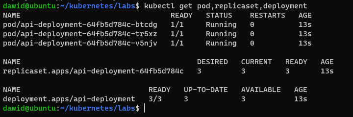

1. Zwiększenie ilości replik wdrożenia z 3 do 7. W tym celu zmodyfikowano wartość atrybutu replicas w pliku definicji wdrożenia. Po zmodyfikowaniu zaaplikowano plik konfiguracyjny. Spowodowało to dodanie podów, aby usatysfakcjonować wymagania wdrożenia.  
Zaraz po wykonaniu komendy kubectl apply wykonano kubectl rollout status w celu sprawdzenia stanu wdrożenia. Nowe pody były kolejno uruchamiane aż do osiągnięcia żądanej ilości.

    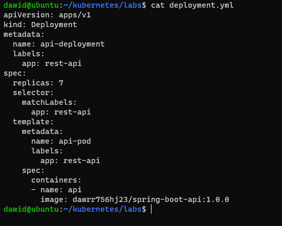
    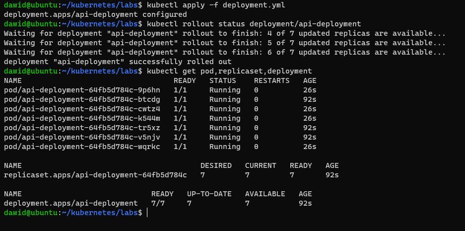

2. Przygotowanie dwóch nowych wersji obrazu (charakteryzowanych poprzez tagi obrazu)
    * 1.0.1 - wersja działająca
    * 1.0.2 - wersja wadliwa

   Obrazy umieszczono w DockerHub.

   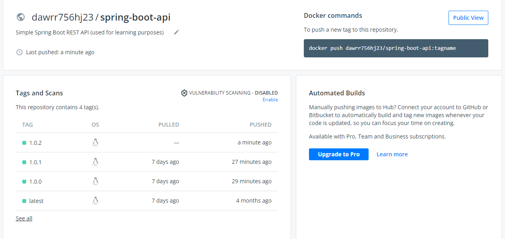

   Wykazano, że wersja 1.0.2 jest wadliwa poprzez uruchomienie kontenera w samym Dockerze.

   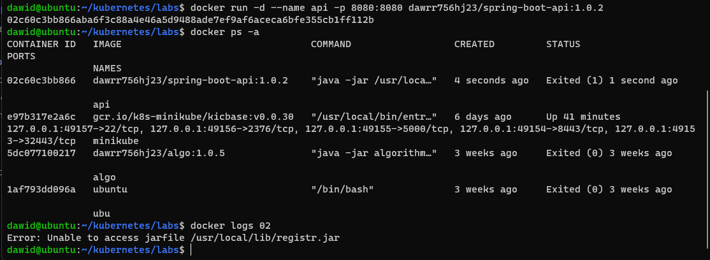

3. Testowanie mechanizmów skalowania oraz cofania zmian wdrożeń. Przetestowano kilka przypadków. W większości z nich cofnięcie nie jest możliwe, ponieważ zmiany nie powodują dodania nowych revision do historii (dotyczą skalowania, a nie zmiany obrazu wdrożenia).
    * Zwiększenie ilości replik z 7 do 10.

        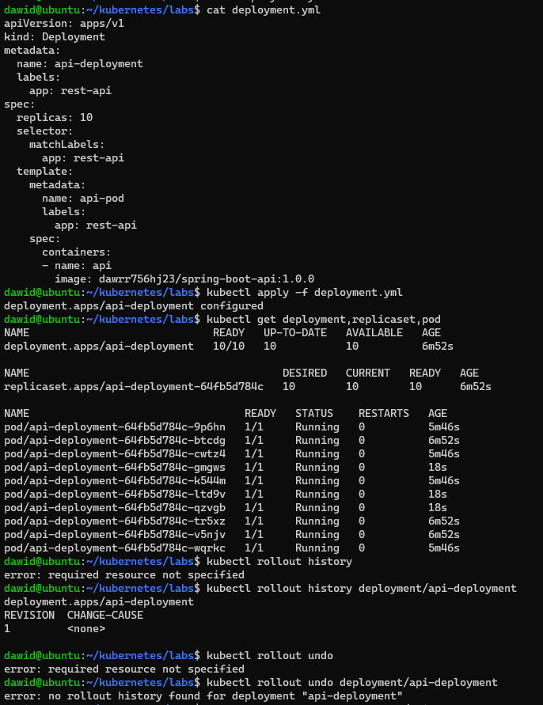

    * Zmniejszenie ilości replik do 1.

        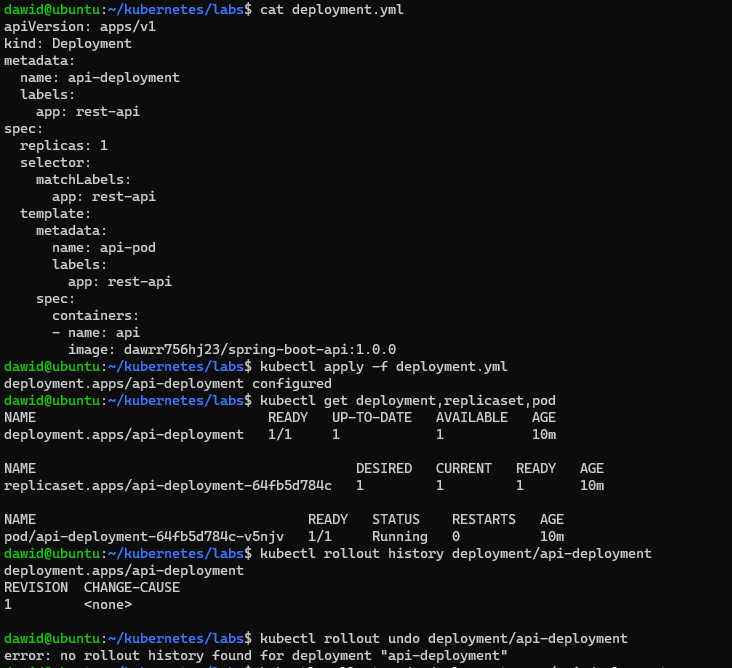

    * Zmniejszenie ilości replik do 0.

        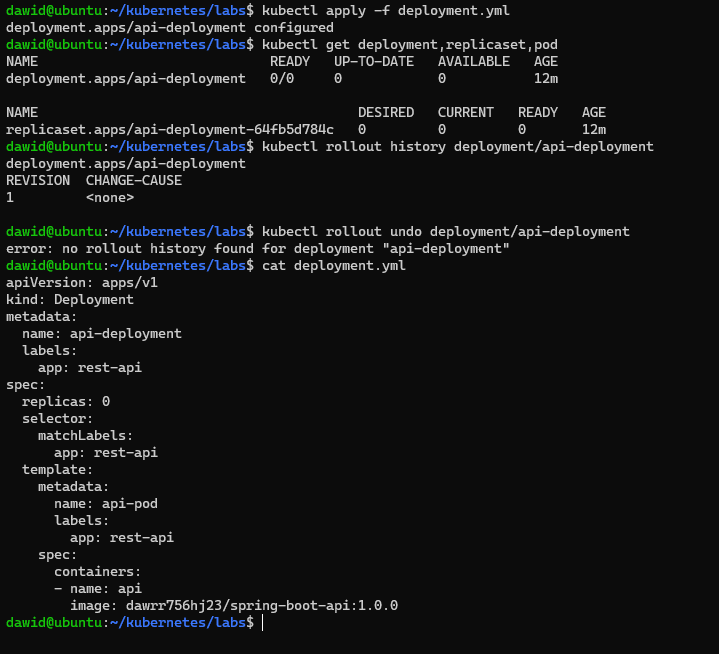

        Żadna z powyższych operacji nie powoduje modyfikacji historii wdrożenia. Jest tylko jedna rewizja, dlatego nie można wykonać kubectl rollout undo. Operacje skalowania nie powodują dodania nowej rewizji do historii.

    * Zastosowanie nowszej wersji obrazu - tag 1.0.1

        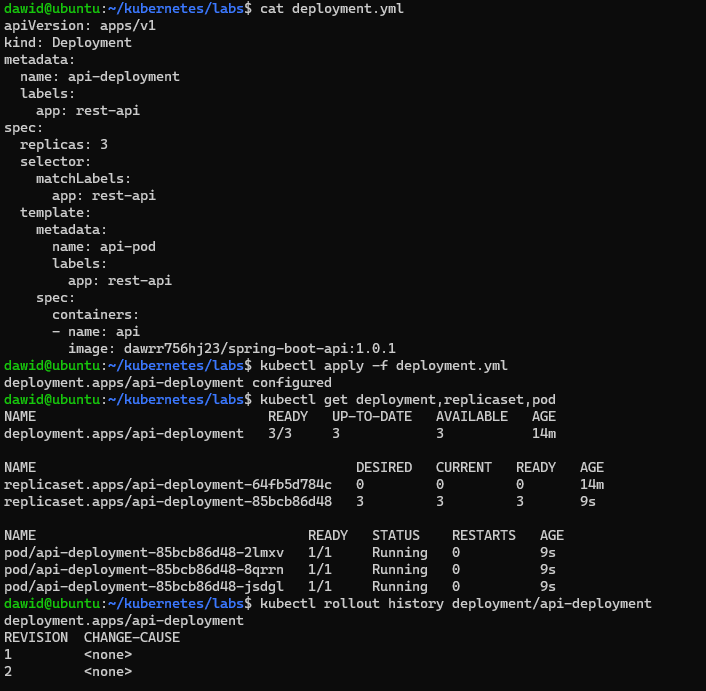
        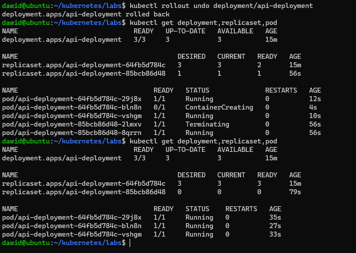

      Spowodowało to utworzenie nowej rewizji w historii. Operacja kubectl rollout undo spowodowała cofnięcie stanu deploymentu do rewizji pierwszej.
      W klastrze istniały dwa ReplicaSet, po jednym dla każdej rewizji. Operacja undo powoduje wypełnienie odpowiedniej ReplicaSet podami, aby usatysfakcjonować wymagania. Z drugiej strony opróżniana jest ReplicaSet aktualnej wersji wdrożenia.

    * Zastosowanie starszej wersji obrazu - tag 1.0.0  
      W tym celu najpierw wdrożono aplikację w wersji 1.0.2 - wadliwą.
      Spowodowało to utworzenie kolejnej rewizji.  
      Na tym etapie w klastrze znajdowały się trzy rewizje, po jednej dla każdej z wersji obrazu. W klastrze znajdowały się również trzy obiekty ReplicaSet, po jednym dla każdej wersji obrazu (i rewizji w historii)

        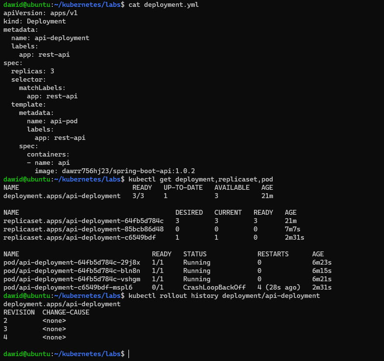
        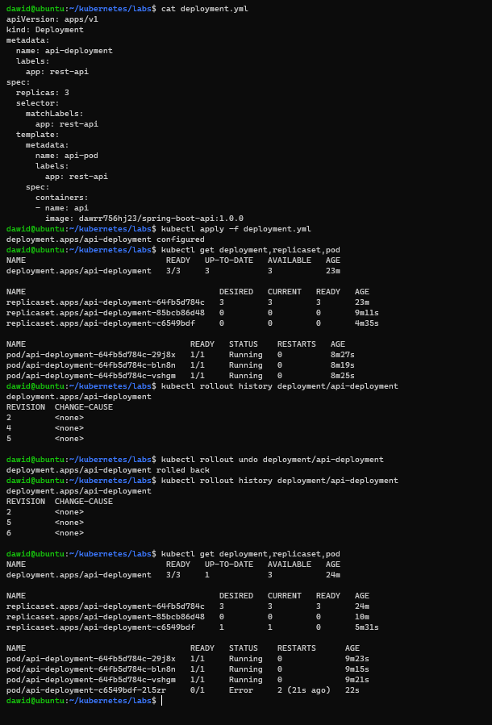
    
4. Sporządzenie skryptu monitorującego stan wdrożenia.  

    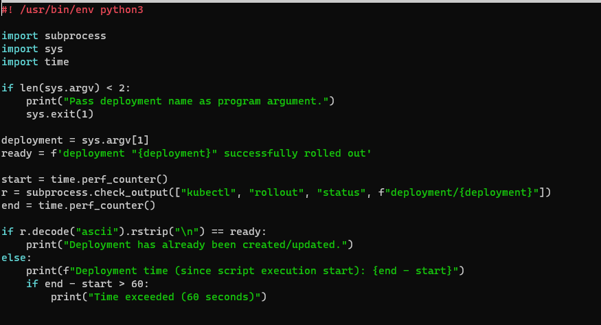

5. Testowanie różnych strategii wdrożeń. Przetestowano mechanizmy wdrażania dla wersji pierwszej aplikacji (1.0.0).
    * RollingUpdate - mechanizm domyślny, który polega na stopniowej wymianie podów w celu zachowania ciągłości działania aplikacji.

        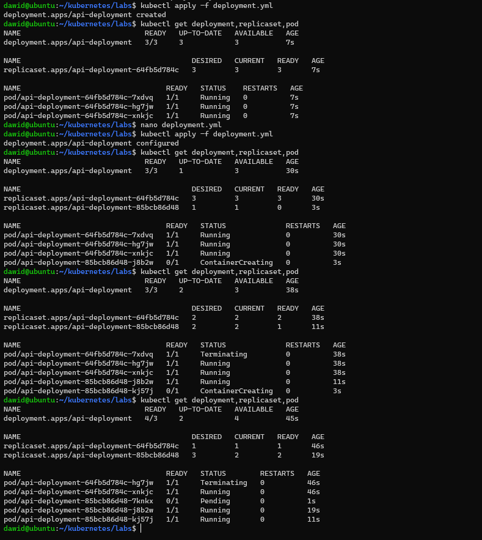
        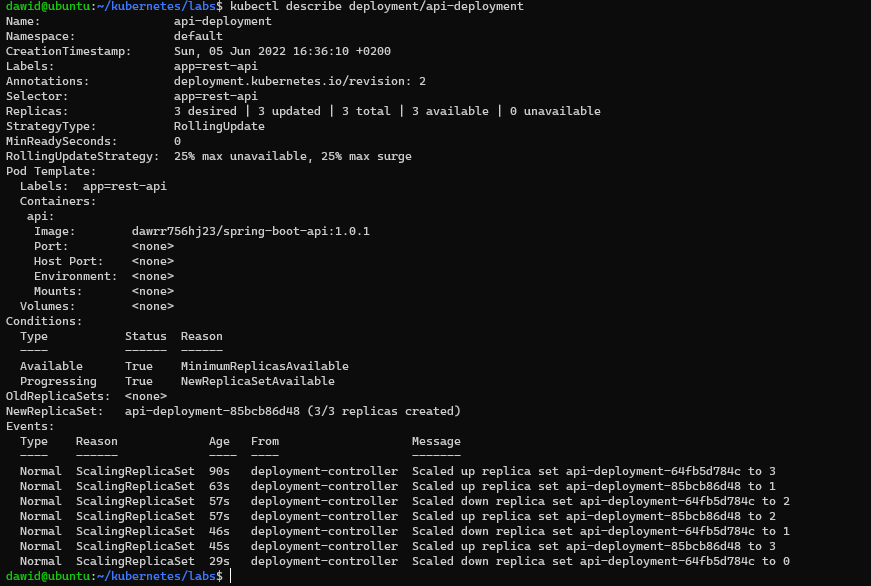

        Działanie strategii dobrze obrazuje output komendy kubectl describe (sam dół).  
        Pody były stopniowo usuwane i tworzone.

    * Recreate - mechanizm, który polega na usunięciu wszystkich podów starej wersji, a następnie utworzeniu podów nowej wersji. Powoduje przerwę w działaniu aplikacji na czas wdrażania.  
    Zastosowanie strategii wymaga określenia atrybutu strategy w pliku YAMl wdrożenia.

        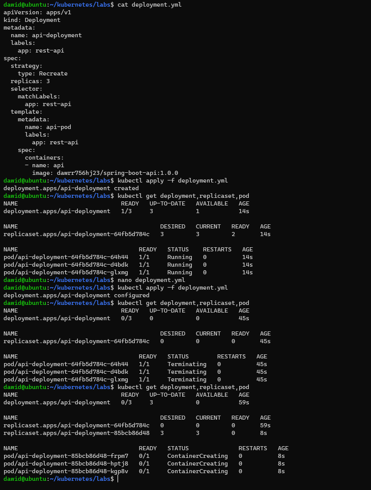
        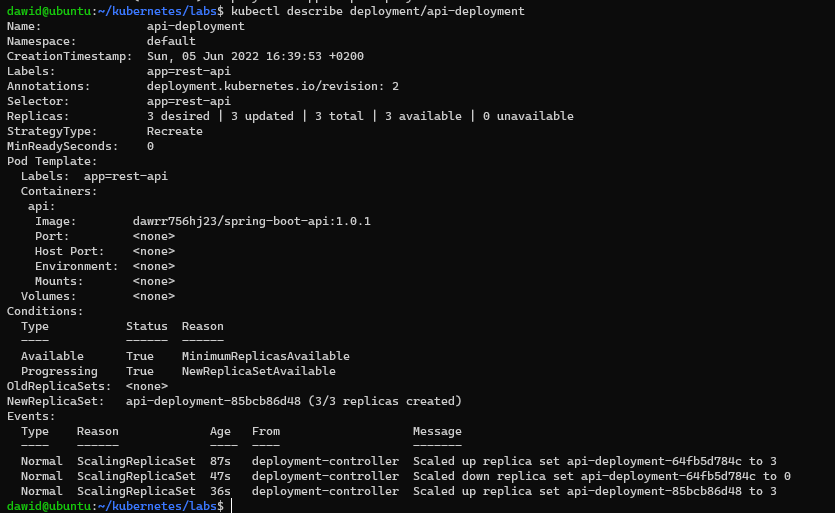

        Działanie strategii dobrze obrazuje output komendy kubectl describe (sam dół).  
        Wszystkie pody zostały najpierw skasowane, a następnie utworzono nowe.

    * Canary Deployment - nie jest to mechanizm wbudowany w Kubernetesa, a pewien wzorzec wdrażania.  
    Charakterystyka zastosowania wzorca w Kubernetesie:
        * Kilka wdrożeń, każde dla osobnej wersji aplikacji.
        * Pody wszystkich wdrożeń ujęte w jeden serwis (Service). Serwis posiada wbudowane mechanizmy równoważenia ruchu (Load Balancing), przekierowuje ruch do odpowiedniego poda - może być to pod starszej wersji lub nowszej.
        * Zastosowanie: testowanie nowej wersji aplikacji w produkcji z zachowaniem minimalnego ryzyka (pody nowej wersji mogą stanowić na początku np. 10% wszystkich, stopniowo jest to zwiększane).

        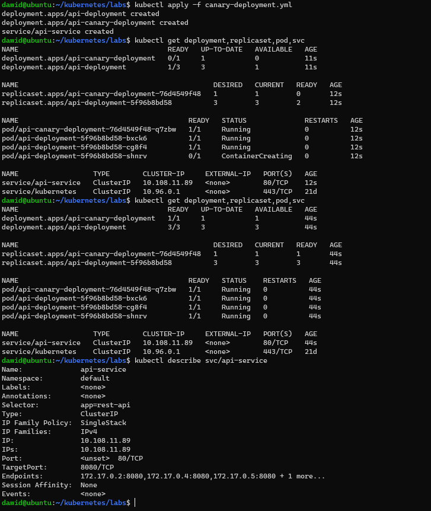
        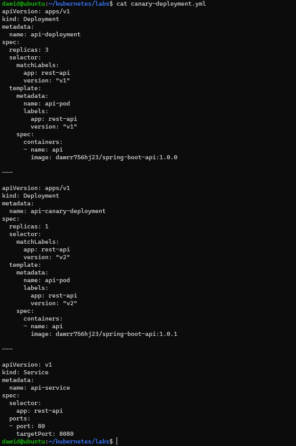
