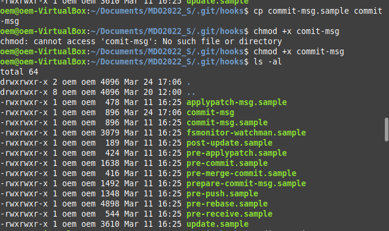
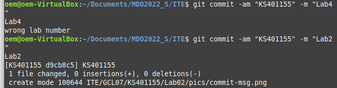
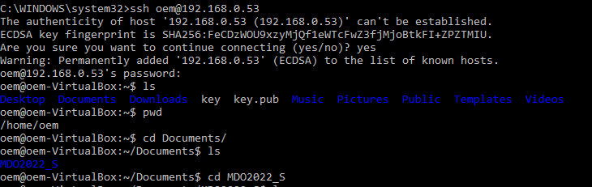
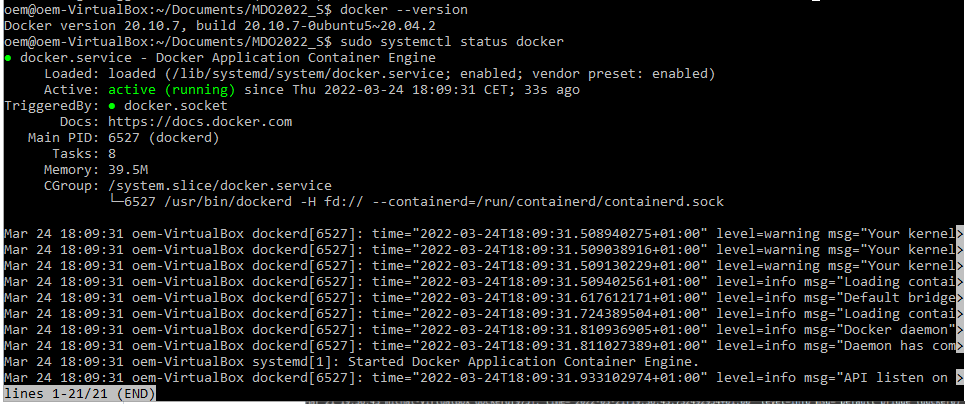
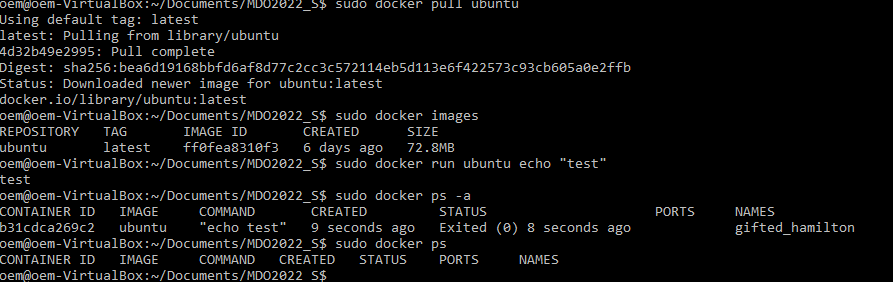
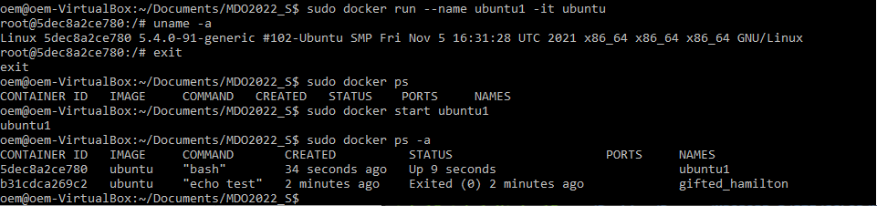

# Sprawozdanie Lab02 Kacper Sochacki ITE-GCL07

## Cel ćwiczenia
Kontrolowanie zawartości commita, konfiguracja środowiska i testowanie działania konteneryzacji.

## Przebieg

1. Przygotowano git hook, który rozwiąże najczęstsze problemy z commitami:
    - hook sprawdzający, czy tytuł commita nazywa się ```KS401155```
    - hook sprawdzający, czy w treści commita pada numer labu, właściwy dla zadania
    - sprawdzono zawarość folderu ```.git/hooks```, zmieniono uprawnienia hooka ```commit-msg```
    

2. Stworzono skrypt sprawdzający podane wymagania
    ```
    #!/usr/bin/python3

	import sys
	import datetime

	pathToFile = sys.argv[1]
	file = open(pathToFile, 'r') # 
	content = file.read()

	title = content.split('\n')[0]
	msg = content.split('\n')[2]

	date = datetime.date.today()
	week = date.isocalendar()[1]


	if ("KS401155" != title):
		print("Wrong commit title!")
		exit(1)

	if ("Lab" not in msg and "lab" not in msg):
		print("Wrong commit message!")
		exit(1)
	else:
		print(msg)
		labInt = int(msg[3])
		correctLab = week - 10
		if(labInt > correctLab +1 or labInt < correctLab -1):
			print("wrong lab number")
			exit(1)
		else:
			exit(0)  
    ```
    - sprawdzono działanie powyższego skryptu:
    
3. Rozpoczęto przygotowanie środowiska Dockerowego:
    - zapewniono dostęp przez SSH:
    
    
4. Działanie środowiska:
    - wersja oraz status Dockera:
    

    - pull obrazu ubuntu oraz wylistowanie wykonanych operacji:
    

    - numer wersji obrazu:
    

5. Założono konto na Docker Hub:

    
