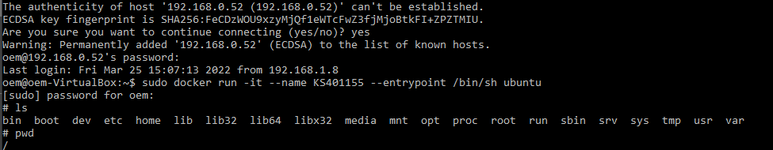
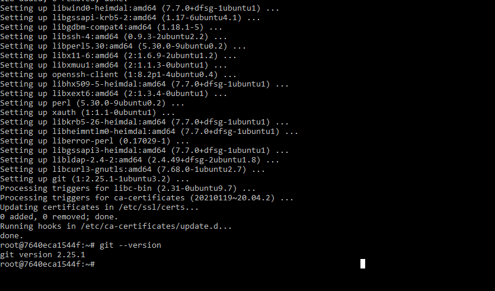
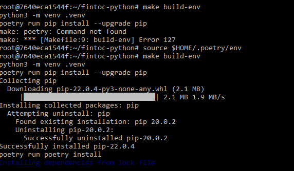
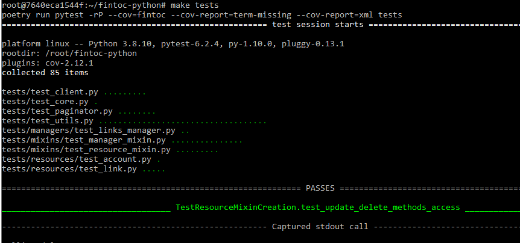
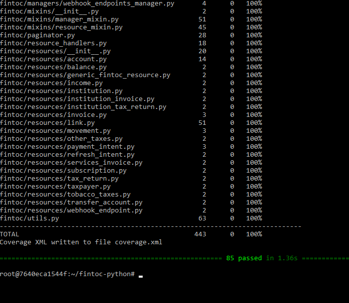
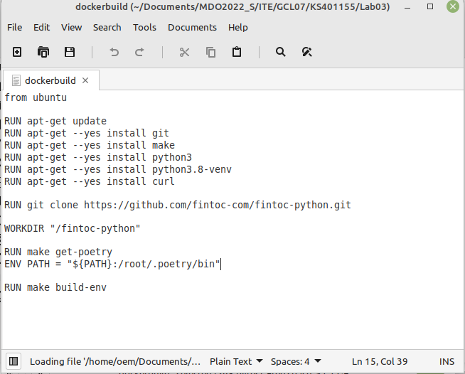
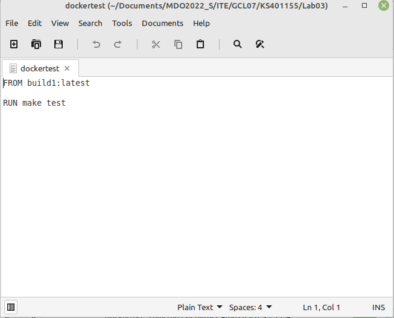
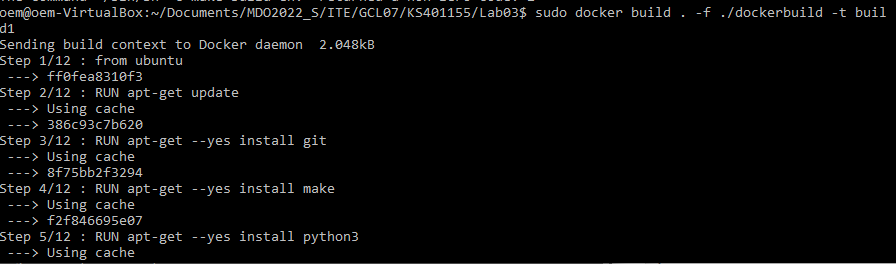
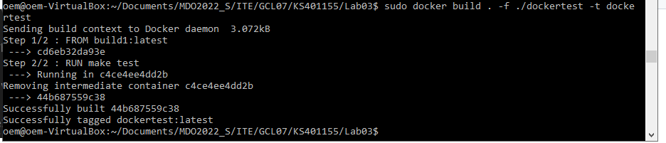
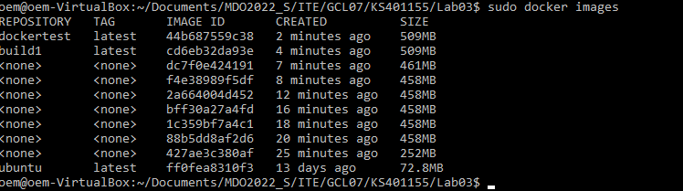

# Sprawozdanie Lab03 Kacper Sochacki ITE-GCL07


## Cel ćwiczenia
Przeprowadzenie buildu repozytorium: https://github.com/fintoc-com/fintoc-python.git z narzedziem make w kontenerze.


## Przebieg

1. Uruchomiono kontener:


2. Zainstalowano git i potrzebne narzedznia:		


3. Zbudowano za pomoca ```make build-env```: </br>


4. Uruchomiono test za pomoca  ```make tests```:		
	


5. Stworzono Dockerfile odpowiadajacy za build:		


6. Stworzono Dockerfile ktory odpowiadal za testy:


7. Uruchomiono ```DockerBuild```:		
		
		


8. Uruchomiono ```DockerTest```:		


10. Powstale obrazy: </br>



## Wnioski- Kontener a obraz
Obraz jest to wzorzec na podstawie ktorego mozemy zrobic kontener.
