# Sprawozdanie Lab04 Kacper Sochacki ITE-GCL07

## Przebieg cwiczenia

1. Przygotowano dwa woluminy (wejsciowy i wyjsciowy):
   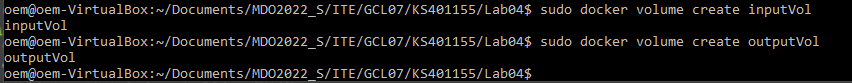

2. Utworzono kontener na podstawie obrazu ubuntu, zamontowano w nim stworzone powyzej woluminy:
   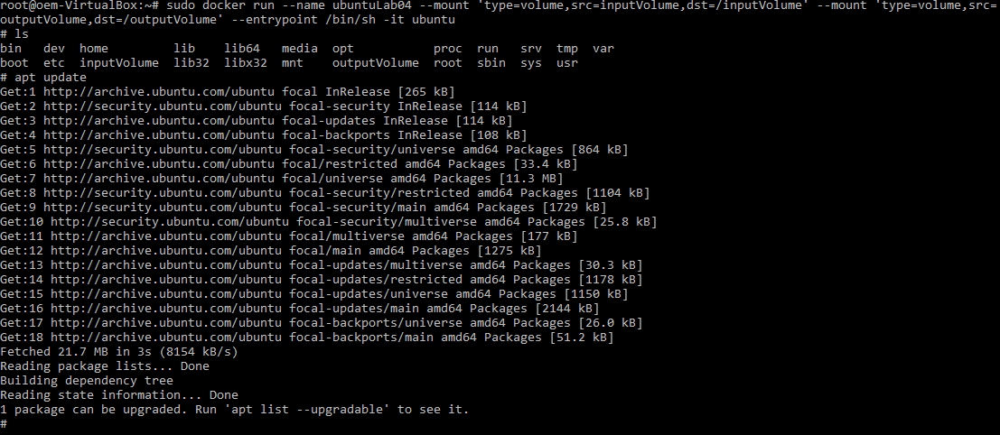

3. Do woluminu wejsciowego sklonowano repozytotium https://github.com/opentracing/basictracer-python.git:
   
   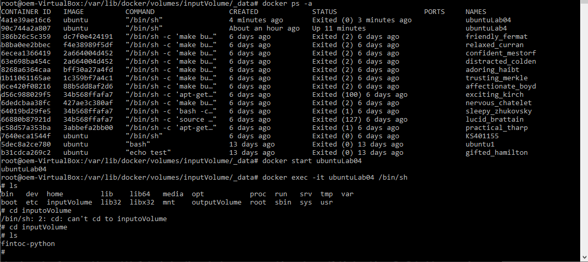

4. Zainstalowano potrzebne narzedzia, uruchomiono build w kontenerze:

   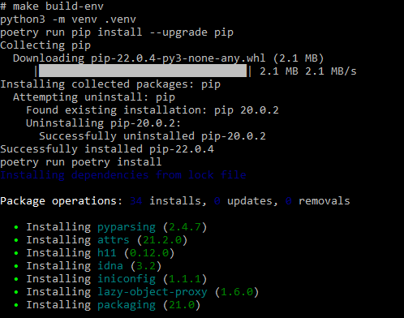
   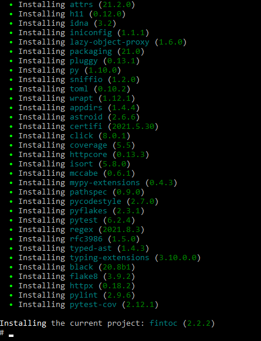


## Eksponowanie portu

1. Zainstalowano narzedzie ```iperf3``` oraz pakiet ```net-tools```:
   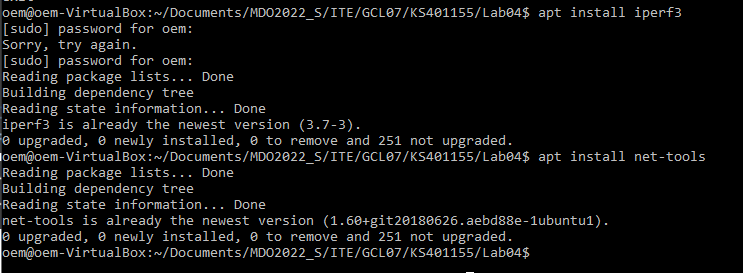

2. Rozpoczeto nasluchiwanie na porcie ```2000``` i sprawdzono polaczenie host-kontener:
   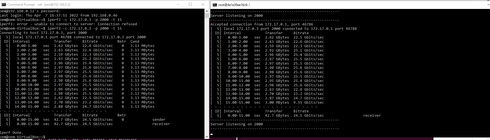

3. Rozpoczeto nasluchiwanie na porcie ```2000``` i sprawdzono polaczenie kontener-kontener:
   

4.  Zainstalowano ```iperf3``` na system poza hostem, dokonano proby nasluchiwania portu ```2000```:
    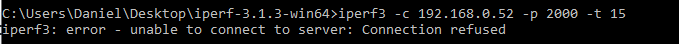
    Polaczenie zostalo odrzucone gdyz nie byl opublikowany. Nalezy zatem uruchomienic kontener z opcja ```--publish```.

6. Uruchomiono kontener z opcja ```--publish``` i ustawiono nasluchiwania na port 2000:
   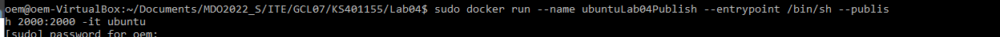

7.  Rozpoczeto nasluchiwanie na porcie ```2000``` i sprawdzono polaczenie host-system spoza hosta:
    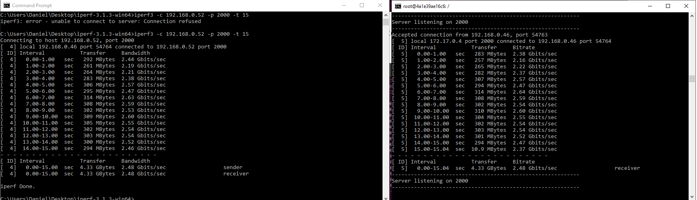

8. Porownano maksymalne wartosci birate dla 3 powyzszych typow polaczen:
    ||Kontener-kontener | Host-Kontener  | Obcy-kontener|
    |---|--- | --- | ---|
    |Birate avg (Gbits/sec)|20.1|24.5|2.48|

    Najszybsze jest polaczenie host-kontener, najbardziej skomplikowana trase pakiet musi pokonac z 'obcej' maszyny do kontenera.


## Instalacja Jenkins

1. Stworzono siec na Dockerze za pomoca polecenia ```sudo docker network create jenkins```.

2. Pobrano i uruchomiono obraz ```docker:dind```:
   
   ```
    docker run --name jenkins-docker --rm --detach /
    --privileged --network jenkins --network-alias docker /
    --env DOCKER_TLS_CERTDIR=/certs /
    --volume jenkins-docker-certs:/certs/client /
    --volume jenkins-data:/var/jenkins_home /
    --publish 3000:3000 --publish 2376:2376 /
    docker:dind
    ```
3. Utworzono Dockerfile:

    ```
    FROM jenkins/jenkins:2.332.2-jdk11
    USER root
    RUN apt-get update && apt-get install -y lsb-release
    RUN curl -fsSLo /usr/share/keyrings/docker-archive-keyring.asc \
    https://download.docker.com/linux/debian/gpg
    RUN echo "deb [arch=$(dpkg --print-architecture) \
    signed-by=/usr/share/keyrings/docker-archive-keyring.asc] \
    https://download.docker.com/linux/debian \
    $(lsb_release -cs) stable" > /etc/apt/sources.list.d/docker.list
    RUN apt-get update && apt-get install -y docker-ce-cli
    USER jenkins
    RUN jenkins-plugin-cli --plugins "blueocean:1.25.3 docker-workflow:1.28"
    ```
4. Zbudowano obraz na podstawie Dockerfile:
    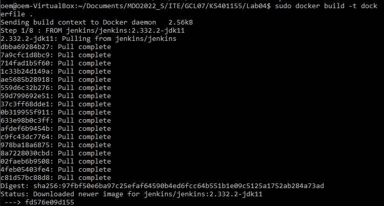

5. Uruchomiono kontener na powyzszym obrazie, nastepnie poleceniem ```docker logs [ID_KONTENERA]``` wyswietlono logi w celu uzyskania hasla do Jenkins:	</br>
    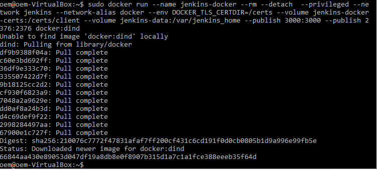
    

6. Zalogowano sie do Jenkins:
    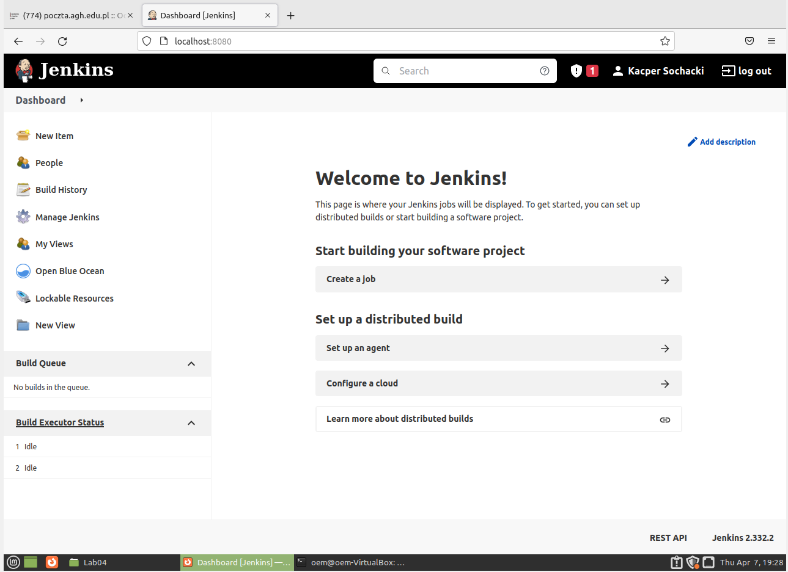


    
