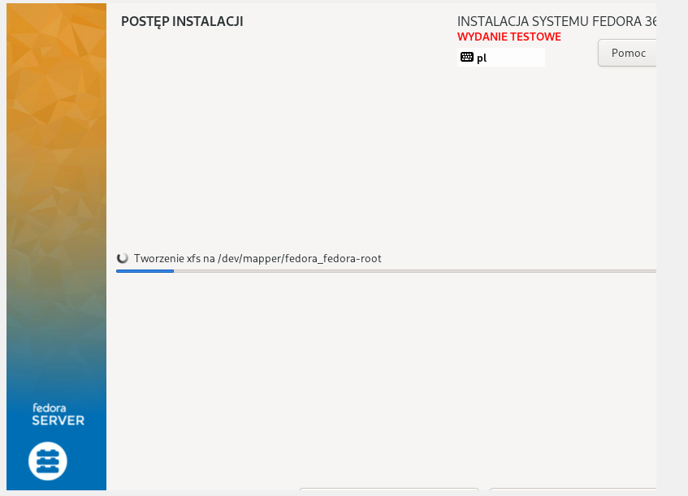
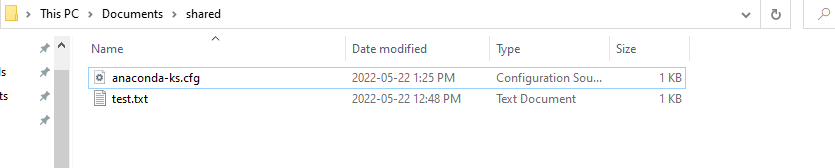
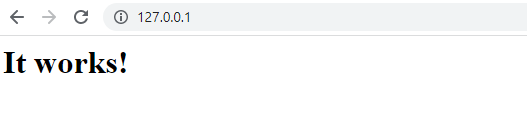
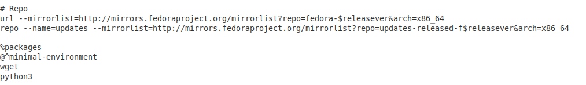
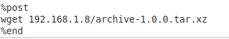
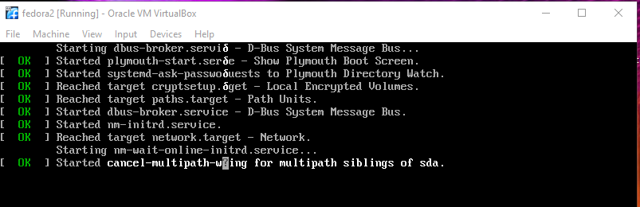
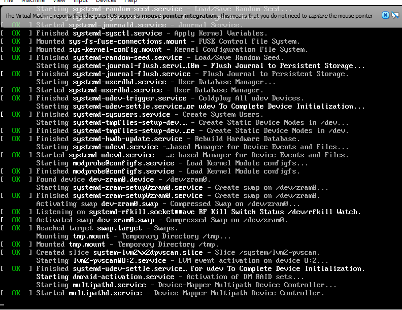
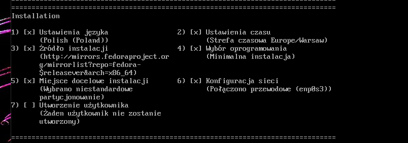
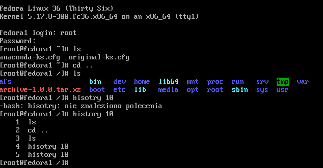

# Sprawozdanie Lab09 Kacper Sochacki ITE-GCL07

## Przebieg cwiczenia

1. Instalacja GUI Fedory:
   

2. Utworzenie dzielonego folderu
   

3. Zamontowanie folderu i skopiowanie do niego pliku kickstart:
   
   
   

4. Utworzenie lokalne serwera http i umieszczenie na nim artefaktu:
   
   

5. Dodanie dependencji, repozytorii z OS i aktualizacjami do pliku kickstart
   
   
6. Dodanie pobierania artefaktu przez lokalnego serwera http
   
   
7. Instalacja przy uzyciu kickstart
   
   
   
   
8. Wynik instalacji
   
