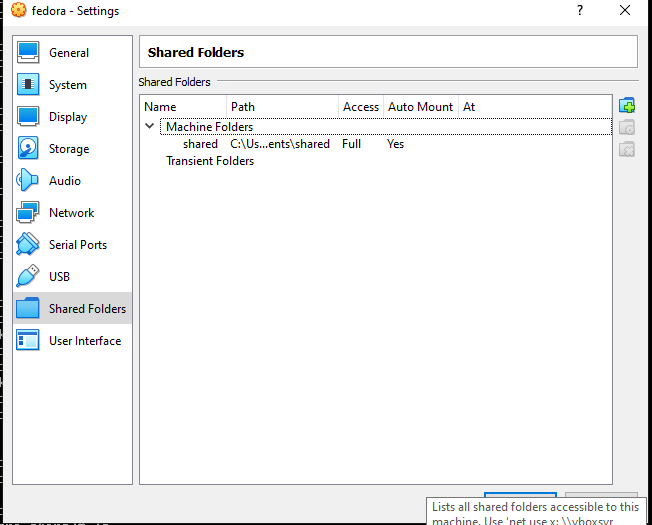
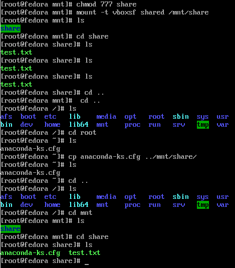
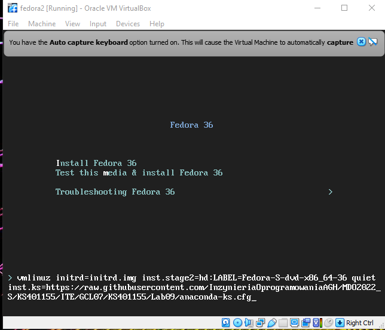

# Sprawozdanie Lab09 Kacper Sochacki ITE-GCL07

## Przebieg cwiczenia

1. Instalacja GUI Fedory:
   

2. Utworzenie dzielonego folderu

   

3. Zamontowanie folderu i skopiowanie do niego pliku kickstart:

   

   

4. Utworzenie lokalne serwera http i umieszczenie na nim artefaktu:

   

5. Dodanie dependencji, repozytorii z OS i aktualizacjami do pliku kickstart

   
   
6. Dodanie pobierania artefaktu przez lokalnego serwera http

   
   
7. Instalacja przy uzyciu kickstart

   

   

   

   
   
8. Wynik instalacji

   
