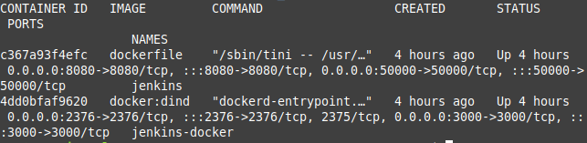

# Kacper Sochacki 401155

## Pipieline
 

### Kontener Jenkins i dind skonfigurowane wedlug instrukcji

### Pliki dockerfile uzyte w pipeline

 
### Skonfigurowany pipeline na Jenkins:

### Build

### W kroku build tworze kontener na bazie ubuntu przy uzyciu dockerbuild. Klonuje repozytorium, pobieram dependencje oraz uruchamiam makefile.

 

### Test

### Tworze kontener na bazie kontenera budujacego oraz uruchamiam makefile test.

 

### Deploy

### Wyslanie obrazu do dockerhuba: ksochacki0. Aby bylo to mozliwe nalezalo dodac credentials w jenkins ->Dashboard->Manage Jenkins -> Manage Credentials -> Global i dodac swoje login i haslo

### Publish

### Tworze kontener na bazie kontenera budujacego. Builduje tym razem przy uzyciu innej opcji z narzedzia poetry oraz pakuje katalog do archive.tar.xz. Nastepnie dopisuje wersje i archiwizuje plik, aby moc go pobrac z Jenkinsa. Aby zmiana nazwy byla mozliwa nalezalo dac uprawienia uzytkownikowi jenkins z grupy 1000 do folderu, w ktorym znajduje sie archive.tar.xz

### Pipeline

### W Jenkinsie widac utworzony plik tar z wersja wybrana przy jego uruchomieniu

