# Kacper Sochacki 401155

## Pipieline
 

### Pliki dockerfile uzyte w pipeline
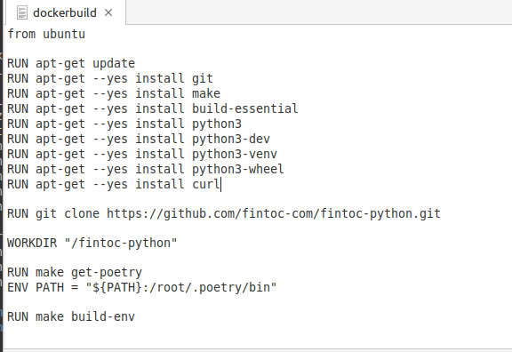

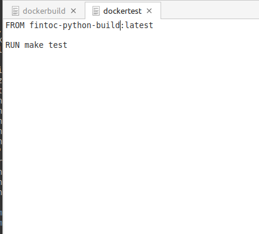

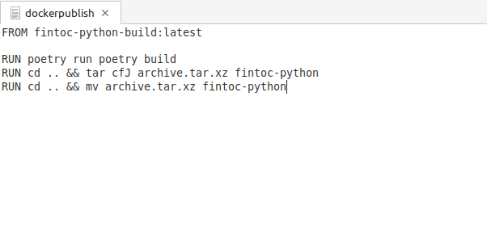
 
### Skonfigurowany pipeline na Jenkins:

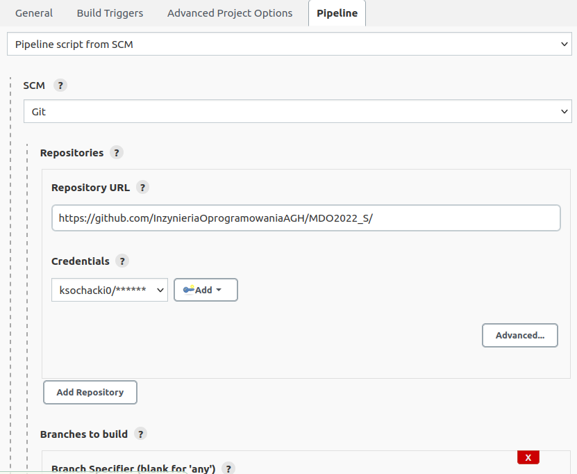

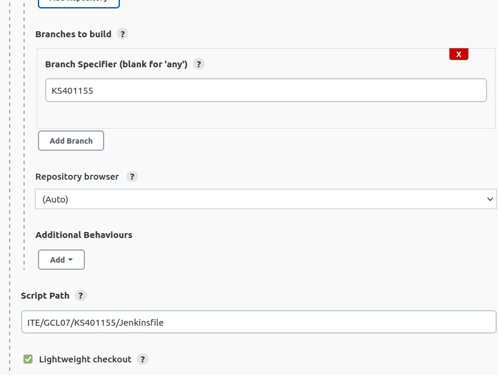

### Build

### W kroku build tworze kontener na bazie ubuntu przy uzyciu dockerbuild. Klonuje repozytorium, pobieram dependencje oraz uruchamiam makefile.

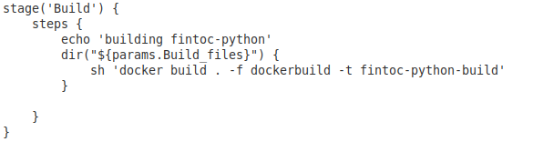

 

### Test

### Tworze kontener na bazie kontenera budujacego oraz uruchamiam makefile test.

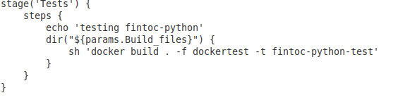

 

### Deploy

### Wyslanie obrazu do dockerhuba: ksochacki0

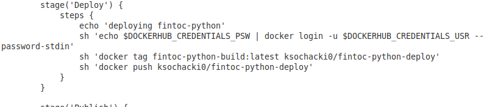

### Publish

### Tworze kontener na bazie kontenera budujacego. Builduje tym razem przy uzyciu innej opcji z narzedzia poetry oraz pakuje katalog do archive.tar.xz. Nastepnie dopisuje wersje i archiwizuje plik, aby moc go pobrac z Jenkinsa.

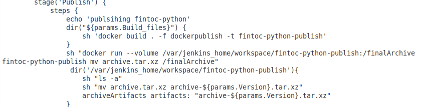

### Pipeline

### W Jenkinsie widac utworzony plik tar z wersja wybrana przy jego uruchomieniu

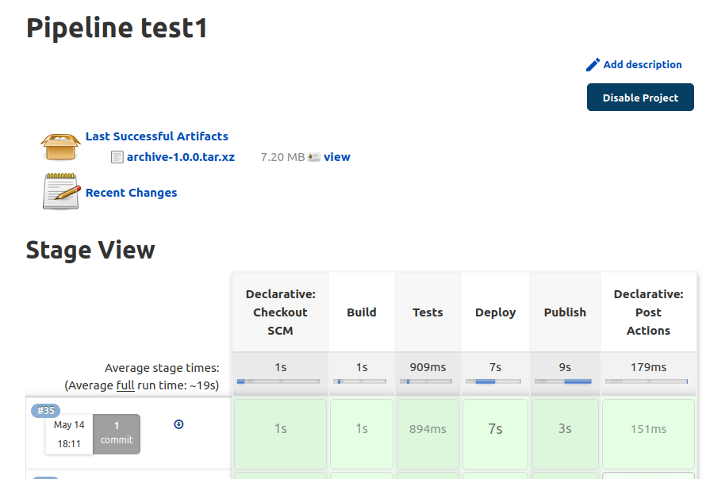
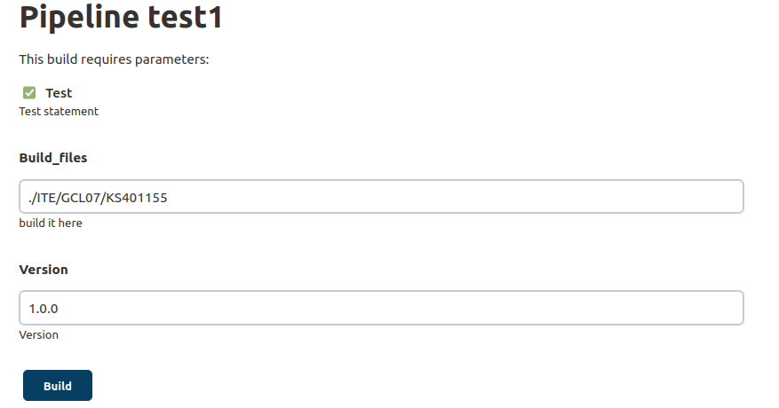

