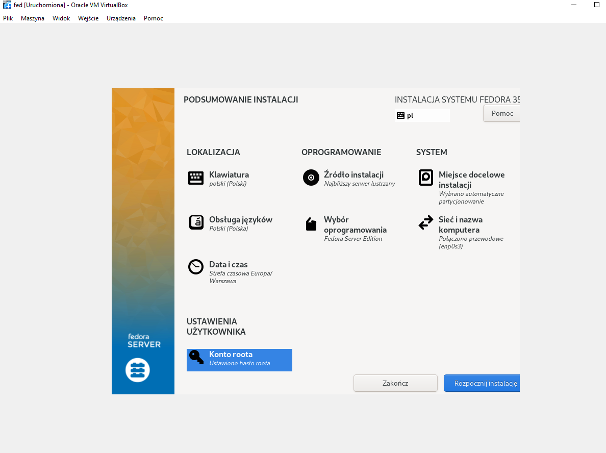
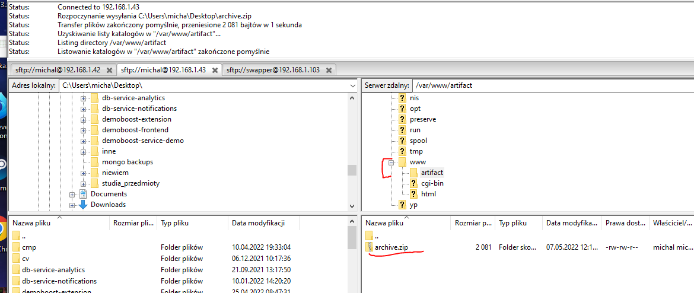
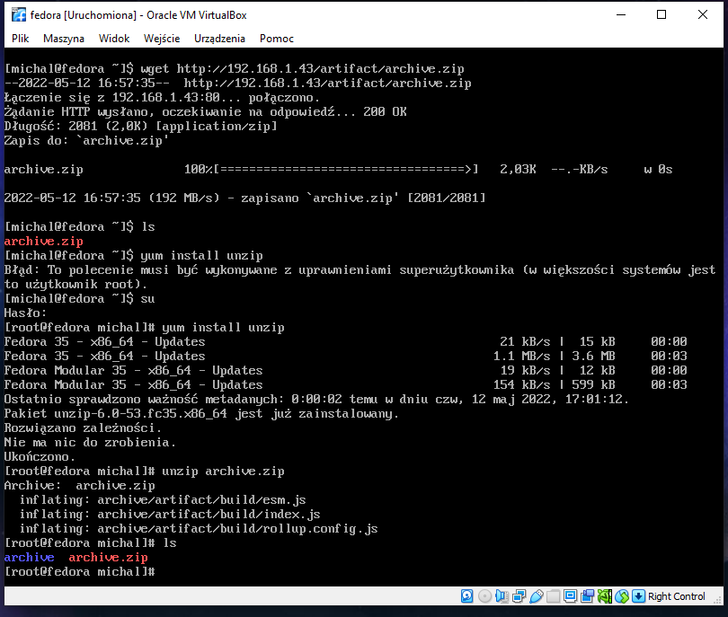
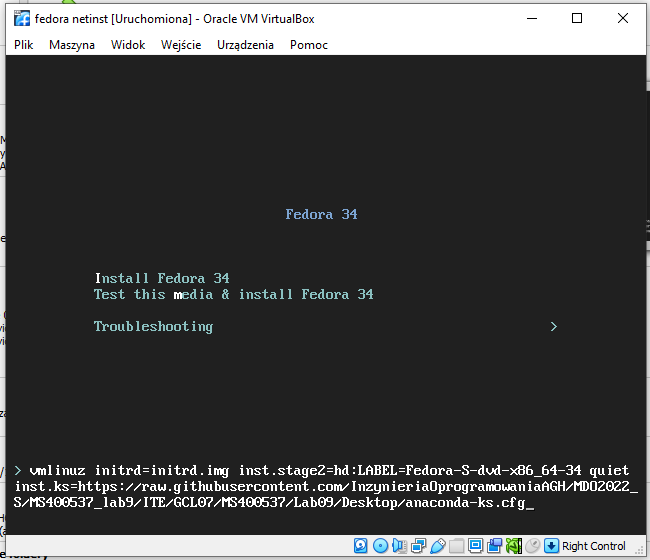
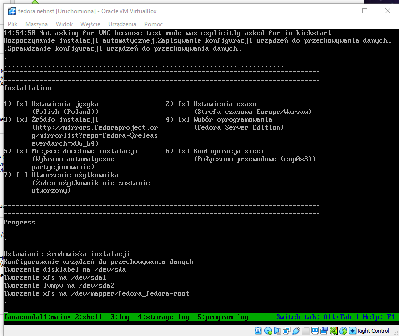
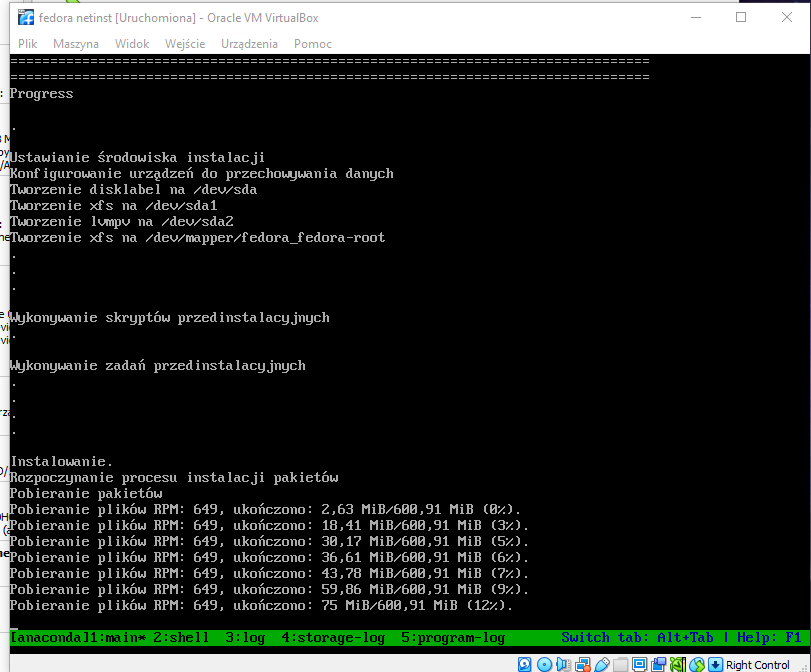
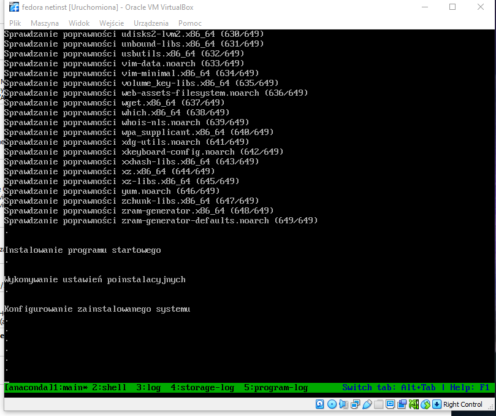
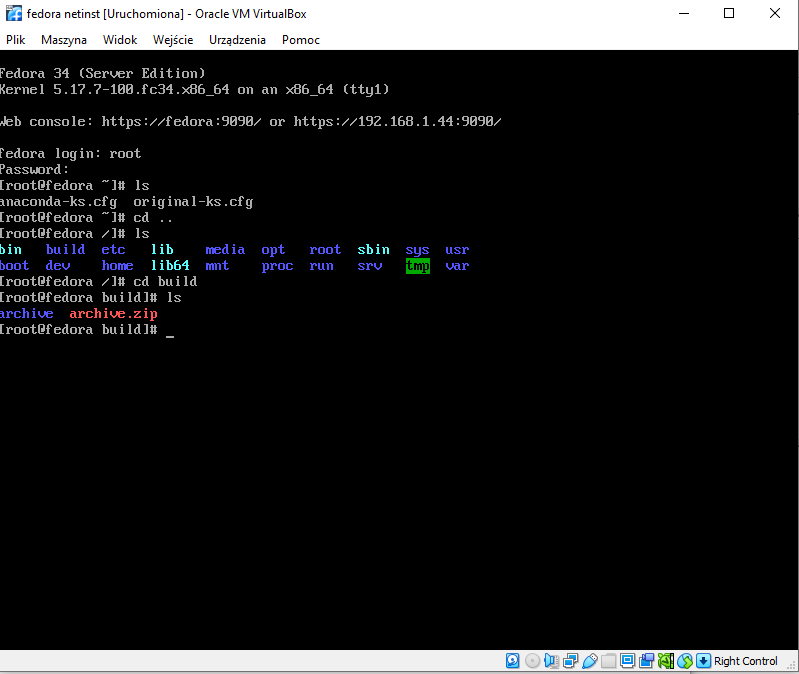

Lab09 Sprawozdanie - netinstall fedora

1. Zainstalowanie fedory


2. Po zainstalowaniu wyciagnalem plik ```anaconda.cfg``` i zapisalem go na dysku

3. Zainstalowanie drugiego systemu

4. Instalacja, konfiguracja httpd
- `yum install httpd`
- `systemctl firewalld disable`
- umieszczenie artefaktu na serwerze


- konfiguracja httpd


5. Test serwera


6. instalacja z pliku anaconda-ks.cfg






Po wlaczeniu

