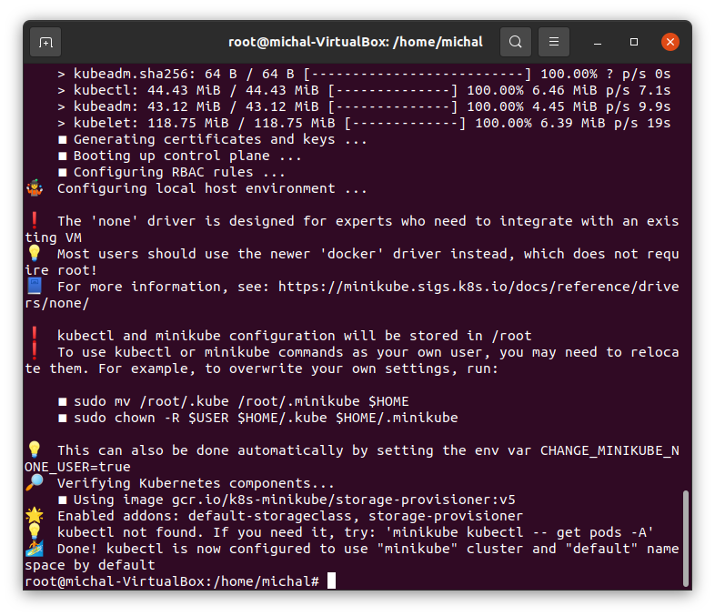
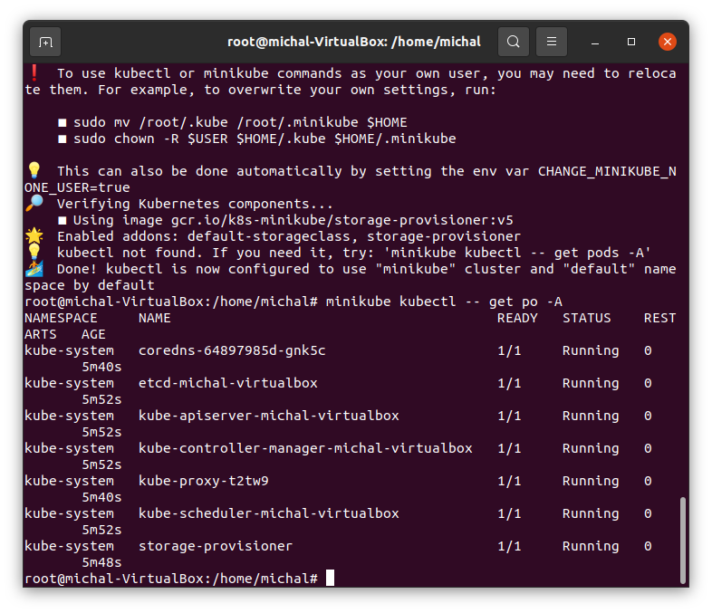
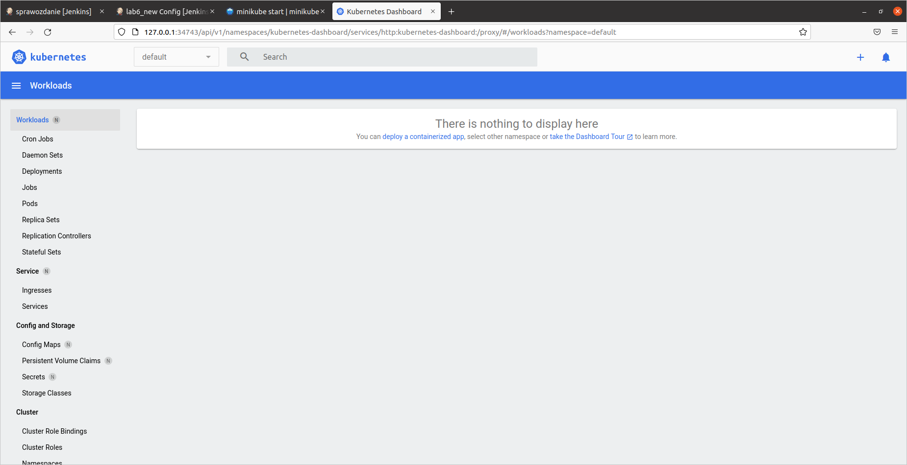
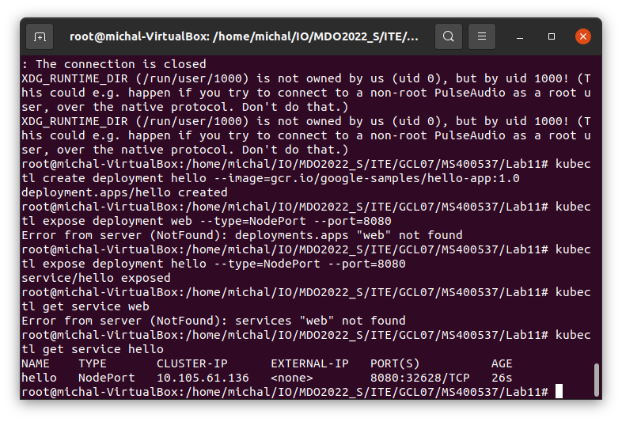
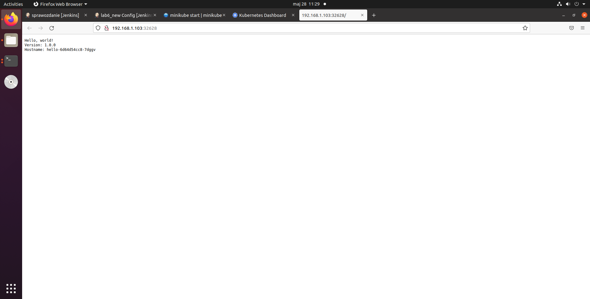

1. Instalacja minikube
Instalacja

Start

2. Dashboard
Uruchomienie dashboarda

3. Deploy przykladowej aplikacji hello-world

kubectl create deployment hello --image=gcr.io/google-samples/hello-app:1.0

4. Exposowanie portow

kubectl expose deployment hello --type=NodePort --port=8080

5. Laczenie do aplikacji

