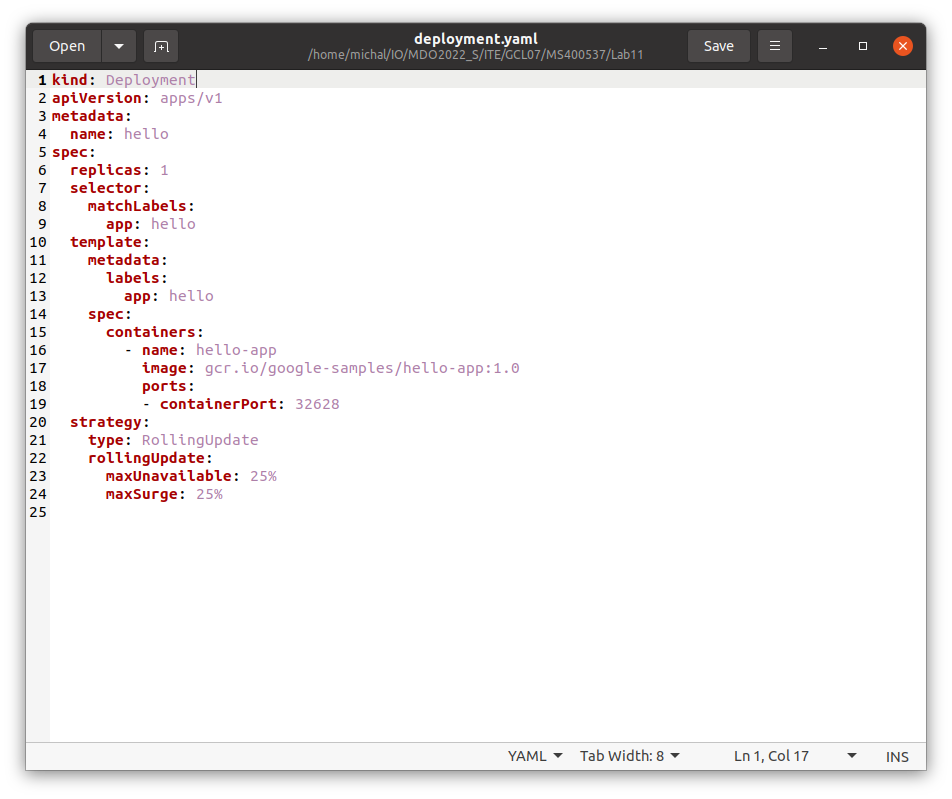
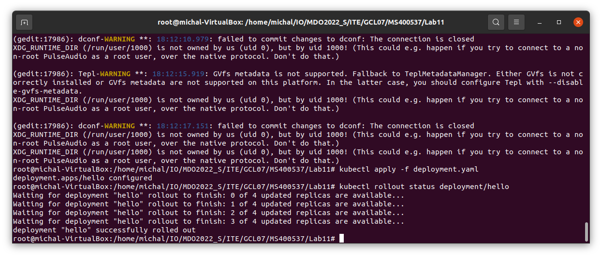
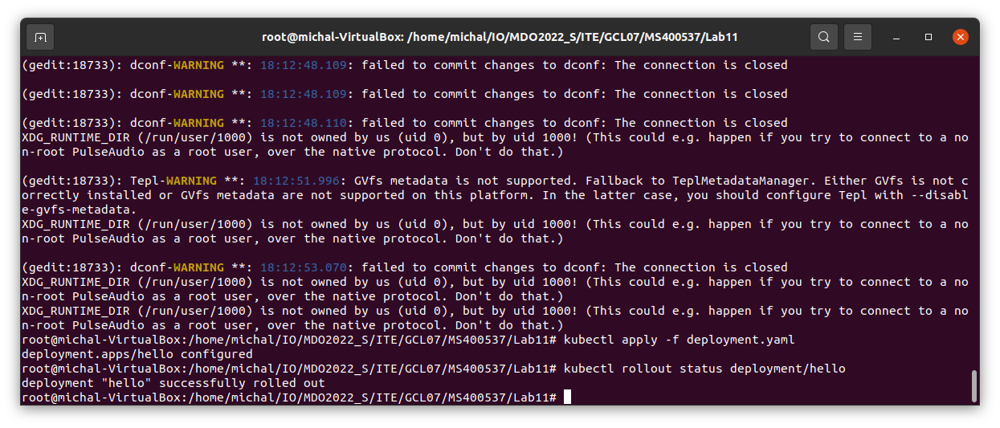
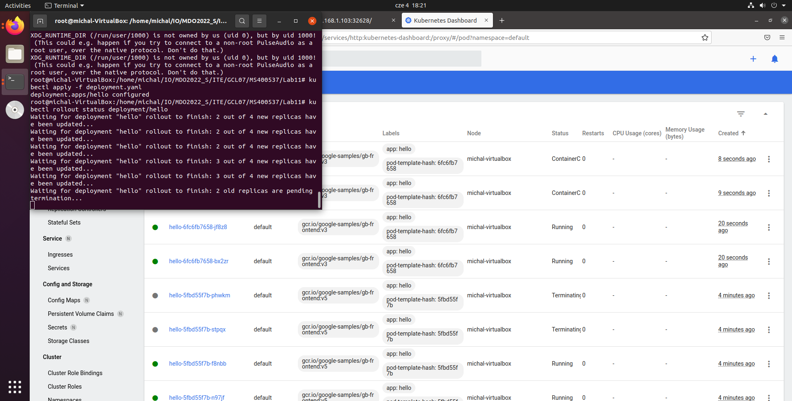
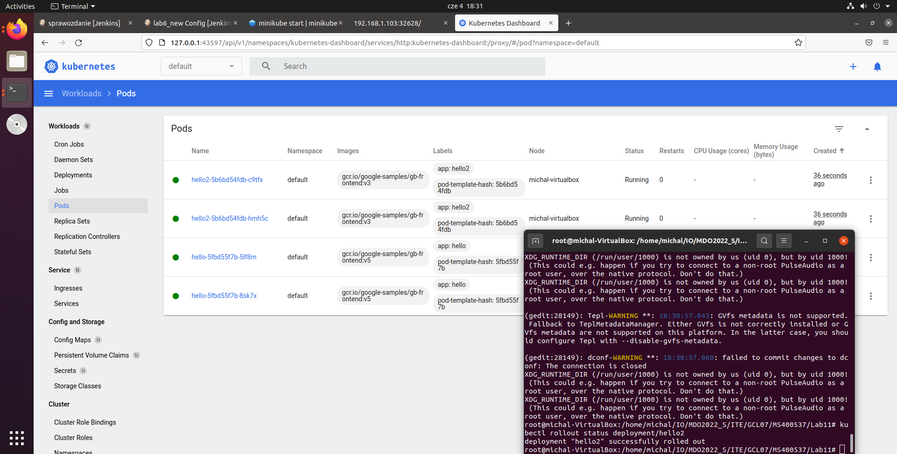

CZESC 1 LAB 11
1. Instalacja minikube
Instalacja

Start

2. Dashboard
Uruchomienie dashboarda

3. Deploy przykladowej aplikacji hello-world

kubectl create deployment hello --image=gcr.io/google-samples/hello-app:1.0

sprawdzenie stanu
`kubectl get services hello`

laczenie sie do obrazu przez przegladarke
`minikube service hello`

4. Exposowanie portow

kubectl expose deployment hello --type=NodePort --port=8080

5. Laczenie do aplikacji

CZESC 2 LAB 12

1. Sprawdzenie, czy mamy plik z deploymentem (wygenerowanie z dashboarda)

test dzialania

2. Zmiana ilosci replik na 4 (linia 6 w pliku powyzej)

3. Wykonanie polecen "Zmiany w deploymencie"
brak zauwazenia specjalnych zmian

4. Test roznych strategii wdrozenia
- recreate: pody zostaja wylaczone, obraz zostaje zaladowany i nastepnie pody odtwarzane sa z wdrazana wersja od zera, wszystkie jednoczesnie

- rolling update: w zaleznosci od wyboru uzytkownika, jednoczesnie updatowana jest rozna ilosc podow, tutaj - 2. Oznacza to ze w jednym momencie max 2 pody nie dzialaja i sa updatowane, podczas gdy inne nadal dzialaja na starej wersji. Po updacie pierwszych 2 podow, kolejne 2 z puli (tutaj pula=4) sa updatowane.

- canary: w pewnym sensie to wdrozenie jest reczne. nalezy przygotowac 2 deploymenty - ze stara i nowa wersja. nastepnie zmieniamy stary deployment tak, aby rozdzielic go przykladowo na 2 czesci i kazda z czesci uruchamia rozna wersje oprogramowania. pozwala to na udostepnienie np. testowej wersji wybranej grupie klientow. gdy chcemy wlaczyc wiecej podow z dana wersja, po prostu updatujemy deployment. troche przypomina to manualny Rolling update

