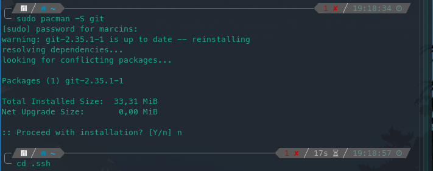
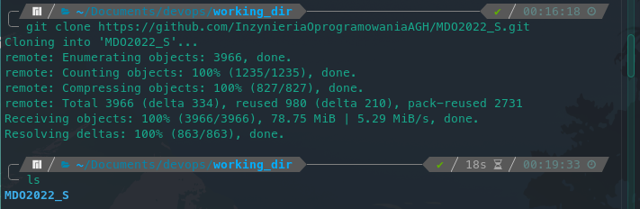
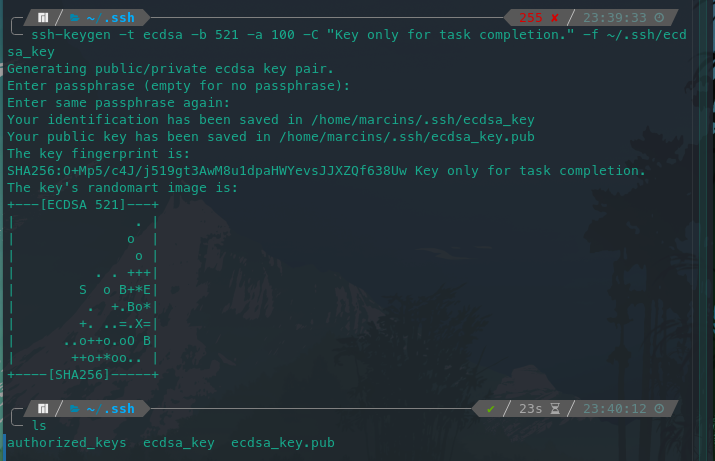
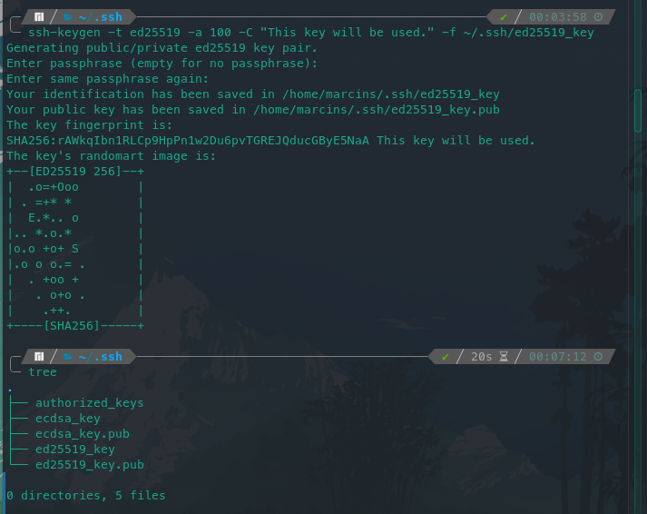
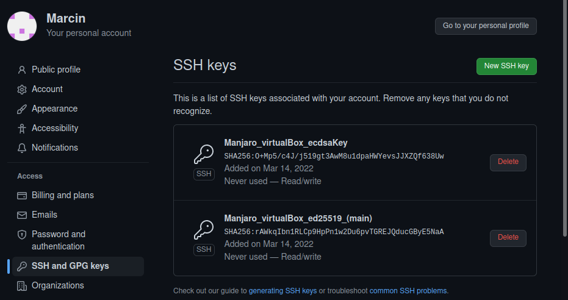
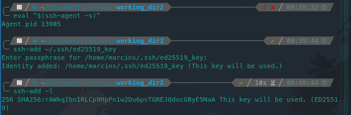
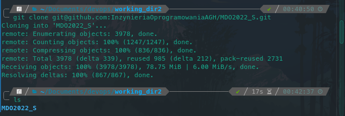
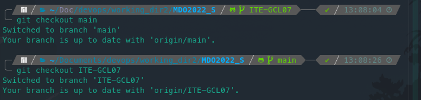
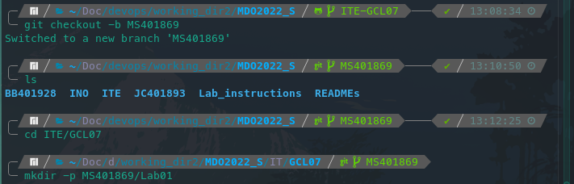
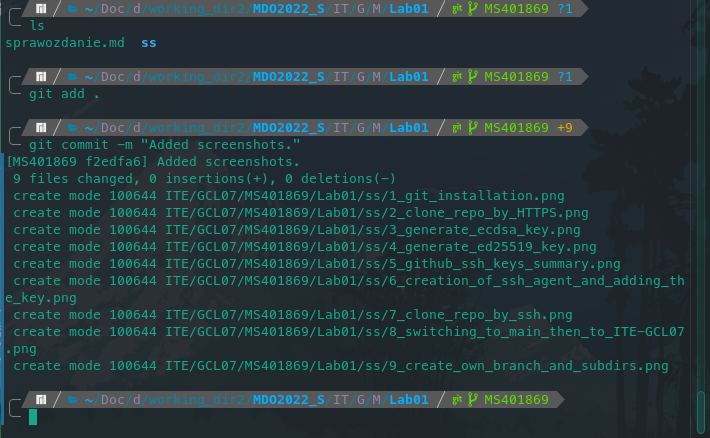

# Metodyki DevOps lab01 sprawozdanie

## **1. Instalacja klienta GIT**


---

## **2. Klonowanie repozytorium poprzez HTTPS**


---

## **3. Klonowanie repozytorium poprzez SSH**
## **3.1. Generacja kluczy**

Opis parametrów
---

| Opcja | Opis |
| ---   | ---  |
| `-t`  | Określa typ klucza używanego do enkrypcji i dekrypcji |
| `-b`  | W przypadku ECDSA określa rozmiar klucza poprzez wybranie rozmiaru krzywej eliptycznej |
| `-a`  | Określenie liczby rund KDF |
| `-C`  | Komentarz do klucza |
| `-f`  | lokalizacja i nazwa pary kluczy |
## **3.1.1. Generacja klucza `ECDSA`**


Komenda użyta do generacji klucza
---

```zsh
ssh-keygen -t ecdsa -b 521 -a 100 -C "Key only for task completion." -f ~/.ssh/ecdsa_key
```

## **3.1.2. Generacja klucza `ed25519`**


Komenda użyta do generaji klucza
---
```zsh
ssh-keygen -t ed25519 -a 100 -C "This key will be used." -f ~/.ssh/ed25519_key
```

## **3.1.3. Podsumowanie operacji dodawania kluczy**



## **3.2. Konfiguracja kluczy**


Utworzenie agenta ssh
---
```zsh
eval "$(ssh-agent -s)"
```
Dodanie klucza prywatnego `ed25519` do utworzonego agenta
---
```zsh
ssh-add ~/.ssh/ed25519_key
```

## **3.3. Sklonowanie repozytorium**


---

## **4. Przełączenie gałęzi**


---

## **5. Utworzenie własnej gałęzi**


---

## **6. Praca na gałęzi**
