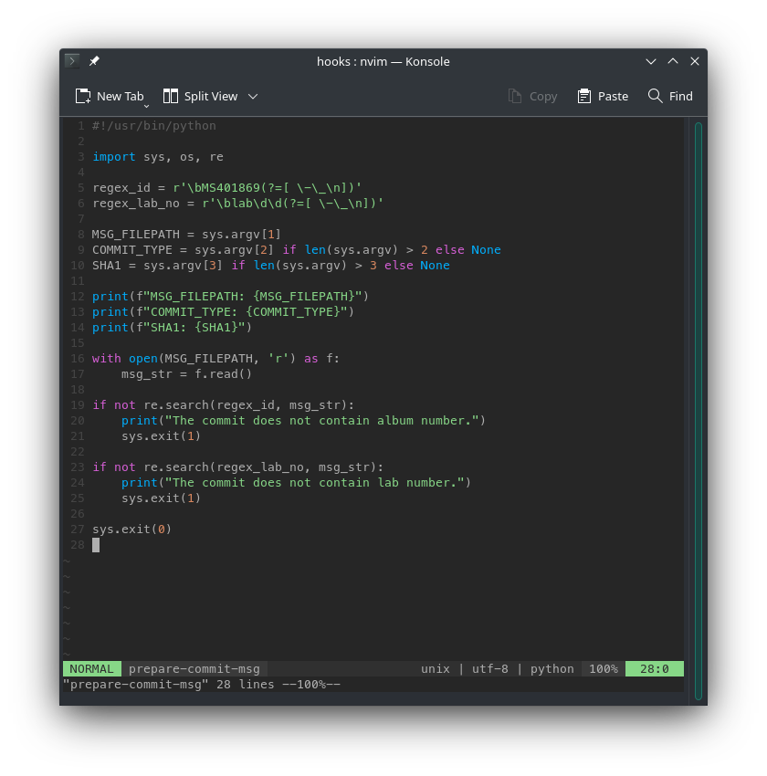
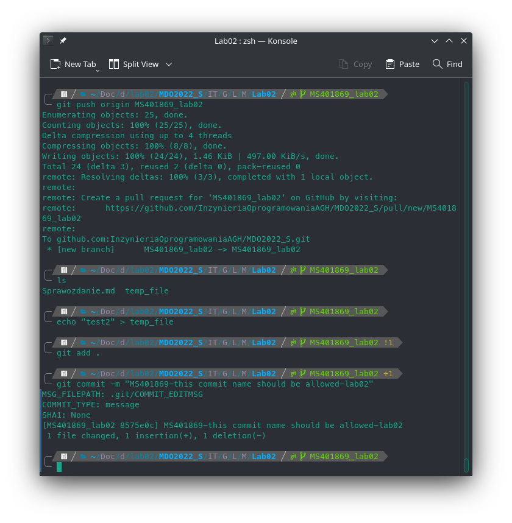
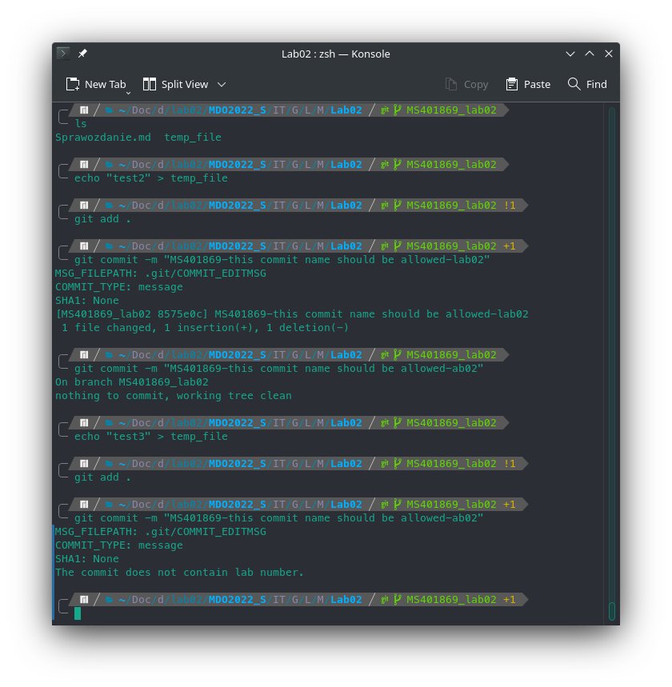
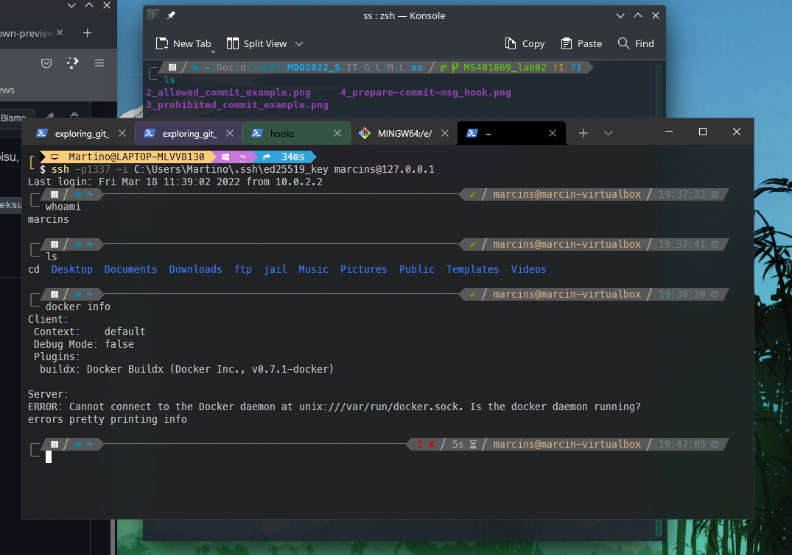
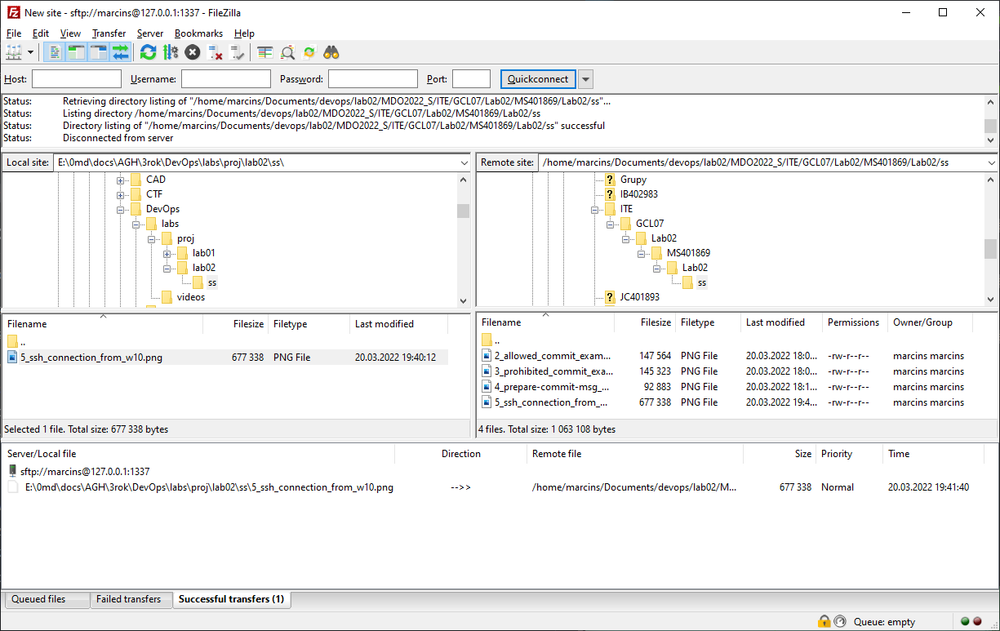
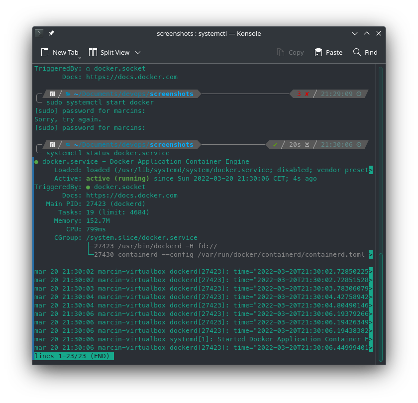
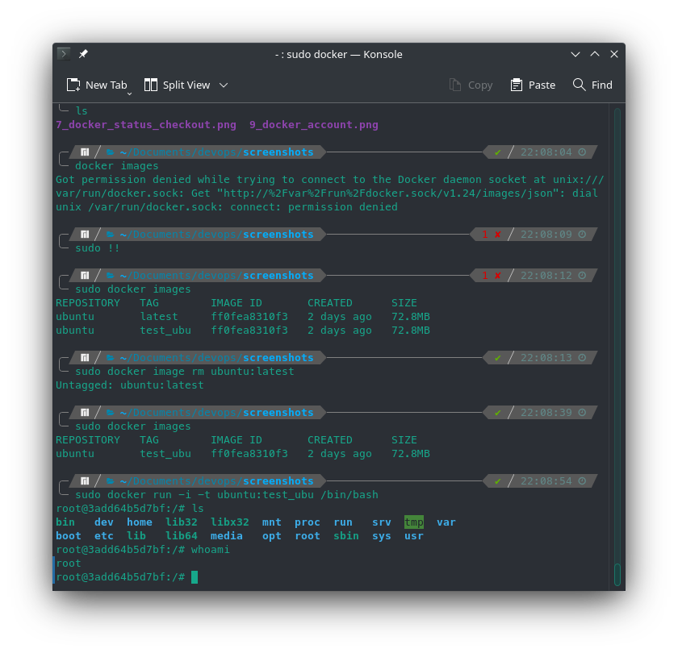
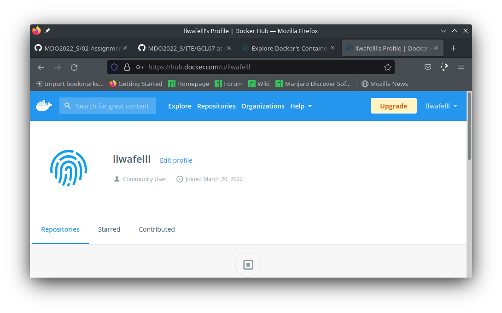

# Sprawozdanie - metody DevOps - lab02
## Utworzenie git hook'a
Do realizacji zadania wykorzystano git hook'a o nazwie
`prepare-commit-msg`. Jego zawartość przedstawia poniższy screen:

Poniższy zrzut ekranu prezentuje pomyślne wykonanie commit'a

W przypadku jeżeli commit nie spełnia określonych wytycznych wypisana
zostanie stosowana wiadomość, a operacja zostanie porzucona.

## Przygotowanie środowiska Dockerowego
Środowisko pracy zapewnia łączność z maszyną wirtualna poprzez `ssh`
oraz `sftp`. Ponizszy zrzut ekranu przedstawia pomyślne połączenie się
z maszyną wirtualna poprzez `ssh` oraz `sftp`.

## Działanie środowiska
Wykazanie ze Docker jest uruchomiony

Pobranie oraz uruchomienie obrazu z Ubuntu

## Utworzenie konta na DockerHub

