# Metodyki DevOps lab03 - sprawozdanie

## Kod programu oraz testy

### Struktura projektu

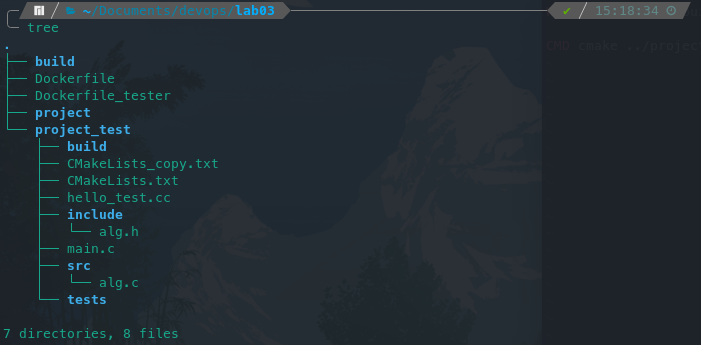

### Konfiguracja cmake oraz budowa projektu

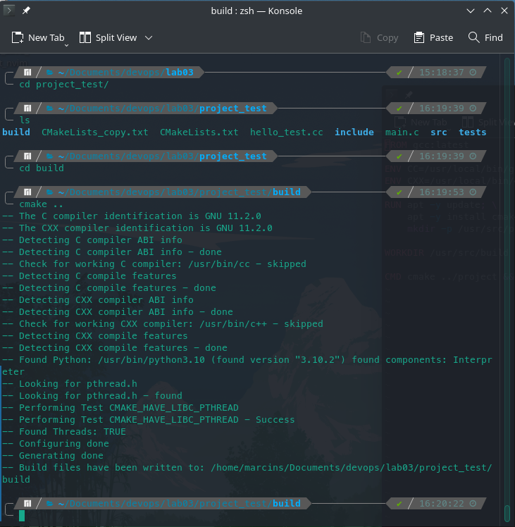
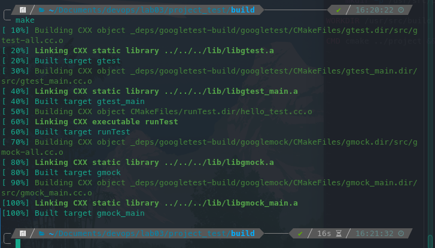

### Uruchomienie testów

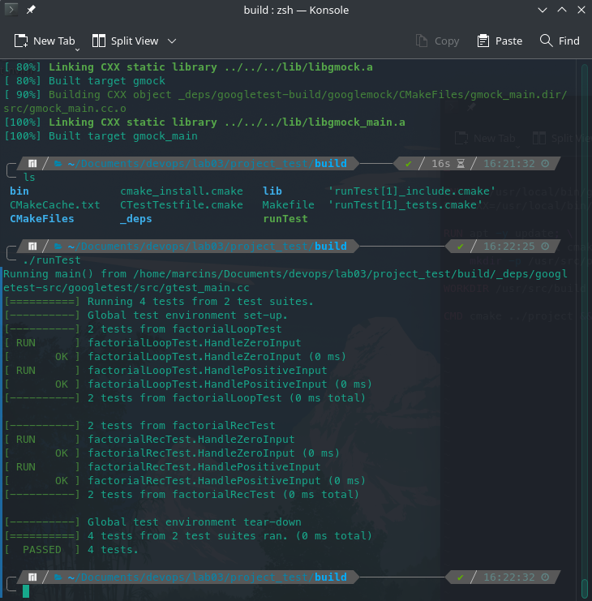

## Przygotowanie obrazów

### Kontener bazowy

Użyty do realizacji ćwiczenia obraz to `gcc:latest`

### Kontener do buildu

Do budowania testów został utworzony obraz `app_builder`
na podstawie kontenera bazowego

#### Dockerfile kontenera `app_builder`

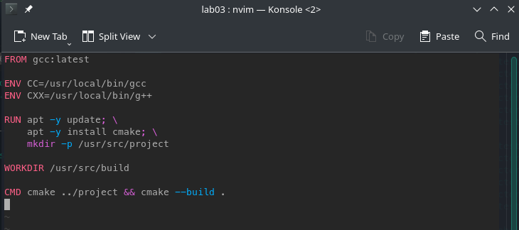

#### Budowanie obrazu kontenera

    sudo docker build -f ./Dockerfile -t app_builder:latest .

#### Uruchomienie kontenera

    sudo docker run -v "$(pwd)/build:/usr/src/build" \        
    -v "$(pwd)/project_test:/usr/src/project" \
    -t app_builder:latest

### Kontener do testów

Do uruchomienia testów został utworzony obraz `app_tester`
na podstwie kontenera `app_builder`

#### Dockerfile kontenera `app_tester`

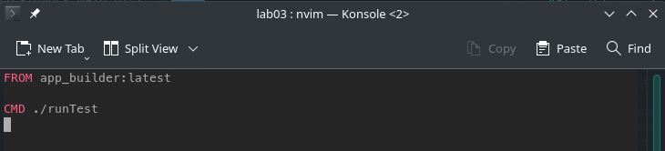

#### Budowanie obrazu kontenera

    sudo docker build -f ./Dockerfile_tester -t app_tester .

#### Uruchomienie kontenera

    sudo docker run -v "$(pwd)/build:/usr/src/build" \        
    -v "$(pwd)/project_test:/usr/src/project" \
    -t app_tester:latest

## Przeprowadzenie buildu w kontenerze

brak obrazow

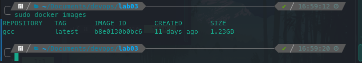

#### Budowa obrazu `app_builder`

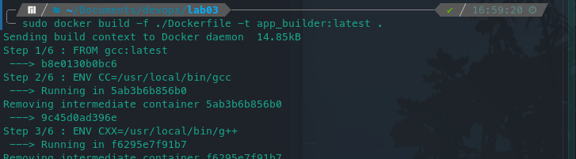

#### Budowa obrazu `app_tester`

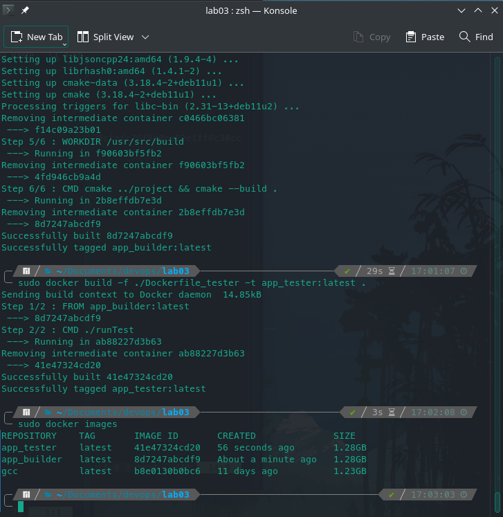

#### Zawartość folderu `./build/` przed uruchomieniem kontenerów

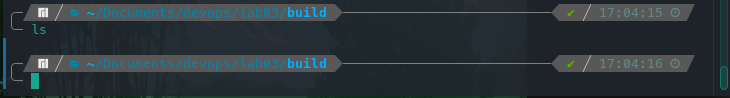

#### Uruchomienie kontenera app_builder

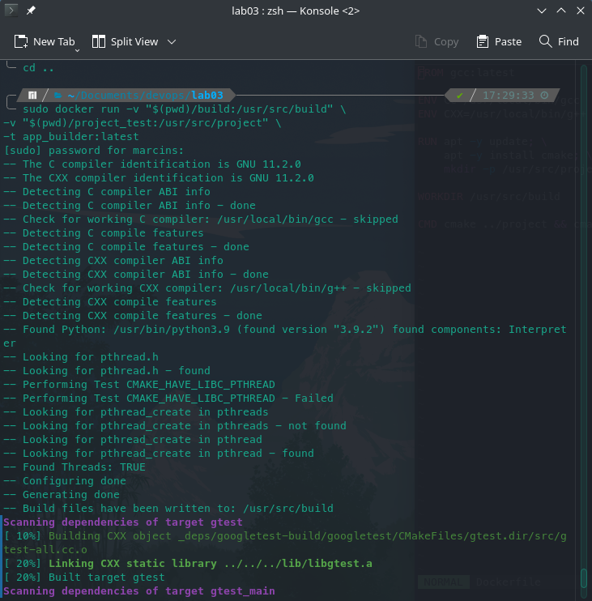

#### Uruchomienie kontenera app_tester

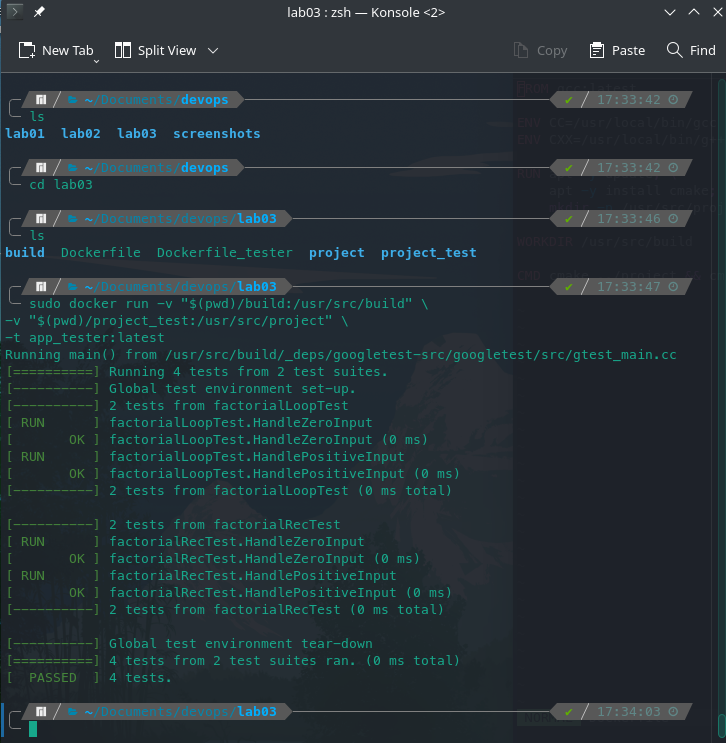

#### Zawartość folderu `./build/` po uruchomieniem kontenerów

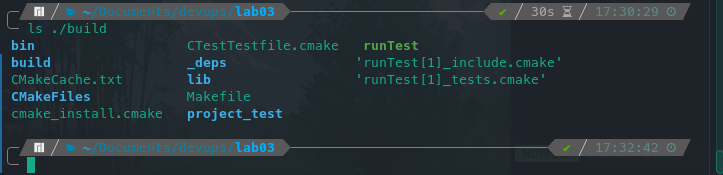

