# metodyki DevOps sprawozdanie - lab04

Uwaga
- Poniższe sprawozdanie zawiera zrzuty ekranu na których powerline
mylnie wskazuje na pracę na branchu `MS401869_lab3`. Barnch został
zmieniony dopiero pod koniec pracy, dlatego należy to zigorować
## Zachowanie stanu
### Przygotowanie obrazu do budowania

Do budowy repozytorium został użyty obraz bazowy z poprzedinch laboratoriów
`gcc:latest`

1. Początkowy stan kontenerów

	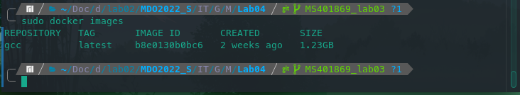

2. Folder projektu przed uruchomieniem kontenera

	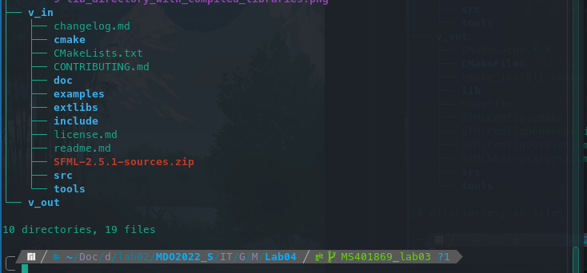

3. Dockerfile do budowy obrazu

	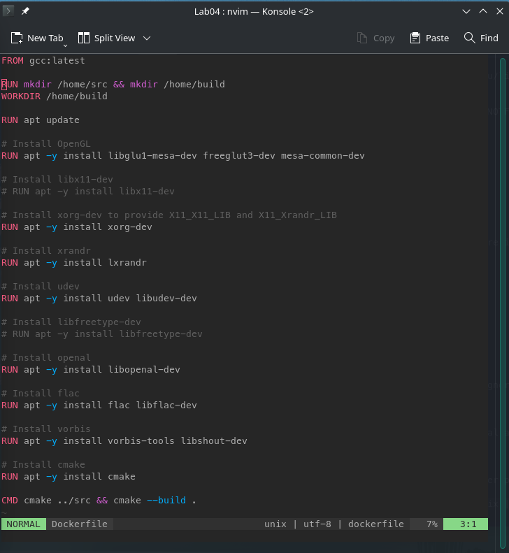

Powyższy dockerfile w formie tekstowej
```dockerfile
FROM gcc:latest

RUN mkdir /home/src && mkdir /home/build
WORKDIR /home/build

RUN apt update

# Install OpenGL
RUN apt -y install libglu1-mesa-dev freeglut3-dev mesa-common-dev

# Install libx11-dev
# RUN apt -y install libx11-dev

# Install xorg-dev to provide X11_X11_LIB and X11_Xrandr_LIB
RUN apt -y install xorg-dev

# Install xrandr
RUN apt -y install lxrandr

# Install udev
RUN apt -y install udev libudev-dev

# Install libfreetype-dev
# RUN apt -y install libfreetype-dev

# Install openal
RUN apt -y install libopenal-dev

# Install flac
RUN apt -y install flac libflac-dev

# Install vorbis
RUN apt -y install vorbis-tools libshout-dev

# Install cmake
RUN apt -y install cmake

CMD cmake ../src && cmake --build .
```

4. Budowa obrazu do budowania

	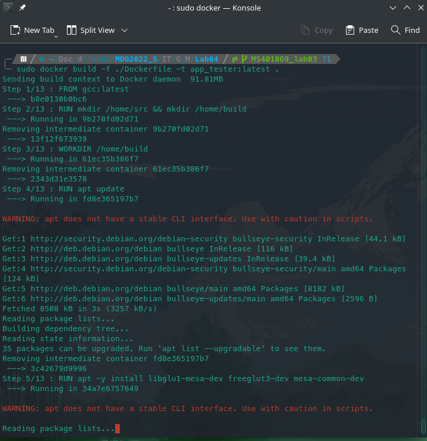

- `-f` wzkazuje na docker file który powinien zostać użyty. W tym
kontekście opcja ta mogłaby zostać pominięta ponieważ dockerfile
posiada domyślną nazwę
- `-t` opcja pozwalająca na określenie nazwy obrazu. Użyta nazwa
`app_tester` nie jest adewatna i została użyta przez pomyłkę, jednak
została zachowana, aby nie powtarzać całego procesu od nowa
- `.` wskazuje na katalog `root` w którym powinny znajdować się pliki
dockerfile

Użyta komenda

	sudo docker build -f ./Dockerfile -t app_tester:latest .

6. Zrzut ekranu przedstawia udaną budowę obrazu

	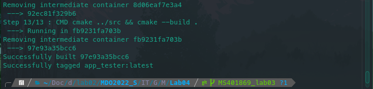

7. Widok kontenerów po budowie obrazu

	

### Uruchomienie obrazu

1. Początek działania obrazu - konfiguracja cmake

	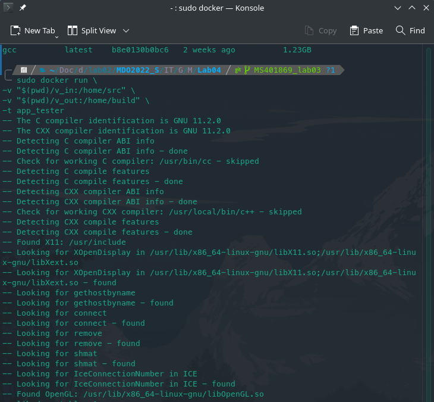

2. Fragmęt budowy bibliotek sfml

	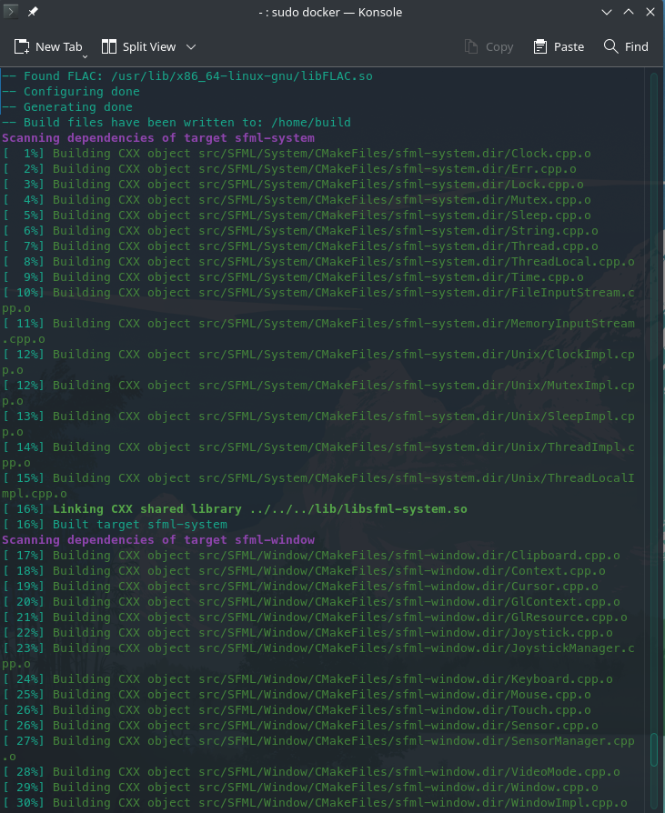

3. Fragmęt przedstawiający pomyśle zakończenie budowy obrazu

	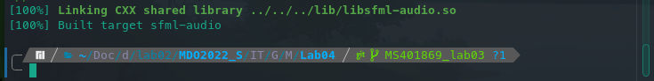

- `-v` utworzenie volumenów dla folderu z kodem źródłowym oraz
	buidem. Użyto `bind mount`

	> Named volumes are great if we simply want to store data, as we don’t
	> have to worry about where the data is stored.
	> With **bind mounts**, we control the exact mountpoint on the host.
	
		-v [ścieżka_do_zasobów_hosta]:[ścieżka_do_zasobów_wewnątrz kontenera]
- `-t` określenie nazwy kontenera do uruchomienia

Użyta komdenda

	sudo docker run \
	-v "$(pwd)/v_in:/home/src" \
	-v "$(pwd)/v_out:/home/build" \
	-t app_tester

4. Folder projektu po uruchomieniu kontenera

	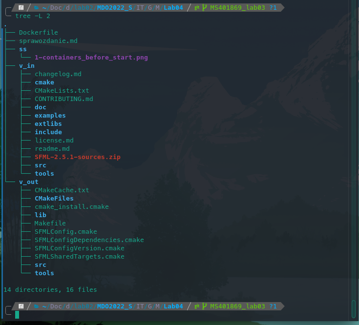

	Na powyższym zrzucie widać, że folder `v_out` został wypełniowy
	zawartością. Gdzie komeda `tree` została wykonana z poziomu hosta.

5. Folder `v_out/lib` przedstawiający skompilowane biblioteki

	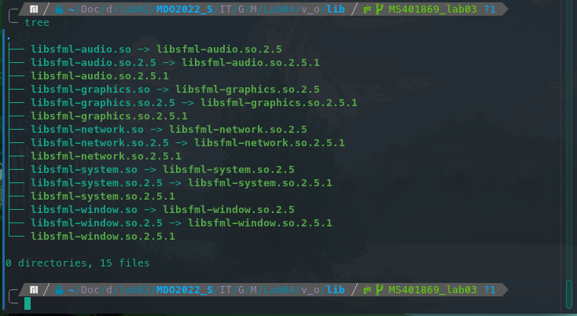

## Eksportowanie portu


### Testowanie transferu danych

Komenda `iperf3`
- `-s` oznacza uruchomienie serwera `iperf3`
- `-c` oznacza uruchomienie klienta `iperf3` po użyciu tej opcji należy
	podać adres ip na którym pracuje serwer `iperf3`
- `-t` opcja pozwalająca czas transferu danych w sekundach
- `-p` opcja pozwalająca na określenie portu na którym pracuje serwer

1. Utworzenie nowej sieci

	Zgodnie z wpisem dokumentajci dockera
	>If two containers are on the same network, they can talk to each other.
	>If they aren’t, they can’t.

	Aby możliwe było przetestowanie komunikacji między dwoma kontenerami,
	konieczne jest utworzenie sieci, do której będą podpięte oba 
	kontenery -- srwera oraz klienta.

		sudo docker network create mynet
	
	Aby pozyskać adresy ip sieci/kontenerów (głównie przydatny będzie adres
	serwera) można użyć komendy

		sudo docker network inspect mynet
	
	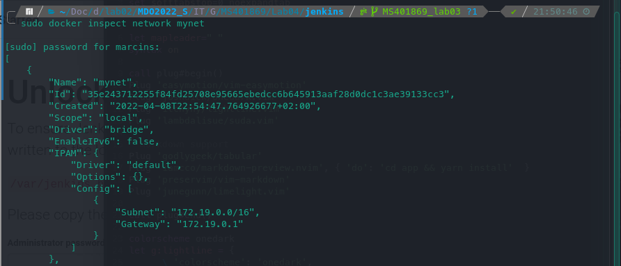
	
	Aby łatwiej zidentyfikować adresy contenerów można użyć `grep`

		sudo docker inspect network mynet | grep IPv4Address


1. Uruchomienie kontenera z serwerem `iperf3`
	
		sudo docker run --network=mynet -p 5201:5201 -it ubu01 sh -c "iperf3 -s"

- `--network` opcja pozwalająca na zdefiniowania w której sieci będzie
	pracował kontener. W tym przypadku kontener został podłączony do sieci
	`mynet` utworzenej wcześniej
- `-p` przekierowanie portów z `5201` kontenera na `5201` hosta
- `-it` opacja `-i` zachowuje standardowy strumień wejścia otwarty.
	opcja `-t` definiuje, który kontener ma zostać uruchomiony. Ostatni
	parametr `"bash"` powoduje uruchomienie powłoki po starcie kontenera
- `sh -c "iperf3 -s"` uruchomienie powłoki zaraz po starcie kontenera, oraz
	(poprzez opcję `-c`) określenie komendy, która ma zostać wykonana
	w tejże powłoce

	*Zrzut dokumentujący wywołanie powyższej komendy znajduje się niżej*

2. Test przepustowości między kontenerami

	

- `--network` opcja pozwalająca na zdefiniowania w której sieci będzie
	pracował kontener. W tym przypadku kontener został podłączony do sieci
	`mynet` utworzenej wcześniej
- `-it` opacja `-i` zachowuje standardowy strumień wejścia otwarty.
	opcja `-t` definiuje, który kontener ma zostać uruchomiony. Ostatni
	parametr `"bash"` powoduje uruchomienie powłoki po starcie kontenera

	Komenda uruchamiająca kontener pełniący rolę klienta `iperf3`

		sudo docker run --network=mynet -it ubu02 "bash"

	Komenda uruchamiająca klienta `iperf3`

		iperf3 -c 172.19.0.2 -t 5 -p 5201

	Należy pamiętać, że pracujemy we własno zdefiniowanej sieci `mynet`,
	dlatego należy podać adres ip kontenera serwera właściwy dla tej sieci.
	W celu pozyskania informacji o adresie ip kontenera z serwerem można
	skożystać z komendy `sudo docker network inspect mynet`
	

3. Test przepustowości między kontenerem, a hostem dockera (linux)

	

4. Między kontenerem, a hotem VM (windows)

	Aby umożliwić połączenie clienta działającego na hoście maszyny 
	wirtualnej (windows) należy ustawić port forwarding z `127.0.0.1:5201`
	na `172.19.0.1:5201`. Jest to konieczne ze względu na fakt, że
	adpater karty sieciowej na maszynie wirtualnej wykożystuje NAT.

	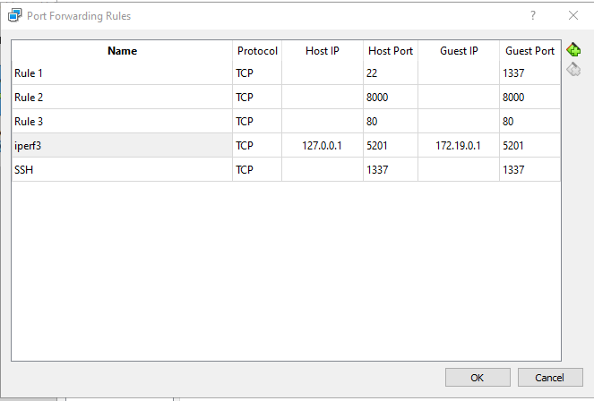

	Próba połączenia się z serwerem `iperf3`

	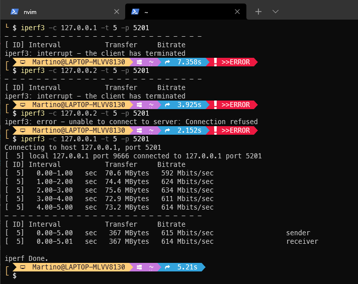

	*`iperf3` został doinstalowany z wykorzystaniem choco:
	`choco install iperf3`*

5. Server `iperf3` uruchomiony na kontenerze po przeprowadzeniu testów
	przepustowości

	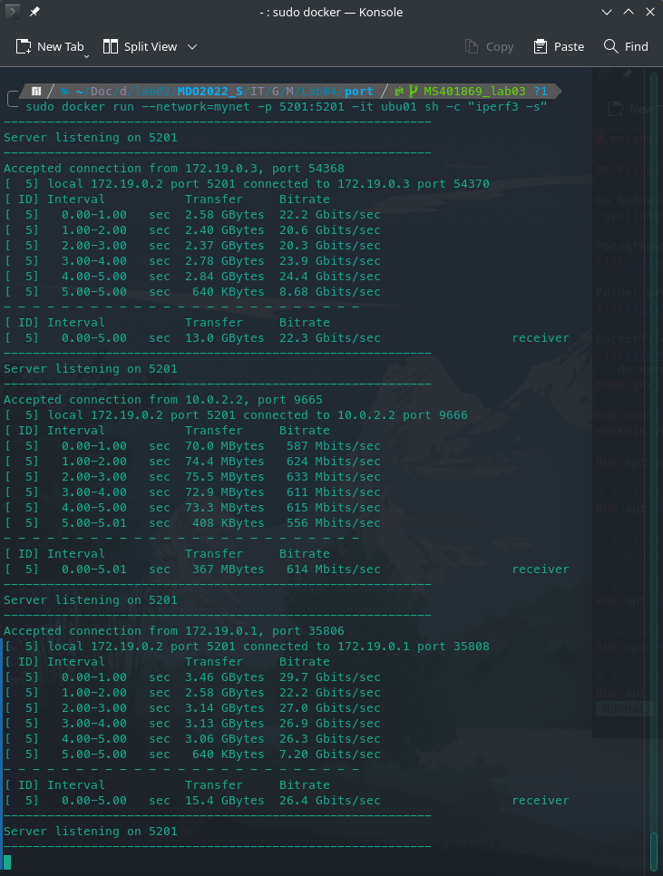

	Zrzut przdstawia uruchomienie kontenera, oraz logi po wykonaniu ww. zapytań
	klienta

	Użyta komenda

### Instancja Jenkins

1. Instalacja jenkins odbyła się zgodnie [dokumentacją](https://www.jenkins.io/doc/book/installing/docker/)

	Widok obrazów oraz procesów po instalacji oraz uruchomieniu jenkins'a

	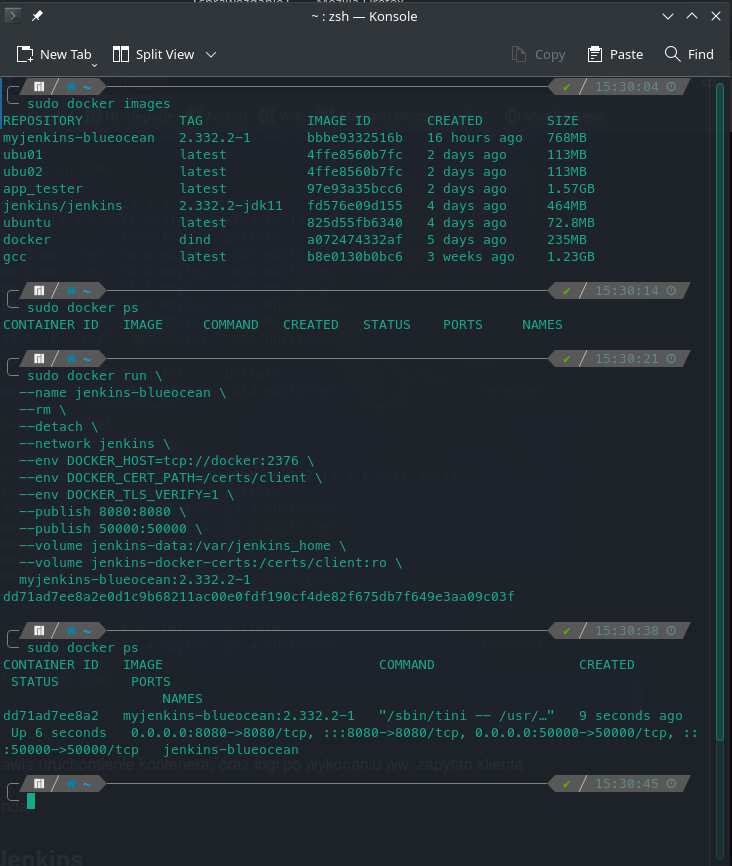

2. Pobranie hasła początkowego w celu utorzenai konta admin

	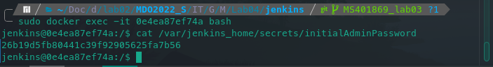

3. Pierwsze uruchomienie jenkins z przeglądarki -- instalacja pluginów

	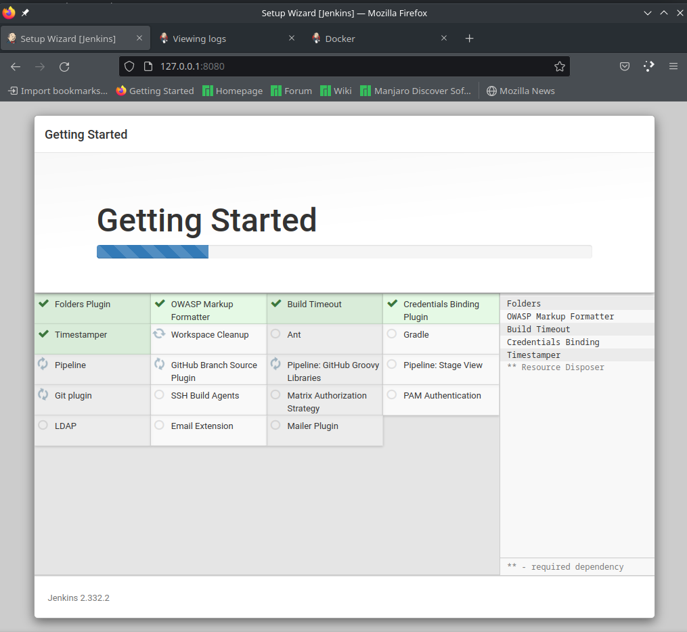

4. Widok w pełni działającego jenkins'a

	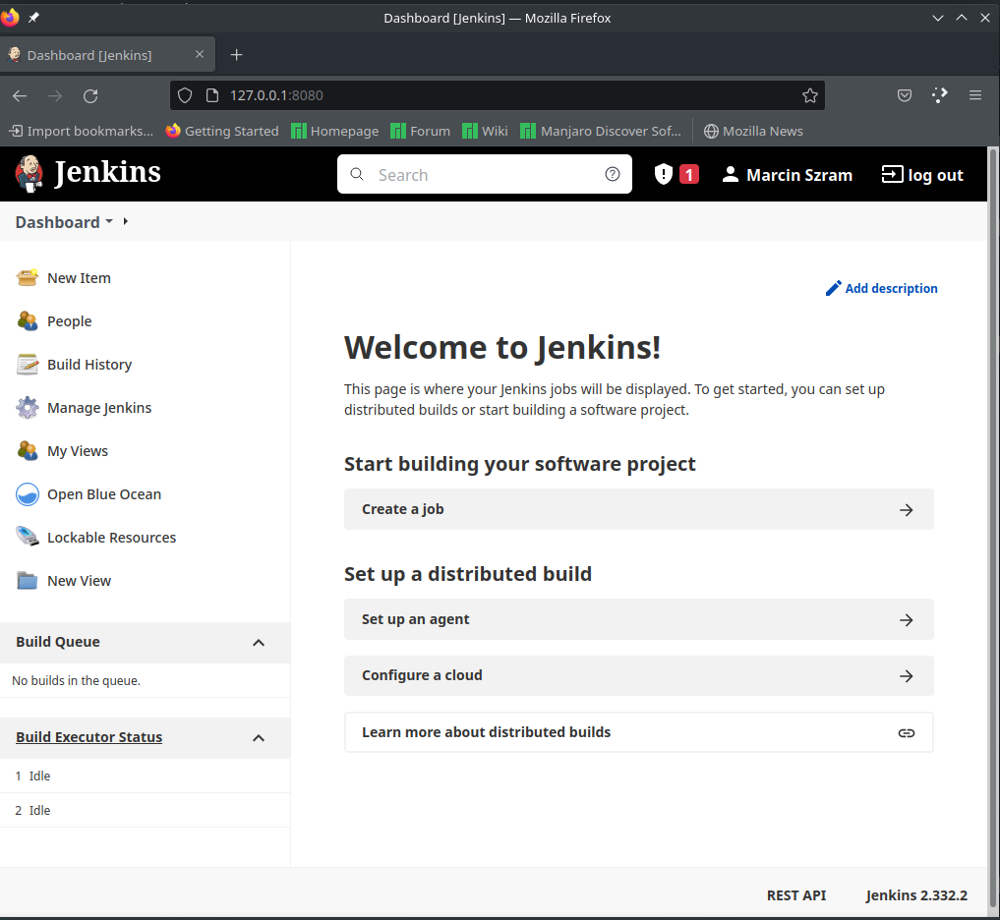
