# Sprawozdanie - Jenkins
## Cel
Celem tworzonego pipeline jest dostarczenie przykładowego
programu `sfml` gotowego do uruchomienia na maszynie docelowej.

Kod przykładowego programu jest dostarczany przez dewelopera.

Pipeline zapewnia:
- Pobranie kodu źródłowego z oficjalnej strony internetowej dewelopera
- Automatyzacja procesu budowania bibliotek `sfml` oraz dodatkowych
    komponentów (m.in. przykłady)
- Integracja bibliotek dynamicznych, zasobów programu oraz plików
    wykonywalnych, w celu dostarczenia w pełni kompletnego programu
    gotowego do wykonania na maszynie docelowej

## Instalacja oraz uruchomienie Jenkins'a
W niniejszym projekcie Jenkins jest uruchamiany na kontenerze dockera,
dlatego konieczne jest wykorzystanie `docker:dind` (docker in docker).

Ten krok jest realizacją instukcji z [oficjalnej dokumentacji Jenkins][install_jenkins]

**Uruchomienie `docker:dind`**
```bash
sudo docker run \
    --name jenkins-docker \
    --detach \
    --privileged \
    --network jenkins \
    --network-alias docker \
    --env DOCKER_TLS_CERTDIR=/certs \
    --volume jenkins-docker-certs:/certs/client \
    --volume "$(pwd)/opengl_app:/var/jenkins_home/export" \
    --volume jenkins-data:/var/jenkins_home \
    --publish 2376:2376 \
    docker:dind \
    --storage-driver overlay2
```

**Uruchomienie `myjenkins-blueocean:2.332.3-1`**
```bash
sudo docker run \
    --name jenkins-blueocean \
    --detach \
    --network jenkins \
    --env DOCKER_HOST=tcp://docker:2376 \
    --env DOCKER_CERT_PATH=/certs/client \
    --env DOCKER_TLS_VERIFY=1 \
    --publish 8080:8080 \
    --publish 50000:50000 \
    --volume jenkins-data:/var/jenkins_home \
    --volume "$(pwd)/opengl_app:/var/jenkins_home/export" \
    --volume jenkins-docker-certs:/certs/client:ro \
    myjenkins-blueocean:2.332.3-1 
```

- Aby powyższe komendy działały prawidłowo, należy upewnić się,
    że `$(pwd)` zwraca ścieżkę tak jak niżej (ścieżka ta zawiera
    podkatalog `opengl_app`, w którym chcemy, aby znalazł się
    program):

        /home/marcins/Documents/devops/lab02/MDO2022_S/ITE/GCL07/MS401869/Lab05/

- Zmiany względem wersji z dokumentacji to:
    - Usunięcie opcji `--rm`
    - Dodanie dodatkowego `bind volume`

**Uwagi**
- Nie ma potrzeby własnoręcznie tworzyć wolumenów. Jeżeli `--volume` jest
    użyty podczas wykonania `docker run` wolumen zostanie utworzony
    automatycznie
- Ścieżka do nazwanych wolumenów `/var/lib/docker/volumes/`
- Jeżeli zajdzie potrzeba utworzenia `bind volumes`, należy pamiętać,
    że zarówno `docker:dind` jak i `myjenkins-blueocean` powinny
    wskazywać na tą samą lokalizację oraz mieć taką samą nazwę
    wolumenu
- Ścieżka do hasła początkowego:

        /var/lib/docker/volumes/jenkins-data/_data/secrests/
    plik ten jest również osiągalny, z poziomu kontenera.
    W tym celu należy wykonać:

        sudo docker exec -it myjenkins-blueocean bash

    a następnie przejść do folderu `/var/jenkins_home/secrets/`
- Należy pamiętać, że aby można było uruchamiać kontenery
    z wewnątrz kontenera Jenkins'a **docker:dind musi być
    uruchomiony**

[install_jenkins]:https://www.jenkins.io/doc/book/installing/docker/

## Obrazy kontenerów
Pliki dockerfile dla opisywanych poniżej obrazów znajdują się
w folderze

    /var/lib/docker/volumes/jenkins-data/_data/workspace

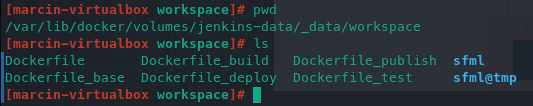

### Kontener bazowy -- `sfml-base`
Kontener bazowy został utworzony na podstawie obrazu `gcc:latest`.

#### Przeznaczenie

Kontener ten pobiera wszystkie potrzebne pakiety potrzebne
do budowania biblioteki `sfml` z kodu źródłowego oraz
narzędzia do samego budowania (`cmake`). Kontener ten stanowi
bazę dla `sfml-builder`

#### Dockerfile
```dockerfile
FROM gcc:latest

RUN apt update

# Install OpenGL
RUN apt -y install libglu1-mesa-dev freeglut3-dev mesa-common-dev

# Install libx11-dev
# RUN apt -y install libx11-dev

# Install xorg-dev to provide X11_X11_LIB and X11_Xrandr_LIB
RUN apt -y install xorg-dev

# Install xrandr
RUN apt -y install lxrandr

# Install udev
RUN apt -y install udev libudev-dev

# Install libfreetype-dev
# RUN apt -y install libfreetype-dev

# Install openal
RUN apt -y install libopenal-dev

# Install flac
RUN apt -y install flac libflac-dev

# Install vorbis
RUN apt -y install vorbis-tools libshout-dev

# Install cmake
RUN apt -y install cmake

# Install zip
RUN apt -y install zip
```

### Kontener do budowania - `sfml-builder`

#### Przeznaczenie
Budowa projektu z wykorzystaniem `cmake` oraz `cmake --build`.
Kontener ten wyznacza również cele do budowania (ang. target)
poprzez nadpisywanie zmiennych w `CMakeCache.txt`.

#### Dockerfile
```dockerfile
FROM sfml-base:latest

RUN mkdir /home/src && mkdir /home/build \
    && mkdir /home/resources
WORKDIR /home/build

CMD cmake -USFML_BUILD_EXAMPLES \
    -DSFML_BUILD_EXAMPLES:BOOL=TRUE \
    ../src && cmake --build .

```
- `-USFML_BUILD_EXAMPLES` usunięcie zmiennej `SFML_BUILD_EXAMPLES`
- `-DSFML_BUILD_EXAMPLES:BOOL=TRUE` utworzenie zmiennej
    `SFML_BUILD_EXAMPLES` typu `BOOL` oraz ustawienie jej na wartość
    `TRUE`
- Należy pamiętać, że opcja `-D` utworzy zmienną środowiskową tylko
    w przypadku, jeżeli ta wcześniej nie istniała (nie będzie jej wtedy
    w `CMakeCache.txt`). W przeciwnym wypadku zmienna ta **nie zostanie
    nadpisana**. Aby zatem nadpisać domyślną wartość zmiennej
    *z poziomu konsoli*, należy najpierw ją usunąć (`-U`),
    a następnie utworzyć i przypisać do niej wartość na
    nowo (`-D`)

### Kontener do testów
Projekt nie przewiduje wykonywania testów, ze względu na ich brak
w oficjalnym repozytorium (testy jednostkowe).

### Kontener do publish'mentu -- `sfml-publisher`
#### Przeznaczenie
Utworzenie archiwum zawierającego wszystkie potrzebne pliki wymagane
do uruchomienia porogramu są to:
- plik wykonywalny
- biblioteki dynamiczne
- tekstury, fonty wykorzystywane przez program

Efektem pracy tego kontenera jest plik `app.zip` umieszczony na
volumenie, który po rozpakowaniu powinien zawierać aplikację
w pełni gotową do uruchomienia (na maszynie docelowej)

*Obrazem bazowym tego kontenera jest `sfml-base` co nie jest najbardziej
optymalnym podściem biorąc pod uwagę charakterystykę pracy tego kontenera.
Możliwe kroki optymalizacji to wykorzystanie "lżejszego" obrazu np.
`ubuntu:latest`*

#### Dockerfile
```dockerfile
FROM sfml-base:latest

WORKDIR /home/app

CMD cp -r ../build/lib/* . \
    && cp -r ../build/examples/opengl/* . \
    && mkdir ./resources \
    && cp -r ../resources/* ./resources \
    && zip -rm app.zip .
```

### Kontener do deploy'mentu -- `sfml-deployer`
#### Przeznaczenie
Dostarczenie gotowego programu do maszyny docelowej. W tym celu wykorzystane
zostały odpowiednio zamontowane volumeny. Efektem działania kontenera jest
plik `app.zip` znajdujący się w folderze `opengl_app` w repozytorium do `lab05`

*Obrazem bazowym tego kontenera jest `sfml-base` co nie jest najbardziej
optymalnym podściem biorąc pod uwagę charakterystykę pracy tego kontenera.
Możliwe kroki optymalizacji to wykorzystanie "lżejszego" obrazu np.
`ubuntu:latest`*

#### Dockerfile
```dockerfile
FROM sfml-base:latest

CMD cp /home/from/app.zip /home/to
```

## Tworzenie pipeline
### Opis stage'ów

#### Stage -- `pre_build`

Buduje kontener bazowy [`sfml-base:latest`](#kontener-bazowy-–-sfml-base)
oraz tworzy strukturę katalogów (na volumenie `jenkins-data`)

#### Stage -- `download_source`
Jeżeli kod źródłowy biblioteki `sfml` nie jest obecny w katalogu
`source/` stage ten wykona następujące czynności:
1. Pobierze archiwum z kodem źródłowym `sfml`
2. Rozpakuje archiwum
3. Przeniesie rozpakowane pliki do folderu `source/`
4. Usunie plik zip

#### Stage -- `build`
Buduje oraz uruchamia kontener
[`sfml-builder:latest`](#kontener-do-budowania---sfml-builder),
którego zadaniem jest przeprowadzenie build'a aplikacji z kodu
źródłowego umiejscowionego w katalogu `source/` w poprzednim stage'u.

**Komenda użyta do uruchomienia kontenera**
```bash
docker run \
    -v "/var/jenkins_home/workspace/sfml/source:/home/src" \
    -v "/var/jenkins_home/workspace/sfml/build:/home/build" \
    -t sfml-builder:latest
```

#### Stage -- `publish`
Buduje oraz uruchamia kontener
[`sfml-publisher:latest`](#kontener-do-publish’mentu-–-sfml-publisher).
Efektem działania jest utworzenie archiwum zip ze skompletowanymi wszystkimi
potrzebnymi komponentami wymaganymi do uruchomienia i w pełni poprawnego
działania aplikacji na maszynie docelowej. Komponentami tymi są:
- plik wykonywalny
- biblioteki dynamiczne `so`
- zawartość folderu `resources/`: czcionki, tekstury

**Uwaga**: nie wszystkie biblioteki dynamiczne są wymagane do uruchomienia
pliku wykonywalnego publikowanego w tym konkretnym pipeline.

**Komenda użyta do uruchomienia kontenera**
```bash
docker run \
    -v "/var/jenkins_home/workspace/sfml/build:/home/build" \
    -v "/var/jenkins_home/workspace/sfml/resources:/home/resources" \
    -v "/var/jenkins_home/workspace/sfml/app:/home/app" \
    -t sfml-publisher:latest
```

#### Stage -- `deploy`
Buduje oraz uruchamia kontener
[`sfml-deployer:latest`](#kontener-do-deploy’mentu---sfml-deployer).
Efektem działania jest udostępnienie archiwum (będącego efektem
działania poprzedniego stage) klientowi, poprzez przeniesienie
go do odpowiedniego folderu.

Przeniesienie odbywa się z pomocą odpowiednio zamontowanych volumenów.

Ideą tego stage jest udostępnienie produktu jakim jest gotowy do uruchomienia
program zwykłemu użytkownikowi (nie root) -- z powodu pracy na `named volumes`
dostanie się do archiwum, jest możliwe tylko z poziomu root'a (folder
`/var/lib/docker/volumes/` z tąd konieczność przeniesienia archiwum).

Folder docelowy to katalog `opengl_app/` utworzony wewnątrz repozytorium
odpowiedniego dla tych laboratoriów.

**Komenda użyta do uruchomienia kontenera**
```bash
docker run \
    -v "/var/jenkins_home/workspace/sfml/app:/home/from" \
    -v "/var/jenkins_home/export:/home/to" \
    -t sfml-deployer:latest
```

#### Stage -- `cleanup`
Uruchamia obraz `ubuntu:latest`, którego jedynym zadaniem jest usunięcie
repozytorium `app.zip` z folderu `app/` na volumenie `jenkins-data`.
Plik ten jest zbędny ze względu na to, że repozytorium zostało
dostarczone do lokalizacji docelowej w stage `deploy`.

Zawartość folderu `build/` nie jest usuwana. Projekt zakłada
wykorzystywanie tych plików poza pipeline po przeprowadzeniu
pomyślnego build'a.

**Komenda użyta do uruchomienia kontenera**
```bash
docker run \
-v /var/jenkins_home/workspace/sfml/app:/home/app \
ubuntu:latest \
sh -c "rm /home/app/app.zip"
```

### Jenkinsfile
```groovy
pipeline {
    agent any
    environment {
        FNAME = 'sfml.zip'
    }

    stages {
        stage('pre_build') {
            steps {
                sh "docker build -f ../Dockerfile_base -t sfml-base:latest ."
                sh "mkdir -p source build archive"
            }
        }

        stage('download_source') {
            // when { expression { fileExists('source/sfml.zip') } }
            steps {
                    dir('source') {
                        script {
                            if (! fileExists("CMakeLists.txt")) {
                                // if sources have not been downloaded download it
                                sh '''curl -o ${FNAME} \
                                https://www.sfml-dev.org/files/SFML-2.5.1-sources.zip'''

                                // unzip the file
                                sh '''unzip ${FNAME} -d .'''

                                // move files to ./source folder
                                sh '''mv ./SFML*/* .'''

                                // clean zip and empty folder
                                sh '''rm -r ./SFML* ./${FNAME}'''

                            } else {
                                echo "skipping downloading sources"
                        }
                    }
                }
            }
        }

        stage('build') {
            steps {
                sh '''docker build -f ../Dockerfile_build -t sfml-builder:latest .'''
                sh '''docker run \
                -v "/var/jenkins_home/workspace/sfml/source:/home/src" \
                -v "/var/jenkins_home/workspace/sfml/build:/home/build" \
                -t sfml-builder:latest'''
            }
        }
        
        stage('publish') {
            steps {
                sh '''docker build -f ../Dockerfile_publish -t sfml-publisher:latest .'''
                sh '''docker run \
                -v "/var/jenkins_home/workspace/sfml/build:/home/build" \
                -v "/var/jenkins_home/workspace/sfml/resources:/home/resources" \
                -v "/var/jenkins_home/workspace/sfml/app:/home/app" \
                -t sfml-publisher:latest'''
            }
        }
        
        stage('deploy') {
            steps {
                sh '''docker build -f ../Dockerfile_deploy -t sfml-deployer:latest .'''
                sh '''docker run \
                -v "/var/jenkins_home/workspace/sfml/app:/home/from" \
                -v "/var/jenkins_home/export:/home/to" \
                -t sfml-deployer:latest'''
            }
        }
        
        stage('cleanup') {
            steps {
                sh '''docker run \
                -v /var/jenkins_home/workspace/sfml/app:/home/app \
                ubuntu:latest \
                sh -c "rm /home/app/app.zip"'''
            }
        }
    }
}
```

## Prezentacja uruchomienia oraz efektów działania pipeline

### Uruchomienie pipeline
Przed uruchomieniem pipeline należy upewnić się, że kontenery
`docker:dind` oraz `myjenkins-blueocean` są uruchomione.
[Jak uruchomić kontenery?](#instalacja-oraz-uruchomienie-jenkins’a)

#### Stan przed uruchomieniem pipeline
##### Struktura oraz zawartość katalogów
###### Katalog z repozytorium do lab05
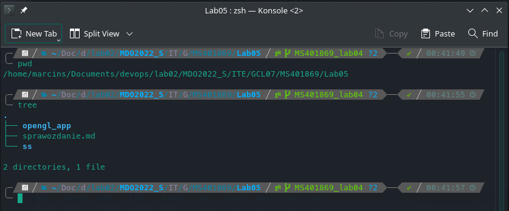

###### Katalog z volumenem jenkins'a `jenkins-data` (dla pipeline sfml)
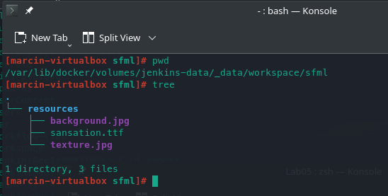

##### Obrazy kontenera `myjenkins-blueocean`
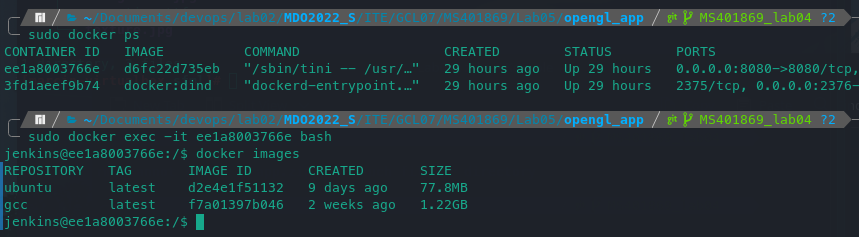

#### Uruchomienie pipeline
##### Jenkins dashboard: zakładka `My Views`
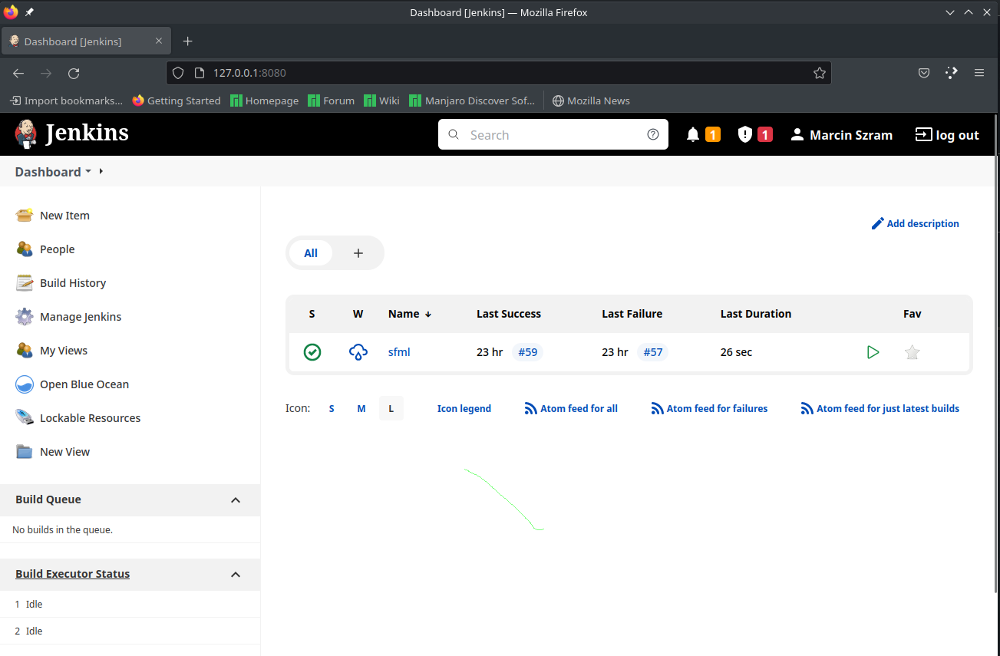

##### Widok na progres pipeline
###### Halfway
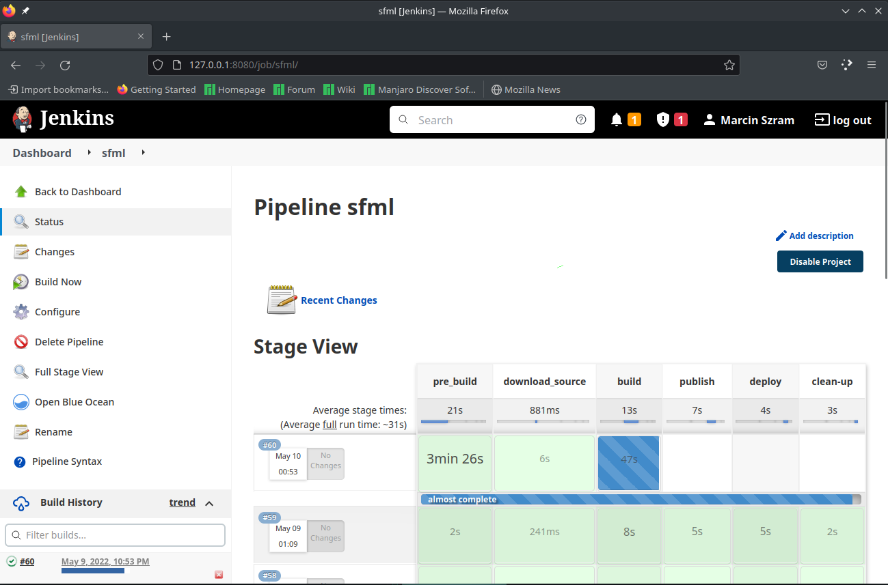

###### Koniec działania pipeline
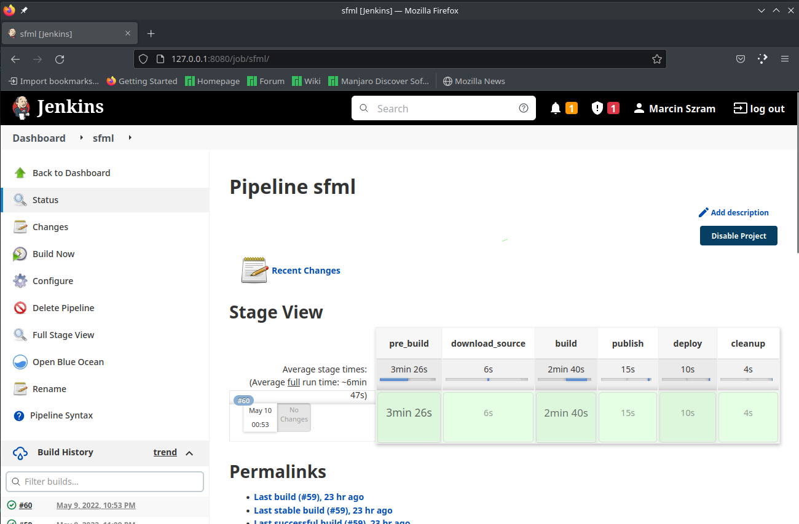

#### Stan po uruchomieniu pipeline
##### Struktura oraz zawartość katalogów
###### Katalog z repozytorium do lab05
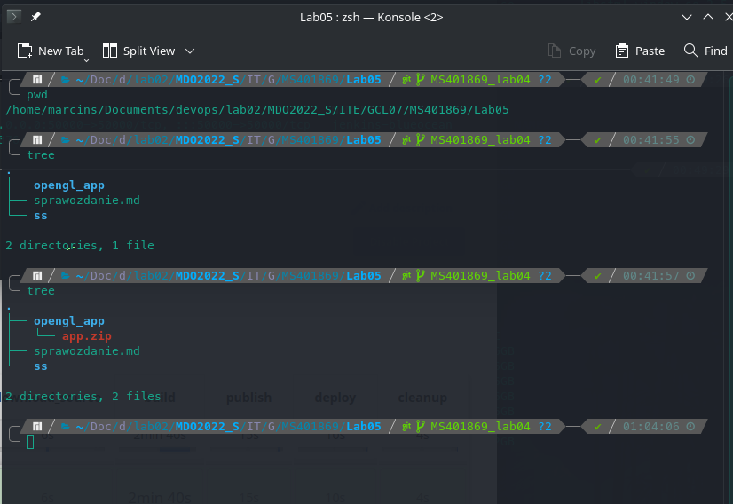

###### Katalog z volumenem jenkins'a `jenkins-data` (dla pipeline sfml)
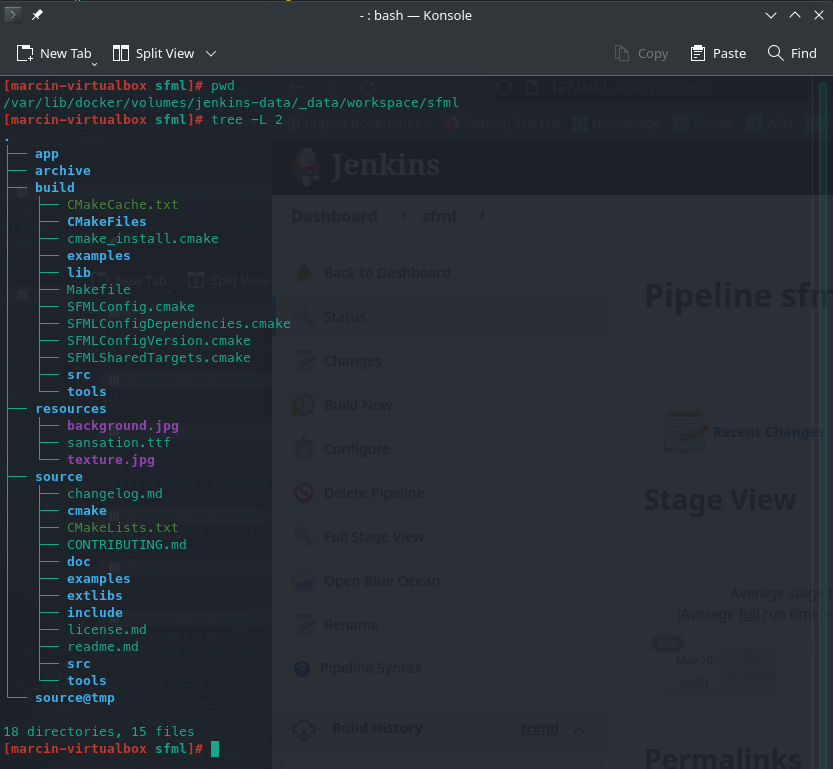
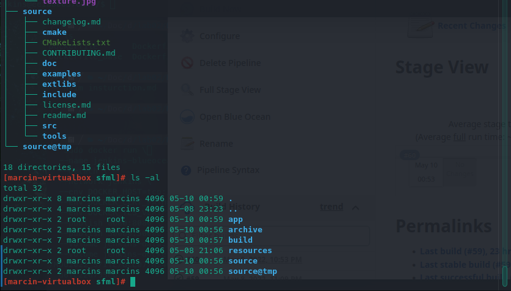

##### Obrazy kontenera `myjenkins-blueocean`
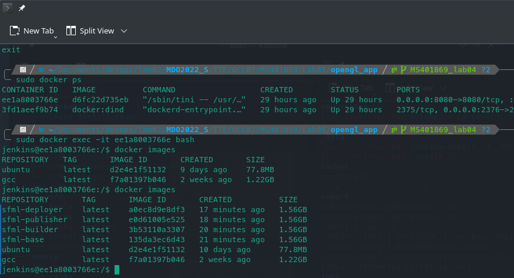

#### Efekty działania pipeline
##### Rozpakowanie pliku wynikowego

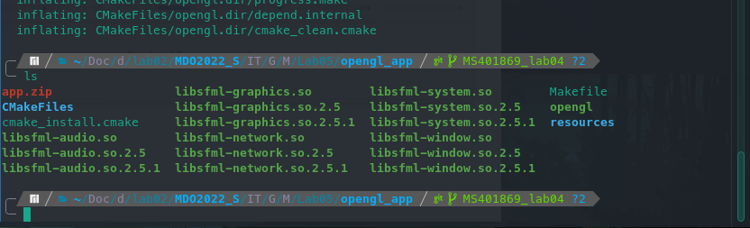

##### Uruchomienie aplikacji
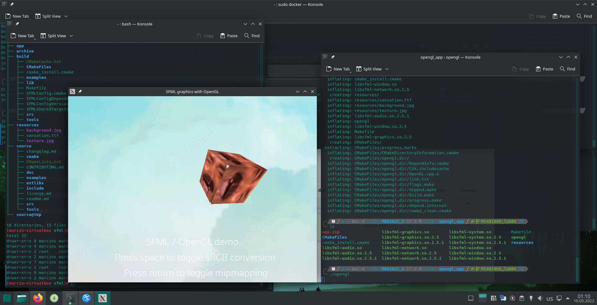
