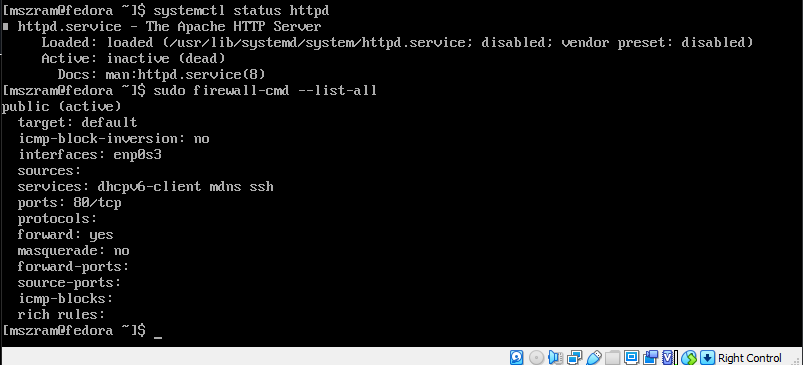
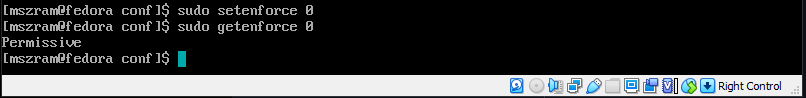
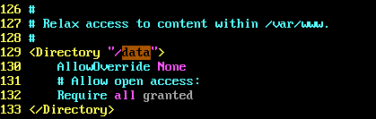
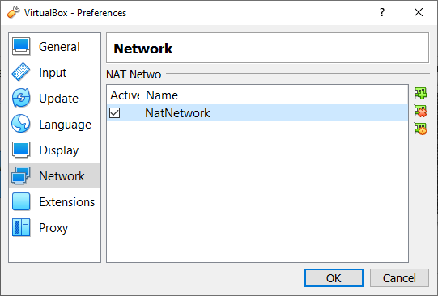
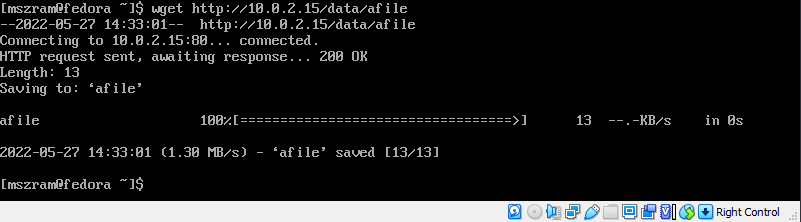
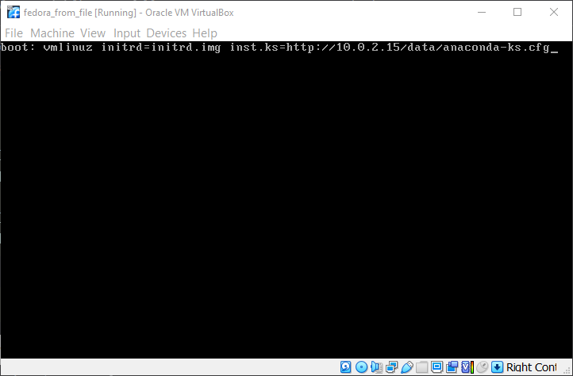
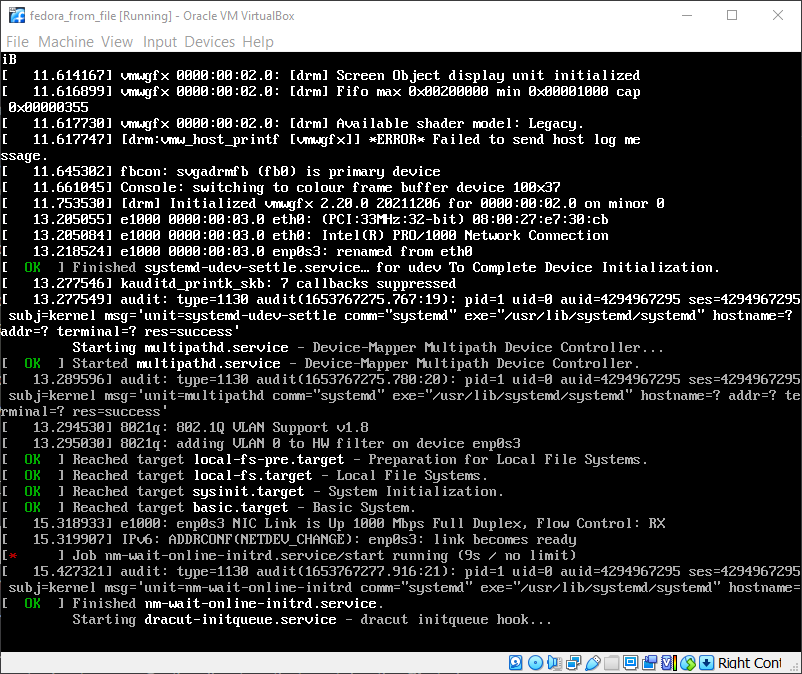
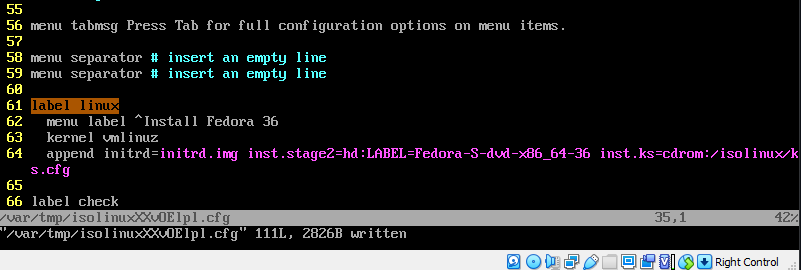
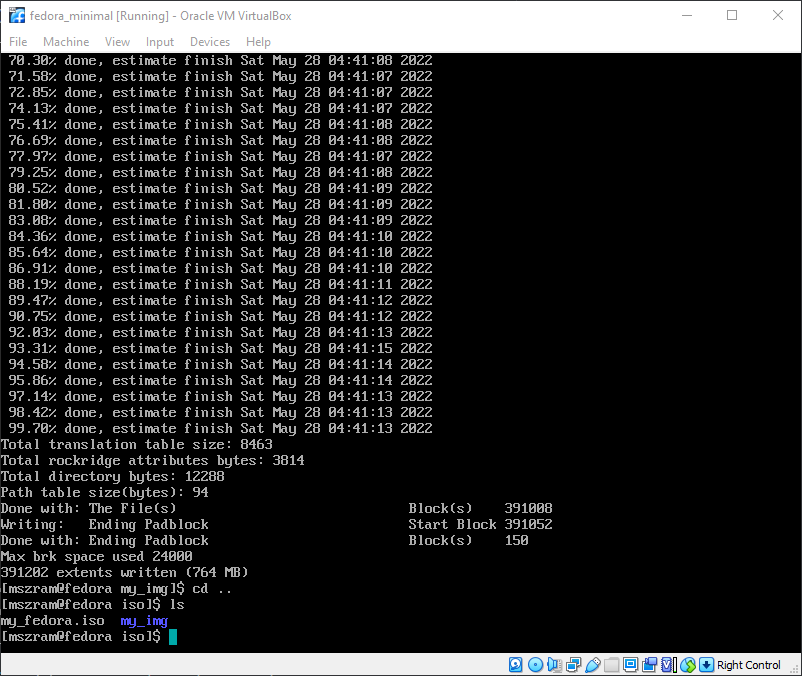

# Metodyki DevOps sprawozdanie - lab09
## Instalacja oraz przygotowanie systemów
### Przygowowanie serwera http
1. Sprawdzenie czy daemon httpd jest zainstalowany oraz otwarcie portu 80

    

    Komenda do otwarcia portu 80
        
        sudo firewall-cmd --add-port=80/tcp

1. Wyłączenie SELinux

    

1. Dodanie folderu do udostępniania przez serwer

    Plik konfigruacyjny serwera httpd znajduje sie w folderze
    `/etc/httpd/conf/httpd.conf`
    

### Konfiguracja maszyny wirtualnej
1. Utworzenie sieci NAT

    

1. Zmiana ustawień sieciowych dla hosta oraz serwera
- Attached to: `NAT Network`
- Name: `NatNetwork`

### Weryfikacja połączenia
1. Wykonanie testu w celu sprawdzenia czy maszyna 'klient' jest w stanie
pobierać zasoby z maszyny będącej serwerem

    

## Instalacja nienadzorowana
### Modyfikacja pliku
1. Plik odpowiedzi z instalacji `anaconda-ks.cfg` znajduje się w folderze `/root/`

2. Modyfikacja:
    - wyłączenie instalacji graficznej
    - dodanie pobierania artefaktów z sewera http
    - dodanie repozytorium

### Instalacja
1. Uruchomienie instalatora systemu fedora
1. W celu przeprowadzenia zautomatyczowanej instalacji na podstawie
pliku `anaconda-ks.cfg` po wyświetleniu ekranu z opcją bootowania
nacisnąć `esc`, następnie wykonać komendę

        vmlinuz initrd=initrd.img inst.ks=http://10.0.2.15/data/anaconda-ks.cfg

1. Widok po wciśnięciu `esc` z poziomu menu bootowania oraz chwilę po
wywołaniu powyższej komendy

    

    

## Instalacja as a code
### Preparacja custom'owego obrazu iso
1. Zamontowanie obrazu iso z fedorą
`Menu Bar->Devices->Optical Drivers` (plik iso być widoczyny
jako `/dev/sr0`)

1. Utworzenie folderu na którym zamontujemy obraz

        mkdir /media/my_img

1. Zamontowanie obrazu

        mount /dev/sr0 /media/my_img

1. Utworzenie folderu, który będzie przechowywał lokalną kopię obrazu iso

        mkdir ~/iso

1. Skopiowanie danych

        cp -pr /media/my_img/ ~/iso

1. Skopiowanie pliku `anaconda-ks.cfg` oraz zmiana jego nazwy na `ks.cfg`

        cp anaconda-ks.cfg ~/iso/my_img/isolinux/ks.cfg

1. Modyfikacja pliku `isolinux.cfg`

    

    Modyfikacje obejmują linię 64:

        append initrd=initrd.img inst.stage2=hd:LABEL=Fedora-S-dvd-x86_64-36 inst.ks=cdrom:/isolinux/ks.cfg

1. Generacja obrazu iso z użyciem `genisoimage`

    

    Komenda użyta do generacji iso (komenda uruchomiona wewnątrz
    folderu `my_img/`

        genisoimage -UTJrv \
        -V "Fedora-S-dvd-x86_64-36" \
        -volset "Fedora-S-dvd-x86_46-36" \
        -A "Fedora-S-dvd-x86_64-36" \
        -b isolinux/isolinux.bin \
        -c isolinux/boot.cat \
        -boot-load-size 4 \
        -e images/efiboot.img \
        -no-emul-boot \
        -o ../my_fedora.iso .

    - `-V` ID volumenu (nazwa/label)
    - `-volset` ID zestawu volumenów
    - `-A` Nazwa wpisana do nagłówka volumenu - opisuje aplikację zapisaną na dysku
    - `-b` Ścieżka do boot image (wymagane przy tworzeniu bootable CD)
    - `-c` Ścieżka do boot catalog
    - `-e` Ścieżka do EFI boot image
    - `no-emul-boot` Sprecyzowanie, że boot image wykorzystany do
        tworzenia bootable CD nie jest obrazem emulowanym
    - `-o` Ustawienie, ścieżki oraz nazwy dla output file'a
