# Metodyki devops sprawozdanie lab11

## Instalacja kubernates

Instalacja została przeprowadzona na maszynie wirtualnej (Oracle VirtualBox).
Kubernates wykorzystuje docker'a jako driver.

1. Dodanie użystkowanika do grupy `docker`

    Operacja ta była konieczna w celu podjęcia kroku nr 2

        sudo usermod -aG docker $USER

    *Aby zmiany zostały zastosowane należy wylogować, a następnie
    zalogować ponownie na konto*

2. Instalacja kubernates
    
        minikube start

    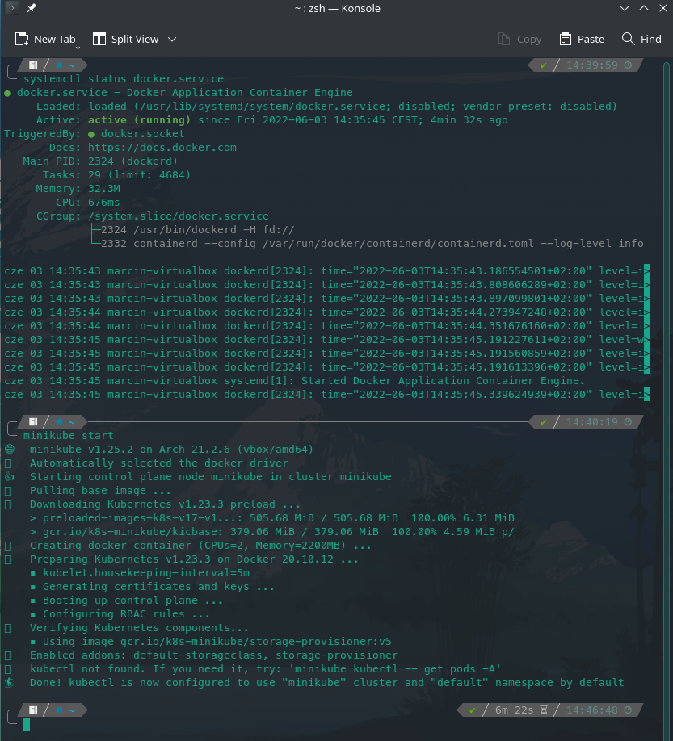
    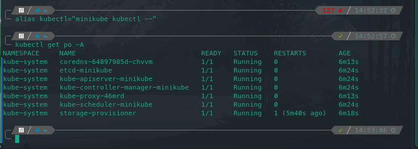

## Uruchamianie oprogramowania

    minikube kubectl run -- http-serv --image=httpd:2.4 --port=80 --labels app=http-serv

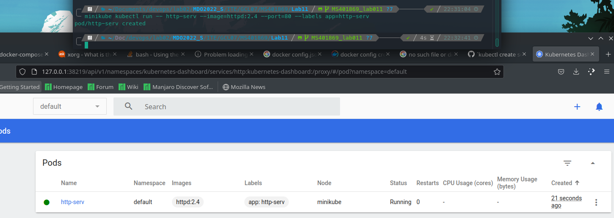

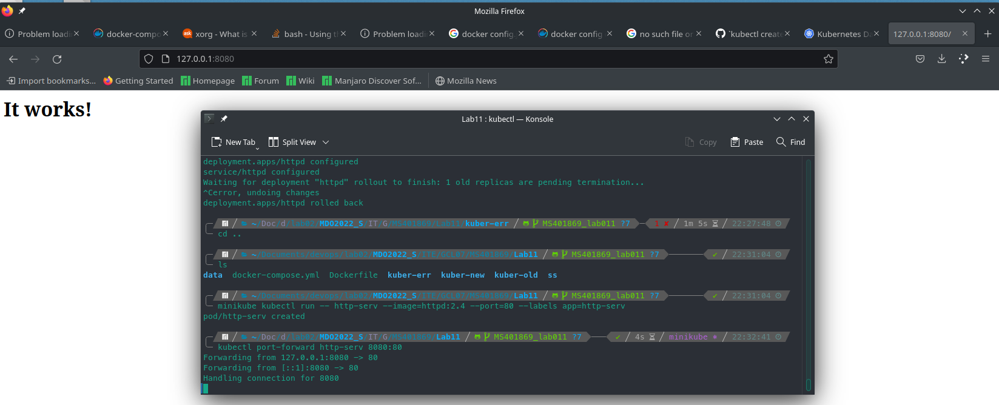


## Konwersja wdrożenia ręcznego na wdrożenie deklaratywne YAML

Stan obrazów przed rozpoczęciem pracy
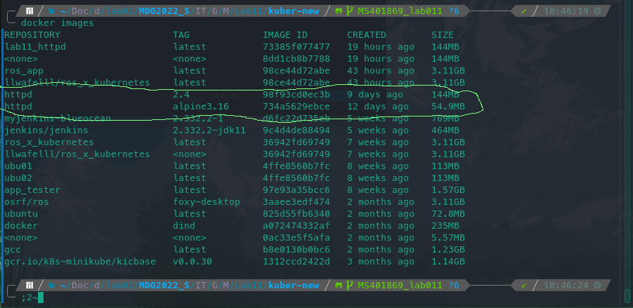

Docker-compose użwany do budowania kontenerów
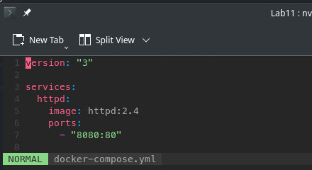

Komenda użyta do konwersji `docker-compose.yml`
(wywołana wewnątrz folderu z docker-compose)

    kompose convert

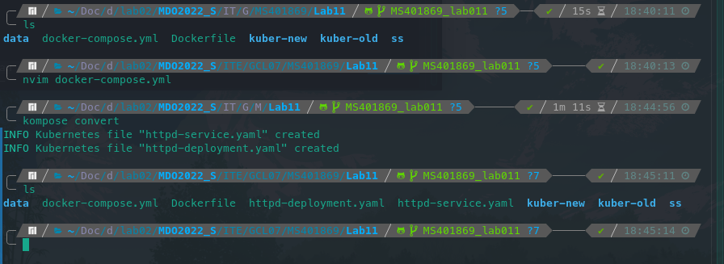

Edycja pliku `httpd-deployment.yaml` w celu zwiększenia liczby replik
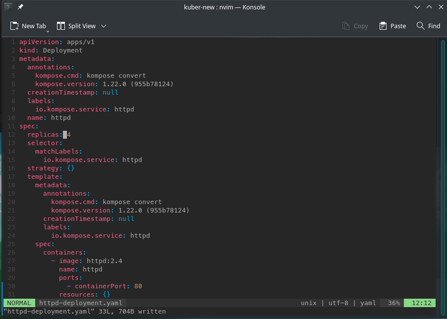

Rozpoczęcie wdrożenia

    kubectl apply -f .

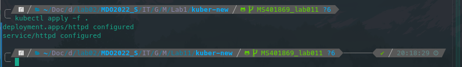

Dashboard po zakończeniu procesu wdrożenia
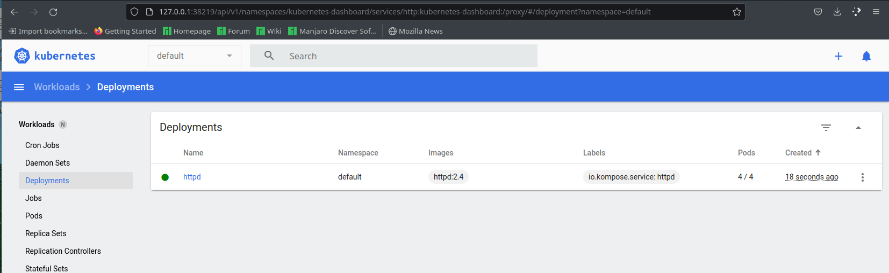
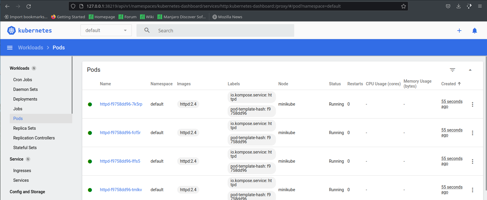

Zbadanie elementu

    kubectl rollout status deployment/httpd

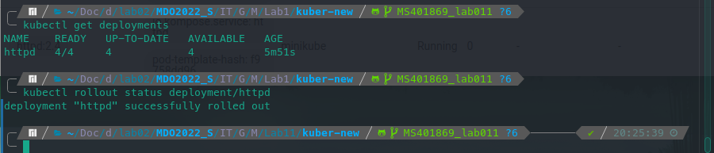

## Przygotowanie nowego obrazu

Do istniejących obrazów (prezentowanych powyżej) dodano obraz mający na celu
spowodować błąd
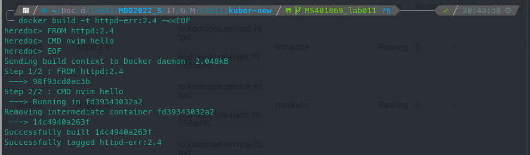

## Zmiany w deploymencie

Dashboard po zwiększeniu liczby replik do 8


Dashboard po zmniejszeniu liczby replik do 1
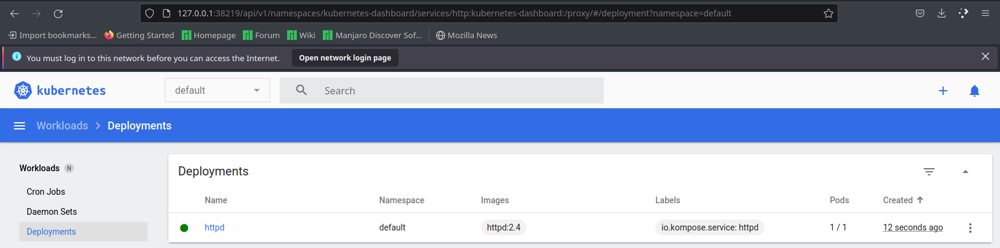

Dashboard po zmniejszeniu liczby replik do 0
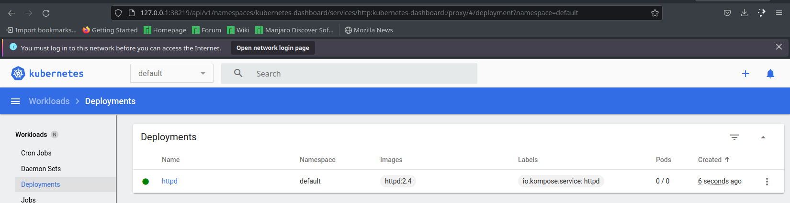

Deployment starej oraz nowej wersji, sprawdzenie historii
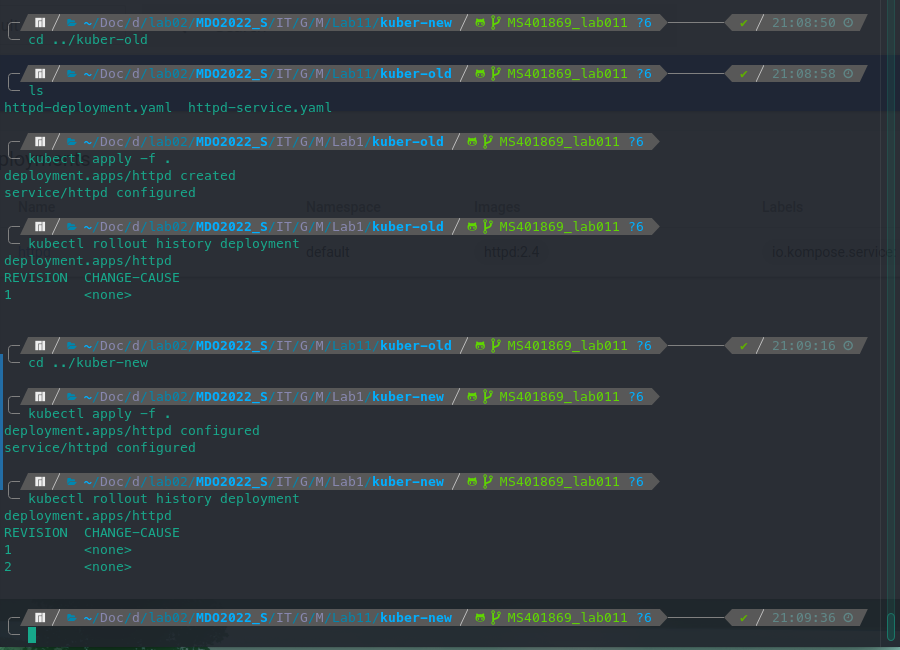

Przywrócenie poprzedniej wersji wdrożenia
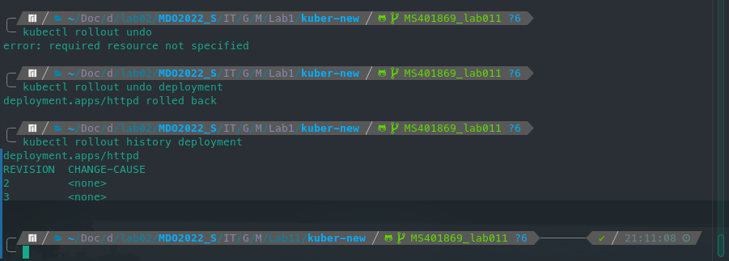

## Kontrola wdrożenia

Deplyment błędogennej wersji
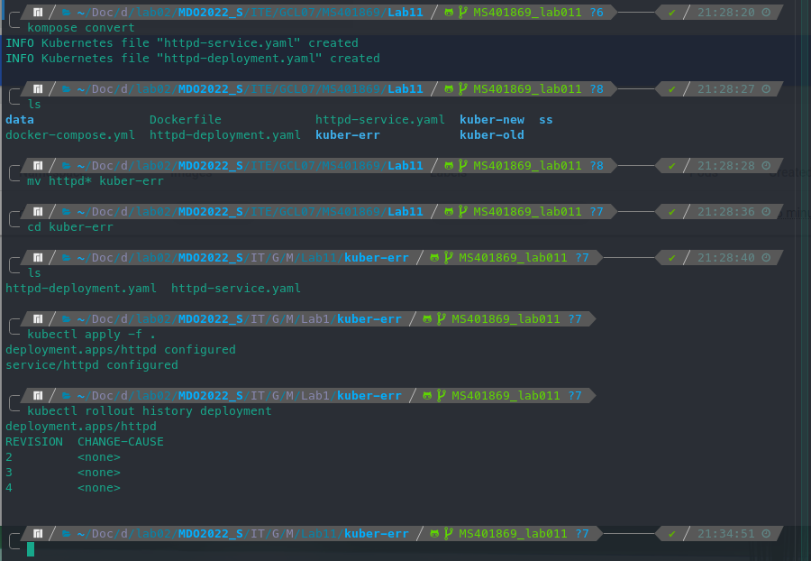
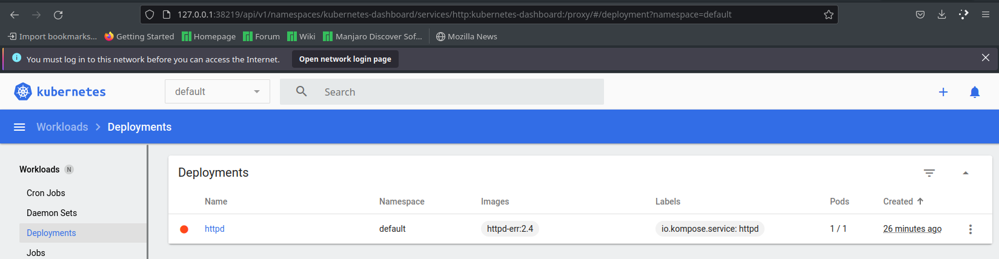

Ręczny powrót do działającej wersji


Skrypt do automatyzacji powrotu do ostatniego deply'u,
w przypadku kiedy deployment nie zostanie wdrożony w przeciągu 1 minuty

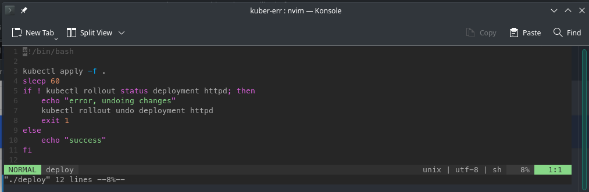

```bash
#!/bin/bash

kubectl apply -f .
sleep 60
if ! kubectl rollout status deployment httpd; then
	echo "error, undoing changes"
	kubectl rollout undo deployment httpd
	exit 1
else
	echo "success"
fi
```

Działanie skryptu
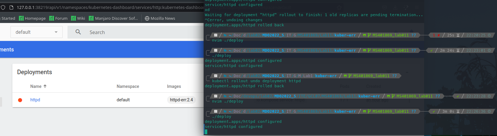
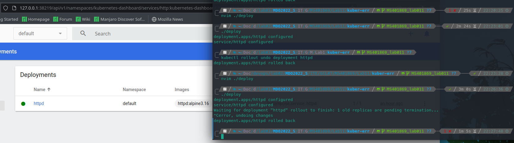
