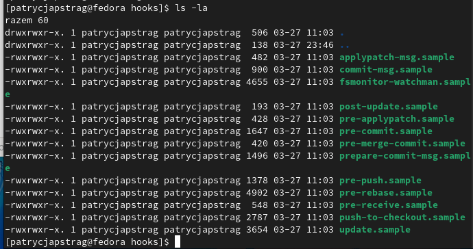
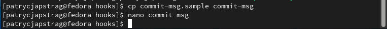
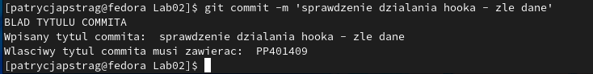
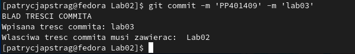
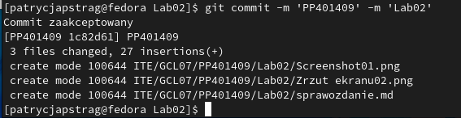
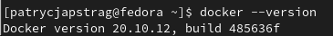
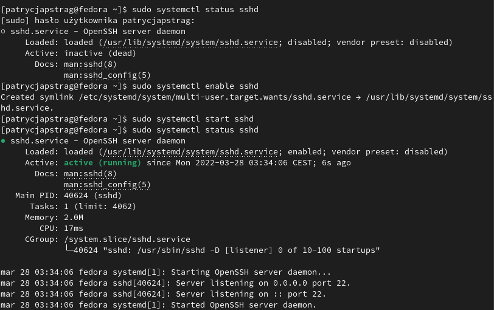
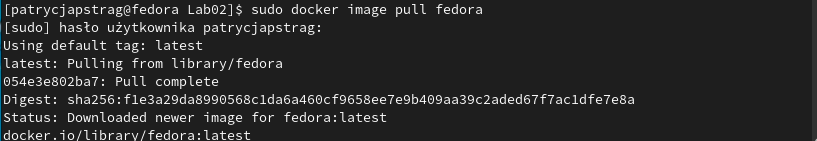
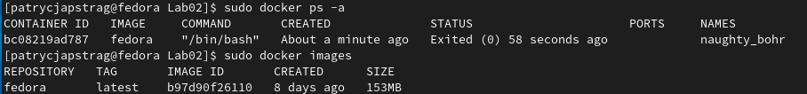
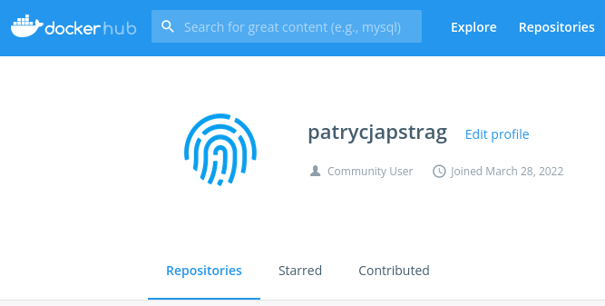

# SPRAWOZDANIE LAB02 
Patrycja Pstrąg 401409

1. Wyświetlenie zawartości katalogu hooks



2. Przygotowanie git hooka sprawdzającego czy w tytule commita znajduje się PP401409, oraz czy w treści commita znajduje się numer laboratorium.



```sh
#!/bin/sh
if [ "$(grep -E -w -o 'PP401409' "$1" | wc -l)" != "1" ]
then
    echo INCORRECT_TITLE
    exit 1
fi
if [ $(grep -E -w -o 'Lab[0-20]*' "$1" | wc -l) != "1" ]
then
    echo  INCORRECT_DESC
    exit 1
fi
exit 0
```

Przykład działania
a) niewłaściwy tytuł commita - poprawione



b) właściwy tytuł commita ale niewłaściwa treść commita - poprawione



c) właściwy tytuł i treść - poprawione



3. Przygotowanie środowiska Dockerowego:

`sudo dnf install docker` Instalacja dockera

`docker --version` Sprawdzenie wersji dockera



`systemctl status docker` Sprawdzenie czy docker jest uruchomiony


`ifconfig` Wyświetlenie interfejsu sieciowego w celu nawiąznia połączenia z Windowsem


4.Łączenie za pomocą ssh

a) `sudo systemctl status sshd` sprawdzenie statusu ssh

b) `sudo systemctl enable sshd`

c) `sudo systemctl start sshd` uruchomienie ssh

d) ponowne sprawdzenie statusu



WYSTĄPIŁ BŁĄÐ PRZEZ FAKT, ŻE DO SIECI AKADEMIKOWEJ TRZEBA SIĘ LOGOWAĆ I MASZYNA WIRTUALNA NIE MIAŁA DOSTĘPU DO INTERNETU GDY SIEĆ BYŁA USTAWIONA NA BRIDGET

5. Uruchomienie obrazu fedory w kontenerze

`sudo docker image pull fedora`
Pobranie obrazu fedory



` sudo docker run fedora`

Uruchomienie obrazu fedory

`sudo docker ps -a`

`sudo docker images`




6. Założenie konta na Docker Hub




