SPRAWOZDANIE LAB03 PATRYCJA PSTRĄG

1. Uruchamianie kontenera z obrazu ubuntu

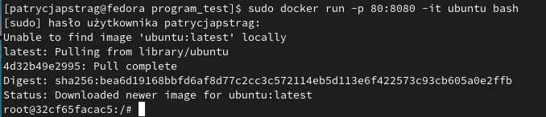

2. Update systemu kontenera

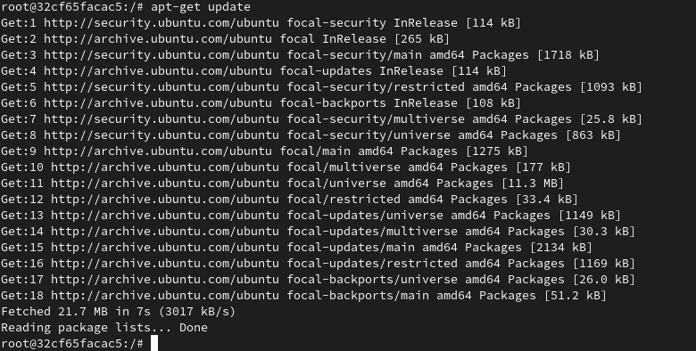

`apt-get install git` Instalacja gita

3. Klonowanie

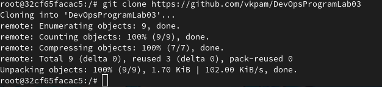

Instalowanie cmake 
`apt-get install cmake`

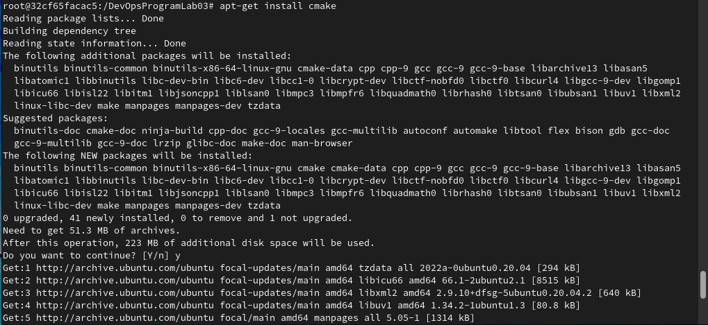

Instalowanie g++ 
`apt-get install g++`

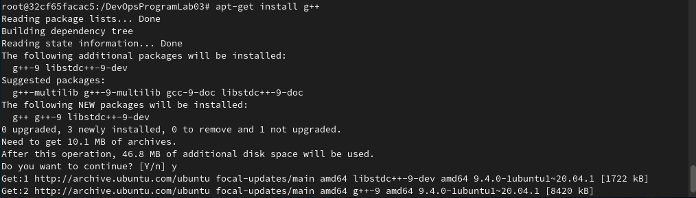

Instalacja biblioteki gTest
`apt-get install libtest-dev`

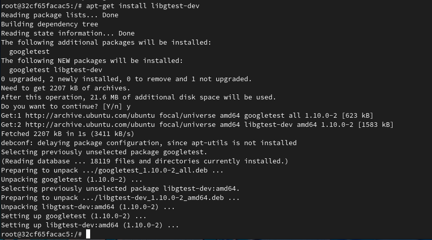

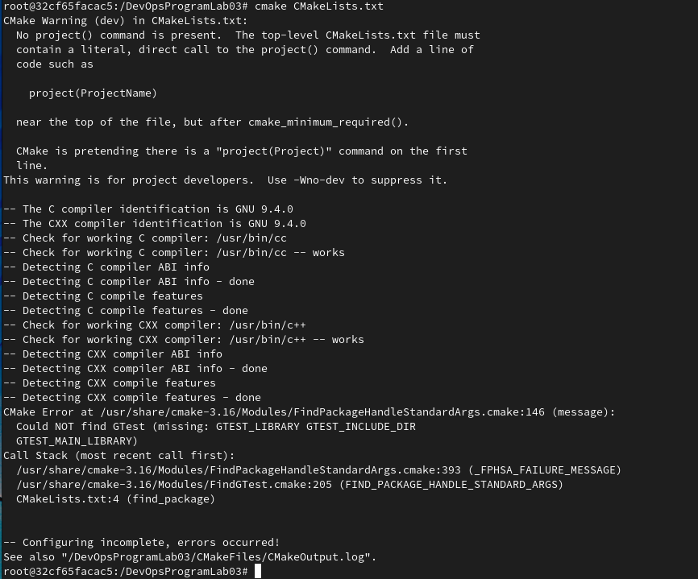

`cmake CMakeLists.txt` 

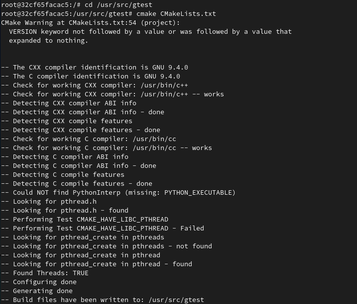

`make` 

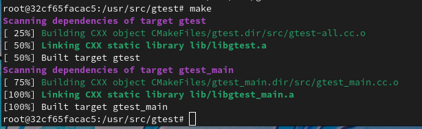

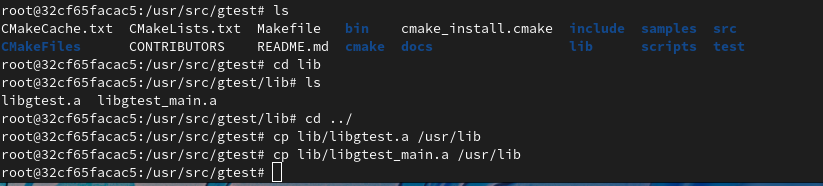


4. Kompilacja programu

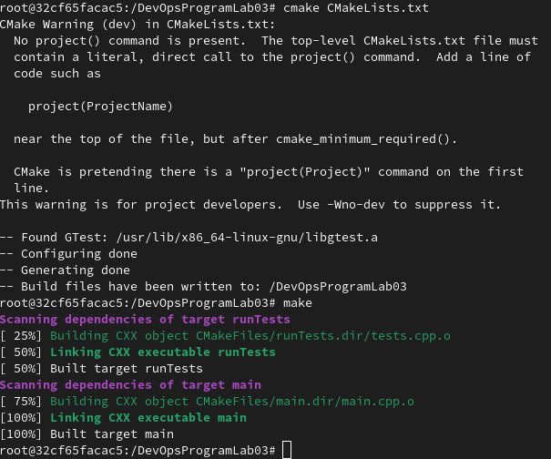

Uruchomienie testów - passed

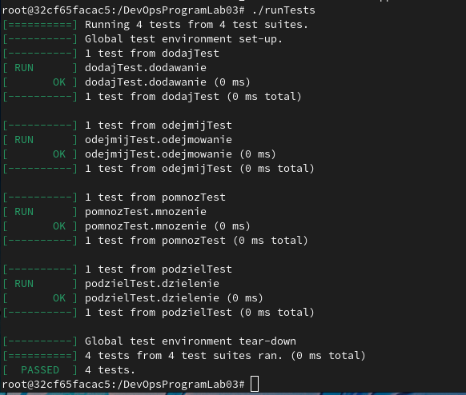

CZĘŚĆ 2

1. Stworzenie pierwszego pliku Dockerfile

```

FROM ubuntu:latest
RUN apt-get update -y
RUN apt-get install git -y
ENV TZ=Europe/Warsaw
RUN ln -snf /usr/share/zoneinfo/$TZ /etc/localtime && echo $TZ > /etc/timezone
RUN apt-get install cmake -y
RUN apt-get install g++ -y
RUN apt-get install libgtest-dev -y
WORKDIR "/usr/src/gtest"
RUN cmake CMakeLists.txt
RUN make
RUN cp lib/libgtest.a /usr/lib
RUN cp lib/libgtest_main.a /usr/lib
WORKDIR "/"
RUN mkdir DevOpsProgramLab03                 
WORKDIR "/DevOpsProgramLab03"
RUN git init
RUN git clone https://github.com/vkpam/DevOpsProgramLab03
RUN cmake CMakeLists.txt
RUN make

```

2. Zbudowanie za pomocą pliku Dockerfile obrazu dockerfilepicture

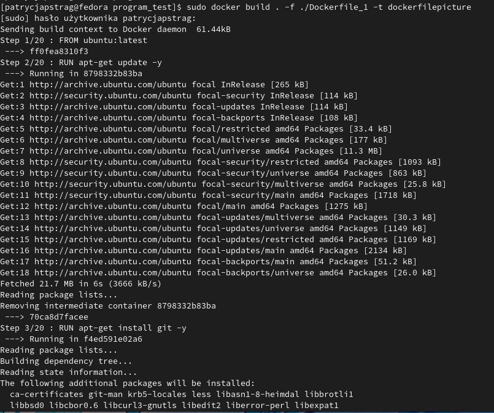

`sudo docker images`
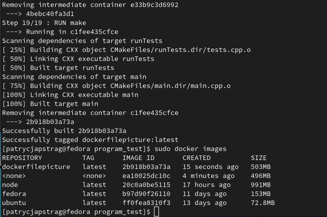


3. Stworzenie drugiego pliku Dockerfile 

```
FROM dockerfilepicture:latest
WORKDIR "/DevOpsProgramLab03"
RUN ./runTests

```
Zbudowano za pomocą pliku Dockerfile_2 obrazu dockerfilepicture
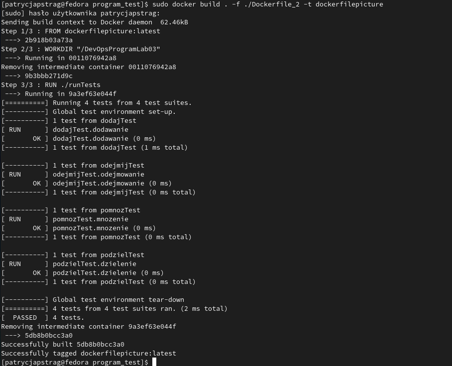


