SPRAWOZDANIE 04

1. Utworzenie 2 woluminów o nazwach inpuut i outpuut

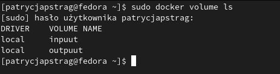

2. Utworzenie kontenera na podstawie obrazu ubuntu i podpięcie do niego utworzonych wcześniej woluminów
`sudo docker run  -it -d  --name contener_lab4 --mount 'type=volume,src=inpuut,dst=/inpuut' --mount 'type=volume,src=outpuut,dst=/outpuut' ubuntu `

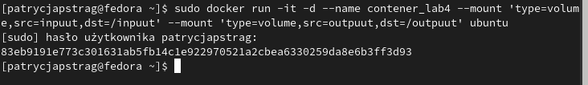

`sudo docker attach contener_lab4`


3. Instalacja g++, cmake oraz ligtest-dev 
`apt-get update`

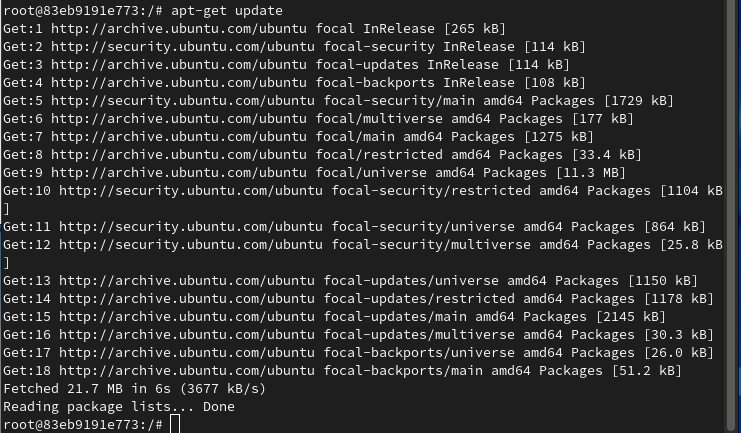

`apt-get install g++`
`apt-get install cmake`
`apt-get install libgtest-dev`

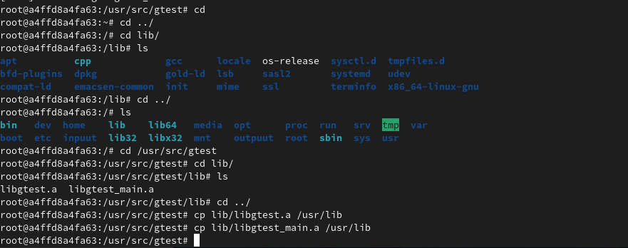

4. Żeby dostać się do folderu należało użyć najpierw komendy `sudo -i`

Sklonowanie repozytorium na volumin wejściowy

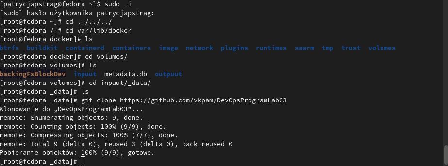

5. Zbudowanie programu

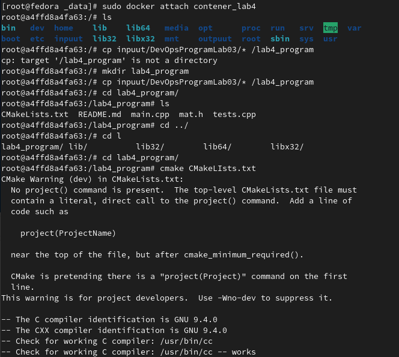

Wykonanie make'a

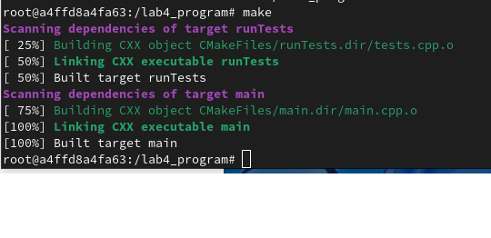

6. Zapisanie zbudowanytch plików w voluminie wyjściowym


7. Instalacja i uruchomienie iperf3 oraz net-tools
` apt-get install iperf3`

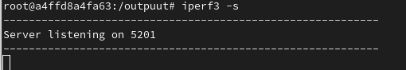

`apt-get install net-tools`

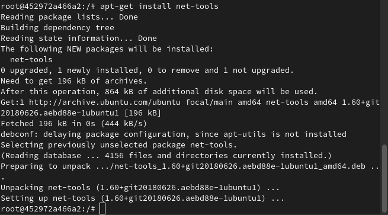

8. Połączenie się z kontenerem z kontenera
Uruchomienie nasłuchiwania na porcie 2000 w kontenerze, utworzenie drugiego kontenera, zainstalowanie serwera iperf3 i sprawdzenie ruchu pomiędzy kontenerami


9. Zainstalowanie serwera iperf3 na host i sprawdzenie ruchu pomiędzy hostem, a kontenerem

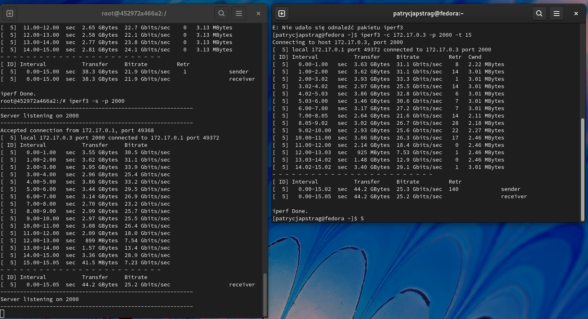

`ifconfig` dla hosta

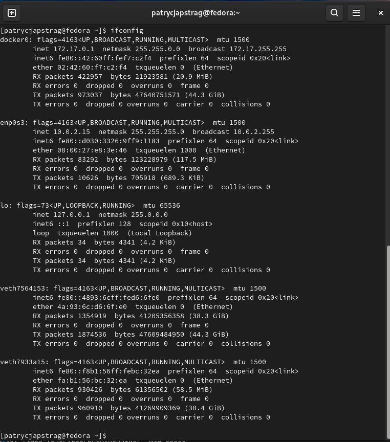

Połączenie kontenera z systemem poza hostem nie zadziałało.

10. Zainstalowanie jenkinsa z pomocą dokumentacji
`sudo docker network create jenkins`


11. Pobranie i uruchomienie obrazu docker:dind

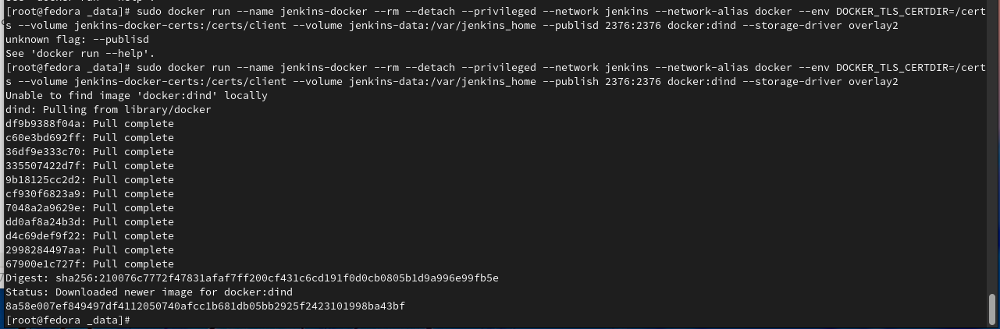

12. Utworzenie Dockerfile oraz obrazu na podstawie Dockerfile

```
FROM jenkins/jenkins:2.332.1-jdk11
USER root
RUN apt-get update && apt-get install -y lsb-release
RUN curl -fsSLo /usr/share/keyrings/docker-archive-keyring.asc \
  https://download.docker.com/linux/debian/gpg
RUN echo "deb [arch=$(dpkg --print-architecture) \ 
  signed-by=/usr/share/keyrings/docker-archive-keyring.asc] \
  https://download.docker.com/linux/debian \ 
  $(lsb_release -cs) stable" > /etc/apt/sources.list.d/docker.list
RUN apt-get update && apt-get install -y docker-ce-cli
USER jenkins
RUN jenkins-plugin-cli --plugins "blueocean:1.25.3 docker-workflow:1.28"

```

13. Utworzenie obrazu na podstawie Dockerfile

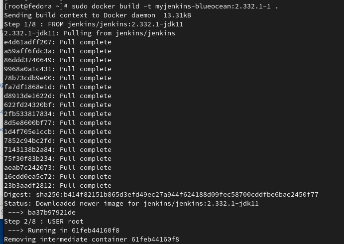

14. Uruchomienie kontenera

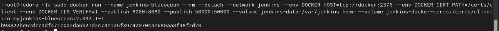

15. Sprawdzenie uruchomionych kontenerów, wyświetlenie logów kontenera jenkins oraz wyświetlenie ekranu logowania

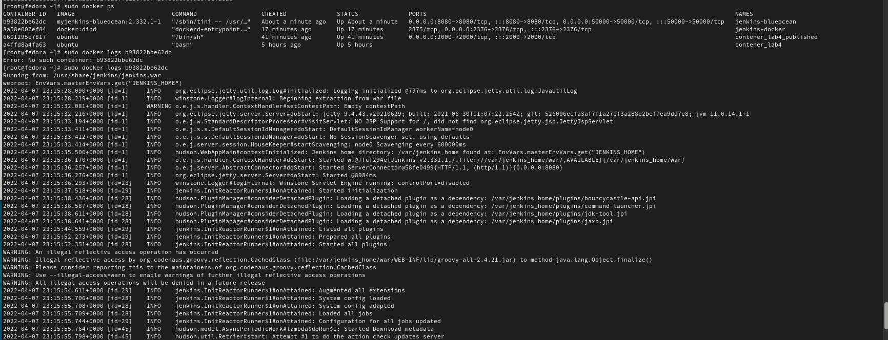

Ekran Logowania

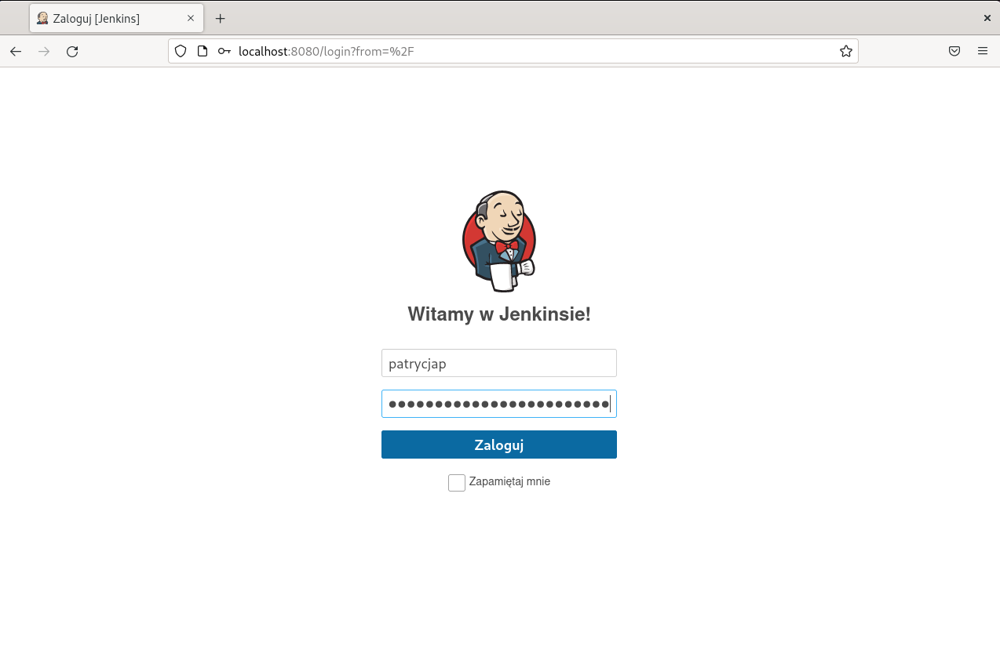

