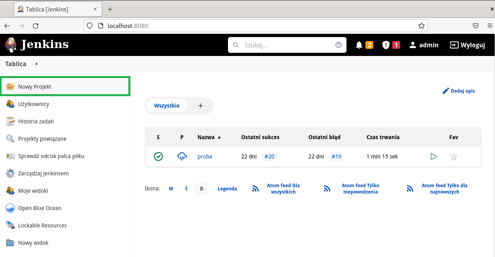
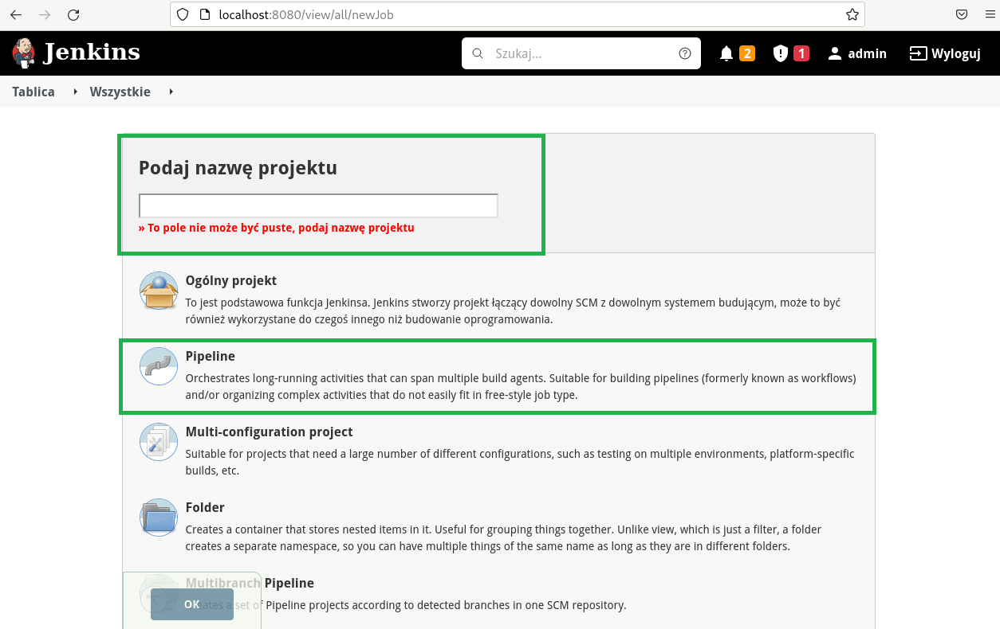
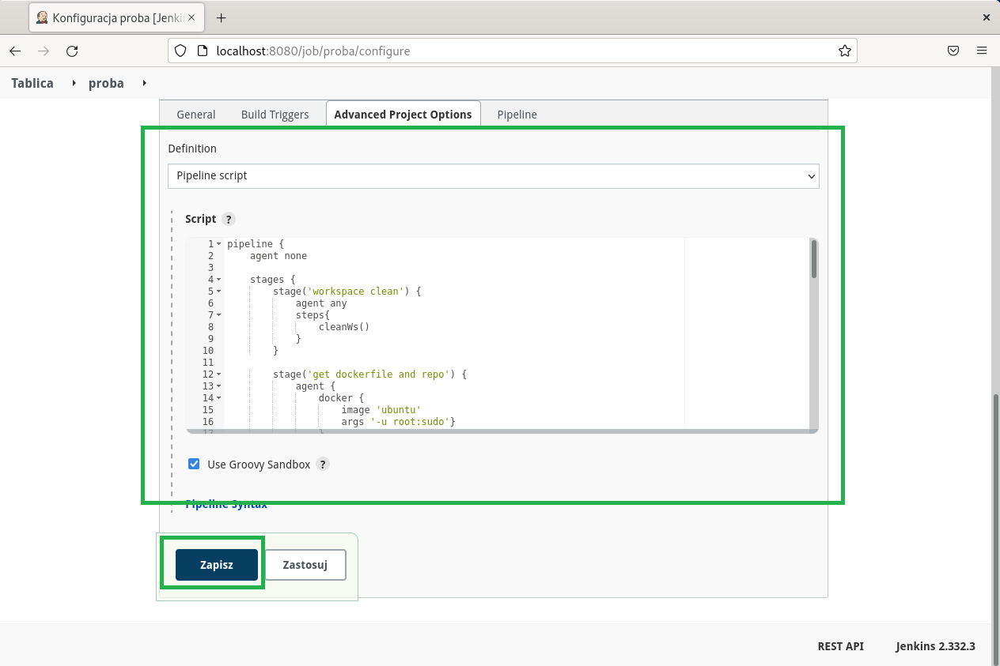
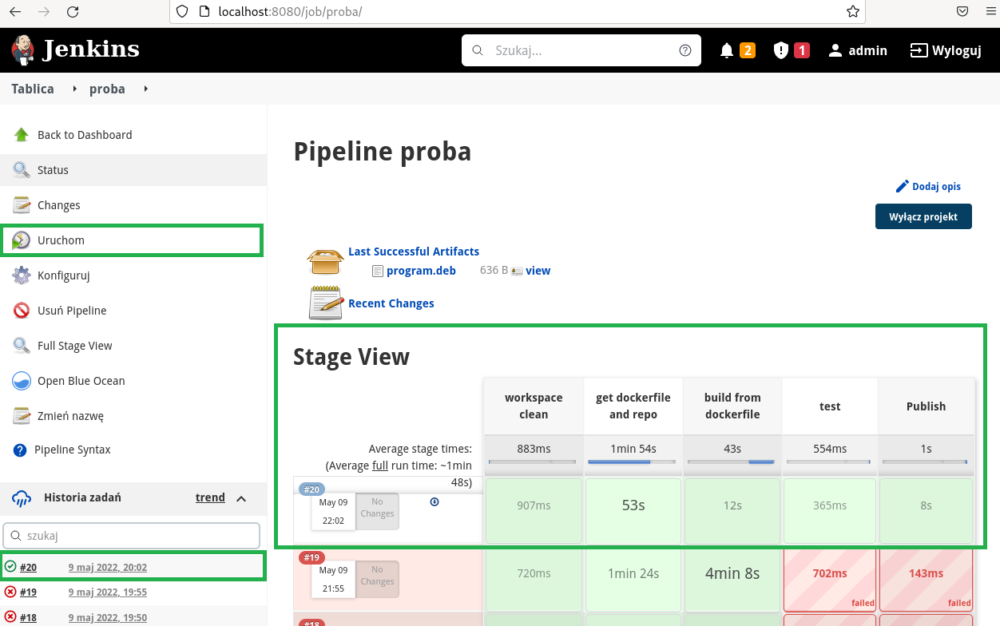
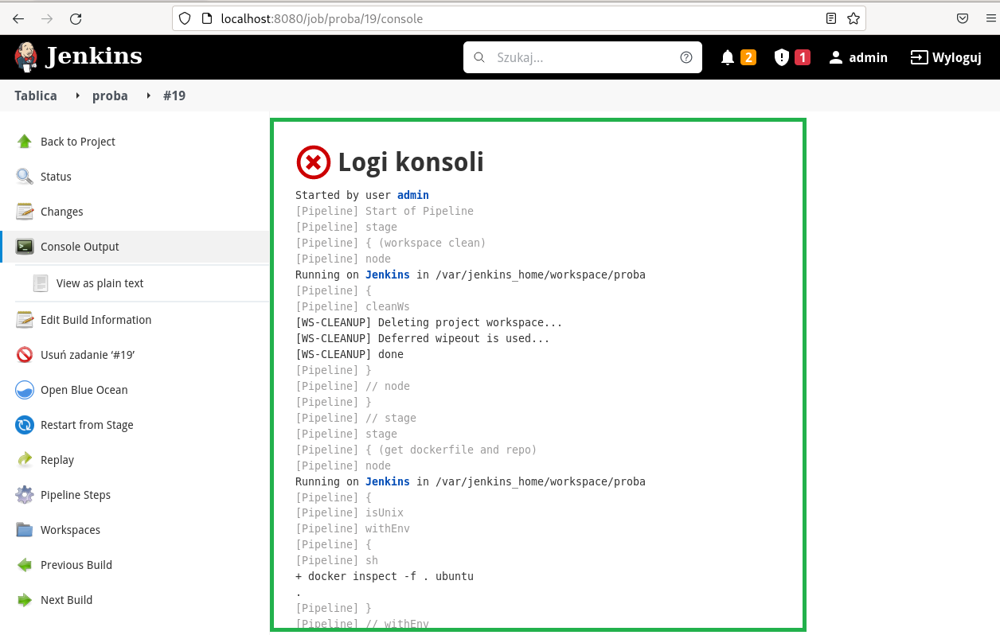
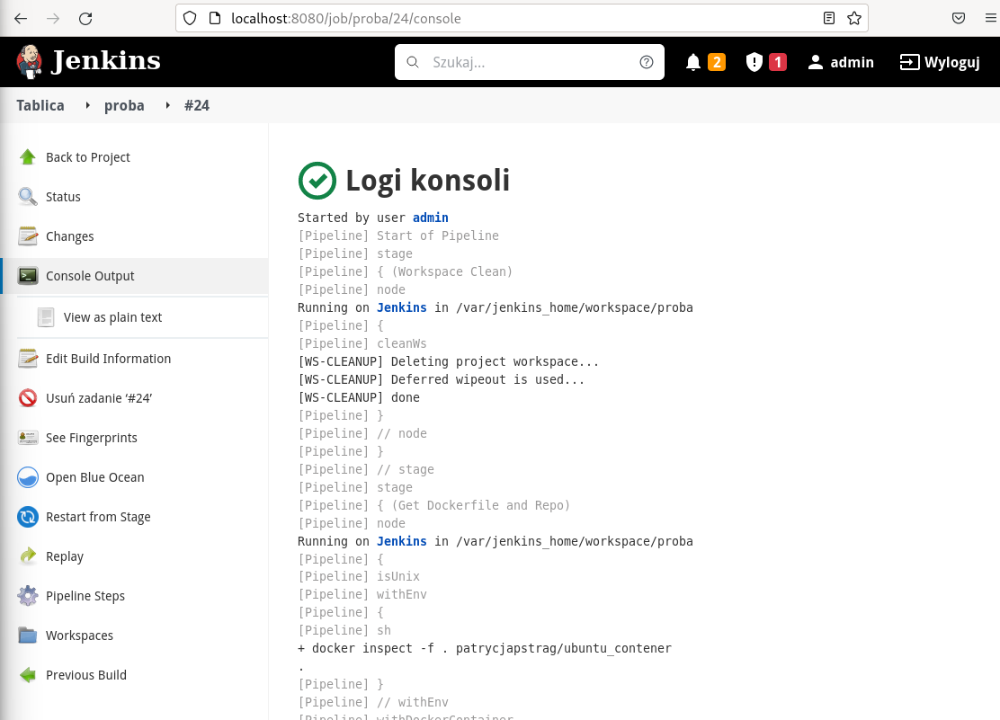
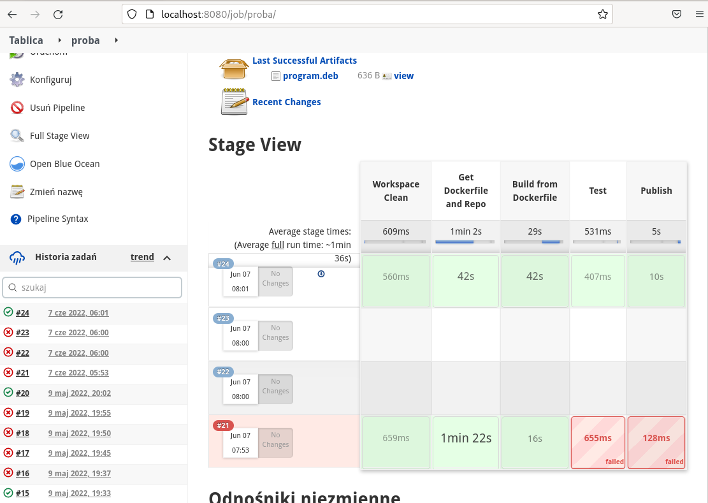
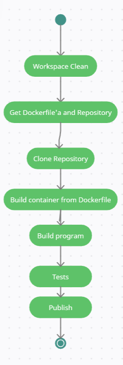

# SPRAWOZDANIE - Laboratoria nr 5,6,7 - Patrycja Pstrąg

## 1. Cel projektu
Celem projektu było utworzenie jenkinsowego pipeline'a do budowania, testowania, deployu oraz publishu aplikacji. W moim przypadku programem był prosty kalkulator, którego kod źródłowy, napisany w  języku C++, został przedstawiony poniżej:

```
#include<iostream>
#include"mat.h"
using namespace std;
int main()
{
    cout<<dodaj(24.0,43.0)<<endl;
    cout<<odejmij(12.0,5.0)<<endl;
    cout<<pomnoz(3.0,4.0)<<endl;
    cout<<podziel(21.0,7.0)<<endl;
    return 0;
}

```

w bibliotece mat.h znajdowały się definicje użytych funkcji, któych już sama nazwa wskazuje na ich działanie.

Program kompilowany jest za pomocą cmake'a

```
cmake_minimum_required(VERSION 3.14)
 
# Locate GTest
find_package(GTest REQUIRED)
include_directories(${GTEST_INCLUDE_DIRS})
 
# Link runTests with what we want to test and the GTest and pthread library
add_executable(main main.cpp)
add_executable(runTests tests.cpp)
target_link_libraries(runTests ${GTEST_LIBRARIES} pthread)
```

natomiast testowanie odbywa się za pomocą Google Test:

```
// tests.cpp
#include "mat.h"
#include <gtest/gtest.h>
 
TEST(dodajTest, dodawanie) { 
    ASSERT_EQ(6, dodaj(4.0, 2.0));
    ASSERT_EQ(18.0, dodaj(16.5, 1.5));
    ASSERT_EQ(25.4, dodaj(12.0, 13.4));
    ASSERT_EQ(0, dodaj(0.0, 0.0));
}
 
 TEST(odejmijTest, odejmowanie) { 
    ASSERT_EQ(2.0, odejmij(4.0, 2.0));
    ASSERT_EQ(15.0, odejmij(16.5, 1.5));
    ASSERT_EQ(0.0, odejmij(0.0, 0.0));
}

TEST(pomnozTest, mnozenie) { 
    ASSERT_EQ(8.0, pomnoz(4.0, 2.0));
    ASSERT_EQ(18.0, pomnoz(6.0, 3.0));
    ASSERT_EQ(25.0, pomnoz(5.0, 5.0));
    ASSERT_EQ(0.0, pomnoz(0.0, 0.0));
}

TEST(podzielTest, dzielenie) { 
    ASSERT_EQ(2.0, podziel(4.0, 2.0));
    ASSERT_EQ(16.0, podziel(16, 1.0));
    ASSERT_EQ(25, podziel(50.0, 2.0));
}

int main(int argc, char **argv) {
    testing::InitGoogleTest(&argc, argv);
    return RUN_ALL_TESTS();
}

```

Link do repozytorium z programem (i potrzebnymi plikami do pipelinu) znajduje się tutaj -> https://github.com/vkpam/DevOpsProgramLab03.

## 2. Dockerfile 
### 2.1 Utworzenie obrazu za pomocą Dockerfile'a. Obraz ten będzie odpowiedzialny za pobranie programu, dockerfile’a instalującego dependencje potrzebne do zbudowania programu oraz pliku control.

```
FROM ubuntu:latest
RUN apt-get update -y;apt-get upgrade -y
RUN apt-get install git -y
```

### 2.2  Połączenie obrazu Dockera z DockerHubem (w terminalu VM)
```
sudo docker login -u patrycjapstrag
```


### 2.3 Przesłanie utworzonego obrazu na DockerHuba

```
sudo docker commit -m="This is a image to lab5" pierszy patrycjapstrag/ubuntu_contener
```
-m=To jest obraz testowy : jest komunikatem o zatwierdzeniu.
pierszy : Nazwa kontenera, z którego tworzysz obraz.
patrycjapstrag/ubuntu_contener: nazwa repozytorium Docker Hub, w którym chcesz wypchnąć obraz. To jest tag, który zostanie przypisany do nowo utworzonego obrazu.

Komenda pozwalająca na przesłanie obrazu do repozytorium DockerHub
```
sudo docker push patrycjapstrag/ubuntu_contener
```
Efekt:
```
Using default tag: latest
The push refers to repository [docker.io/patrycjapstrag/ubuntu_contener]
6b09abae3e22: Pushed 
e59fc9495612: Mounted from library/ubuntu 
latest: digest: sha256:4d87093cec1a0d28a3619c41fe06dda06ead418b9768fa303bc70384402c666c size: 741
```
Logowanie na DockerHub i weryfikacja obrazu w repozytoriach


## Treść utworzonego Dockerfile'a, który został przesłany do repozytorium programu. Będzie on odpowiedzialny za stworzenie środowiska do zbudowania programu
```
FROM ubuntu:latest
RUN apt-get update -y
RUN apt-get install git -y
ENV TZ=Europe/Warsaw
RUN ln -snf /usr/share/zoneinfo/$TZ /etc/localtime && echo $TZ > /etc/timezone
RUN apt-get install cmake -y
RUN apt-get install g++ -y
RUN apt-get install libgtest-dev -y
WORKDIR "/usr/src/gtest"
RUN cmake CMakeLists.txt
RUN make
RUN cp lib/libgtest.a /usr/lib
RUN cp lib/libgtest_main.a /usr/lib
WORKDIR "/"
```

## Treść utworzonego pliku control, który również został przesłany do repozytorium programu. Plik control jest potrzebny do zbudowania pliku .deb.

```
Package: program
Version: 0.2
Maintainer: King Foo
Architecture: all
Description: program_description
```

## 3. Przygotowanie Jenkinsa i Pipeline 

Aby utworzenie projektu mogło przebiec pomyślnie potrzebujemy poprawnie skonfigurowanego Jenkinsa. Cała instrukcja konfiguracji znajduje się pod linkiem -> https://www.jenkins.io/doc/book/installing/ .
Natomiast informacje oraz instrukcje dotyczące pipeline znajdują się tutaj -> https://www.jenkins.io/doc/book/pipeline/ .

Instalacja Jenkinsa została przedstawiona w Sprawozdaniu z laboratorium numer 4 (punkty od 10) -> https://github.com/InzynieriaOprogramowaniaAGH/MDO2022_S/blob/PP401409/ITE/GCL07/PP401409/Lab04/sprawozdanie.md


## 4. Utworzenie projektu Pipeline w Jenkins

Uruchamiamy localhost i logujemy się do Jenkinsa na wybranym porcie. W moim przypadku jest to port 8080

4.1 Klikamy nowy projekt
  

4.2 Podajemy nazwę projektu oraz wybieramy opcję "Pipeline"


4.3 Tworzymy skrypt pipeline'a a następnie klikamy "Zapisz"



Treść skryptu Pipeline
```
pipeline {
    agent none
    
    stages {
        stage('Workspace Clean') {
            agent any
            steps{
                cleanWs()
            }
        }

        stage('Get Dockerfile and Repo') {
            agent {
                docker {
                    image 'patrycjapstrag/ubuntu_contener' 
                    args '-u root:sudo'}
                }
            steps {
	            sh 'apt-get update -y'
	            sh 'apt-get install git -y' 
                sh 'git clone https://github.com/vkpam/DevOpsProgramLab03'
                sh 'mv  DevOpsProgramLab03/Dockerfile Dockerfile'
            }
        }
        stage('Build from Dockerfile')
        {
            agent {dockerfile{filename 'Dockerfile' args '-u root:sudo'}}
            steps
            {
	            sh 'mkdir pr'
                sh 'cp DevOpsProgramLab03/* pr'
                sh '(cd pr;cmake CMakeLists.txt)'
                sh '(cd pr;make)'
 	    sh '(cd pr;./runTests)'
            }
        }
        stage('Test')
        {
            agent any
            steps
            {
	    //echo("Testy umieszczone w tym miejscu sie wysypywaly);
        	    //sh '(cd pr;./runTests)'
            }
        }

        stage('Publish')
        {
            agent {docker {image 'ubuntu' 
            args '-u root:sudo'}}
            steps
            {
                sh 'mkdir program && mkdir program/DEBIAN'
                sh 'mkdir program/home'
                sh 'mkdir program/home/user'
                sh 'mkdir program/home/user/program'
                sh 'cp pr/main program/home/user/program/program'
                sh 'cp DevOpsProgramLab03/control program/DEBIAN/control'
                sh 'dpkg-deb --build program'
                archiveArtifacts artifacts: 'program.deb', fingerprint: true
            }
        }
    }
}
```

## Opisy poszczególnych Stage'ów pipeline'a

### Stage " Workspace Clean" odpowiedzialny jest za czyszczenie workspace'a przed rozpoczęciem budowania.

```
stage('Workspace Clean') {
            agent any
            steps{
                cleanWs()
            }
        }
```

### Stage "Get Dockerfile and Repo" odpowiedzialny jest za sklonowanie Dockerfile'a, repozytorium zawierającego program oraz pliku control.

```
stage('Get Dockerfile and Repo') {
            agent {
                docker {
                    image 'patrycjapstrag/ubuntu_contener' 
                    args '-u root:sudo'}
                }
            steps {
	            sh 'apt-get update -y'
	            sh 'apt-get install git -y' 
                	sh 'git clone https://github.com/vkpam/DevOpsProgramLab03'
                	sh 'mv  DevOpsProgramLab03/Dockerfile Dockerfile'
            }
        }
```

### Stage "Build from Dockerfile" odpowiedzialny jest za zbudowanie kontenera ze środowiskiem wymaganym do zbudowania programu.

```
stage('Build from Dockerfile')
        {
            agent {dockerfile{filename 'Dockerfile' args '-u root:sudo'}}
            steps
            {
	            sh 'mkdir pr'
                	sh 'cp DevOpsProgramLab03/* pr'
                	sh '(cd pr;cmake CMakeLists.txt)'
                	sh '(cd pr;make)'
            }
        }
```


### Stage "Test" odpowiedzialny jest za testowanie działania programu, który zbudowaliśmy.

```
stage('Test')
        {
            agent any
            steps
            {
        	    sh '(cd pr;./runTests)'
            }
        }
```


### Stage "Publish" odpowiedzialny jest za stworzenie pliku .deb oraz zapisanie go jako artefakt.
```
stage('Publish')
        {
            agent {docker {image 'ubuntu' 
            args '-u root:sudo'}}
            steps
            {
                sh 'mkdir program && mkdir program/DEBIAN'
                sh 'mkdir program/home'
                sh 'mkdir program/home/user'
                sh 'mkdir program/home/user/program'
                sh 'cp pr/main program/home/user/program/program'
                sh 'cp DevOpsProgramLab03/control program/DEBIAN/control'
                sh 'dpkg-deb --build program'
                archiveArtifacts artifacts: 'program.deb', fingerprint: true
            }
        }
```


4.4 Po wykonaniu kroków 4.1-4.3 w menu po lewej stronie pojawia się nam kilka opcji, jedną z nich jest opcja "Uruchom", klikamy tą opcję.  Powoduje ona uruchomienie naszego pipeline. Status jego przebiegu przedstawiony zostaje w centralnej części strony. Ewentualne błędy i ich logi możemy podglądnąć poprzez kliknięcie na ikonę czerwonego iksa oznaczającego nieudane przejście operacji.


4.5 Wyświetlenie logów ostatniej nieudanej budowy pozwala na naprawienie ewentualnych błędów i sprawdzenie co poszło nie tak:


4.6 W moim przypadku Stage przeszły pomyślnie za 24 razem. Większość błędów dotyczyła literówek, dodania niepotrzebnie jakiegoś rozszerzenia do pliku (np. w Publish zamiast cp pr/main miałam cp pr/main.cpp i Stage się wysypywał), był też problem z agentami. Metodą prób i błędów oraz wyszukiwania po errorach w logach udało się pomyślnie przeprowadzić stage. Jedynym błędem, którego nie udało się rozwiązać był problem z Stagem Test, którego zawartość poprawnie wykonywała się w poprzedzającym go Stage'u Build from Dockerfile, a pomimo dokłądnie tego samego agenta w swoim właściwym stage'u Test się wysypywał.


5. Efekt zbudowania projektu
Logi konsoli:



Artefakt


6. Artefakt
## Pobranie artefaktu na system 
## Instalacja artefaktu odbywa się za pomocą komendy:

```
sudo dpkg –i Downloads/program.deb
```

##Sprawdzenie czy instalacja programu przebiegła pomyślnie:


#Diagram aktywności


#Problemy 
Największym problemem w przypadku tego projektu była maszyna wirtualna, która wysypywała się nawet podczas zwykłego robienia screenshota lub wpisaniu komendy w terminal. 
