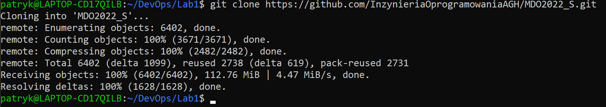
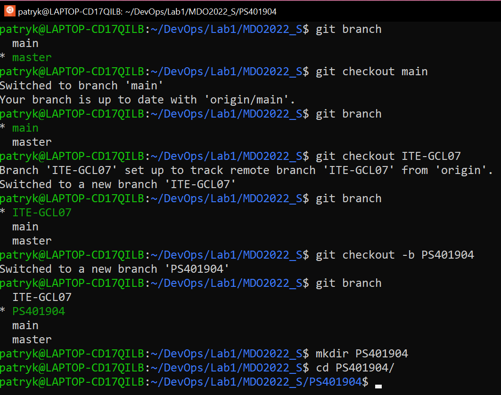
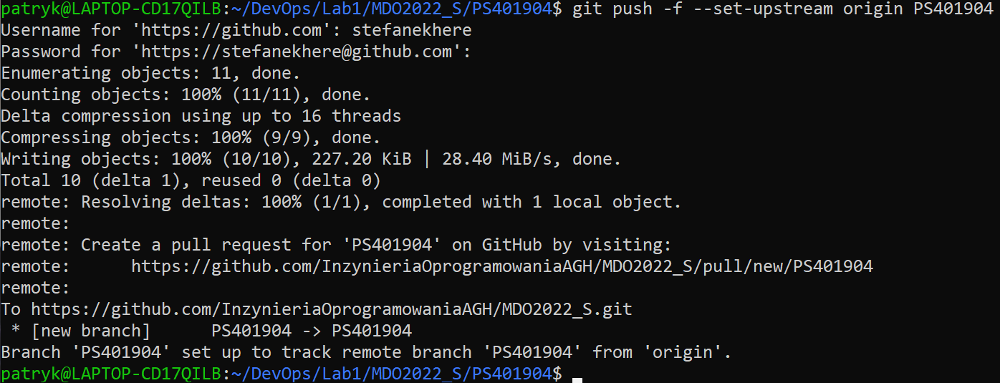

# Sprawozdanie
##
## Patryk Stefan GĆL_07
##
##
#### 1.Instalacja Githuba

Na swojej maszynie posiadam już zainstalowanego githuba.
####
#### 2. Klonowanie repozytorium przez HTTPS

####
#### 3. Stworzenie klucza ssha oraz dodanie do githuba

####
#### 4. Przelaczenie sie na galaz main, a nastepnie do katalogu grupy. Stworzenie wlasnego brancha z inicjalami oraz numerem indeksu, a w nim takiego samego katalogu.

####
#### 5. Dodanie katalogu Lab1 i wrzucenie do niego sprawozdania, a następnie commit i push.

####
##  Wnioski:
Wykorzystane komendy:
- git --version - wypisuje wersje zainstalowanego githuba
- git clone - klonuje repozytorium
- git branch - wypisuje w jakim branchu się znajdujemy
- git checkout [nazwa] -b - przejście do brancha, opcja -b tworzy brancha jeśli takowy nie istnieje
- git add - dodaje pliki które mają zostać przesłane
- git commit -m - tworzy commita, opcja -m pozwala na dodanie opisu commita
- git push --set-upstream origin name - wypycha zmiany do repozytorium