# Sprawozdanie
##
## Patryk Stefan GĆL_07
##
##

### Instalacja minikube

##### Instalacja minikube zgodnie z dokumentacją oraz sprawdzenie sumy kontrolnej.
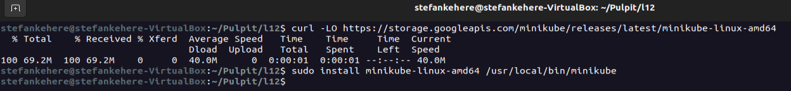
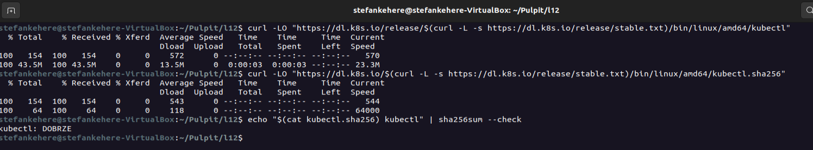
##### Instalacja kubectl.
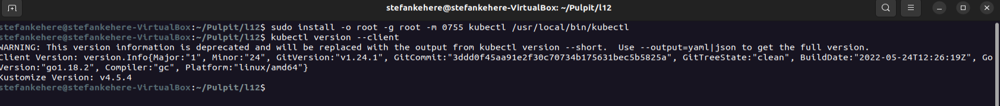
##### Próba uruchomienia minikube- zakończona niepowodzeniem.
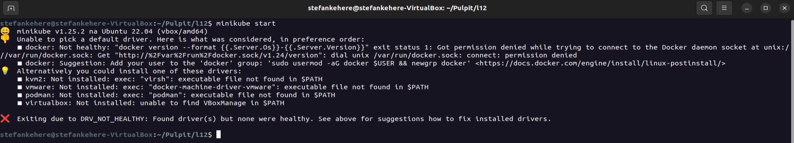
##### Po wpisaniu komendy wyświetlonej przez logi minikube oraz kolejnym uruchomieniu wszystko poszło w porządku. (Pomijam problem z używaniem przez VB 1 rdzenia procesora, co też skutkowało problemem, ponieważ minikube zgodnie z dokumentacją wymaga przynajmniej 2 rdzeni. Pomijam, bo zapomniałem to udokumentować.). Ponadto sprawdzenie node'ów oraz podów.
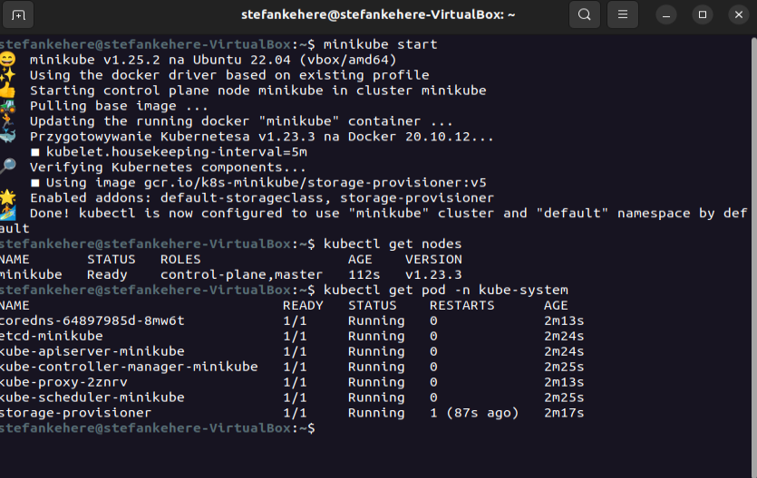
##### Uruchomienie dashboardu komendą: minikube dashboard.
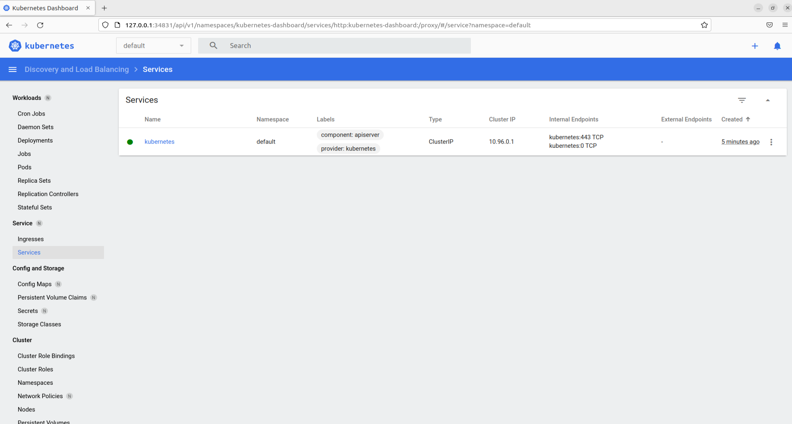

### Próba uruchomienia express.js.
Programem, który został wybrany do realizacji poprzednich laboratoriów jest express.js, który nadaje się do użycia, ponieważ podczas uruchamiania skryptów udostępnia port :3000.

##### Stworzenie dockerfile'a w celu utworzenia obrazu z artefaktem express.js oraz skopiowanie przykładowej apki do uruchomienia.
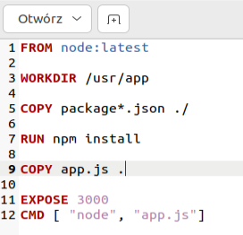
##### Budowa obrazu z dockerfile'a.
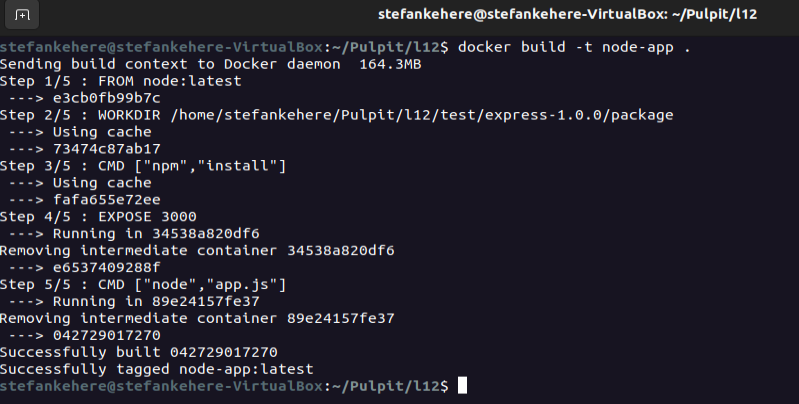
##### Poprawnie uruchomienie kontenera z wcześniej stworzonym obrazem, wyeksponowanie portu 49160 oraz potwierdzenie jego działania.

##### Po włączeniu kontenera jesteśmy w stanie uruchomić naszą apkę na porcie :49160.
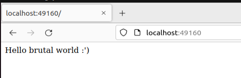

### Pierwsze kroki z podami

##### Stworzony został następujący plik pod.yml.

##### Stworzenie poda na podstawie pliku pod.yml oraz sprawdzenie statusu- EeeImageNeverPull

##### Po przekopaniu stacka rozwiązaniem problemu okazało się to, że należy zadeklarować zmienną środowiskową w następujący sposób: eval $(minikube docker-env), aby obrazy dockerowe stworzone lokalnie były widoczne dla minikube.
##### Po wprowadzeniu powyższych zmian pod wystartował bez zarzutów.
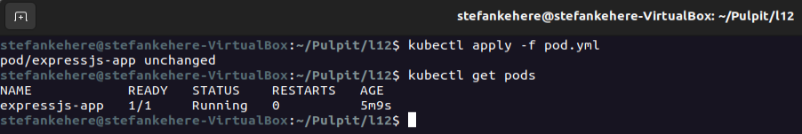
##### Działanie poda- widoczne w dashboardzie.
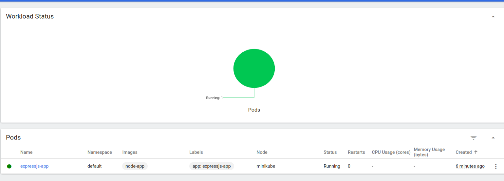
##### Przekierowanie portu komendą port-forward z portu 3000 na port 7500.
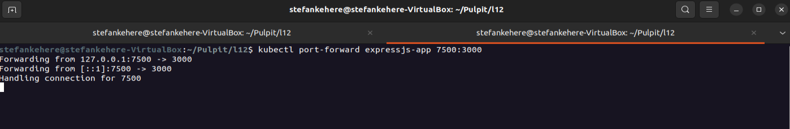
##### Już po chwili można było połączyć sie localhostem na porcie :7500.
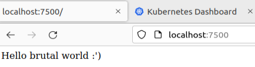

### Przekucie wdrożenia manualnego w plik wdrożenia

##### Na początku wzbogacony został plik pod.yml o stworzenie replik oraz zapisany jako plik podDeploy.yml.
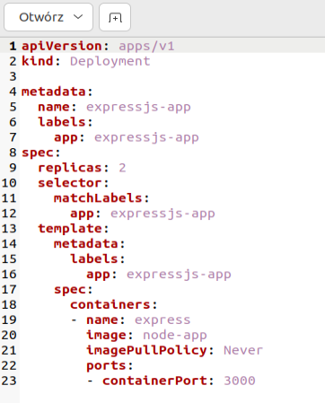
##### Wyświetlenie działania (Dopiero pod koniec wykonywania laboratoriów zauważyłem, że działał jeszcze stary pod, który wyłączyłem dopiero pod koniec :|).
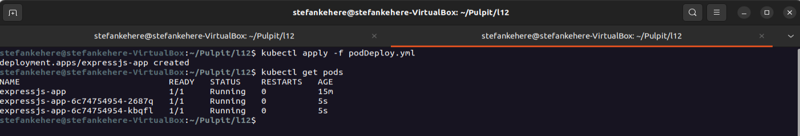
##### Działanie widoczne w dashboardzie (running 3 a nie 2 z powyższego powodu :|).
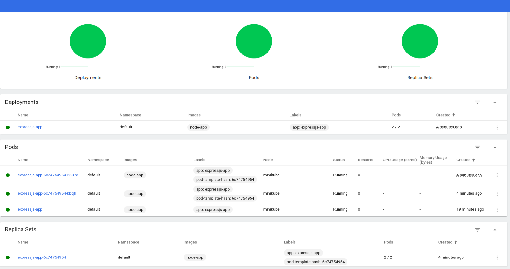

### Konwersja wdrożenia ręcznego na wdrożenie deklaratywne YAML

##### Wzbogacenie pliku podDeploy.yml do ilości replik=5 oraz uruchomienie, wyświetlenie działania podów oraz sprawdzenie rollout status.
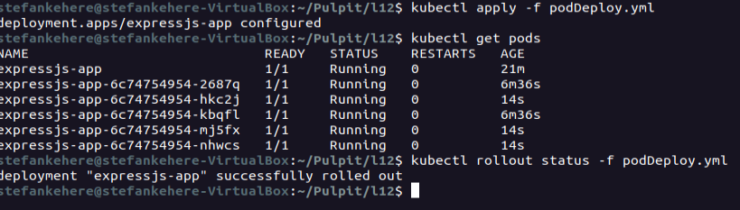
##### Zmiana na 10 replik oraz sprawdzenie rollout status w trakcie wdrażania zmian.
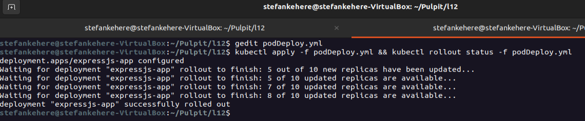
##### Działanie w dashboardzie
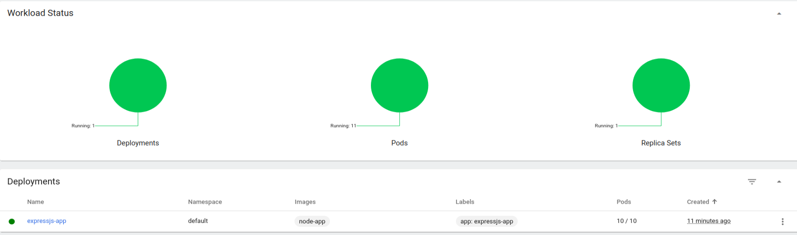
##### Zmiana ilości replik na 1.
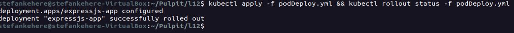
##### Działanie w dashboardzie.
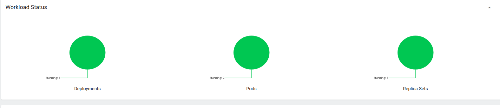
##### Stworzenie nowego lokalnego obrazu- node-app-fail, który jak nazwa mówi nie działa poprawnie.
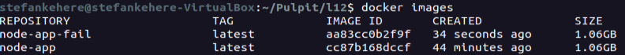
##### Usunięcie tego jednego poda, który działał od początku i przeszkadzał.
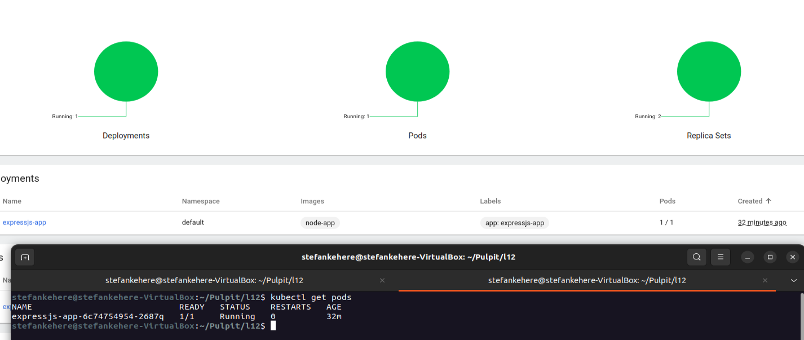
##### Działanie podów po zmianie na błędny obraz.
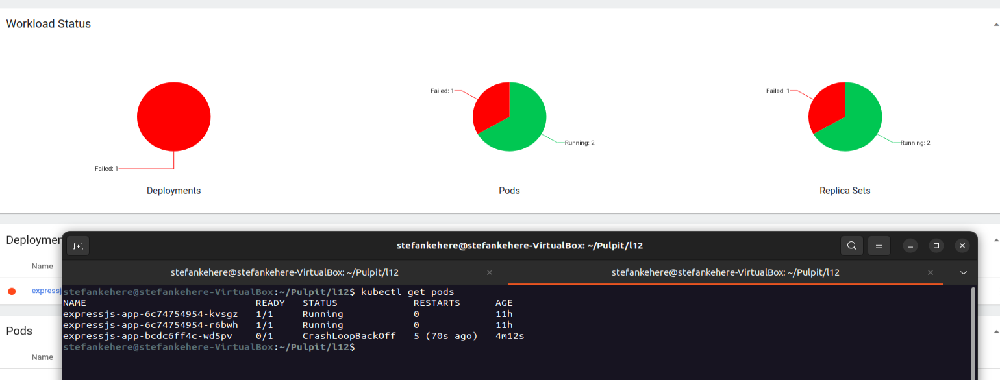
##### Sprawdzenie historii rollout oraz wyświetlenie konkretnych logów
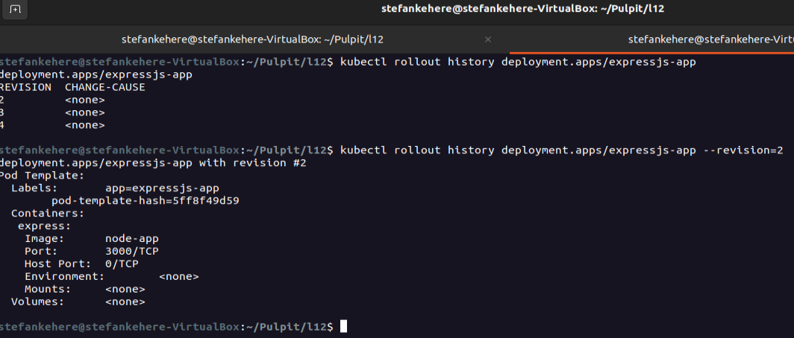
##### Przywrócenie poprawnego wdrożenia
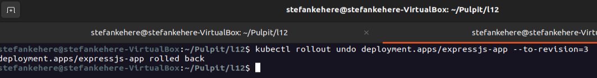
##### Potwierdzenie poprawności działania w dashbaordzie
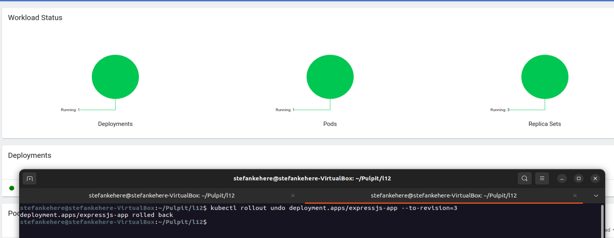

### Kontrola wdrożenia

##### Napisanie skryptu bashowego, który zwraca błąd jeśli wdrożenie trwa dłużej niż 60 sekund.
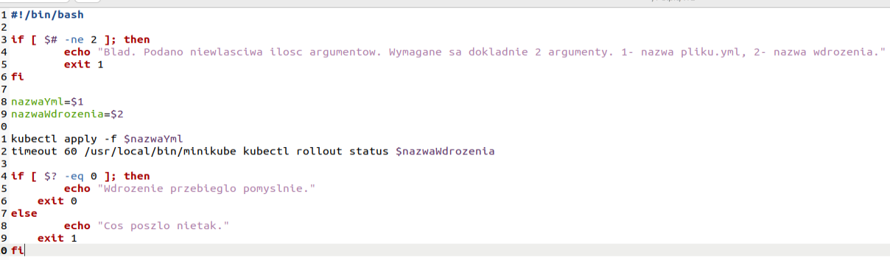
##### Uruchomienie skryptu
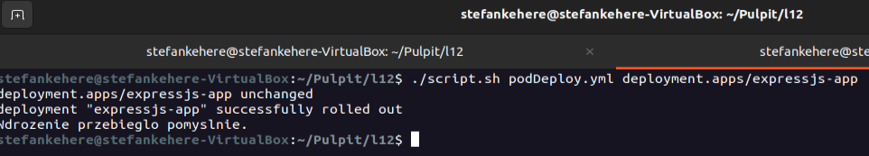

### Strategie wdrożenia

##### Recreate
W tej strategii najpierw zabijane są stare wersje, a następnie wdrażane nowe.
Na zrzucie ekranu pod komendą "kubectl describe deployments" widać użytą strategię przy polu: StrategyType
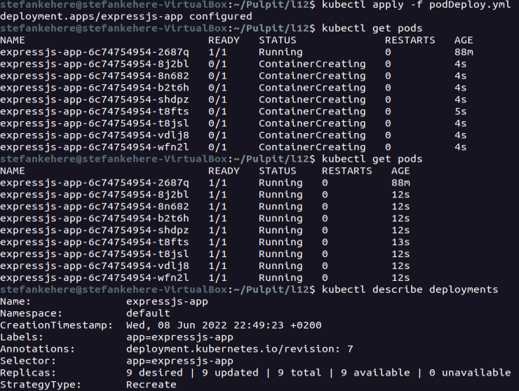
##### RollingUpdate
W strategii RollingUpdate najpierw wyłączane są pody, a następnie progresywnie włączane.
Strategia RollingUpdate przyjmuje dwie właściwości:
- maxSurge - określa ilośc podów, które są włączane w określonym czasie
- maxUnavailable - określa ilość podów które mogą być niedostępne w trakcie wdrażania zmian

Na zrzucie ekranu pod komendą "kubectl describe deployments" widać użytą strategię przy polu: StrategyType
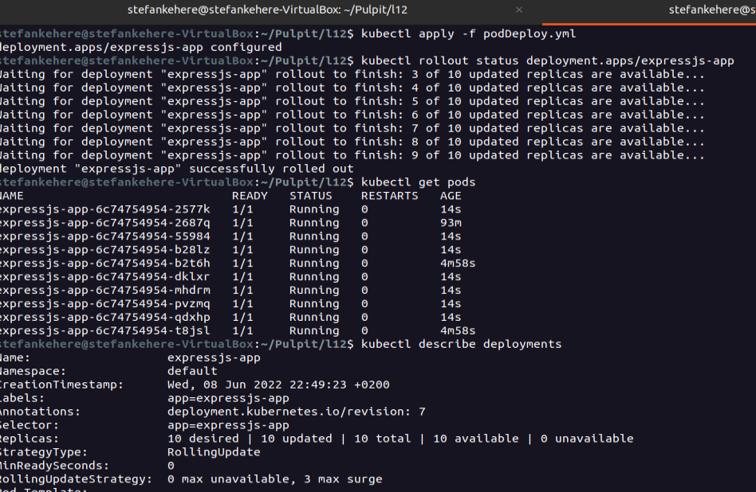
##### Canary
Strategia canary nie posiada swojego odpowiednika w kodzie .yml przy polu strategy: -> type:  tak jak RollingUpdate, czy Recreate ( lub jej nie znalazłem :|). Polega ona na wdrożeniu nowej wersji aplikacji obok starej- stabilnej wersji.

