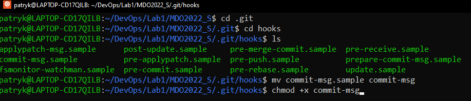
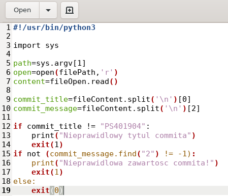
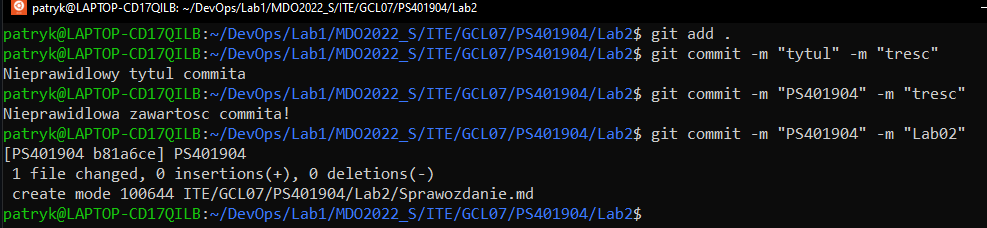
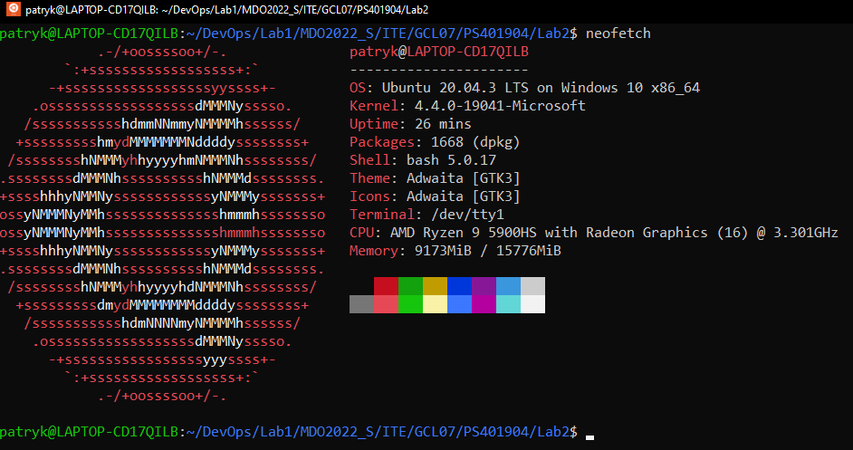
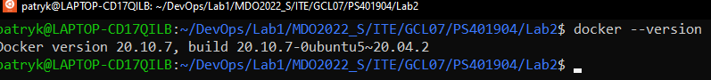
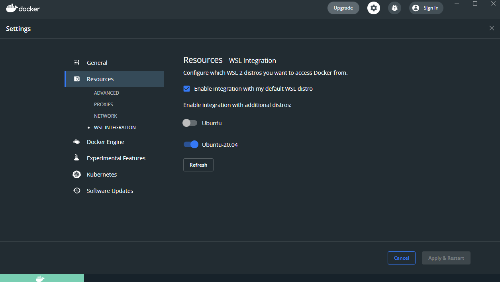
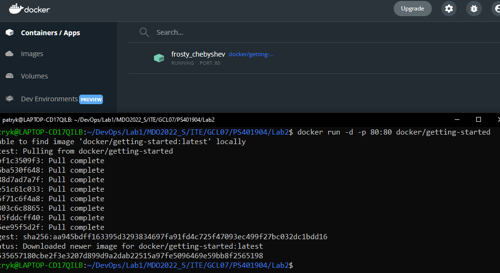
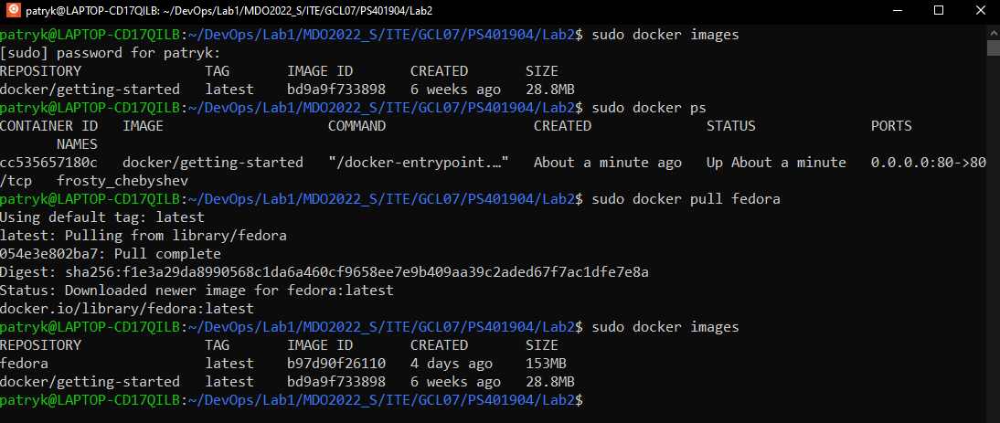
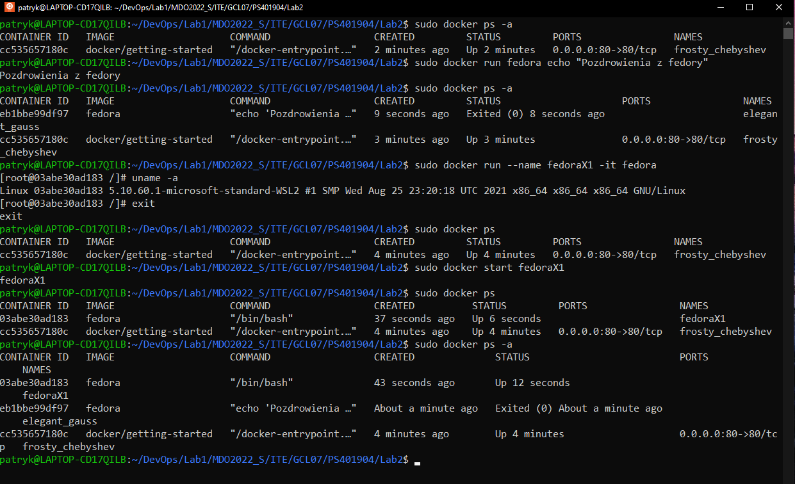
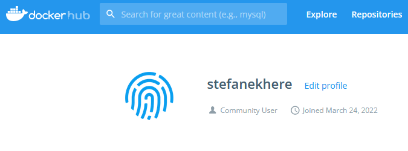

# Sprawozdanie
##
## Patryk Stefan GĆL_07
##
##
#### 1. Utworzenie pliku w folderze .git/hooks w którym zapisany zostanie nowy hook.

####
#### 2. Kod hooka. 

####
#### 3. Sprawdzenie poprawności działania hooka. 

####
#### 4. Działam na WSL2

####
#### 5. Do poprawności działania dockera kolejno:
- zainstalowałem pakiet docker.io komendą sudo apt install docker.io
- następnie pobrałem docker desktop w którym połączyłem się z moim WSL
- na koniec zainicjowałem dockera

####
#### 6. Pobranie obrazu fedory

####
#### 7. Kilka operacji na obrazie fedory
- włączenie fedory oraz wypisanie w niej tekstu
- utworzenie obrazu o konkretnej nazwie fedoraX1 oraz jego włączenie, po czym wyświetlenie informacji komendą uname -a
- wyjście z obrazu fedory oraz ponowne jej uruchomienie
- na koniec sprawdzenie jakie komendy zostały uruchomione na obrazach

####
#### 8. Założenie konta na Docker Hubie

####
