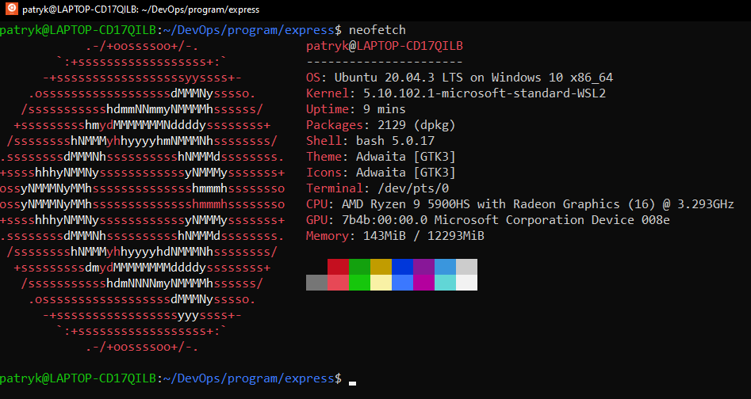
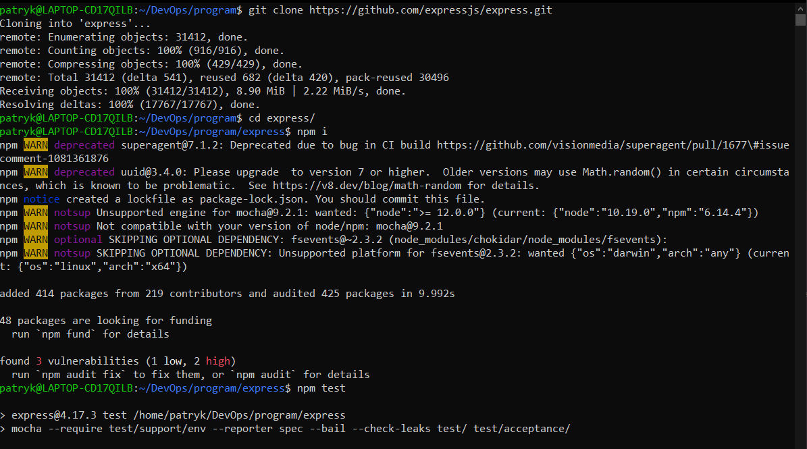
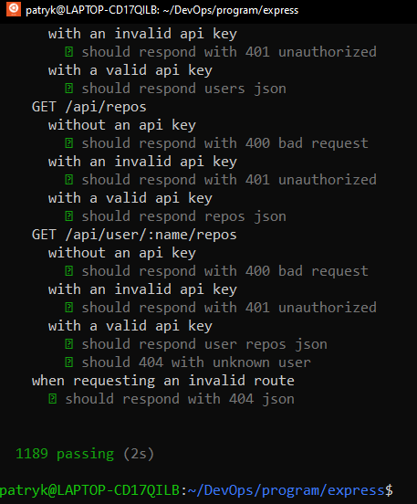
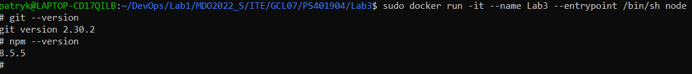
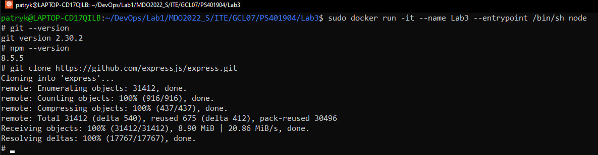
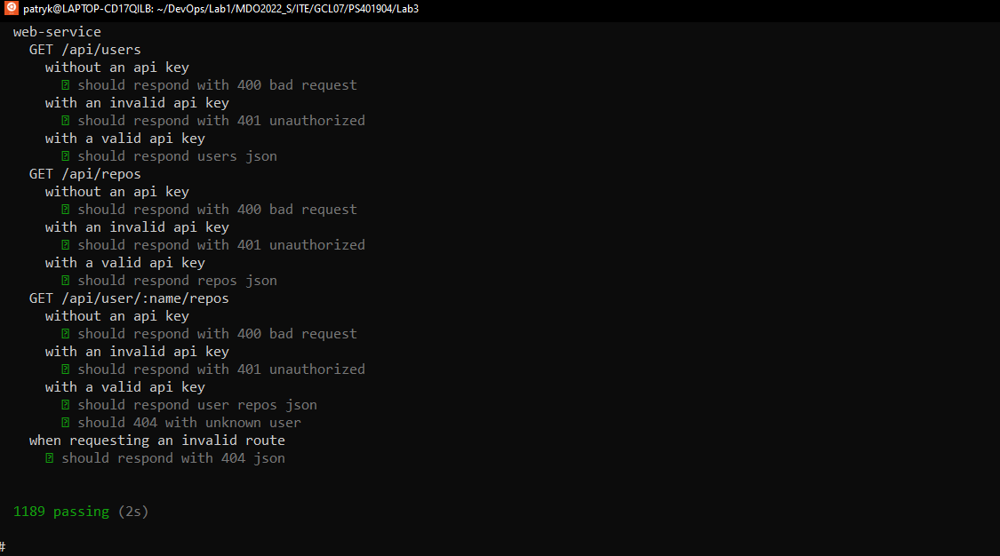
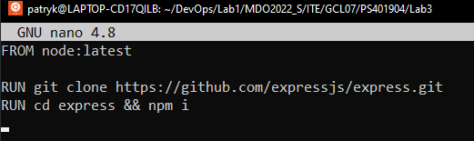
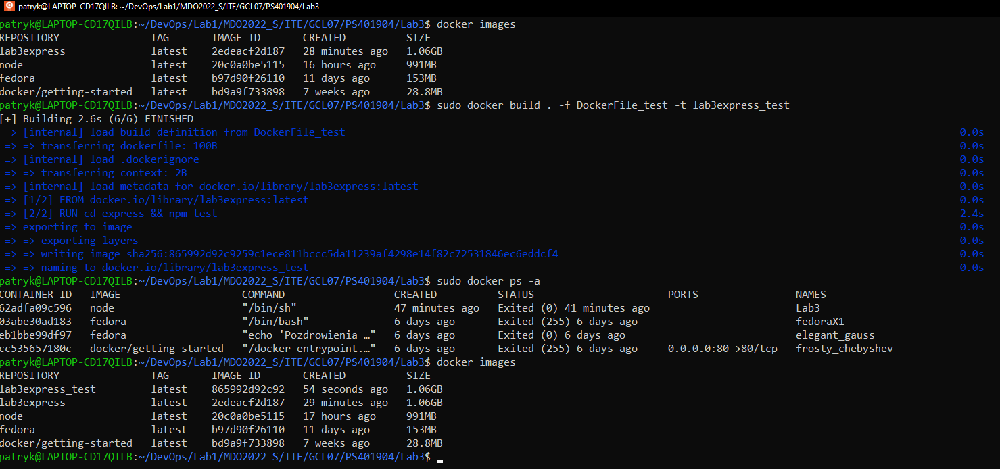
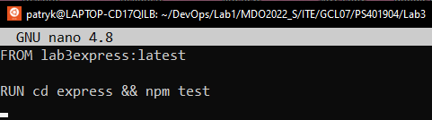

# Sprawozdanie
##
## Patryk Stefan GĆL_07
##
##
#### 1. Maszyna na której wykonywane jest laboratorium.

####
#### 2. Sklonowanie repo expressjs, sprawdzenie działania i poprawności wykonywania testów.

####
#### 3. Pobranie obrazu node 

####
#### 4. Sprawdzenie czy w obrazie jest zainstalowany git oraz npm

####
#### 5. Wykonanie git clone

####
#### 6. Wykonanie komendy npm install w sclonowanym folderze express oraz wykonanie w nim testów.

####
#### 7. Stworzenie nowego obrazu lab3express wykorzystując dockerfile.

####
#### 8. Na podstawie wcześniej stworzonego obrazu, wykonanie w nim testów.

####

#### W kontenerze pracuje wywołany przez nas program, który jest odizolowany od środowiska zewnętrznego. Podstawą do utworzenia kontenera jest obraz.