# Sprawozdanie
##
## Patryk Stefan GĆL_07
##
##
# Zachowywanie stanu
#### 
#### 1. Stworzenie dwóch woluminów: input i output
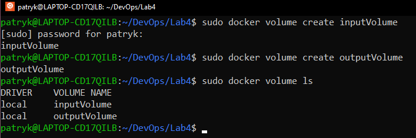
####
#### 2. Stworzenie kontenera z dwoma wcześniej stworzonymi woluminai
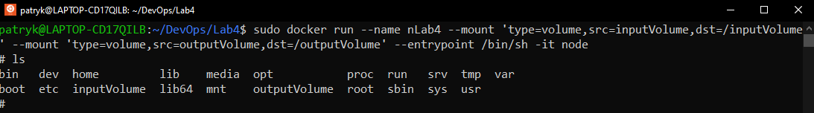
####
#### 3. Sprawdzenie położenie woluminu i próba wejścia do niego, natomiast na WSL2 nie miałem możliwości wejścia w folder dockera. 
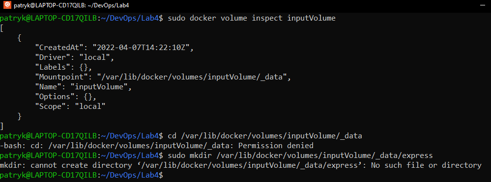
####
#### 4. Próbowałem również dostać się do pliku przez windowsa, natomiast z tym samym skutkiem.
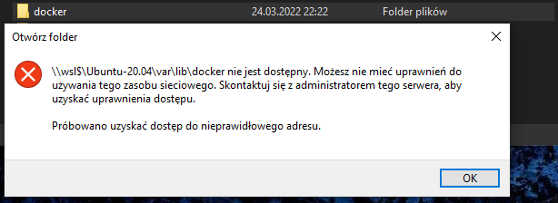
####
#### 5. Po rezygnacji z dalszych prób ręcznie wrzuciłem do woluminu outputowego repozytorium z githuba oraz zbuildowałem go.
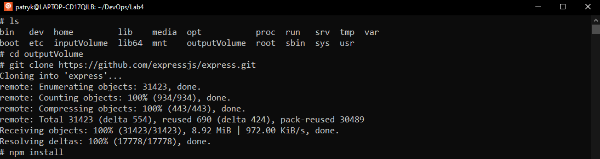
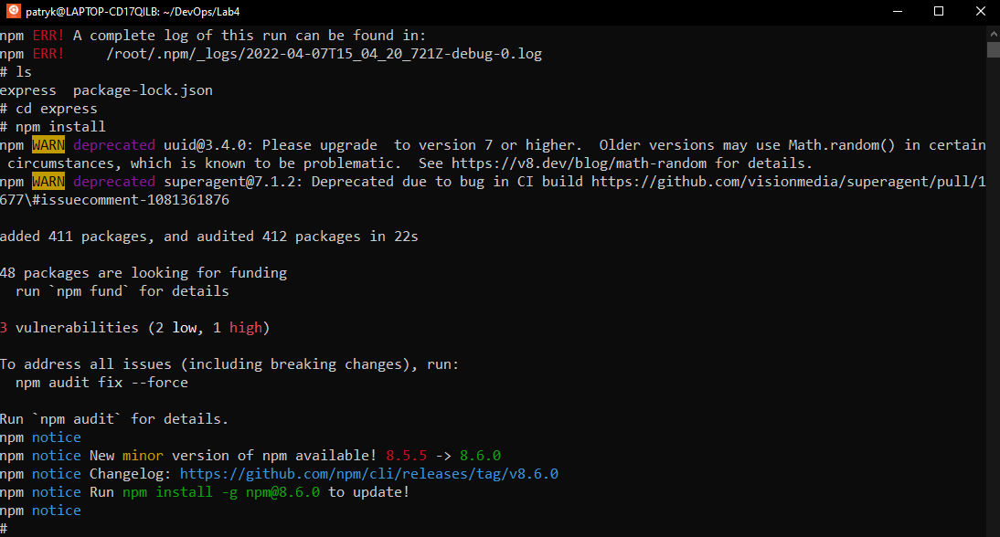
####
#### 6. Z wolumenem outputowym problem był taki sam jak z inputowym.
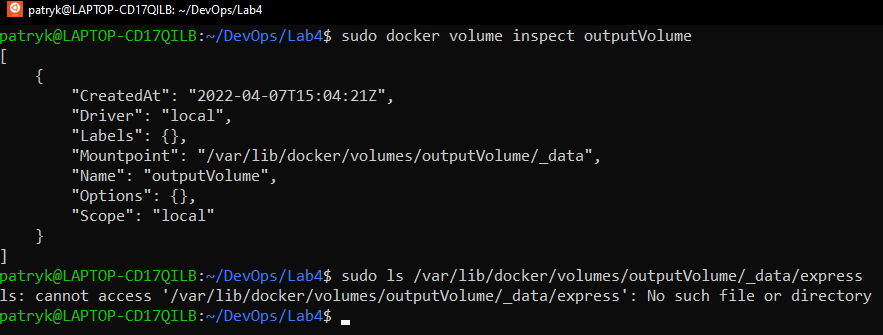
####
#### 7. Natomiast używając docker desktop można zauważyć, że pliki zapisały się poprawnie na wolumenie wyjściowym.
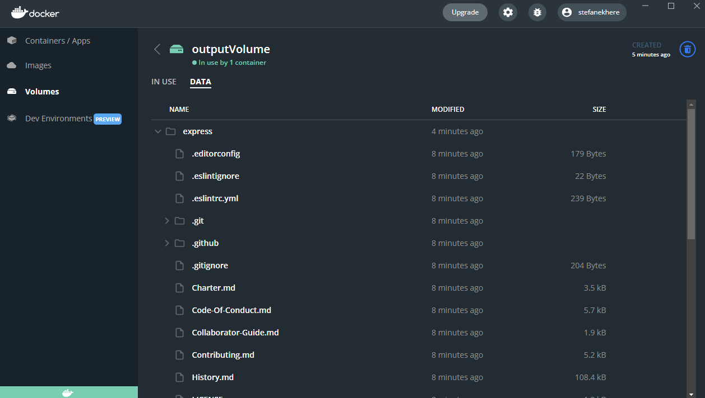
####
# Eksponowanie portu
#### 
#### 1. Instalacja iperf3 na obrazie ubuntu.
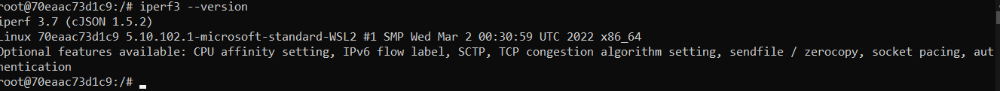
####
#### 2. Uruchomienie nasłuchiwania na porcie 2000 oraz komunikacja między dwoma kontenerami.
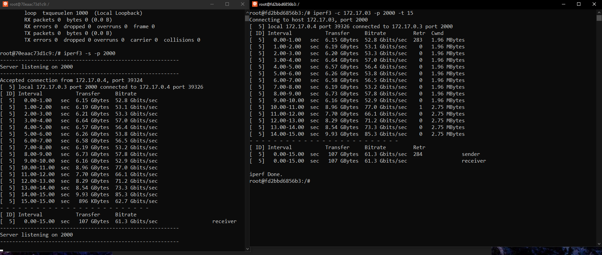
####
#### 3. Nieudana próba połączenia hosta z kontenerem.
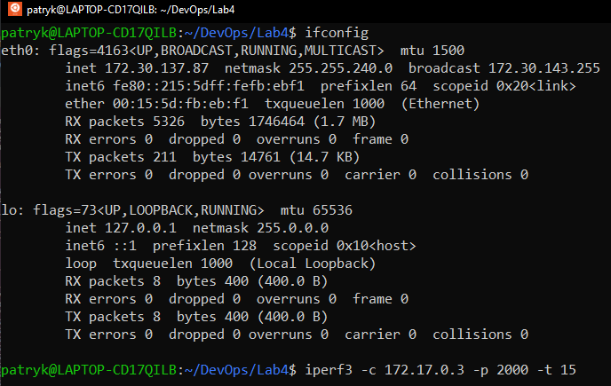
####
#### 4. Utworzenie kontenera z opcją publish na porcie 2000, niestety z tym samym skutkiem.
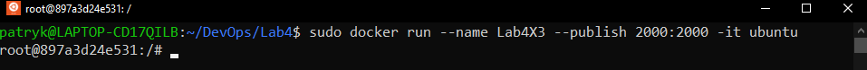
####
# Instancja Jenkins
#### 
#### 1. Stworzenie sieci mostkowanej w dockerze.
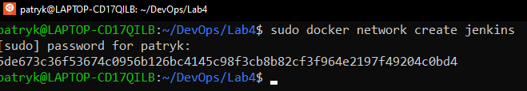
####
#### 2. Pobranie i uruchomienie obrazu docker-dind zgodnie z dokumentacją jenkinsa.
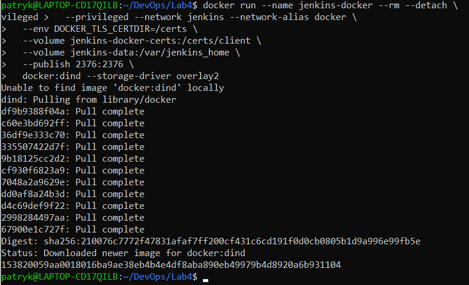
####
#### 3. Dodanie dockerfile'a prosto ze strony dokumentacji jenkinsa.
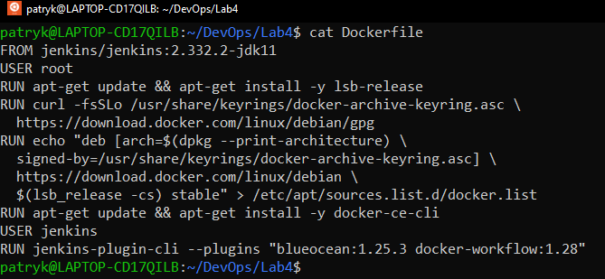
####
#### 4. Stworzenie obrazu na podstawie wcześniej stworzonego dockerfile'a.
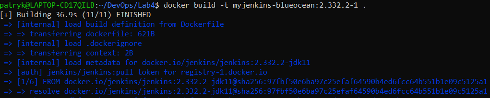
####
#### 5. Uruchomienie wcześniej stworzonego obrazu.

####
#### 6. Wyświetlenie logów, żeby dostać się do klucza.
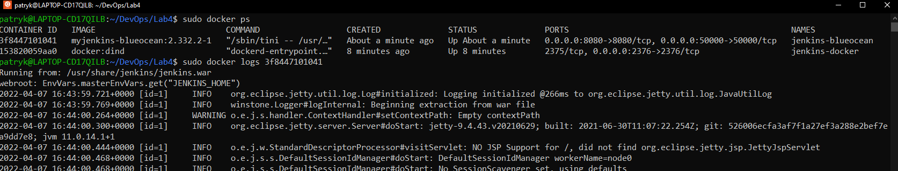
####
#### 7. Po wpisaniu klucza, możliwość rejestracji do jenkinsa.
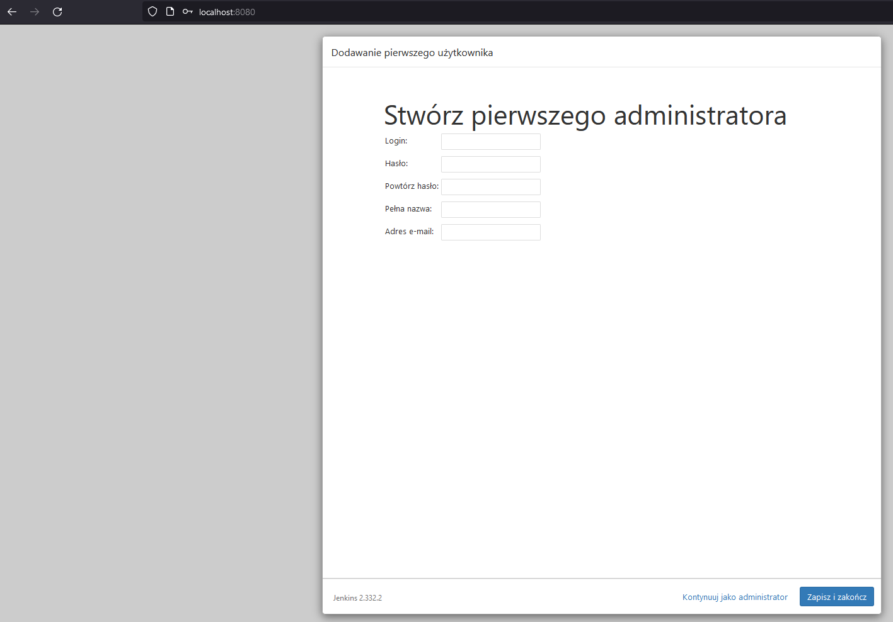
####