# Sprawozdanie
##
## Patryk Stefan GĆL_07
##
##
### Wykonanie pipeline'a dla programu express.js.
(Założenie: Jesteśmy już zalogowani w Jenkinsie, który został zainicjalizowany zgodnie z dokumentacją Jenkinsa dla instalacji Jenkinsa w Dockerze)

##### Celem projektu było napisanie pipelineo'wego skryptu działającego na Jenkinsie który zautomatyzuje proces wdrażania produktu po zmianach, który aspiruje do bycia nową wersją produktu.

#
#
##### Wybranym programem do projektu jest express.js który działa na kontenerze node. Klonowanie odbywa się na kontenerze node- bazowym, ponieważ ma on zainstalowanego gita, natomiast reszta kroków wykonywana jest na node:alpine, ponieważ jest lekki, a doinstalowywany jest tylko bash. Główną częścią projektu było napisanie skryptu, którego poszczególne kroki - Stage'e zostały szczegółowo opisane w dalszej części sprawozdania. Ponadto napisany skrypt został wdrożony na Jenkinsa, a sam proces importowania skryptu również został szczegółowo opisany.
####
####
#### 1. Napisanie pipeline'owego skryptu
- Budowa skryptu
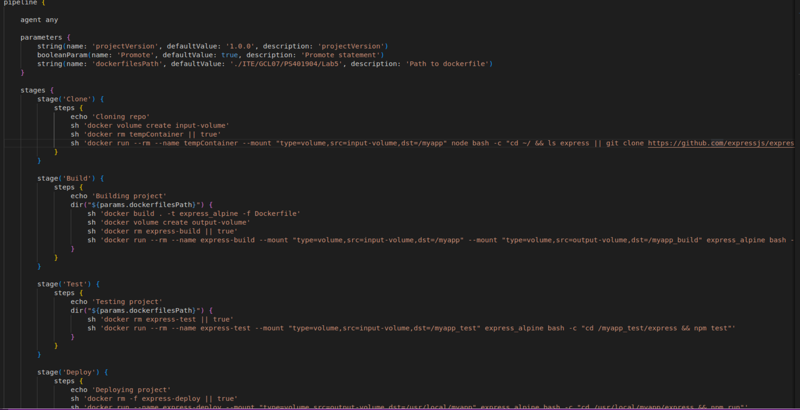
Skrypt składa się ze słowa kluczowego 'pipeline' na początku, zdefiniowania agenta, zdefiniowania zmiennych oraz poszczególnych kroków skryptu. W tym wypadku krokami są: klonowanie repozytorium, zbudowanie programu, przetestowanie programu, wdrożenia oraz opublikowania.

- Opis poszczególnych kroków skryptu
---
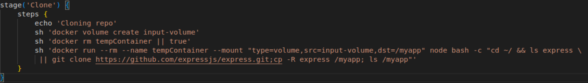
Stage Clone. Zadaniem tego kroku jest sklonowanie repozytorium na wolumin wejścowy. Dlatego skrypt kolejno: tworzy nowy wolumin 'input-volume' -> usuwa kontener tempContainer, aby jeśli już takowy istnieje nie zaśmiecał on środowiska, a jeśli operacja rm się nie powiedzie bo taki kontener nie istnieje to wyrażenie i tak zwróci true ze względu na wyrażenie '|| true'. Jest to ważne, ponieważ każdy krok musi się powieść, aby pipeline nie zatrzymał się w tym momencie i zwrócił kodu błędu -> włączenie kontenera node z podpięciem wcześniej stworzonego woluminu wejściowego -> (operacje już w kontenerze) wejście do folderu domowego -> sklonowani repo i przeniesienie do folderu myapp.
W tym miejscu warto zwrócić uwagę że wybranym kontenerem jest node który w sobie ma zainstalowany pakiet git, przez co nie musimy się martwić o jego doinstalowanie.
---
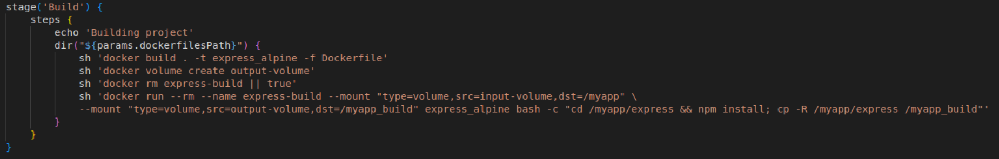
Stage Build. Zadaniem tego kroku jest zbudowanie projektu. Kolejne kroki: wejście do folderu z dockerfilem -> zbudowanie obrazu na podstawie dockerfile, dockerfile zawiera obraz node:alpine- alpine ponieważ jest bardzo mały, oraz dodatkowo instalowany jest bash i system jest updateowany -> stworzenie woluminu wyjściowego -> usunięcie kontenera jeśli już istnieje (tak samo jak poprzednim stage'u) -> włączenie wcześniej zbudowanego kontenera oraz podpięcie woluminu wejściowego i wyjściowego -> zbudowanie projektu komendą npm install oraz skopiowanie go na wolumin wejściowy i wyjściowy.
---
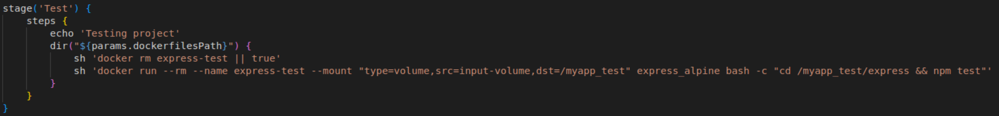
Stage Test. Zadaniem tego kroku jest przetestowanie projektu, czyli wykonywane są dokładnie te same kroku jak poprzednio. Usunięcie kontenera jeśli już istnieje -> włączenie kontenera z podłączeniem woluminu wejścowego na którym jest zbudowany projekt -> włączenie testów komendą npm test
---
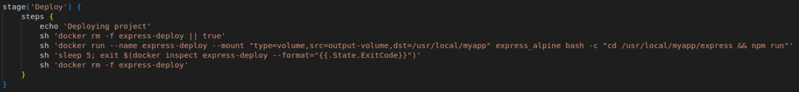
Stage Deploy. Zadaniem kroku jest uruchomienie projektu.Kolejne kroki: na początku standardowo usuwany jest kontener jeśli już istnieje -> uruchomienie kontenera na podstawie wcześniej zbudowanego obrazu node:alpine nazwanego express_alpine oraz uruchomienie w nim projektu komendą npm run -> sprawdzenie exit_code'u -> usunięcie kontenera (ponieważ już go nie potrzebujemy)
---
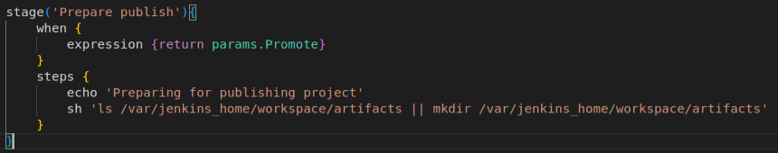
Stage Prepare Publish. Zadaniem tego kroku jest przygotowanie do publikacji projektu jeśli spełnione są warunki publikacji. W wypadku tego projektu jest to utworzenie folderu w którym zostanie przechowany artefakt.
---
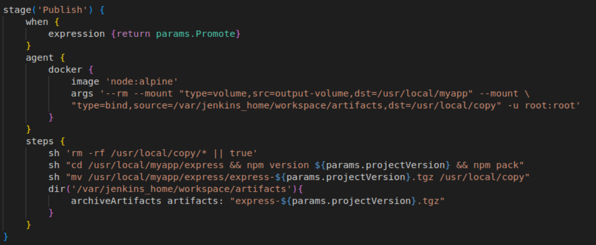
Stage Publish. Zadaniem tego kroku jest wydanie artefaktu. W wypadku tego projektu będzie to paczka .tar. Kolejne kroki: zdefiniowanie agenta- dockera a w nim obrazu oraz argumentów włączenia konteneru -> zdefiniowanie kroków wykonywanych w kontenerze -> spakowanie projektu do paczk .tar -> przekazanie paczki jako artefakt.

---

#### 2. Zimportowanie utworzonego skryptu do Jenkinsa.
- wrzucenie skryptu na githuba
- stworzenie nowego projektu w jenkinsie i wybranie typu projektu: pipeline
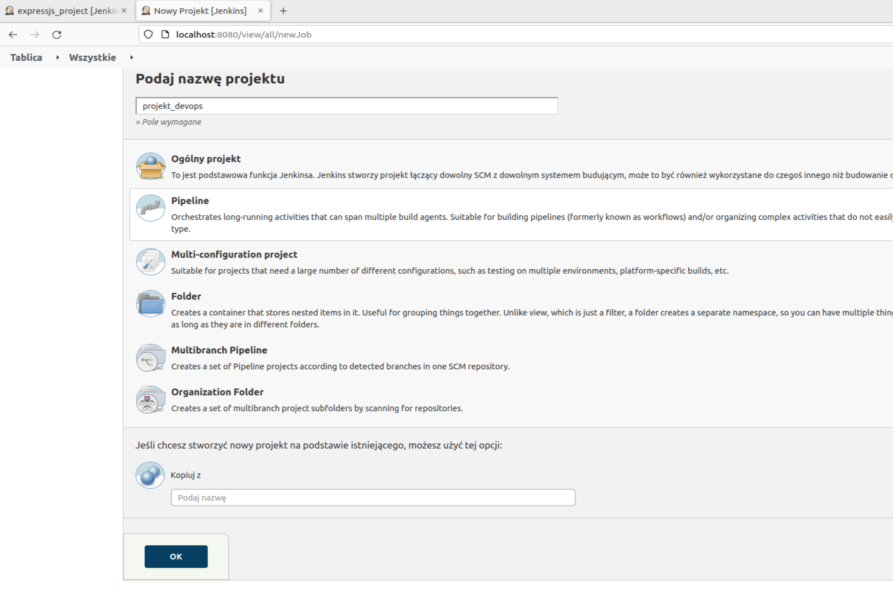
- podczas konfiguracji w zakładce definition należy wybrać pipeline script from SCM
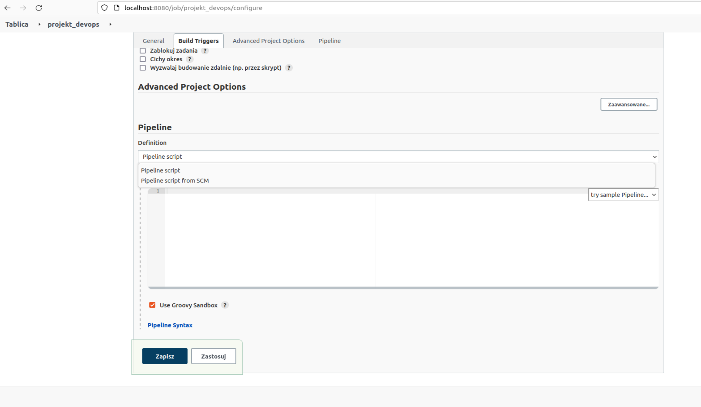
- SCM wybrać Git
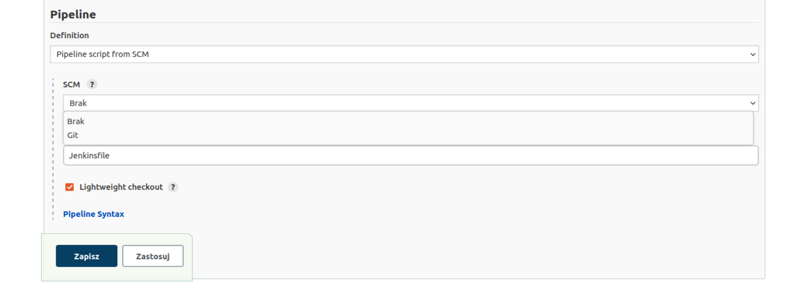
- skopiować ścieżkę do Jenkinsfile'a z Gita
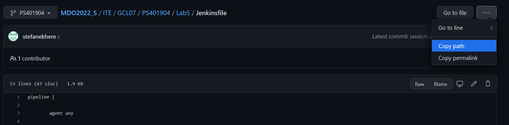
- w zakładce Repository URL wkleić link do klonowania repozytorium po HTTPS, branch specifier wpisać nazwę swojego brancha, w Script Path wkleić skopiowaną we wcześniejszym kroku ścieżkę do Jenkinsfile'a
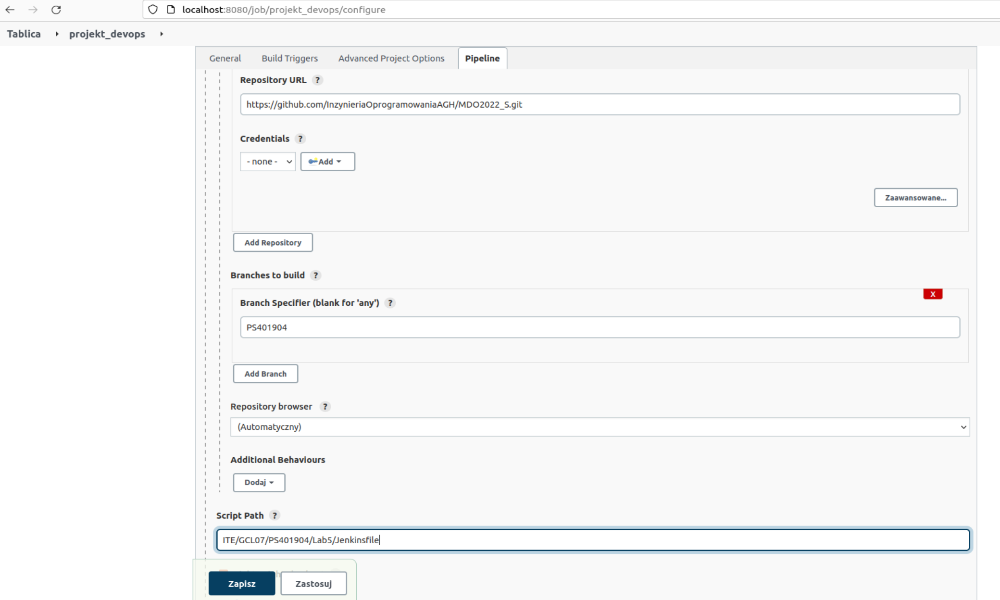

#### 3. Włączenie pipeline'owego skryptu
- sprawdzenie błędów
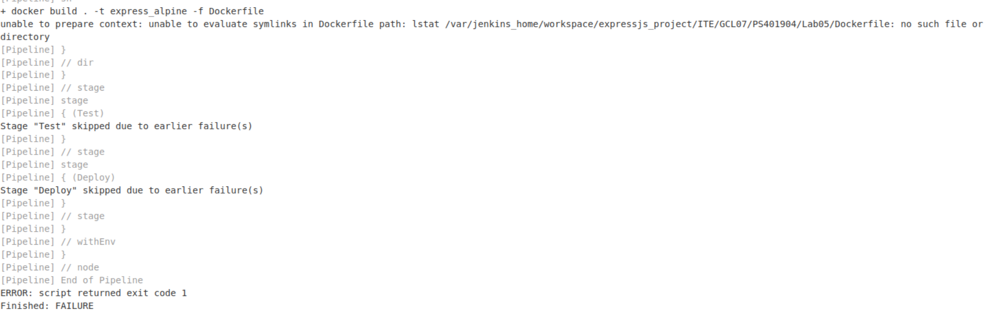
Błędna nazwa ścieżki do Dockerfile'a spowodowała przerwanie pipeline'u.
- włączenie pipeline'u  po poprawce
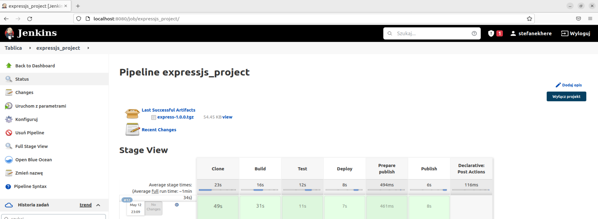
W tym wypadku wszystko przebiegło pomyślnie, a efektem pipeline'u jest artefakt w formie pliku .tgz.
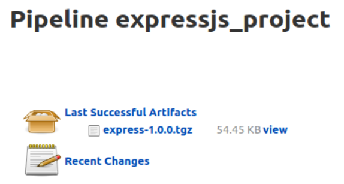
---
#### Wnioski:
Napisanie skryptu pipeline'owego pozwala na dużo łatwiejszy etap testowania poprawności aktualizacji produktu, jak i na bieżące monitorowanie zmian oraz określenie wymogów, które muszą zostać spełnione aby została wydana nowa wersja produktu.

