# Sprawozdanie
##
## Patryk Stefan GĆL_07
##
##

### Przygotowanie systemu fedora

##### Stworzenie partycji.
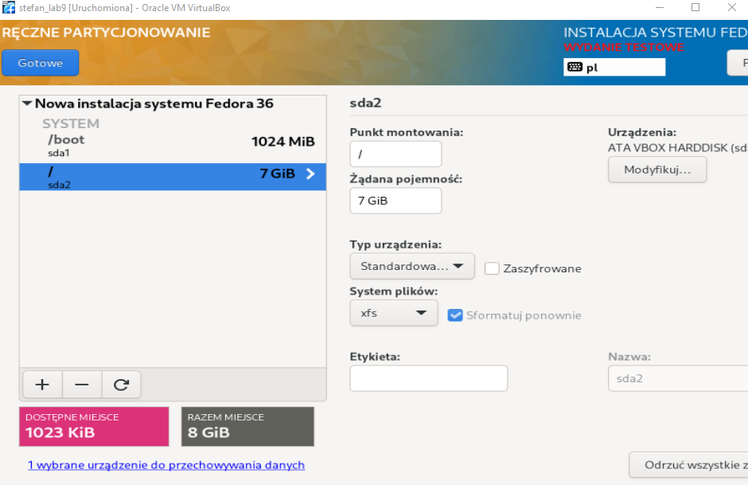
##### Nazwanie sieci.
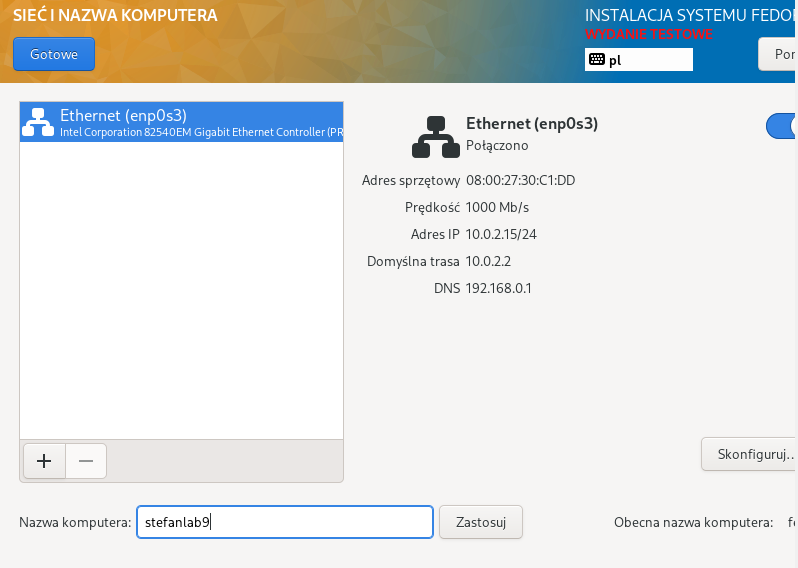
##### Dodanie konta roota oraz zezwolenie na logowanie przez ssh (do późniejszego łączenia w celu przesłania artefaktu przez filezille).
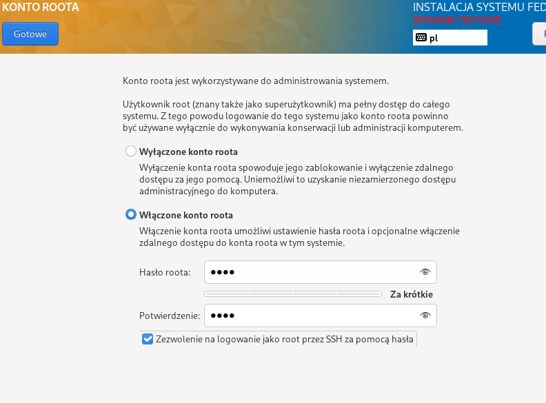
##### Wybranie minimalnej instalacji fedory.
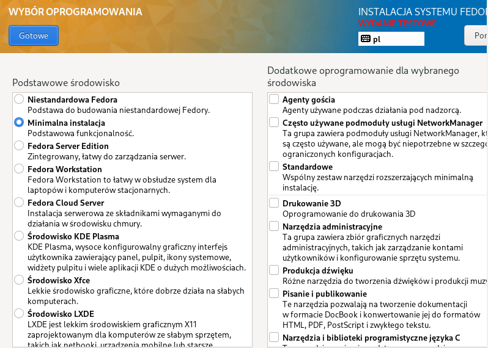
##### Po poprawnej instalacji i sprawdzeniu adresu ip maszyny wirtualnej (fedory)- wyciągnięcie z niej pliku anaconda-ks.cfg łącząc się przez SSH przez filezille.
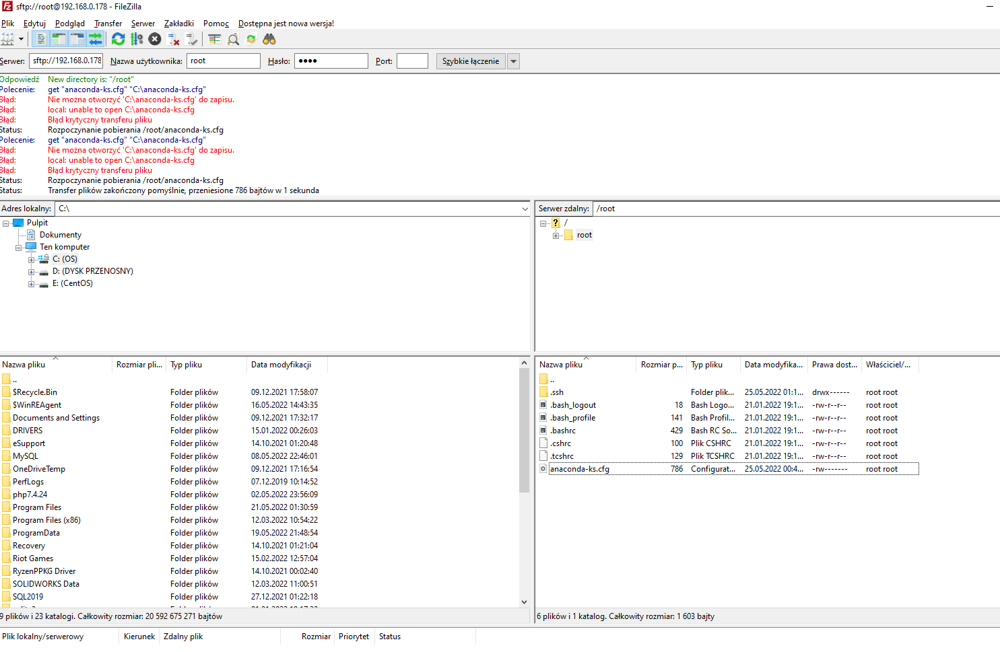
##### Ten sam proces został wykonany dla drugiej maszyny- serwera. Po instalacji serwera- zainstalowanie httpd.
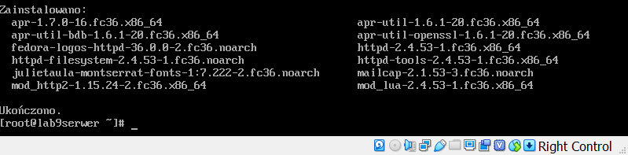
##### Wyłączenie firewalla.
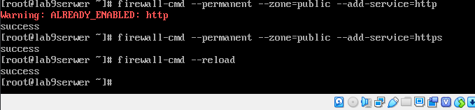
##### Włączenie usługi httpd i sprawdzenie czy działa.
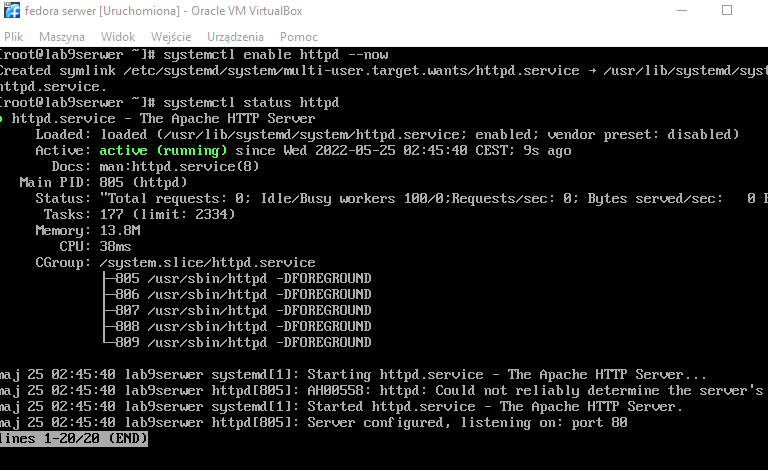
##### Przesłanie artefaktu pobranego z jenkinsa do maszyny wirtualnej - serwera przez program filezilla.
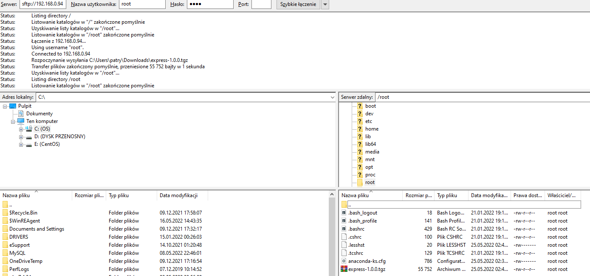
##### Utworzenie folderu /var/www/html (ten folder jest udostępniany przez usługę httpd), nadanie mu wszystkich praw oraz skopiowanie do niego artefaktu.
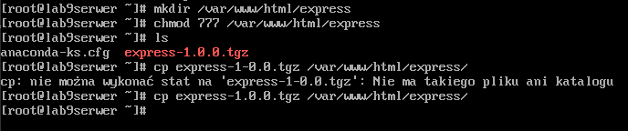

### Pobranie artefaktu express.js z serwera oraz instalacja.

##### Zainstalowanie pakietu wget na maszynie klienta.
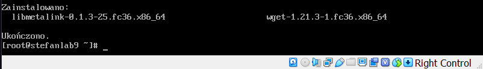
##### Pobranie artefaktu przez klienta z serwera komendą wget.
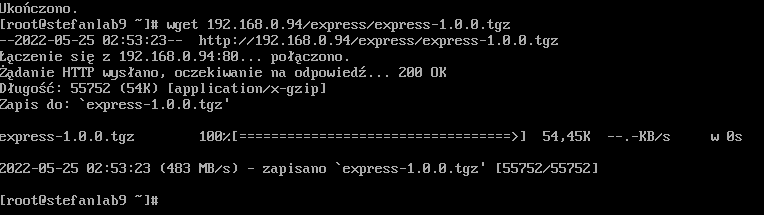
##### Instalacja npm na maszynie klienta.
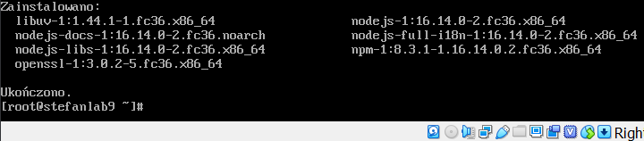
##### Udana instalacja używając artefaktu.

### Instalacja nienadzorowana

#### Wcześniej pobrany plik anaconda-ks.cfg został zmodyfikowany tak aby:
- pobrał artefakt z serwera
- dodał repozytorium fedory
- zainstalował pakiet npm i wget
- instalacja przebiegała w sposób tekstowy- nie graficzny.

##### Instalacja fedory używając niestandardowej instalacji- podając ścieżkę do pliku anaconda-ks.cfg wcześniej wrzuconego na githuba.
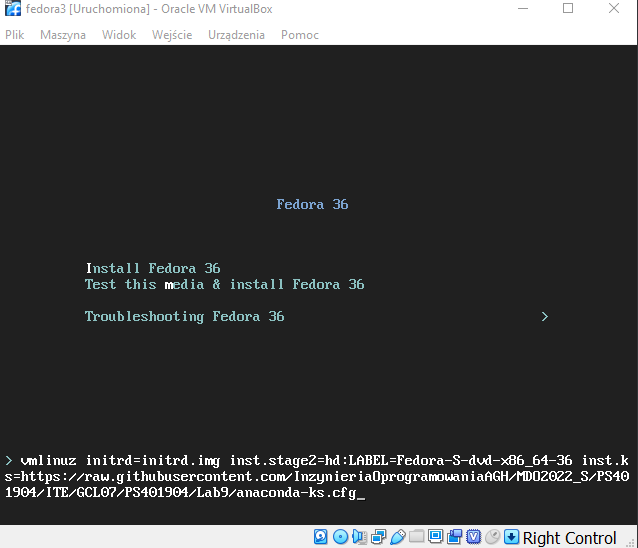
##### Instalacja zakonczona sukcesem.
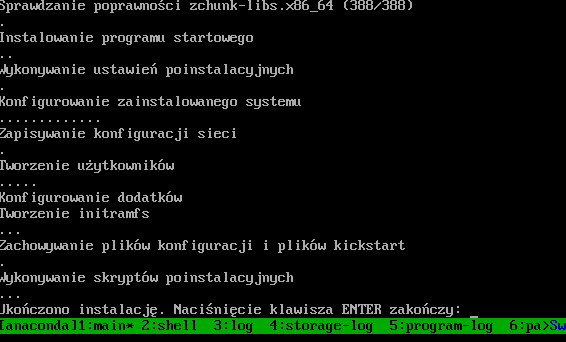

### Infrastructure as a code

##### Na serwerze- wpięcie dysku optycznego z obrazem fedory.
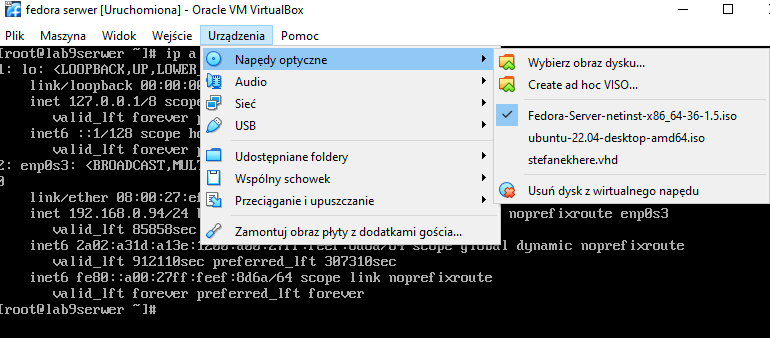
##### Stworzenie nowego folderu oraz uruchomienie obrazu z napędu optycznego.

##### Skopiowanie obrazu do folderu fedora_sio

##### Wrzucenie pliku anaconda-ks.cfg do fedora_iso/iso/isolinux i zmiana nazwy na ks.cfg używając filezille.
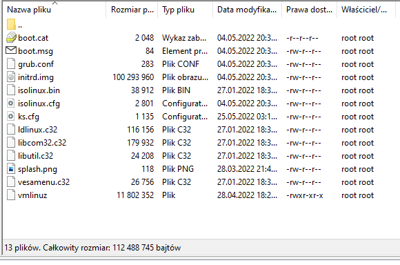
##### Modyfikacja pliku isolinux.cfg tak aby używał pliku ks.cfg przy instalacji.
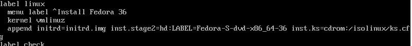
##### Zainstalowanie pakietu genisoimage do wygenerowania nowego obrazu.
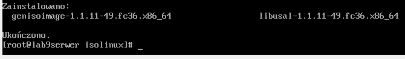
##### Generowanie nowego obrazu.
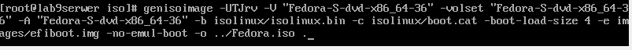
##### Generowanie nowego obrazu zakończone sukcesem.
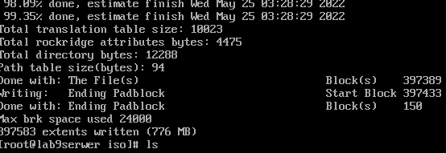
##### Wygenerowany obraz o nazwie Fedora.iso znajduje się w folderze root.
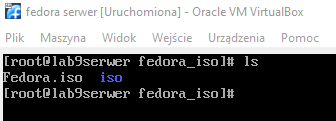

