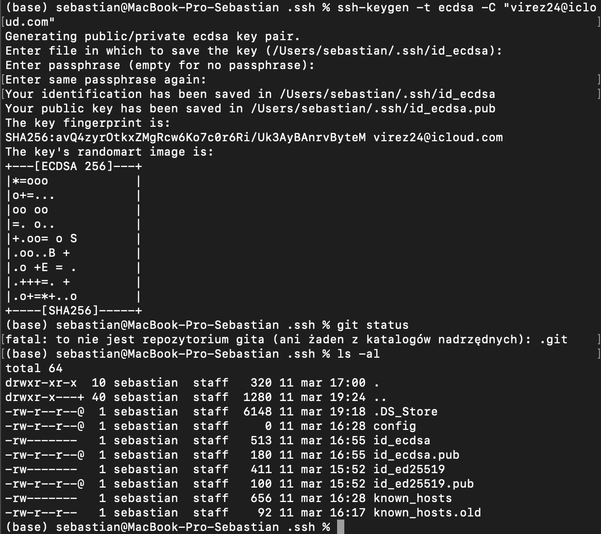
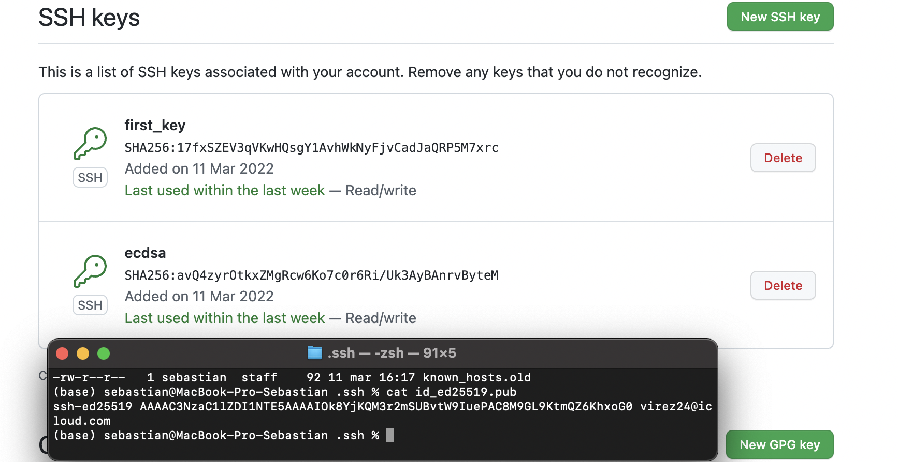
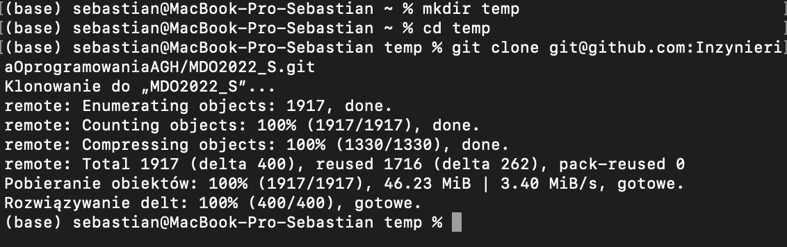
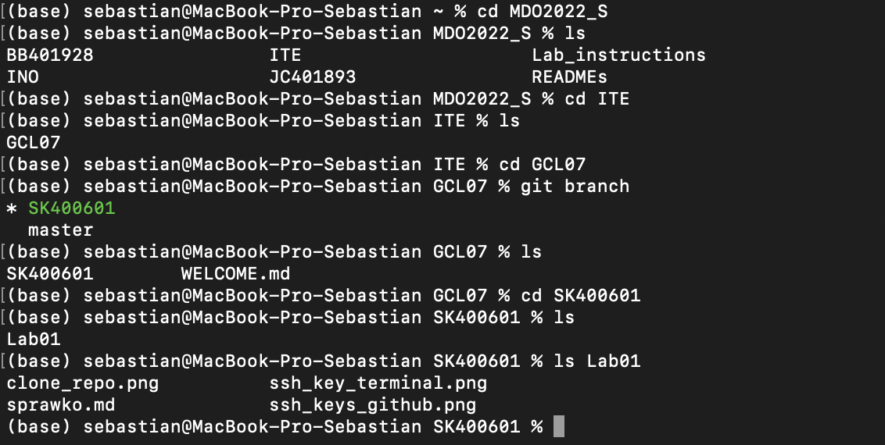

# Sprawozdanie z laboratorium 1

## Tworzenie kluczy ssh: 
1. Najpierw w folderze ~/.ssh utworzono pierwsza parę kluczy ssh z szyfrowaniem ecdsa-sk poleceniem:
    
        ssh-keygen -t ecdsa-sk -C "virez24@icloud.com"
    bez żadnego hasła 

2. Następnie utworzono drugi klucz ssh z szyfrowaniem ecdsa poleceniem:

        ssh-keygen -t ecdsa -C "virez24@icloud.com"

 

 Poniżej zamieszczam zrzut ekranu z konsoli przedstawiający tworzenie drugiego klucza oraz zawartość folderu .ssh

 

 

 Zrzut ekranu z kluczy na github wraz z wydrukiem klucza publicznego  id_ed25519.pub w konsoli aby potwierdzić prawdziwość kluczy:

 

 

## Pobranie repozytorium oraz stworzenie własnego brancha:

Disclaimer: Niestety zamknąłem okno terminala więc zrzutu ekranu z komendami w terminalu nie bedzię.

1. Pobranie repozytorium przy pomocy ssh przy uzyciu komendy:

        git clone git@github.com:InzynieriaOprogramowaniaAGH/MDO2022_S.git
    

Ponizej zrzut ekranu z terminalu pokazujący, że pobranie przy pomocy ssh działa (stworzony został tymczasowy folder aby pokazać na screen'ie ponieważ zamknąłem terminal)

 

2. Stworzenie własnego brancha odgałęziając branch ITE-GCL07 komendą:

        git checkout -b SK400601 origin/ITE-GCL07

3. Następnie przejscie do folder ITE/GCL07 i utworzenie w nim własnego folderu komendą:

        mkdir SK400601
4. W folderz SK400601 otworzono folder Lab01 i w nim umieszono materiały do sprawozdania

5. Następnie dodano zmiany oraz zcommitowano je poleceniami:

        git add ../
        git commit -m "Initial commit"

5. Na koniec push'nieto repo na własnego brancha poleceniem:

        git push origin HEAD

6. Po wykonaniu pierwszego push'u przystąpiono do wykonania sprawozdania.

 

Ponieżej zrzut ekranu z terminalu z folderu z repozytorium pokazujący strukture folderów jak i branche:

 

## Wnioski:

1. Przy tworzeniu kluczy ssh trzeba pamiętać o odpowiedniej nazwie czyli id_nazwa_szyfrowania np. id_rsa oraz o tym, że trzeba je umieścić w folderze ~/.ssh. W przypadku innej nazwy kluczy należy posługiwać się ssh agentem. Klucze publiczne kończą się rozszerzeniem .pub.

2. Aby utworzyć brancha z innego remote brancha należy posłużyć się komendą git checkout -b nazwa_swoje_brancha origin/nazwa_brancha_którego_chcemy_rozgałęzić

3. Do zmiany brancha zamiast checkout można posłużyć się komendą switch, która służy tylko do zmiany brancha. Natomiast checkout'em można posłużyć się w formie git restore poprzez git checkout -- <path_to_file>.  
