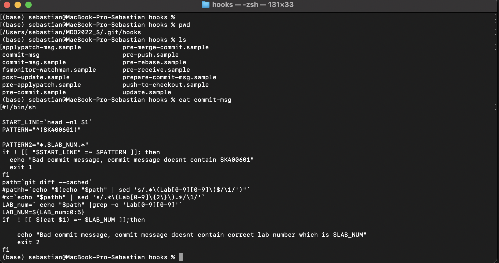
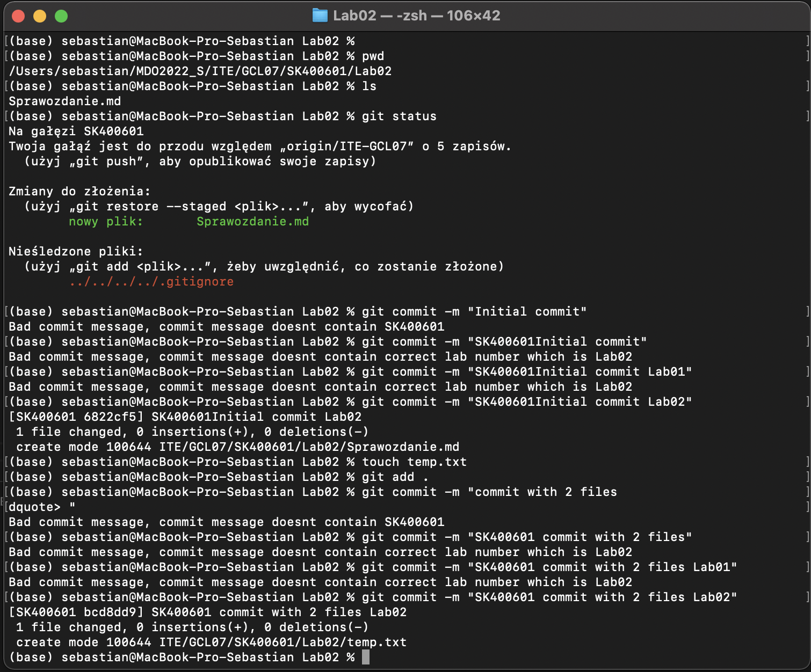
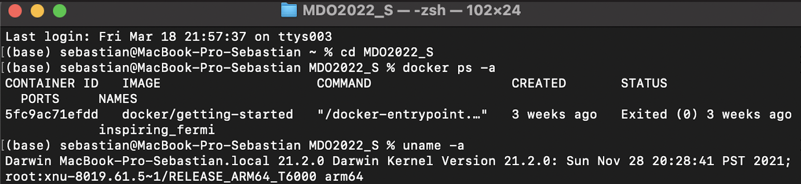
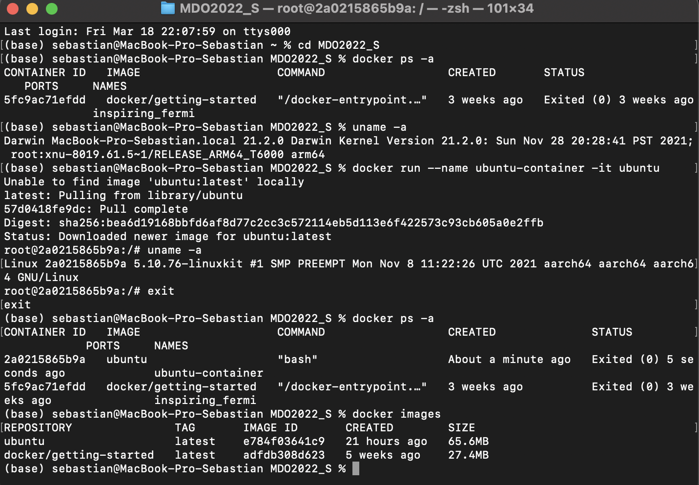
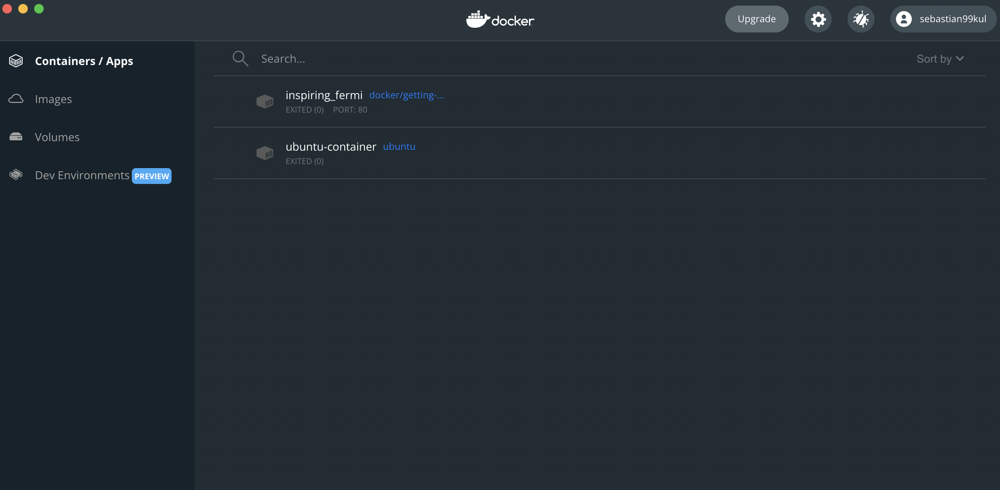

# Sprawozdanie z laboratorium nr. 2

## Tworzenie Hook'ów:
Hook stworzono w pliku commit-msg w folderze .git/hooks/

Hook ten sprawdzał czy commit w tytule zawierał inicjały oraz numer indeksu czyli w tym przypadku SK400601. Drugą rzeczą którą sprawdzał to czy w commit message znajdował się numer odpowiedniego laboratorium w postaci LabXX, gdzie XX to numer laboratorium. W pierwszym przypadku wystarczyło sworzyć prosty regex który sprawdzi czy SK400601 znajduje się w pierwszej linii COMMIT_EDITMSG czyli pod zmienną $1. Natomiast w drugim przypadku trzeba było wyświetlić ścieżkę w której to znajdowały się zacommit'owane pliki. Najpierw próbowałem rozwiązać problem poprzez wyświetlenie ścieżki przy pomocy pwd lecz wyświetla ona tylko ścieżkę do folderu w którym znajduje się folder .git czyli z tamtąd wykonywany jest hook. Lecz sprawdzenie zmian pomiedzy commitami powiodło się więc do zmiennej path przypisałem  wynik git diff --cashed. A następnie echo "$path" |grep -o 'Lab[0-9][0-9]' wyciągłem wszystkie pasujące wyniki i zostawiłem pierwszy wrazie wypadku jakby więcej niż jeden plik był dodany. Poniżej zamieszczam listing kody z commit-msg:

        #!/bin/sh

    START_LINE=`head -n1 $1`
    PATTERN="^(SK400601)"

    PATTERN2="*.$LAB_NUM.*"
    if ! [[ "$START_LINE" =~ $PATTERN ]]; then
    echo "Bad commit message, commit message doesnt contain SK400601"
    exit 1
    fi
    path=`git diff --cached`
    #pathh=`echo "$(echo "$path" | sed 's/.*\(Lab[0-9][0-9]\)$/\1/')"`
    #x=`echo "$pathh" | sed 's/.*\(Lab[0-9]\{2\}\).*/\1/'`
    LAB_num=` echo "$path" |grep -o 'Lab[0-9][0-9]'`
    LAB_NUM=${LAB_num:0:5}
    if  ! [[ $(cat $1) =~ $LAB_NUM ]];then
        
        echo "Bad commit message, commit message doesnt contain correct lab number which is $LAB_NUM"
        exit 2
    fi

Poniżej zamieszczam zrzut ekranu z wyduku pliku w konsoli :

 

Natomiast poniżej znajduje sie sprawdzenie działania hooka: 

## Docker: 

Docker już był wcześniej zainstalowany i jest on zainstalowany bezpośrednio na macbooku bez żadnych maszyn wirtualnych.  Poniżej zamiesczam screena z komendy uname -a potwierdzającej system, oraz z docker ps -a potwierdzający zainstalowanego dockera.

 

Następnie został uruchomiony kontener z ubuntu przy użyciu komendy:

    docker run --name docker-container -it ubuntu 

poniżej zamieszczam zrzut ekranu z konsoli: 

Na koniec zamieszczam zrzut ekranu z zalogowaniem na konto dockerhubem:

