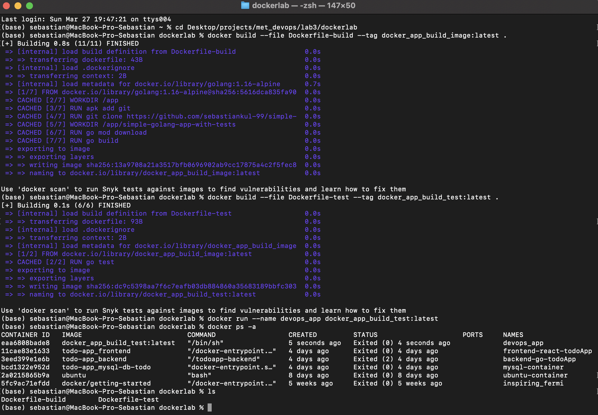
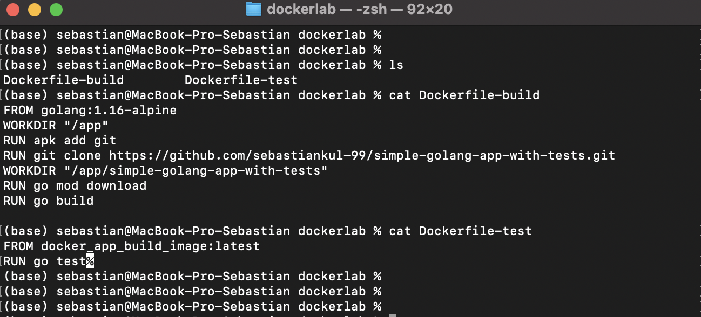
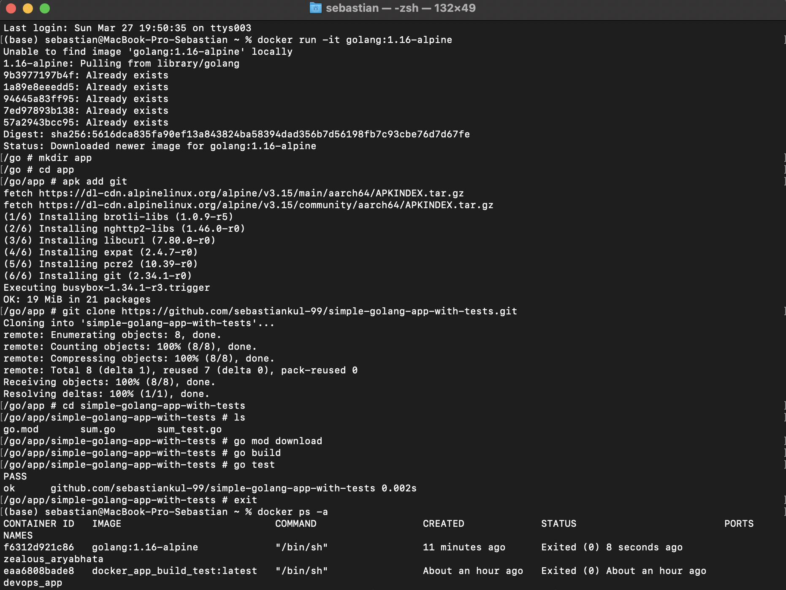

# Sprawozdanie numer 3

## Aplikacja:

Jako aplikacje testową wybrałem prostą aplikacje go która sumuje wartość tablicy intów do której dołączyłem jeden test.

## Dockerfile buildu:

Go podobnie jak node posiada już swój obraz na podstawie linuxa alpine (golang:1.16-alpine), więc jedyne co trzeba było zrobić to zainstalować git następnie pobrać repozytorium z githuba i ustawić working directory na pobrany folder. Na koniec wystarczyło pobrać zależnosci (których akurat w tym programie nie ma) i odpalić builda (go build). Poniżej przedstawiam Dockerfile'a:

    FROM golang:1.16-alpine
    WORKDIR "/app"
    RUN apk add git 
    RUN git clone https://github.com/sebastiankul-99/simple-golang-app-with-tests.git
    WORKDIR "/app/simple-golang-app-with-tests"
    RUN go mod download
    RUN go build 

## Dockerfile testowania

Dockerfile testowania jest jeszcze prostszy wystarczyło zbudować obraz na podstawie obrazu do buildowania a następnie uruchomić komendę go test która przeprowadzi testy. Jeżeli testy się powiodły to kontener powinnien się zakończyć z statusem 0. Poniżej przedstawiam Dockerfile'a testowania:

    FROM docker_app_build_image:latest
    RUN go test

## Tworzenie obrazów i uruchamianie kontenera

Dockerfile z buildu został zapisany jako Dockerfile-build, natomiast Dockerfile testowania jako Dockerfile-test. Poniżej przedstawiam komendy do budowania i uruchomiania kontenera:

    docker build --file Dockerfile-build --tag docker_app_build_image:latest .
    docker build --file Dockerfile-test --tag docker_app_build_test:latest .
    docker run --name devops_app docker_app_build_test:latest 

Uruchomionu kontener został zamknięty z statusem 0 więc został uruchomiony poprawnie. Poniżej zamieszczam rzut ekranu z konsoli potwierdzający buildowanie obrazów, poprawność uruchomienia kontenera:

Poniżej przedstawiam zrzut ekranu z wypisania do konsoli Dockerfile'ów:

Ponizej historia używanych komend:

    1001  cd Desktop/projects/met_devops/lab3/dockerlab
    1002  docker build --file Dockerfile-build --tag docker_app_build_image:latest .
    1003  docker build --file Dockerfile-test --tag docker_app_build_test:latest .
    1004  docker run --name devops_app docker_app_build_test:latest 
    1005  docker ps -a
    1006  ls
    1007  ls
    1008  cat Dockerfile-build
    1009  cat Dockerfile-test

## Buildowanie i testowanie wewnątrz kontenera 

Na podstawie bazowanego kontenera golang:1.16-alpine został stworzony kontener w trybie interaktywnym przy użyciu komendy:

    docker run -it golang:1.16-alpine    

Następnie w nim został stworzony folder app i został zainstalowany git. Kolejno w folderze app pobrano repozytorium następnie zainstalowano potrzebne zależności, zbudowano program a następnie uruchomiono test. Poniżej przedstawiam użyte komendy:

    docker run -it golang:1.16-alpine
    mkdir app 
    cd app 
    apk add git
    git clone https://github.com/sebastiankul-99/simple-golang-app-with-tests.git
    cd simple-golang-app-with-tests
    go mod download
    go build
    go test

 Poniżej przedstawiam zrzut ekranu z konsoli:

 