# Sprawozdanie numer 4

## Docker volumes 

Najpierw utworzono dwa volumeny poleceniami:

    docker volume create in-vol
    docker volume create out-vol

Poniżej zrzut ekranu z stworzonych volumenów

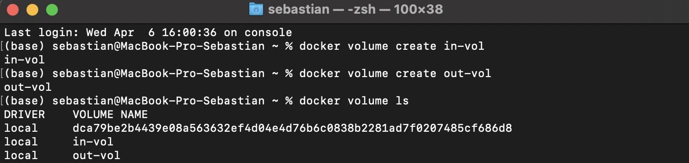

Następnie pobrano projekt z githuba i skopiowano go do volumenu przy użyciu tymczasowego kontenera, używając poleceń:

    git clone https://github.com/sebastiankul-99/simple-golang-app-with-tests.git
    cd simple-golang-app-with-tests
    docker  create --name temp -v in-vol:/build hello-world
    docker cp . temp:/build
    docker rm temp

Ponizej zrzut ekranu z terminalu:

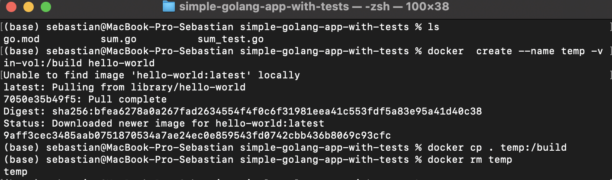

Następnie utworzono kontener na bazie obrazu golang:1.16-alpine przy użyciu komendy:

    docker run -v in-vol:/build \
    -v out-vol:/app\
    --name devops_lab4 -it golang:1.16-alpine

Następnie w kontenerze z volumenu wejsciowego skopiowano pliki do volumenu wyjsciowego gdzie zbudowanu program i odpalono testy poniżej zrzut ekranu z konsoli:

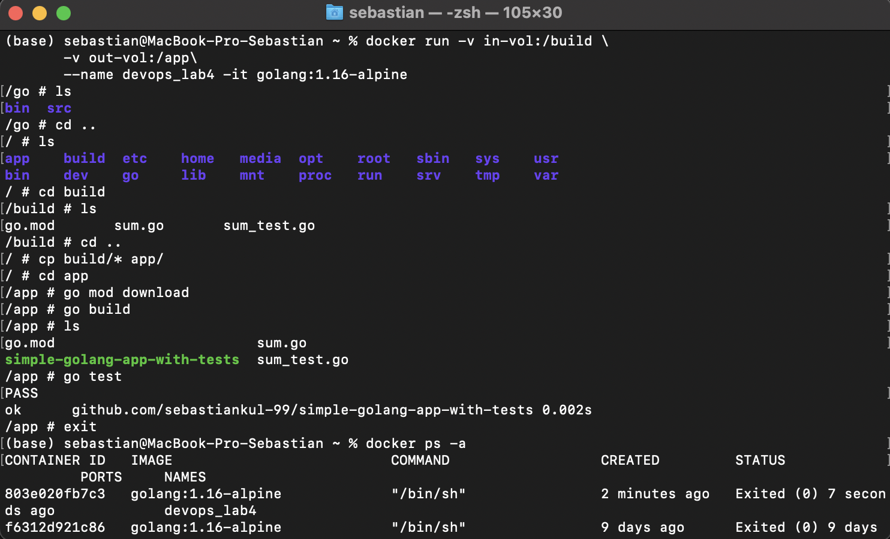

Nastepnie utworzono tymczasowy kontener aby sprawdzić czy dane zostały zapisane na volumenie wyjściowym, poniżej zrzut ekranu:

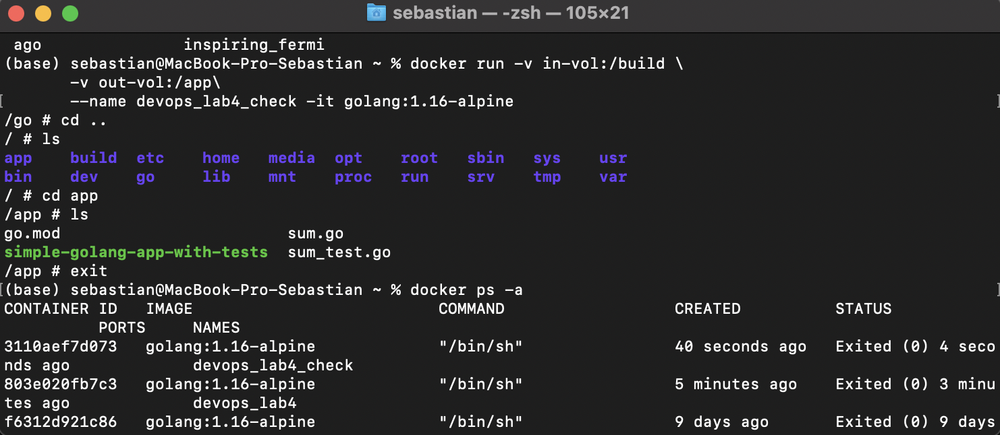

## Docker network

Najpierw utworzono siec typu bridge poleceniem:

    docker network create devops-net

Następnie na podstawie obrazu iperf3 (networkstatic/iperf3) utworzono kontener serwera iperf3 poleceniem:

    docker run --name iperf-server\
    --network devops-net \
    -p 5201:5201\
    -it \
    networkstatic/iperf3 -s

Poniżej zrzut ekranu z terminalu:

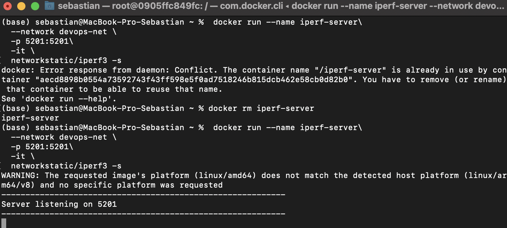

Następnie również na podstawie obrazu networkstatic/iperf3 utworzono kontener Klienta iperf, poleceniem:

    docker run --name iperf-client\
    --network devops-net \
    -it \
    networkstatic/iperf3 -c iperf-server

poniżej zrzut ekranu terminalu dla klienta :

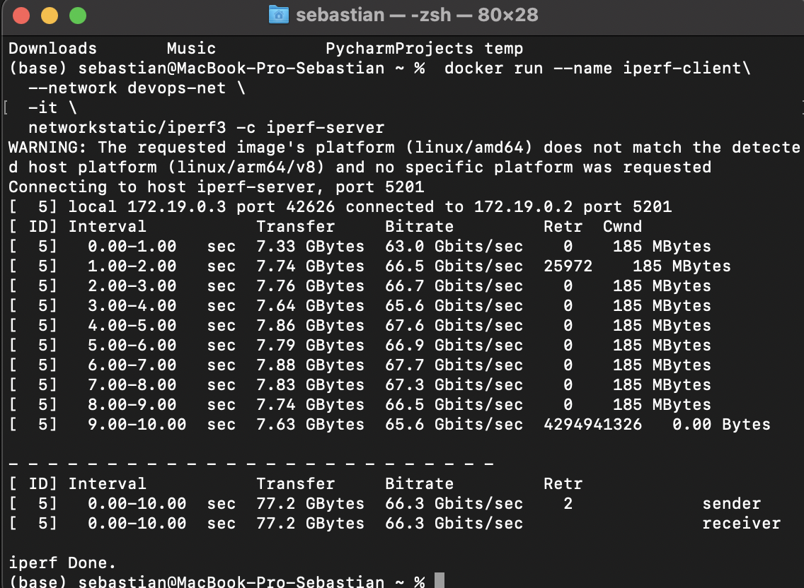

poniżej zrzut ekranu z serwera iperf z otrzymanymi danymi:

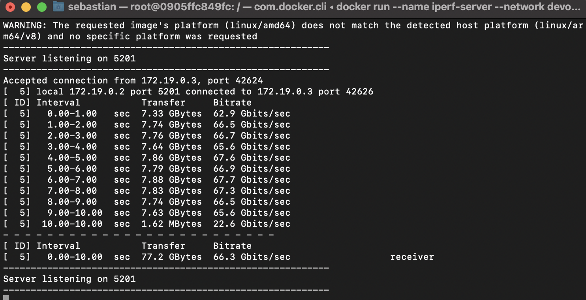

poniżej zestawienie terminali:

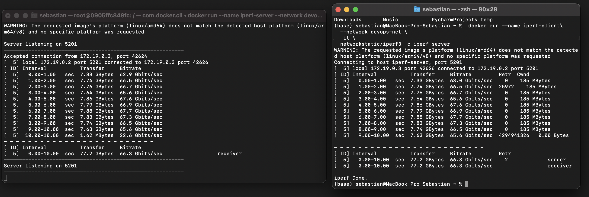

Kolejnym krokiem było połączenie sie z serwerem iperf za pomoca hosta. W tym celu najpierw przy pomocy homebrew pobrano iperf3 a następnie przy użyciu poniższej komendy połączono sie z serwerem:

    iperf3 -c locahost

Poniżej zrzut ekranu z konsoli hosta:

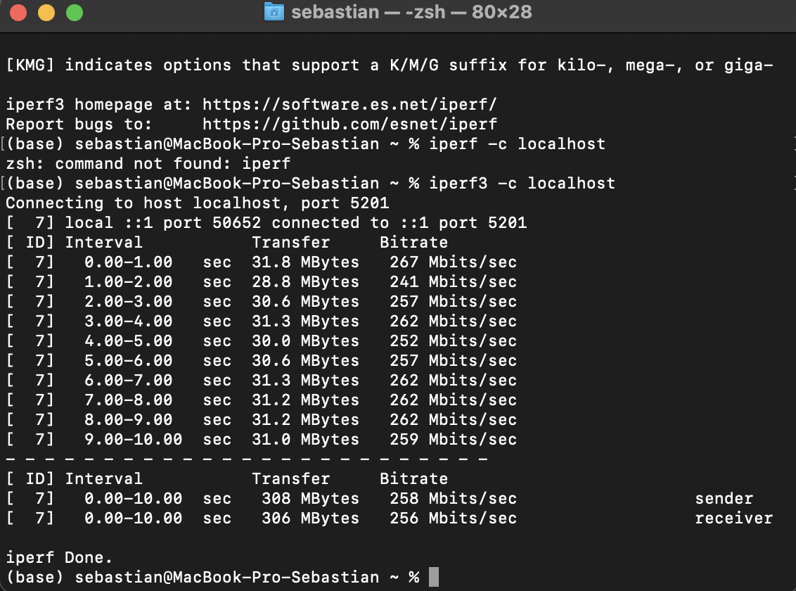

Zrzut ekranu z konsoli serwera:

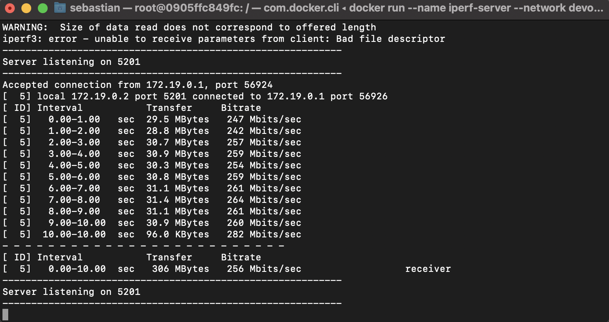

Poniżej zestawienie konsoli hosta oraz serwera:

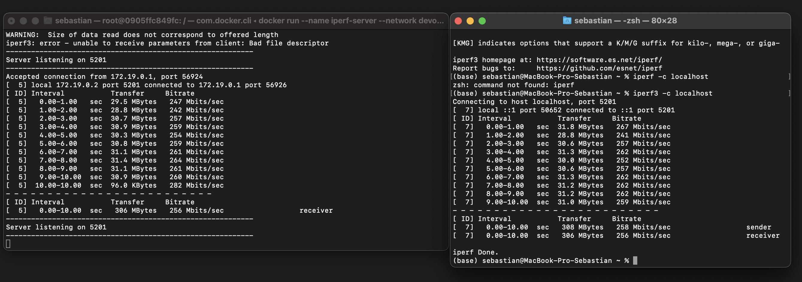

Poniżej zamieszczono listing logów z serwera:

    (base) sebastian@MacBook-Pro-Sebastian ~ % docker logs iperf-server
    -----------------------------------------------------------
    Server listening on 5201
    -----------------------------------------------------------
    Accepted connection from 172.19.0.3, port 42624
    [  5] local 172.19.0.2 port 5201 connected to 172.19.0.3 port 42626
    [ ID] Interval           Transfer     Bitrate
    [  5]   0.00-1.00   sec  7.33 GBytes  62.9 Gbits/sec                  
    [  5]   1.00-2.00   sec  7.74 GBytes  66.5 Gbits/sec                  
    [  5]   2.00-3.00   sec  7.76 GBytes  66.7 Gbits/sec                  
    [  5]   3.00-4.00   sec  7.64 GBytes  65.6 Gbits/sec                  
    [  5]   4.00-5.00   sec  7.86 GBytes  67.6 Gbits/sec                  
    [  5]   5.00-6.00   sec  7.79 GBytes  66.9 Gbits/sec                  
    [  5]   6.00-7.00   sec  7.88 GBytes  67.7 Gbits/sec                  
    [  5]   7.00-8.00   sec  7.83 GBytes  67.3 Gbits/sec                  
    [  5]   8.00-9.00   sec  7.74 GBytes  66.5 Gbits/sec                  
    [  5]   9.00-10.00  sec  7.63 GBytes  65.6 Gbits/sec                  
    [  5]  10.00-10.00  sec  1.62 MBytes  22.6 Gbits/sec                  
    - - - - - - - - - - - - - - - - - - - - - - - - -
    [ ID] Interval           Transfer     Bitrate
    [  5]   0.00-10.00  sec  77.2 GBytes  66.3 Gbits/sec                  receiver
    -----------------------------------------------------------
    Server listening on 5201
    -----------------------------------------------------------
    WARNING:  Size of data read does not correspond to offered length
    iperf3: error - unable to receive parameters from client: Bad file descriptor
    -----------------------------------------------------------
    Server listening on 5201
    -----------------------------------------------------------
    Accepted connection from 172.19.0.1, port 56924
    [  5] local 172.19.0.2 port 5201 connected to 172.19.0.1 port 56926
    [ ID] Interval           Transfer     Bitrate
    [  5]   0.00-1.00   sec  29.5 MBytes   247 Mbits/sec                  
    [  5]   1.00-2.00   sec  28.8 MBytes   242 Mbits/sec                  
    [  5]   2.00-3.00   sec  30.7 MBytes   257 Mbits/sec                  
    [  5]   3.00-4.00   sec  30.9 MBytes   259 Mbits/sec                  
    [  5]   4.00-5.00   sec  30.3 MBytes   254 Mbits/sec                  
    [  5]   5.00-6.00   sec  30.8 MBytes   259 Mbits/sec                  
    [  5]   6.00-7.00   sec  31.1 MBytes   261 Mbits/sec                  
    [  5]   7.00-8.00   sec  31.4 MBytes   264 Mbits/sec                  
    [  5]   8.00-9.00   sec  31.1 MBytes   261 Mbits/sec                  
    [  5]   9.00-10.00  sec  30.9 MBytes   260 Mbits/sec                  
    [  5]  10.00-10.00  sec  96.0 KBytes   282 Mbits/sec                  
    - - - - - - - - - - - - - - - - - - - - - - - - -
    [ ID] Interval           Transfer     Bitrate
    [  5]   0.00-10.00  sec   306 MBytes   256 Mbits/sec                  receiver
    -----------------------------------------------------------
    Server listening on 5201
    -----------------------------------------------------------

## Jenkins 

Najpierw utworzono sieć jenkins oraz dwa volumeny przy użyciu komend:

    docker network create jenkins
    docker volume create jenkins-docker-certs
    docker volume create jenkins-data

Następnie utworzono kontener docker-jenkins aby można było używać poleceń Dockera wewnątrz Jenskinsa, kontener ten utworzono na podstawie obrazu docker:dind poleceniem:

    docker run --name jenkins-docker --rm --detach \
    --privileged --network jenkins --network-alias docker \
    --env DOCKER_TLS_CERTDIR=/certs \
    --volume jenkins-docker-certs:/certs/client \
    --volume jenkins-data:/var/jenkins_home \
    --publish 2376:2376 \
    docker:dind --storage-driver overlay2

Następnie utworzono Dockerfile o poniższej zawartości:

    FROM jenkins/jenkins:2.332.2-jdk11
    USER root
    RUN apt-get update && apt-get install -y lsb-release
    RUN curl -fsSLo /usr/share/keyrings/docker-archive-keyring.asc \
    https://download.docker.com/linux/debian/gpg
    RUN echo "deb [arch=$(dpkg --print-architecture) \
    signed-by=/usr/share/keyrings/docker-archive-keyring.asc] \
    https://download.docker.com/linux/debian \
    $(lsb_release -cs) stable" > /etc/apt/sources.list.d/docker.list
    RUN apt-get update && apt-get install -y docker-ce-cli
    USER jenkins
    RUN jenkins-plugin-cli --plugins "blueocean:1.25.3 docker-workflow:1.28"

Następnie na podstawie powyższego Dockerfile utworzono obraz, poleceniem:

    docker build -t myjenkins-blueocean:2.332.2-1 .

I na podstawie powyższego obrazu utworzono kontener, poleceniem:

    docker run --name jenkins-blueocean --rm --detach \
    --network jenkins --env DOCKER_HOST=tcp://docker:2376 \
    --env DOCKER_CERT_PATH=/certs/client --env DOCKER_TLS_VERIFY=1 \
    --publish 8080:8080 --publish 50000:50000 \
    --volume jenkins-data:/var/jenkins_home \
    --volume jenkins-docker-certs:/certs/client:ro \
    myjenkins-blueocean:2.332.2-1

Poniżej zrzuty ekranu z tworzenia kontenerów:

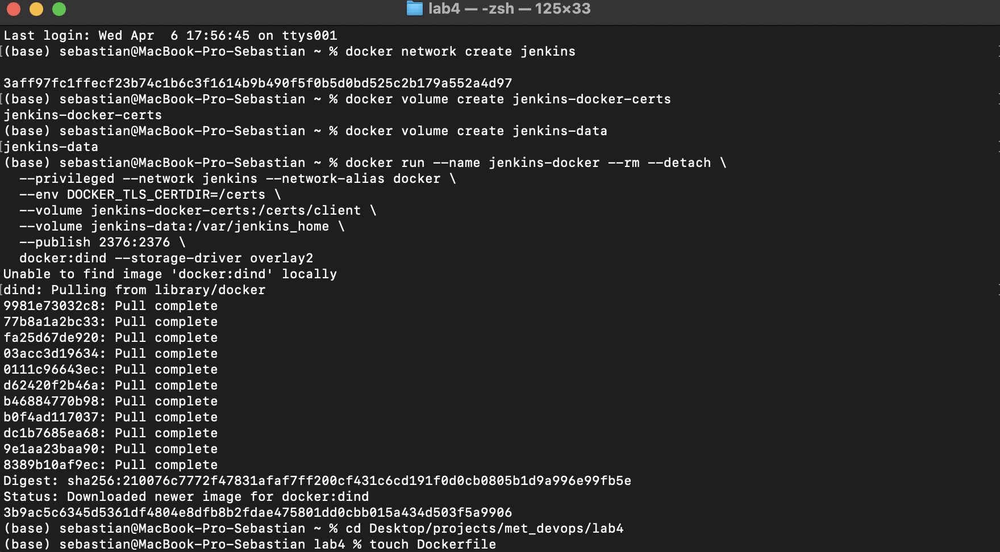

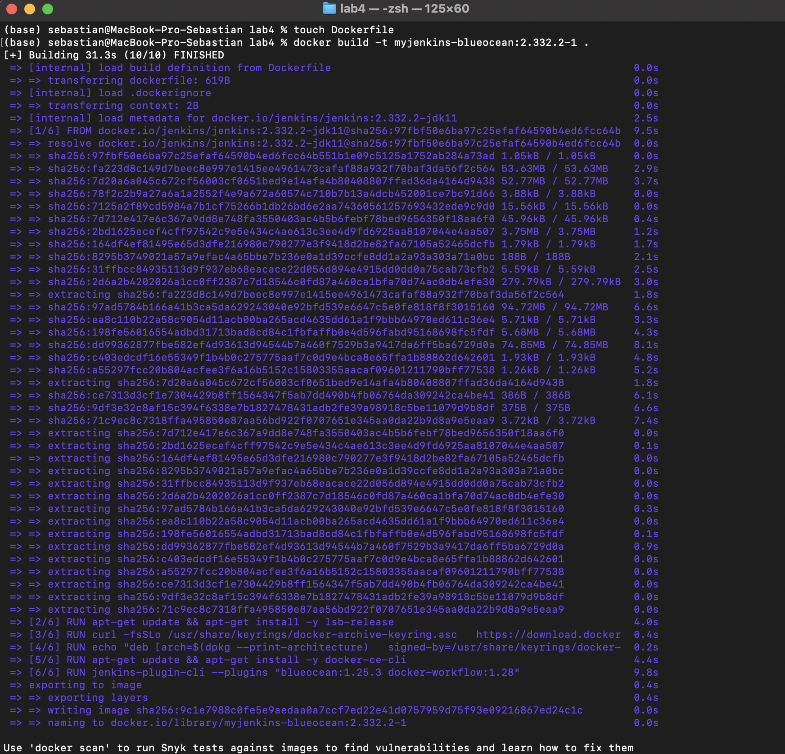

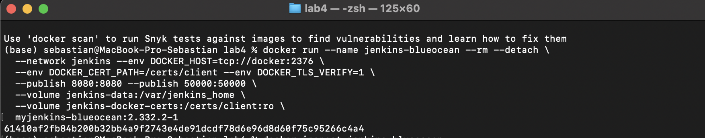

Następnie wciągnieto hasło z logów kontenera przy pomocy polecenia:
    
    docker logs jenkins-blueocean

I zalogowano sie do jenkinsa na locahost:8080

Poniżej zrzut ekranu z logowania:

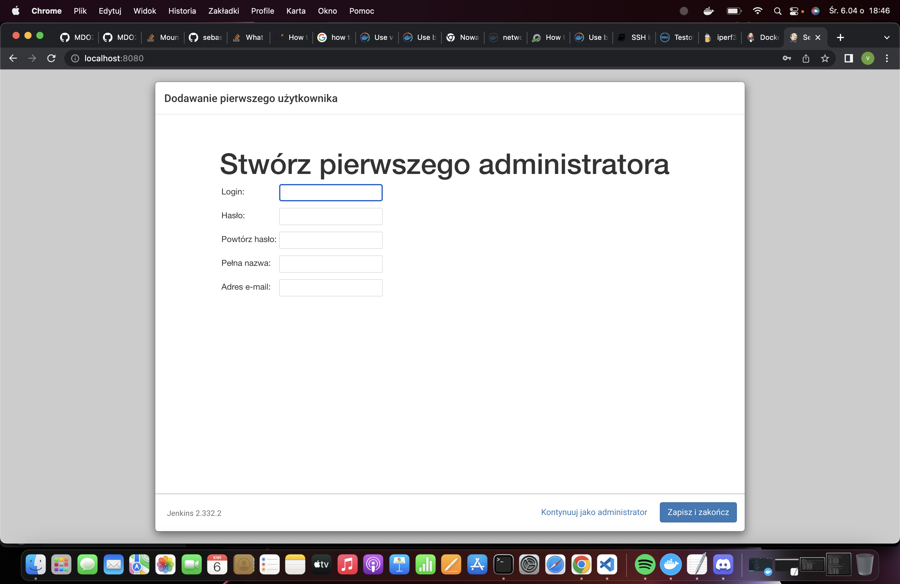

I zrzut ekranu ze strony głownej jenkinsa:

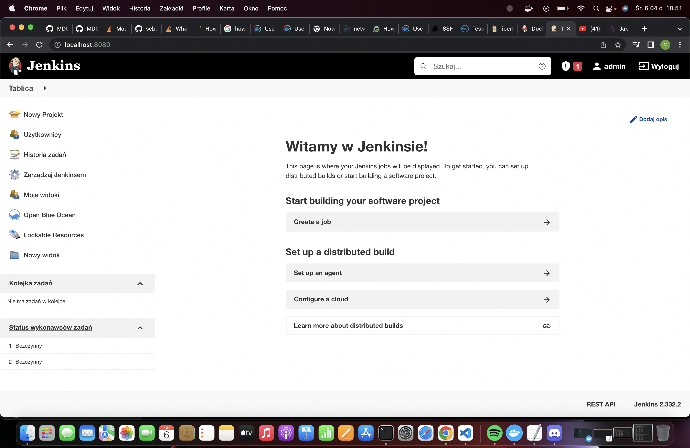

Na koniec zrzut ekranu z uruchomionych kontenerów:

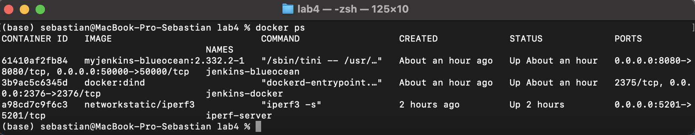