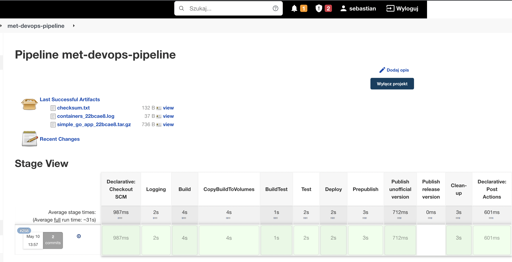
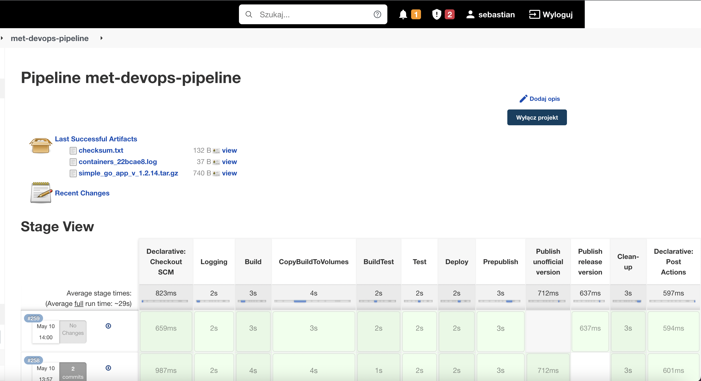
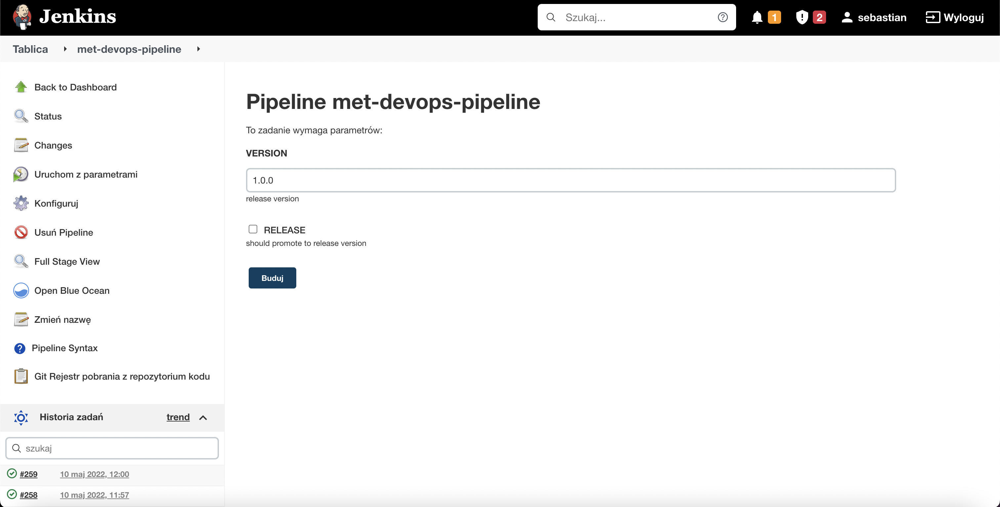

# Sprawozdanie Jenkins pipeline

## **Wstęp:**

Przedstawiony pipeline służy do budowania, testowania, deployu oraz publishu prostej aplikacji napisanej w go. Wszystkie potrzebne pliki do pipelinu znajdują się w [repozytorium](https://github.com/sebastiankul-99/simple-golang-app-with-tests). Pipeline budowany jest z Jenkinsfile'a zawartego w powyższym repozytorium i składa się z 12 stagów:

1. Declarative: Checkout SCM
2. Logging 
3. Build
4. CopyBuildToVolumes
5. BuildTest
6. Test
7. Deploy
8. Prepublish
9. Publish unofficial version
10. Publish release version
11. Clean-up
12. Declarative: Post Actions

Pipeline nie zawiera stagu dependencies ponieważ takich nie zawiera (jest nim tylko obraz golang). Jako główny agent pipelinu został wybrany agent any.

 

## **Wykonane kroki wraz z wytłumaczeniem podjętych decyzji:**

 

### **Stage 1. Declarative: Checkout SCM:**

W tym stagu deklarowane są dwie zmienne VERSION - czyli numer wersji oficialnego releasu, oraz RELEASE zmienna typu boolean która promuje publish do wersji oficialnej. Poniżej część Jenkinsfile'a odnosząca się do tego stagu (o ile to można nazwać stagem):

    parameters{
        string(name: 'VERSION', defaultValue: '1.0.0', description: 'release version')
        booleanParam(name: 'RELEASE', defaultValue: false, description: 'should promote to release version')
    }

 

### **Stage 2. Logging:**

Związku z tym, że kontenery tworzonę są przy użyciu agent Docker to uruchamiane są z flagą --rm, która usuwa je po zakończeniu działania kontenera. Dlatego też wystąpił problem z wyciągnięciem z nich logów przy użyciu polecania docker logs. W tym celu powstał właśnie ten stage. Problem został rozwiązany przy użyciu Fluentd. W tym stagu uruchamiany jest kontener fluentd  do którego dołączane są 3 woluminy:

* /var/lib/docker/containers - jest to folder w którym przetrzymywane są informacje na temat kontenerów. Fluentd właśnie z tego woluminu będzie zbierał logi. 

* \`pwd\`/fluent.conf:/fluentd/etc/fluent.conf - \`pwd\`/fluent.conf to ścieżka do pliku konfiguracjnego który podmienia plik konfiguracyjny z kontenera ze ścieżki /fluentd/etc/fluent.conf

* \`pwd\`/logs:/output - \`pwd\`/logs  jest to folder w którym fluentd będzię zapisywał przetworzone  logi. 

Ponadto w tym stagu przed uruchomianiem fluentd tworzone są potrzebne foldery do przetrzymywania logów, ponieważ gdyby nie zostały one stworzone a system je sam stworzył (na potrzebę kontenerów) to ich ownerem stałby się admin, co uniemożliwiłoby poźniejsze ich usunięcię jako user Jenkins. Dodatkowo uruchamiany jest kontener redisa, a potem zatrzymywany aby wygenerować logi gdyż tworzone w pipelinie kontenery nie generują żadnych. W tym stagu zapisywany jest również początek ID commitu który to później jest wykorzytywany jako wersja w nieoficialnym publishu. Poniżej przedstawiony jest fragment Jenkinsfile'a odnoszący się do tego stagu:

    stage('Logging') {
        
            steps {
            sh 'mkdir -p logs'
            sh 'cd logs && mkdir -p test.log'
            sh 'cd logs and touch test.log.zz_first'
            sh 'echo "these are logs collected by fluentd " >logs/test.log.first'
            sh 'docker run -d  --rm --name fluentd --user root -v /var/lib/docker/containers:/fluentd/log/containers -v `pwd`/fluent.conf:/fluentd/etc/fluent.conf -v `pwd`/logs:/output --log-driver local fluent/fluentd:v1.14.6-debian-1.0'
            sh 'docker run --rm -d --name red redis '
            
            script {    
                env.GIT_COMMIT_REV = sh(returnStdout: true, script: "git log -n 1 --pretty=format:'%h'").trim()
            }
            sh 'docker stop red'
            
            }
            
    }

Poniżej przedstawiam plik konfiguracyjny Fluentd (fluentd.conf):

    <source>
    @type tail
    format json
    read_from_head true
    tag docker.logs
    path /fluentd/log/containers/*/*-json.log
    pos_file /tmp/containers-logs.pos
    </source>

    <match docker.logs>
    @type file
    path /output/test.log
    </match>

 

### **Stage 3. Build:**

Jest to stage w którym buildowany jest obraz do buildu z dockerfile o nazwie Dockerfile-build. Poniżej przedstawiony jest fragment Jenkinsfile'a odnoszący się do tego stagu:

    stage('Build') {
        steps {
                
            sh "docker build --file Dockerfile-build --tag docker_app_build_image:latest ."
            sh "docker images "
        }     
    }

Poniżej przedstawiony jest użyty dockerfile:

    FROM golang:1.16-alpine
    USER root 
    WORKDIR "/app"
    RUN apk add git 
    RUN git clone https://github.com/sebastiankul-99/simple-golang-app-with-tests.git
    WORKDIR "/app/simple-golang-app-with-tests"
    RUN go mod download
    RUN go build 

 

### **Stage 4. CopyBuildToVolumes:**

Jest to stage w którym to usuwane są najpierw zawartości wolumenów z poprzednich buildów a następnie kopiowane są odpowiednie pliki na wolumeny wejściowe i wyjściowe. Kontener w tym stagu uruchamiany jest przy użyciu agent Docker. Poniżej przedstawiony jest fragment Jenkinsfile'a odnoszący się do tego stagu:'

    stage('CopyBuildToVolumes') {
        agent {
            docker {
                image'docker_app_build_image:latest'
                args '-v in-vol:/build  -v out-vol:/output  --user root'
                reuseNode true
                }
            }
        steps {
            sh 'rm -rf /build/*'
            sh 'rm -rf /output/*'
            sh 'cp -r /app/simple-golang-app-with-tests/*  /build/'
            sh 'rm /build/simple-golang-app-with-tests' 
            sh 'cp -r  /app/simple-golang-app-with-tests/*.go /output/'   
            sh 'cp -r  /app/simple-golang-app-with-tests/go.* /output/' 
            sh 'cp -r  /app/simple-golang-app-with-tests/simple-golang-app-with-tests /output/' 
        }
    }

 

### **Stage 5. BuildTest:**

Jest to stage w którym buildowany jest obraz do testowania z dockerfile'a o nazwie Dockerfile-test. Poniżej przedstawiony jest fragment Jenkinsfile'a odnoszący się do tego stagu:

    stage('BuildTest') {
    
        steps {
            sh "docker build --file Dockerfile-test --tag docker_app_build_test:latest ."
            sh "docker images "
        }
    }

Poniżej zostal przedstawiony użyty dockerfile:

    FROM docker_app_build_image:latest
    RUN go test

 

### **Stage 6. Test:**

Jest to stage w którym odpalane są testy na woluminie wyjściowym. Kontener został uruchomiony przy użyciu agent Docker. Poniżej przedstawiony jest fragment Jenkinsfile'a odnoszący się do tego stagu:

    stage('Test') {
        agent {
        docker {
            image'docker_app_build_test:latest'
            args '-v in-vol:/build  -v out-vol:/output  --user root'
            reuseNode true
            }
        }
        steps {
            sh 'cd /output && go test ' 
    
        }
    }

 

### **Stage 7. Deploy:**

Jest to stage w którym aplikacja uruchamiana jest na woluminie wyjściowym (aplikacja uruchamia się, wykonuje swoje zadanie po czym zakańcza swoje działanie). Kontener został uruchomiony przy użyciu agent Docker. Poniżej przedstawiony jest fragment Jenkinsfile'a odnoszący się do tego stagu:

    stage('Deploy') {
        agent {
        docker {
            image'docker_app_build_test:latest'
            args '-v in-vol:/build  -v out-vol:/output  --user root'
            reuseNode true
            }
        }
        steps {
            sh 'ls /output'
            sh 'cd /output && ./simple-golang-app-with-tests ' 
        }
    }

 

### **Stage 8. Prepublish:**

Związku z tym, że w pipelinie występują dwa stage publish (jeden publikujący nieoficialną wersje, drugi publikujący oficialną), powstał ten stage w którym przygotowywane są pliku do publikacji. Najpierw prewencyjnie usuwane są pliki z poprzednich buildów, a następnie wszystkie potrzebne pliki wraz z instrukcją uruchomienia, kopiowane są do folderu który będzię w następnych stage'ach kompresowany i publikowany. Uruchamianie kontenera odbywa się przy pomocy agent docker, poniżej przedstawiony jest fragment Jenkinsfile'a odnoszący się do tego stagu:

    stage('Prepublish') {
        agent {
        docker {
            image'docker_app_build_test:latest'
            args '-v in-vol:/build  -v out-vol:/output  --user root'
            reuseNode true
            }
        }
        steps {
            sh 'rm -rf publish_app'
            sh 'rm -rf checksum.txt'
            sh 'mkdir  publish_app'
            sh 'rm -f simple_go_app*.tar.gz'
            sh 'cp /output/*.go ./publish_app/' 
            sh 'cp /output/go.* ./publish_app/'
            sh 'cp ./Instruction.md ./publish_app'     
        }
    }

 

### **Stage 9. Publish unofficial version:**

W stagu tym publikowana jest nieoficialna wersja aplikacji, dzieje się to wtedy gdy podczas uruchamiania pipeline'a nie zostanie zaznaczona opcja RELEASE która odpowiada za wypuszczenie oficialnej wersji. W stage'u tym najpierw kompresowany jest folder przygotowany w poprzednim stage'u do formatu tar.gz w którego nazwie znajduję się początek id aktualnego commitu, a następnie obliczana jest suma kontrolna skompresowanego folderu i zapisywana jest do pliku checksum.txt. Na koniec tworzone są artefakty ze skompresowanego folderu oraz pliku zawierającego sumę kontrolną, poniżej przedstawiony jest fragment Jenkinsfile'a odnoszący się do tego stagu:

    stage('Publish unofficial version') {
        when{
            environment name: 'RELEASE', value: 'false'
        }
        steps {

            sh 'tar -zcvf simple_go_app_${GIT_COMMIT_REV}.tar.gz ./publish_app'
            sh 'cat simple_go_app_${GIT_COMMIT_REV}.tar.gz | sha512sum > checksum.txt'
            archiveArtifacts artifacts: 'simple_go_app*.tar.gz', fingerprint: true   
            archiveArtifacts artifacts: 'checksum.txt', fingerprint: true      
        }
    }

 

### **Stage 10. Publish release version:**

W stagu tym publikowana jest oficialna wersja aplikacji, dzieje się to wtedy gdy podczas uruchamiania pipeline'a  zostanie zaznaczona opcja RELEASE która odpowiada za wypuszczenie oficialnej wersji. W stage'u tym najpierw kompresowany jest folder przygotowany w poprzednim stage'u do formatu tar.gz w którego nazwie znajduję się wersja aplikacji podana podczas uruchamiania pipeline'u, a następnie obliczana jest suma kontrolna skompresowanego folderu i zapisywana jest do pliku checksum.txt. Na koniec tworzone są artefakty ze skompresowanego folderu oraz pliku zawierającego sumę kontrolną, poniżej przedstawiony jest fragment Jenkinsfile'a odnoszący się do tego stagu:

    stage('Publish release version') {
        when{
            environment name: 'RELEASE', value: 'true'
            }
        steps {

            sh 'tar -zcvf simple_go_app_v_${VERSION}.tar.gz ./publish_app'
            sh 'cat simple_go_app_${VERSION}.tar.gz | sha512sum > checksum.txt'
            archiveArtifacts artifacts: 'simple_go_app*.tar.gz', fingerprint: true   
            archiveArtifacts artifacts: 'checksum.txt', fingerprint: true 
        }
    }

 

### **Stage 11. Clean-up:**

W stagu tym najpierw zatrzymywany (oraz usuwany bo flaga --rm) jest kontener z fluentd a następnie eksportowane są przetworzone przez fluentd logi do pliku containers_commit_id.log (commit_id to początek id commitu). Następnie usuwany jest folder z przetworzonymi przez fluentd logami i na koniec tworzony jest artefakt z pliku w którym zebrano logi (czyli containers_commit_id.log). Poniżej przedstawiony jest fragment Jenkinsfile'a odnoszący się do tego stagu:

    stage('Clean-up') {
        steps {
            sh 'docker stop fluentd'
            script {
                docker.image('docker_app_build_test').withRun('--user root') { c->
                sh 'rm -rf containers*.log'
                sh 'cat logs/test.log.* > containers_${GIT_COMMIT_REV}.log'
                sh 'rm -rf logs'
                }
            }    
            archiveArtifacts artifacts: ' containers*.log', fingerprint: true        
        }
    }

 

### **Stage 12: Declarative: Post Actions:**

Jest to stage (o ile można go tak nazwać) który wykonuje się po zakończeniu wszystkich stage'y. W stage'u tym za każdym razem usuwane są obrazu buildowe i testowe aplikacji, oraz w razie niepowodzenia w którymś ze stage'u, zatrzymywany jest kontener fluentd aby nie był uruchomiony w docker dind, ponieważ byłby uruchomiony bez powodu i wrazie ponownego uruchomienia   pipeline'u to wysypałby się on na stage'u Logging ponieważ nie mógłby on uruchomić kontenera fluentd o tej nazwie bo taki by juź istniał. Poniżej przedstawiony jest fragment Jenkinsfile'a odnoszący się do tego stagu:

    post{
        failure{
          
                sh 'docker stop fluentd'
            
        }
        always{
           
                sh 'docker rmi docker_app_build_test'   
                sh 'docker rmi docker_app_build_image'
            
        }
    }

 

## **Potwierdzenie poprawności budowny pipeline'u:**

Poniżej zrzut ekranu z poprawnej budowy pipeline'u (dla wersji nieoficialnej):

Poniżej zrzut ekranu z poprawnej budowy pipeline'u (dla wersji oficialnej):

Poniżej zrzut ekranu z uruchamiania pipeline'u z parametrami:

 

## **Jak utworzyć pipeline:**

W celu utworzenia pipeline'u jako źródło należy wybrać githuba i podać tą ścieżkę jako rezpozytorium: https://github.com/sebastiankul-99/simple-golang-app-with-tests.git następnie jako gałąź wybrać main i jako script file wpisać Jenkinsfile (aby to zrobić najpierw trzeba wybrać opcje Pipeline script from SCM). To wszystko co trzeba zrobić aby odtworzyć ten pipeline :).

 

##  **Napotkane problemy podczas tworzenia pipeline'u:**

1. Problem z wydobyciem logów ponieważ agent docker uruchamia kontenery z flagą --rm. Rozwiązanie to kontener fluentd.
2. Problem z doklejaniem przez agent docker scieżki do workspace. Rozwiązanie to korzystanie z bezpośrednich ścieżek.
3. Inne foldery worskpace przy rożnych agentach. Rozwiazanie albo można jako defaultowego agenta ustawić none albo w opcjach pozostałych agentów ustawić opcje reuseNode na true. 
4. Brak obsługi trybu interaktywnego w kontenerze przez agent any. Rozwiązanie to agent docker.

 

## **Diagramy:**

Diagramy zostały stworzone w lucidchart i wyeksportowane do formatu visio, dlatego diagramy w formacie visio trochę się rozjeżdżają (zwłaszcza diagram wdrożeń), więc proponuje korzystać z diagramów w formacie png.