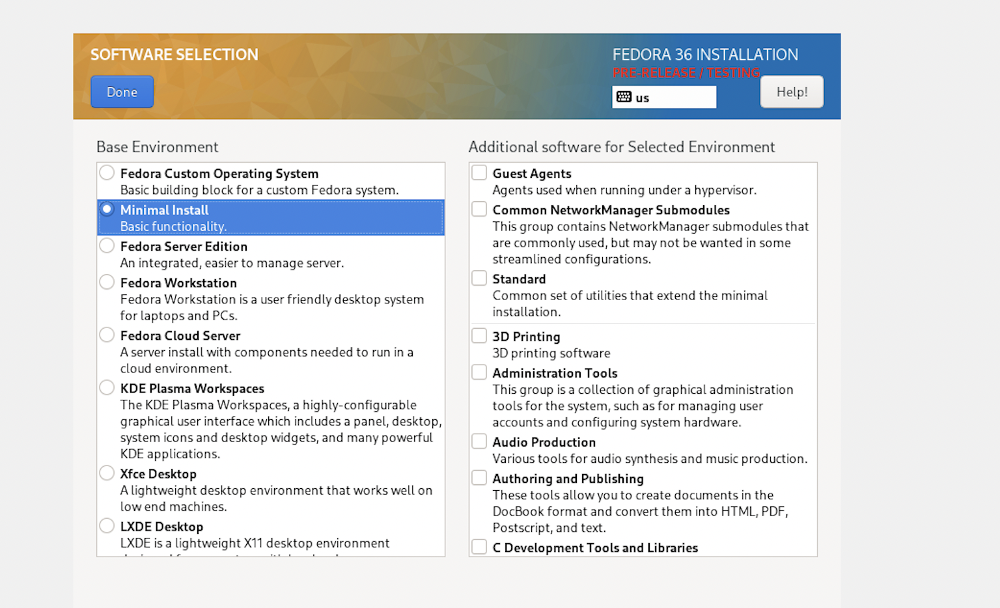
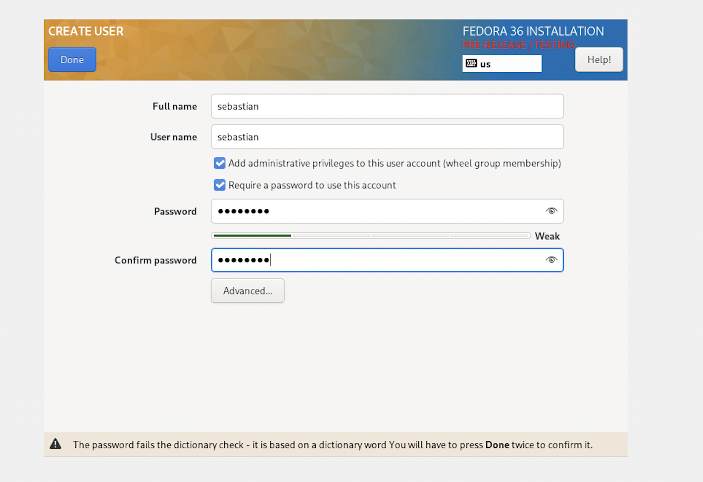
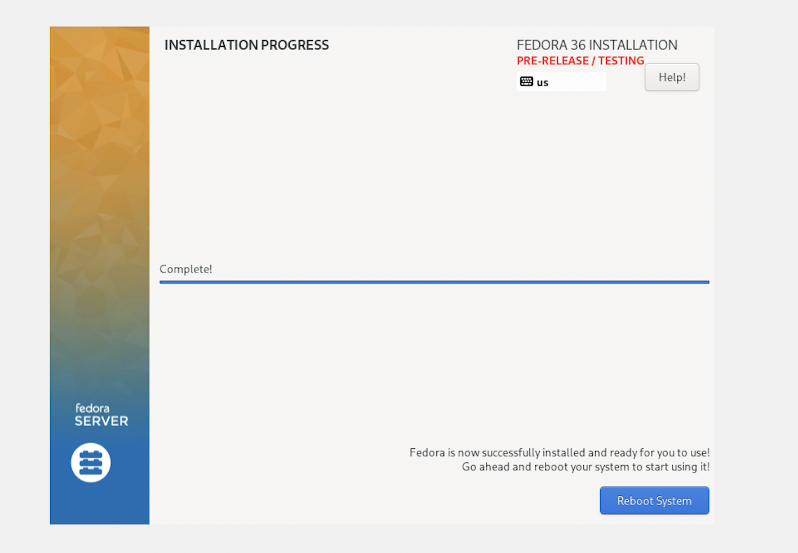
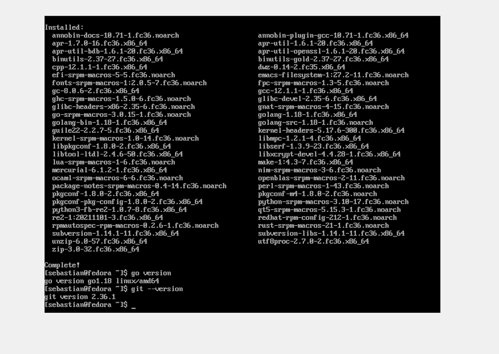
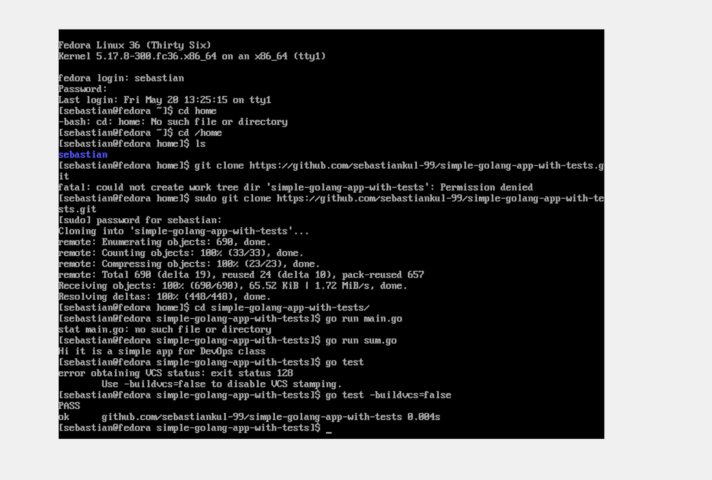
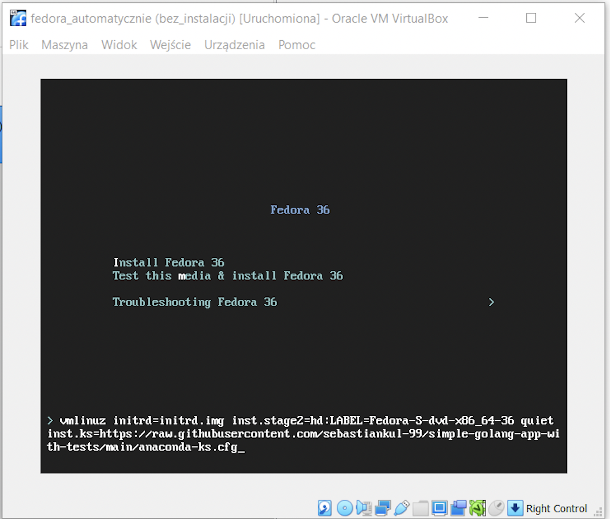
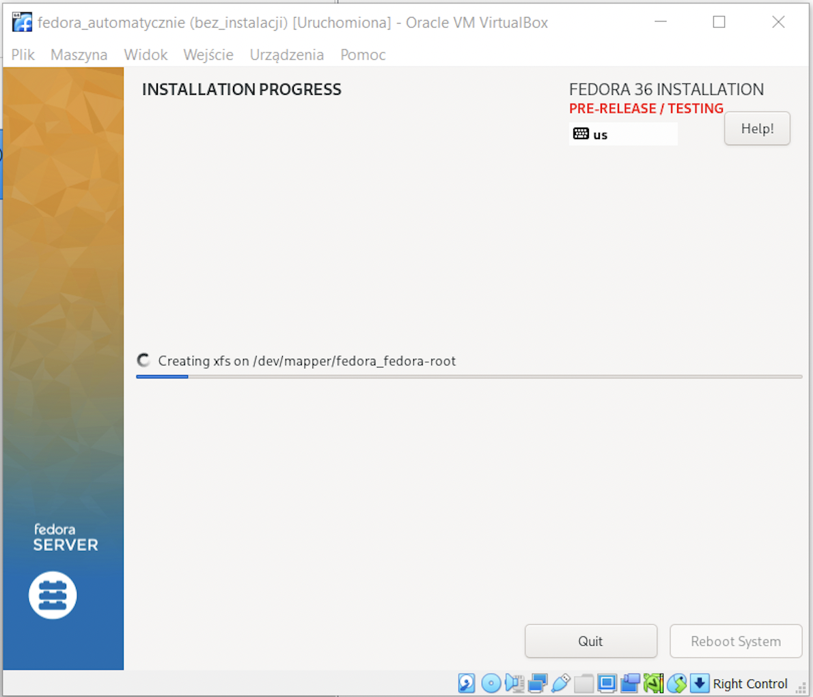
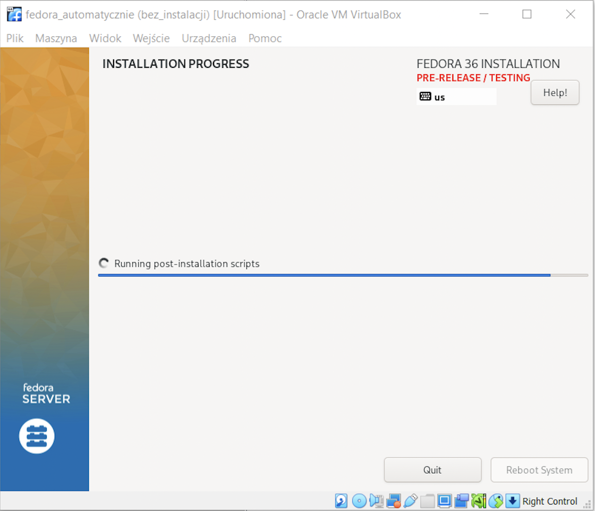
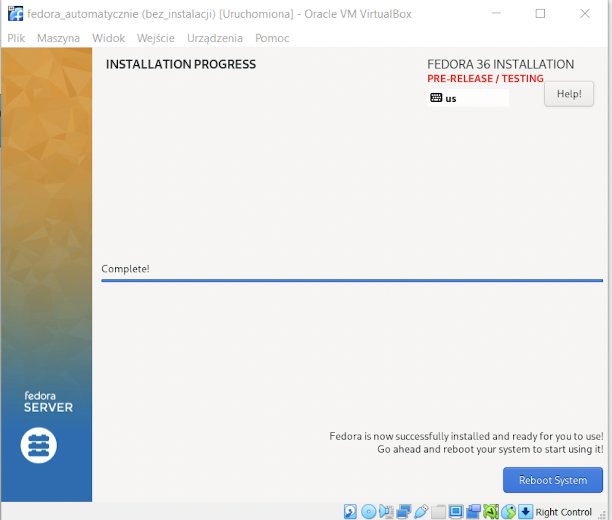
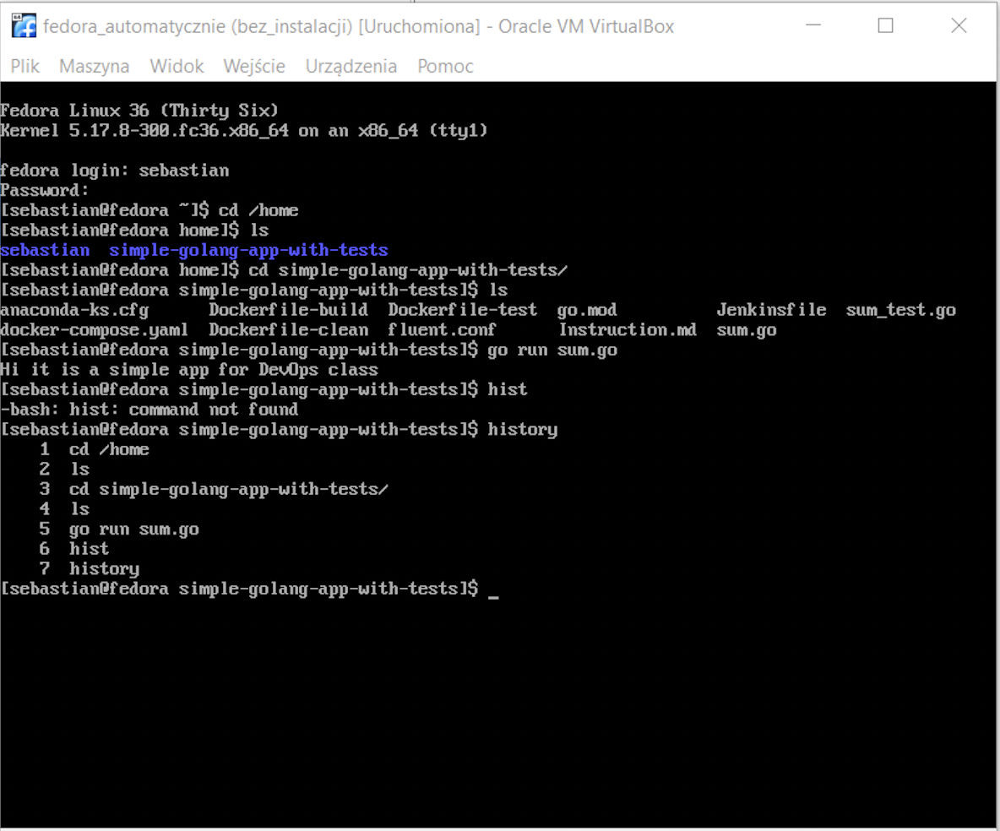

# Sprawozdanie z laboratorium 9 

## Wstęp 

To laboratorium wyjątkowo było wykonywane na windowsie ponieważ virtualbox czy też hyper-v nie działają na macbookach z M1, dlatego też ta cześć nie była łączona z Jenkinsem, ponieważ jest wykonywana na innym laptopie. Z powodu, że artefaktem z poprzedniego laboratorium jest skompresowany folder z plikami *.go i go.mod dlatego też zamiast pobierać artefakt stworzony przez Jenkinsa to pobierane jest całe repo gdyż pliki które znajdują się w artefakcie też znajdują się w repozytorium.   

## Instalacja ręczna 

Podczas instalacji ręcznej wybrano minimalny pakiet systemu, do tego stworzono użytkownika sebastian oraz uaktywniono konto root. Poniżej przedstawiono kilka zrzutów ekranu z procesu instalacji:

Następnie po zainstalowaniu systemu przystąpiono do instalacji gita i golang, nastepującymi poleceniami:

    sudo dnf -y update
    sudo dnf -y install git
    sudo dnf -y install go

Po zainstalowaniu gita i go, w folderze home sklonowano repozytorium poleceniem:

    git clone https://github.com/sebastiankul-99/simple-golang-app-with-tests.git 

Następnie w folderze uruchomiono aplikacje poleceniem:

    go run sum.go -buildvcs=false

i również ją przetestowano, poleceniem:

    go test

Poniżej zrzut ekranu z efektów uruchomienia:

## Instalacja automatyczna

Do instalacji posłużono się plikiem .cfg kick startera anacondy który znajduje się w folderze /root. Podczas uruchamiania maszyny w momencie kiedy jest zapytanie o instalacje sytemu należy nacisnąć tab aby wejść w dodatkowe "opcje" instalacji i dopisać na końcu (po quiet) następującą ścieżke inst.ks=link_do_anaconda-ks.cfg. W moim przypadku był to link do [raw.githubusercontent](https://github.com/sebastiankul-99/simple-golang-app-with-tests/blob/main/anaconda-ks.cfg) do pliku anaconda-ks.cfg. Poniżej zrzut ekranu z potwierdzeniem:

Do pliku anaconda-ks.cfg który został wygenerowany podczas  ręcznej instalacji fedory dopisano jeszcze skrypt który wykonuje się po instalacji systemu. Skrypt ten instaluje gita, golang a następnie pobiera repozytorium po czym uruchamia aplikacje. Poniżej fragment pliku anaconda-ks.cfg dotyczącu skryptu post:

    %post

        exec < /dev/tty3 > /dev/tty3
        sudo dnf -y update
        sudo dnf -y install git
        sudo dnf -y install go
        cd /home
        git clone https://github.com/sebastiankul-99/simple-golang-app-with-tests.git
        cd simple-golang-app-with-tests 
        go run sum.go
	

    %end

Poniżej zamieszczam całość pliku anaconda-ks.cfg:

    # Generated by Anaconda 36.16.2
    # Generated by pykickstart v3.36
    #version=F36
    # Use graphical install
    graphical

    # Keyboard layouts
    keyboard --vckeymap=us --xlayouts='us','pl (legacy)'
    # System language
    lang en_US.UTF-8

    %packages
    @^minimal-environment

    %end

    # Run the Setup Agent on first boot
    firstboot --enable

    # Generated using Blivet version 3.4.3
    ignoredisk --only-use=sda
    autopart
    # Partition clearing information
    clearpart --none --initlabel

    # System timezone
    timezone Europe/Warsaw --utc

    # Root password
    rootpw --iscrypted $y$j9T$BUsrTw17nw.YMTCzi5OMdozM$EBXnH5wRUfsfT6NwktAceJziTiK.kFcEJmBCljyuUND
    user --groups=wheel --name=sebastian --password=$y$j9T$b5kKHWlHfb9W4wFr.yh3XTNw$srt0VAVMRsQ8.fZQxdBKZG.sYUkzETJXKIuLE3YOeu/ --iscrypted --gecos="sebastian"

    # Repo
    url --mirrorlist=http://mirrors.fedoraproject.org/mirrorlist?repo=fedora-$releasever&arch=x86_64
    repo --name=updates --mirrorlist=http://mirrors.fedoraproject.org/mirrorlist?repo=updates-released-f$releasever&arch=x86_64

    %post

        # Change to a vt to see progress

        exec < /dev/tty3 > /dev/tty3
        sudo dnf -y update
        sudo dnf -y install git
        sudo dnf -y install go
        cd /home
        git clone https://github.com/sebastiankul-99/simple-golang-app-with-tests.git
        cd simple-golang-app-with-tests 
        go run sum.go
        

    %end

Poniżej zamieszczono zrzuty ekranu z procesu automatycznej instacji:

Na koniec zrzuty ekranu potwierdzający poprawność instalacji i uruchomienie aplikacji:

