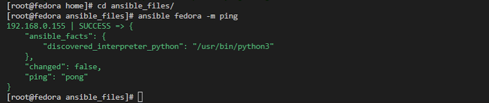
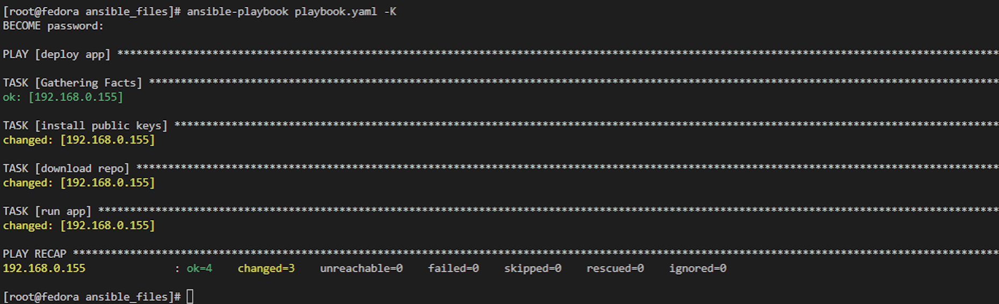
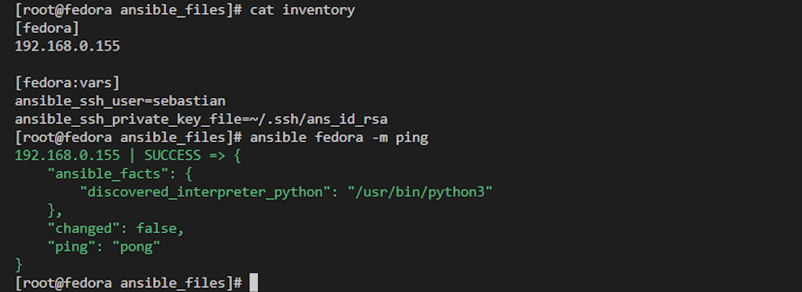
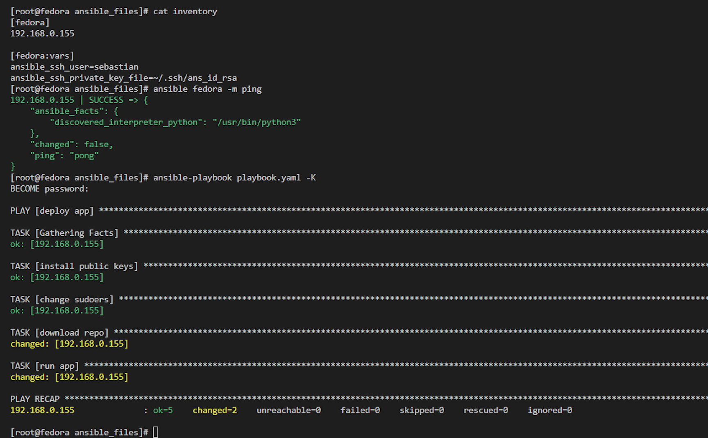

# Sprawozdanie z laboratorium nr. 10 Ansible

## Wstęp 

Podobnie jak poprzednie laboratorium i to zostało wykonane na innym laptopie z Windowsem ponieważ na M1 nie działa VirtualBox, czy też Hyper-V. Dlatego też artefakty z Jenkinsa zostały umieszczone na tymczasowym repozytorium na githubie z którego są pobierane podczas tego laboratorium. Ponadto posłużono sie maszynami z poprzedniego laboratorium więc nie istniała potrzeba instalacji niezbędnych pakietów (np. Go czy git), ponieważ zostały już one zainstalowane podczas poprzedniego laboratorium.

## Ansible bez klucza shh

Na samym początku stworzono plik konfiguracyjny ansible.cfg o następującej zawartości:

    [defaults]
    inventory=inventory
    host_key_checking=False

Po czym utworzono plik inventory w którym to umieszczono informacje na temat docelowych hostów (IP, username i hasło). Treść pliku była następująca:

    [fedora]
    192.168.0.155

    [fedora:vars]
    ansible_ssh_user=sebastian
    ansible_ssh_pass=haslo123

Następnie wykonano ping dla hosta fedora, poniższą komendą:

    ansible fedora -m ping

Poniżej zrzut ekranu z wyniku komendy z konsoli (VS Code):

Następnie przystąpiono do tworzenia playbook'a o nazwię playbook.yaml, a jego zawartość jest następująca (playbook ten zawiera już wszystkie kroki, również te potrzebne do połączenia się za pomocą klucza ssh):

    ---

    - name: deploy app
    hosts: fedora
    become: yes
    tasks:
        - name: install public keys
        ansible.posix.authorized_key:
            user: sebastian
            state: present
            key: "{{  lookup('file', '~/.ssh/ans_id_rsa.pub') }}"
        - name: change sudoers
        ansible.builtin.lineinfile:
            path: /etc/sudoers
            state: present
            regexp: '^%sudo'
            line: '%sudo ALL=(ALL) NOPASSWD: ALL'
            validate: /usr/sbin/visudo -cf %s
        - name: download repo
        shell:
            cmd: rm -rf temporary && git clone https://github.com/sebastiankul-99/temporary.git && cd temporary && tar -xvf simple_go_app*.tar.gz
            chdir: /home
        - name: run app
        shell:
            cmd: go run sum.go
            chdir: /home/temporary/publish_app

W playbook'u w tym momencie ważne są dwa ostatnie kroki, ponieważ pierwsze 2 związane są z połączeniem się przy pomocy klucza. W przedostatnim zadaniu o nazwie download repo, najpierw usuwany jest folder z repozytorium jeżeli taki instnieje następnie klonowane jest repozytorium z githuba, a na koniec rozpakowywany jest folder z artefaktami. W ostatnim kroku uruchamiana jest aplikacja. Poniżej zamieszczono zrzut ekranu (zawiera on już pierwszy i drugi task):

## Ansible z kluczem shh:

Względem wariantu bez klucza ssh zmienił się lekko plik inventory i wygląda następująco:

    [fedora]
    192.168.0.155

    [fedora:vars]
    ansible_ssh_user=sebastian
    ansible_ssh_private_key_file=~/.ssh/ans_id_rsa

Linijka z ansible_ssh_pass została zastąpiona linijką ze scieżką do klucza prywatnego (który został wygenerowany przy pomocy ssh-keygen). W playbook'u który został już przedstawiony dodano 2 taski, pierwszy z nich o nazwie install public keys, kopiuje public key na docelową maszynę hosta. W kroku tym wykorzystano narzędzie lookup, które sluży do znajdowania plików. Następnie w drugim tasku o nazwie change sudoers usuwana jest potrzeba używania sudo ponieważ przy połączeniu z użyciem klucza, nie dysponuje się hasłem. Poniżej przedstawiono zrzut ekranu z polecenia ping:

Poniżej zrzut ekranu z wykonania playbook'a przy pomocy klucza:

