# Sprawozdanie z laboratorium nr. 11 oraz 12 - Kubernetes

## Wstęp:

W folderze Lab11 przedstawiono zrzuty ekranu dotyczące tamtej części natomiast tutaj znajdzie się sprawozdanie z obydwu laboratoriów. Deployowana aplikacja składa się z 3 komponentów:

 * serwera (backend) - napisanego w go
 * frontendu - napisanego w react'cie
 * bazy danych - mysql

 Podstawowe pliki .yaml które następnie były modyfikowane zostały stworzone przy użyciu narzędzia kompose, który to konwertuje docker-compose.yaml do plików .yaml kubernetesa. Aplikacja będzie składać się z 3 deploymentów i serwisów oraz wolumena dla bazy danych. Deploymenty i serwisy to backend, frontend oraz baza danych. Natomiast tylko backend bedzie poddawany modyfikacją (tzn. zmiana ilosci replik, obrazu czy też strategi wdrożeń). Stworzone pliki .yaml są następujące:

 backend-deployment.yaml:

 ```
apiVersion: apps/v1
kind: Deployment
metadata:
  namespace: todoapp-namespace
  annotations:
    kompose.cmd: kompose convert
    kompose.version: 1.26.1 (HEAD)
  creationTimestamp: null
  labels:
    io.kompose.service: backend
  name: backend
spec:
  replicas: 1
  selector:
    matchLabels:
      io.kompose.service: backend
  strategy: {}
  template:
    metadata:
      annotations:
        kompose.cmd: kompose convert
        kompose.version: 1.26.1 (HEAD)
      creationTimestamp: null
      labels:
        io.kompose.service: backend
    spec:
      containers:
        - env:
            - name: network_mode
              value: host
          image: sebastian99kul/backendtodoapp:1.0.1
          name: backend-go-todoapp
          ports:
            - containerPort: 8000
          resources: {}
      restartPolicy: Always
status: {}

 ```
 backend-service.yaml

 ```
 apiVersion: v1
kind: Service
metadata:
  namespace: todoapp-namespace
  annotations:
    kompose.cmd: kompose convert
    kompose.version: 1.26.1 (HEAD)
  creationTimestamp: null
  labels:
    io.kompose.service: backend
  name: backend
spec:
  ports:
    - name: "8000"
      port: 8000
      targetPort: 8000
  selector:
    io.kompose.service: backend
status:
  loadBalancer: {}

 ```

 frontend-deployment.yaml

 ```
apiVersion: apps/v1
kind: Deployment
metadata:
  namespace: todoapp-namespace
  annotations:
    kompose.cmd: kompose convert
    kompose.version: 1.26.1 (HEAD)
  creationTimestamp: null
  labels:
    io.kompose.service: frontend
  name: frontend
spec:
  replicas: 1
  selector:
    matchLabels:
      io.kompose.service: frontend
  strategy: {}
  template:
    metadata:
      annotations:
        kompose.cmd: kompose convert
        kompose.version: 1.26.1 (HEAD)
      creationTimestamp: null
      labels:
        io.kompose.service: frontend
    spec:
      containers:
        - env:
            - name: network_mode
              value: host
          image: sebastian99kul/frontendreacttodoapp:1.0.1
          name: frontend-react-todoapp
          ports:
            - containerPort: 80
          resources: {}
      restartPolicy: Always
status: {}
 ```
 frontend-service.yaml:

 ```
apiVersion: v1
kind: Service
metadata:
  namespace: todoapp-namespace
  annotations:
    kompose.cmd: kompose convert
    kompose.version: 1.26.1 (HEAD)
  creationTimestamp: null
  labels:
    io.kompose.service: frontend
  name: frontend
spec:
  ports:
    - name: "3001"
      port: 3001
      targetPort: 80
  selector:
    io.kompose.service: frontend
status:
  loadBalancer: {}
 ```

 mysql-db-todo-deployment.yaml

 ```
 apiVersion: apps/v1
kind: Deployment
metadata:
  namespace: todoapp-namespace
  annotations:
    kompose.cmd: kompose convert
    kompose.version: 1.26.1 (HEAD)
  creationTimestamp: null
  labels:
    io.kompose.service: mysql-db-todo
  name: mysql-db-todo
spec:
  replicas: 1
  selector:
    matchLabels:
      io.kompose.service: mysql-db-todo
  strategy:
    type: Recreate
  template:
    metadata:
      annotations:
        kompose.cmd: kompose convert
        kompose.version: 1.26.1 (HEAD)
      creationTimestamp: null
      labels:
        io.kompose.service: mysql-db-todo
    spec:
      containers:
        - env:
            - name: network_mode
              value: host
          image: sebastian99kul/mysqldbtodoapp:1.0.1
          name: mysql-container
          ports:
            - containerPort: 3306
          resources: {}
          volumeMounts:
            - mountPath: /var/lib/mysql
              name: mysql-db-todo-claim0
      restartPolicy: Always
      volumes:
        - name: mysql-db-todo-claim0
          persistentVolumeClaim:
            claimName: mysql-db-todo-claim0
status: {}

 ```
mysql-db-todo-service.yaml

```
apiVersion: v1
kind: Service
metadata:
  namespace: todoapp-namespace
  annotations:
    kompose.cmd: kompose convert
    kompose.version: 1.26.1 (HEAD)
  creationTimestamp: null
  labels:
    io.kompose.service: mysql-db-todo
  name: mysql-db-todo
spec:
  ports:
    - name: "3307"
      port: 3307
      targetPort: 3306
  selector:
    io.kompose.service: mysql-db-todo
status:
  loadBalancer: {}

```
mysql-db-todo-claim0-persistentvolumeclaim.yaml czyli plik dla wolumena bazy danej

```
apiVersion: v1
kind: PersistentVolumeClaim
metadata:
  namespace: todoapp-namespace
  creationTimestamp: null
  labels:
    io.kompose.service: mysql-db-todo-claim0
  name: mysql-db-todo-claim0
spec:
  accessModes:
    - ReadWriteOnce
  resources:
    requests:
      storage: 100Mi
status: {}

```

Powyższa aplikacja deployowana jest na osobny namespace'sie o nazwie todoapp-namespace.

## Uruchomienie aplikacji oraz forward portu

Aplikacje zdeployowano następującym poleceniem:

```
kubectl apply -f backend-deployment.yaml,backend-service.yaml,frontend-deployment.yaml,frontend-service.yaml,mysql-db-todo-claim0-persistentvolumeclaim.yaml,mysql-db-todo-deployment.yaml,mysql-db-todo-service.yaml
```
Poniżej zrzuty ekranu potwierdzające prawidłowy deployment:

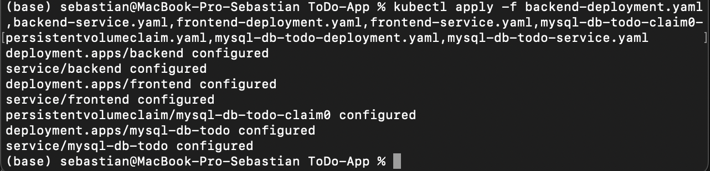


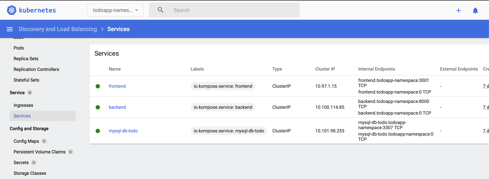

Następnie sforwardowano port service'u frontend tak aby można było się komunikować z aplikacją, poleceniem:

    kubectl port-forward -n todoapp-namespace service/frontend 3001:3001

Poniżej screeny potwierdzające udany forward:

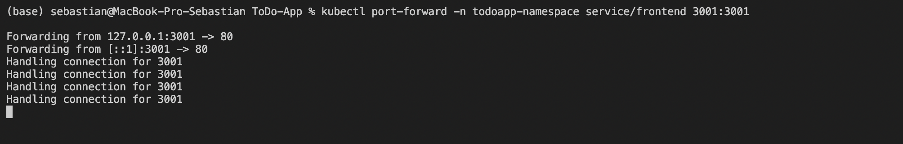

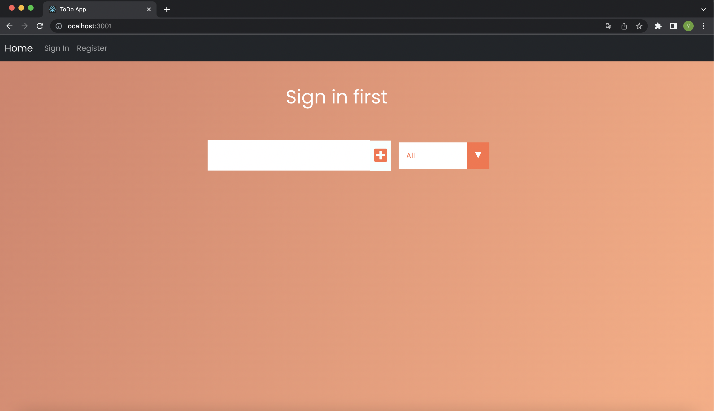

## Sprawdzenie poprawności rollout'u poprzez kubectl rollout status

Poprawność rollout'u dla wszystkich 3 deploymentów została sprawdzona poleceniami:

    kubectl rollout status -n todoapp-namespace deployment/backend
    kubectl rollout status -n todoapp-namespace deployment/frontend
    kubectl rollout status -n todoapp-namespace deployment/mysql-db-todoapp

Poniżej zrzut ekranu potwierdzający poprawność rollout'ów:

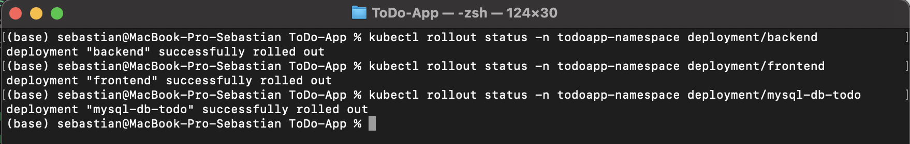

## Przygotowanie obrazów:

Obraz backendu został przygotowany w 2 wersjach:

* 1.0.1 - uruchamiajacy się poprawnie 
* 1.2.1 - kończący się błędem


## Zmiany w deployment'cie:

Zmiany ilości replik czy też obrazy odbywały się poprzez zmianę w pliku backend-deployment.yaml

### Zmiana w ilości replik backend'u do 4:

Poniżej przedstawiono zrzut ekranu z 4 replik:

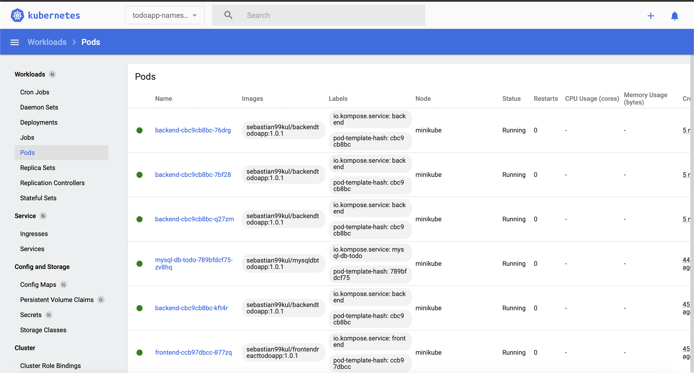

### Zmiana w ilości replik backend'u do 5:

Poniżej przedstawiono zrzut ekranu z 5 replik:

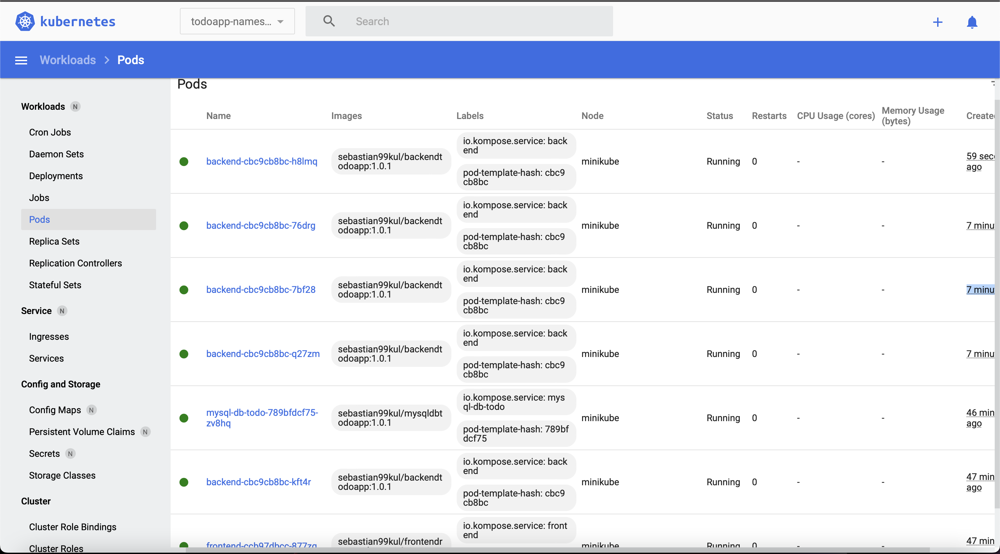

### Zmiana w ilości replik backend'u do 1:

Poniżej przedstawiono zrzut ekranu z 1 replik:

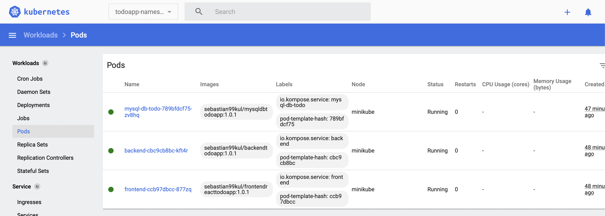

### Zmiana w ilości replik backend'u do 0:

Poniżej przedstawiono zrzut ekranu z 0 replik:

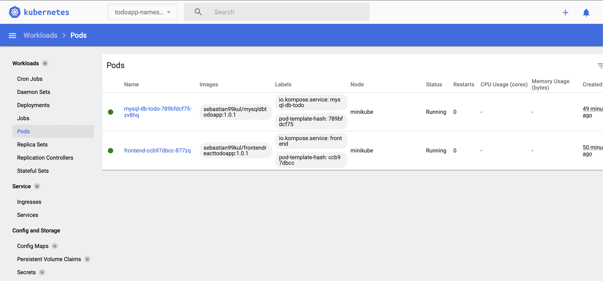

### Zmiana na 2 wersje obrazu backend'u (1 replika):

Poniżej przedstawiono zrzut ekranu ze zmienioną wersją obrazu:

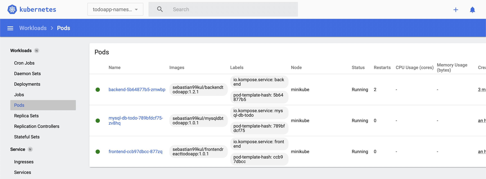

Jak można zauważyć konter został zresetowany już 2 krotnie ponieważ ta wersja obrazu zakańcza się błędem

### Przywracanie poprzedniej wersji przy pomocy rollout undo oraz history:

Wyświetlenie histori rollout poprzez polecenie:

    kubectl rollout history -n todoapp-namespace deployment/backend

poniżej zrzut ekranu z histori:

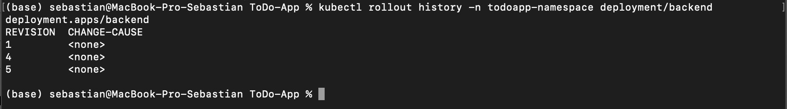

Przywrócenie poprzedniej wersji rollout'u przy pomocy polecenia:

    kubectl rollout undo -n todoapp-namespace deployment/backend

Poniżej zrzut ekranu potwierdzające poprawność wykonania komendy:

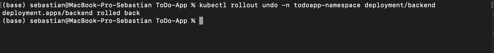

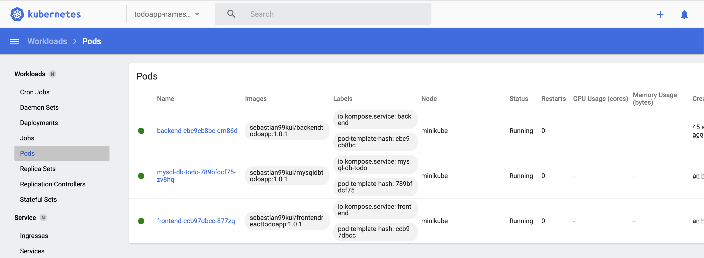

Jak można zauważyć wersja obrazu to 1.0.1 oraz ilość replik to 1 czyli tak jak poprzednia wersja deploymentu (ta przed wadliwym obrazem 1.2.1)


## Kontrola wdrożenia

Poniższy skrypt sprawdza czy podany deployment istnieje jeżeli tak to informuje kiedy deployment sie zakończy ponadto podaje informacje o całkowitej ilości replik i dostępnej ilości replik.
```
#!/bin/bash
set -o errexit
set -o pipefail
set -o nounset

deployment=

get_generation() {
  get_deployment_jsonpath '{.metadata.generation}'
}

get_observed_generation() {
  get_deployment_jsonpath '{.status.observedGeneration}'
}

get_replicas() {
  get_deployment_jsonpath '{.spec.replicas}'
}

get_available_replicas() {
  get_deployment_jsonpath '{.status.availableReplicas}'
}

get_deployment_jsonpath() {
  local readonly _jsonpath="$1"

  kubectl get deployment -n todoapp-namespace "${deployment}" -o "jsonpath=${_jsonpath}"
}

if [[ $# != 1 ]]; then
  echo "usage: $(basename $0) <deployment>" >&2
  exit 1
fi

readonly deployment="$1"

readonly generation=$(get_generation)
echo "waiting for specified generation ${generation} to be observed"
while [[ $(get_observed_generation) -lt ${generation} ]]; do
  sleep .5
done
echo "specified generation observed."

readonly replicas="$(get_replicas)"
echo "specified replicas: ${replicas}"

available=-1
while [[ ${available} -ne ${replicas} ]]; do
  sleep .5
  available=$(get_available_replicas)
  echo "available replicas: ${available}"
done

echo "deployment complete."
```
Poniżej zrzut ekranu potwierdzający działanie skryptu:

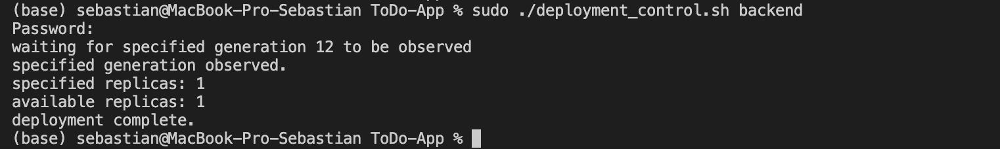

## Strategie wdrożeń:

Strategie zmieniano poprzez modyfikacje pliku backend-deploy.yaml i dopisanie odpowiedniego typu strategi. Wszystkie odbywają się na 4 replikach. (W każdym z plików .yaml były używane etykiety od początku)

### Strategia Recreate

Plik  backend-deploy.yaml zmieniono w następujący sposób:

```
strategy:
  type: Recreate
```

Poniżej zrzut ekranu z dashboardu:

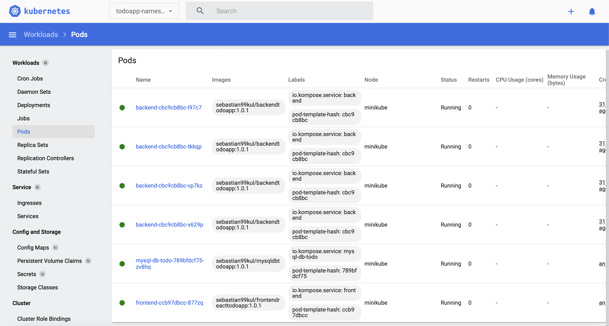

Strategia recreate kończy ("zabija") stary deployment i tworzy nowy. Zaletą tego typu wdrożenia jest to, że stan aplikacji jest od startu nowy lecz wadą jest to że jest downtime ze względu na to, że poprzedni deployment jest kończony i nowy jest stawiany od początku kiedy zakończy się stary. Jak można zauważyć na zrzucie ekranu czas życia podów to tylko kilkanascie sekund. 

### Strategia RollingUpdate

Plik  backend-deploy.yaml zmieniono w następujący sposób:

```
type: RollingUpdate
  rollingUpdate:
    maxSurge: 3
    maxUnavailable: 0
```

Poniżej zrzut ekranu z dashboardu:

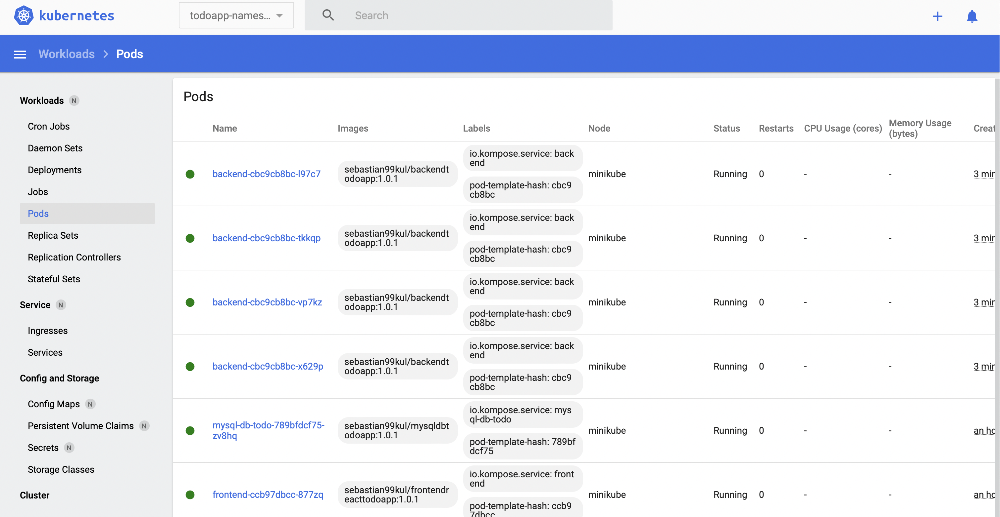

W strategii RollingUpdate tworzony jest dodatkowy ReplicaSet z nową wersją deploymentu następnie ReplicaSety ze stara wersję są powoli zmniejszane a a zwiększane są te ReplicaSety z nową wersją dopóki nie osiągną odpowiedniej liczby. Wadą takiego wdrożenia może być długi czas natomiast plusem jego jest to, że jest użyteczny dla aplikacji "stateful".

### Strategia Canary

Plik  backend-deploy.yaml (bazowy) zmieniono w następujący sposób poprzez dodanie wersji do deploymentu :

```
      labels:
        io.kompose.service: backend
        version: "3.0"
```

Poniżej zrzut ekranu z dashboardu:

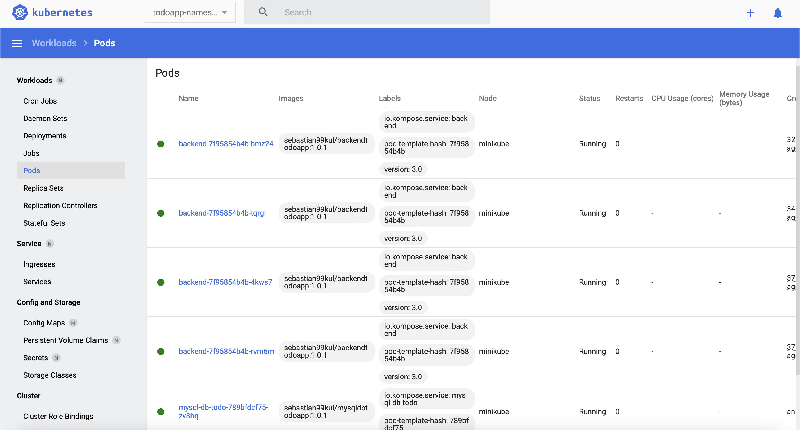

We wdrożeniu Canary tworzone są repliki z nową wersją (poczas gdy stare jescze są) następnie ruch przekierowywany jest z replik ze starą wersją na repliki z nową wersją a gdy możliwe jest już zakończenie działania po jakimiś czasie replik ze starą wersją to deployment ze starą wersją jest usuwany. Plusem takiego wdrożenia jest szybki rollback oraz możliwość wdrożenia wersji dla części użytkowników, natomiast jednym z minusów jest wolny rollout. 

