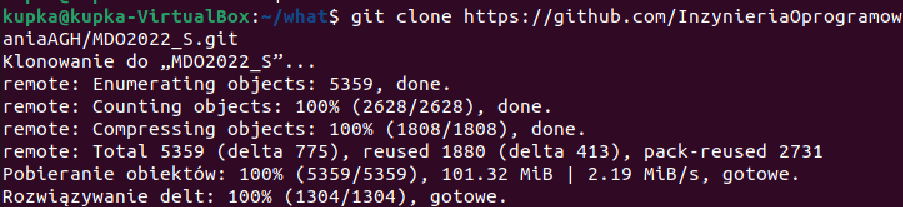
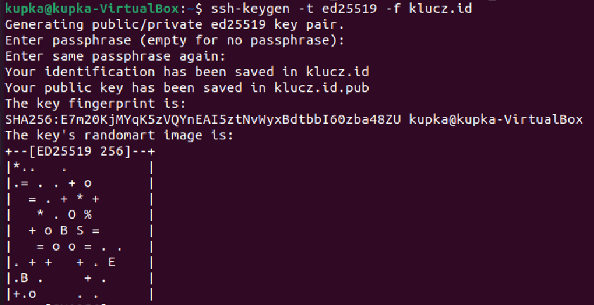
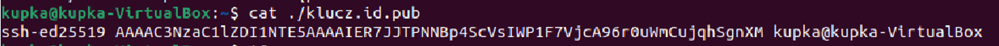
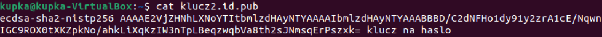
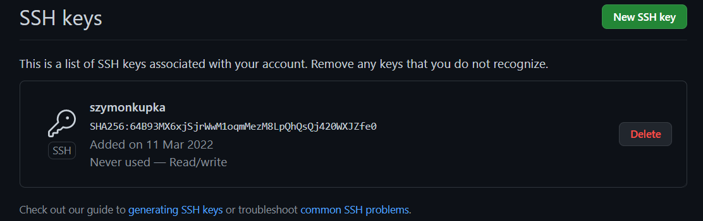
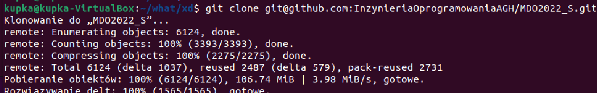
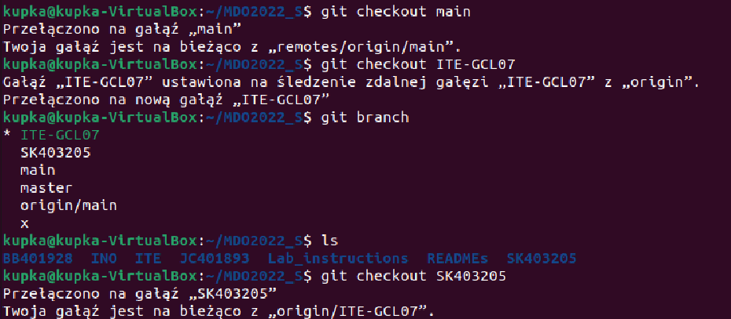
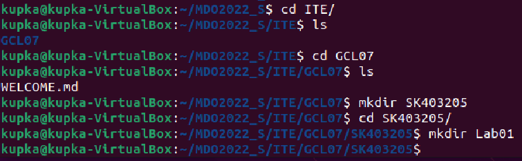
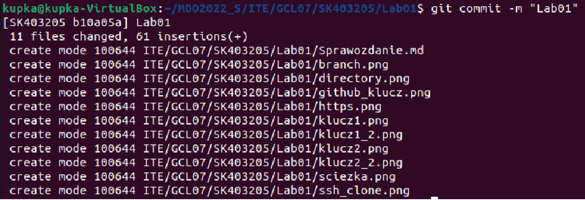
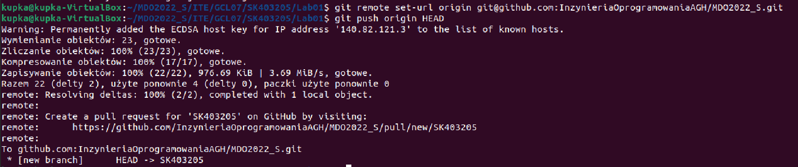

# Szymon Kupka 
## Git, Branches, SSH
sklinowano  repozytorium za pomocą HTTPS
```bash
$ git clone https://github.com/InzynieriaOprogramowaniaAGH/MDO2022_S.git
```


Utworzono dwa klucze SSH, inne niż RSA, w tym  jeden zabezpieczony hasłem

-klucz bez hasła
```bash
$ ssh-keygen -t ed25519 -f klucz.id
```

```bash
$ cat ./klucz.id.pub
```



-klucz z hasłem
```bash
ssh-keygen -t ecdsa -f kluczyk2.id -C 'klucz z haslem'
```

```bash
$ cat ./klucz2.id.pub
```


Skonfigowano klucz SSH jako metodę dostępu do GitHuba




Sklonano repozytorium z wykorzystaniem protokołu SSH

```bash
$ git clone git@github.com:InzynieriaOprogramowaniaAGH/MDO2022_S.git
```


Przełączono się na gałąź main, a potem na gałąź grupy oraz utworzono gałąź o nazwie SK403205 
```bash
$ git checkout main
```
```bash
$ git checkout -b SK403205 origin/ITE-GCL07
```


W katalogu grupy utworzono nowy katalog, także o nazwie SK403205
W nim także utworzono katalog: Lab01



W nowym katalogu dodano pliki ze sprawozdaniem za pomocą `git add .`


Stworzono komit z komentarzem


Zmieniono URL z HTTPS na SSH
Wysłano zmiany do zdalnego repozytorium za pomocą `git push`.



