# Szymon Kupka 
## Hooks, heterogeniczne środowisko pracy, instancja Dockera
utworzono hook sprawdzający, czy tytuł commita nazywa się
w katalogu `MDO2022_S/.git/hooks` edytowano plik `commit-msg.sample`
```bash
$ git clone https://github.com/InzynieriaOprogramowaniaAGH/MDO2022_S.git
```
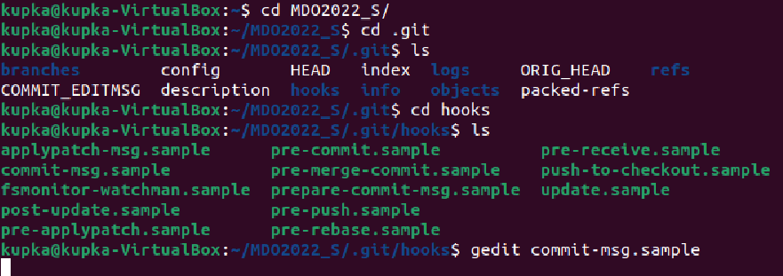

i zmieniono jego tresc oraz mazwe (pozbyto sie rozszezenia .sample)
```bash
#!/bin/bash

 ID="SK403205"
 echo "Sprawdzam poprawnosc nazwy commita"
if [[ $( cat $1) = $ID* ]] ;then
       echo "Nazwa commitu jest prawidlowa"

 else

       echo "Nazwa commitu nie jest prawidlowa"

       exit 1

 fi
```
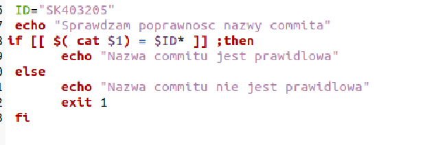

nastepnie sprawdzono działanie hooka wykonując komende commit z odpowiednim komentarzem
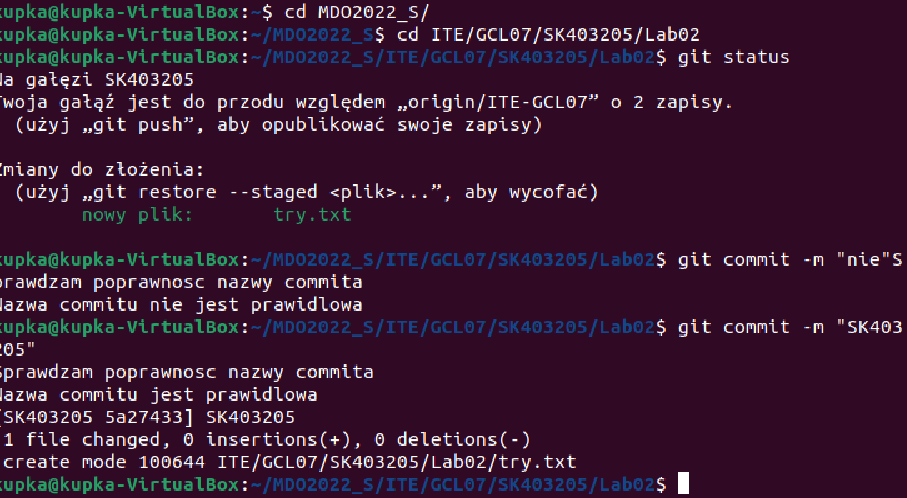
Utworzono hook sprawdzający, czy w treści commita pada numer labu, właściwy dla zadania edytujac plik `pre-commit.sample`
```bash
#!/bin/sh

if git diff --cached | grep "Lab"
then
       echo "Commit in Lab"
else
       echo "commit not et in Lab"
       exit 1
fi
```
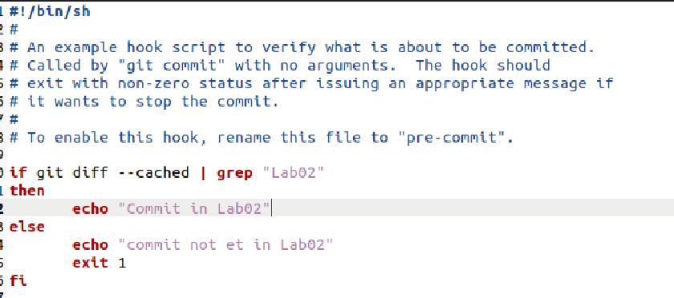

oraz sprawdzono działanie hooka

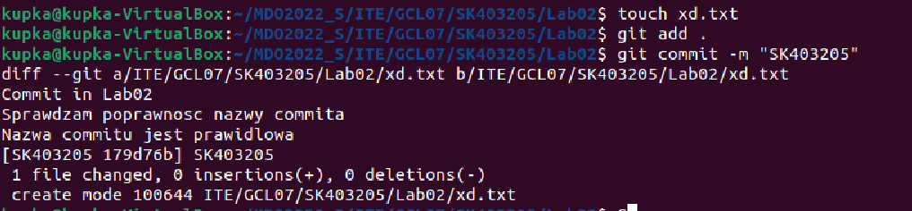
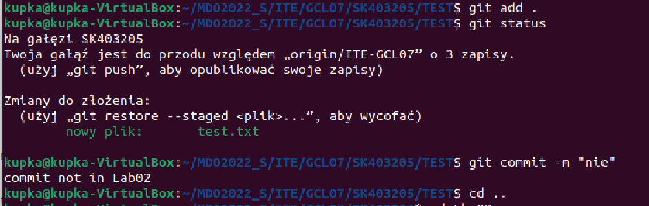

Za pomocą poniższej komendy sprawdziłam status OpenSSH servera:
```bash
$ sudo systemctl status ssh
```
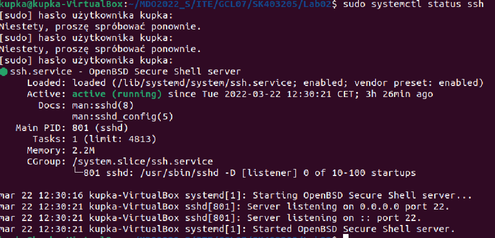

sprawdzono czy program docker jest aktywny ponizszą komędą
```bash
$ sudo systemctl status docker
```


zalogowano sie na VM przy pomocy PuTTY
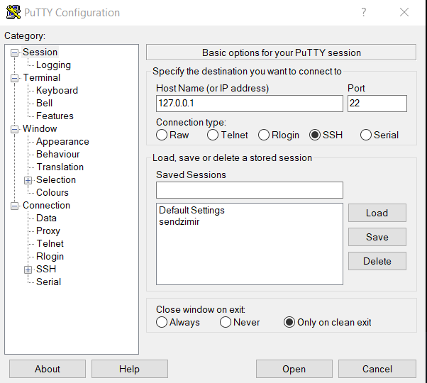

Uruchomiłam obraz `hello-world` przy pomocy komendy:

```bash
$ sudo docker run hello-world
```
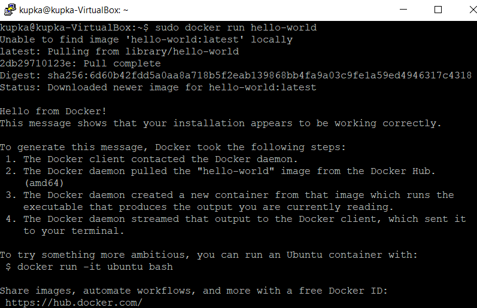


wykazanie działania dockera w sposób praktyczny

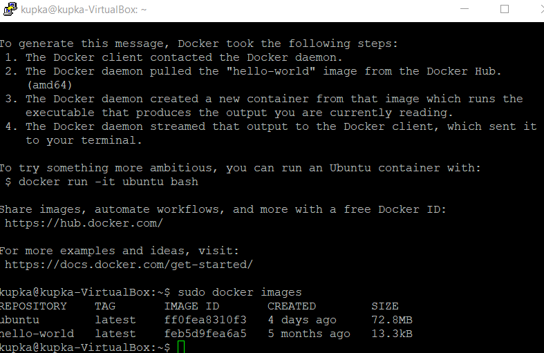


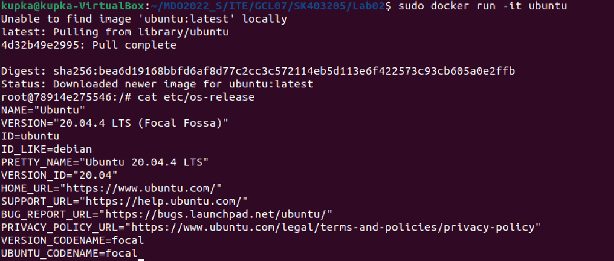

Założenie konta na Docker Hub
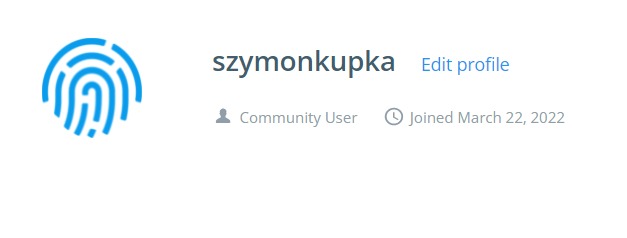