# Szymon Kupka 
## Docker files, kontener jako definicja etapu

Znalezieno repozytorium spełniające wymagania  https://github.com/nodejs/nodejs.org.git oraz sklonowanie go komendą `git clone`
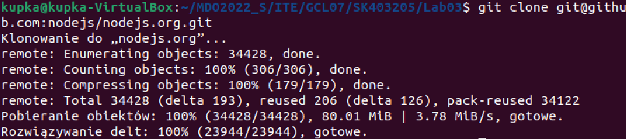
Następnie zainstalowano wymagane zalezność oraz wykonano kolejno
```bash
$ npm install
```
```bash
$ npm run build
```
```bash
$ npm run test
```
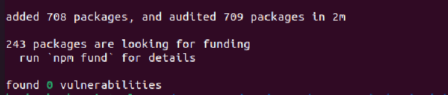

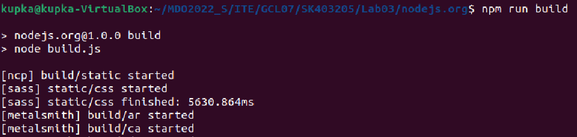
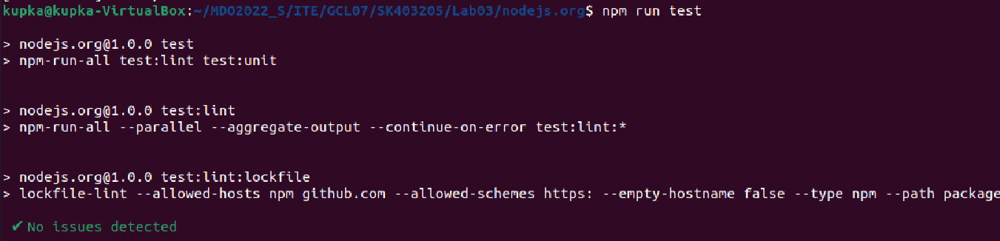
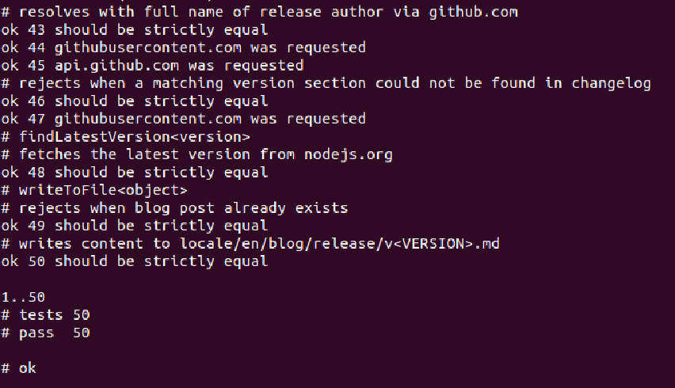
pobrano obraz node
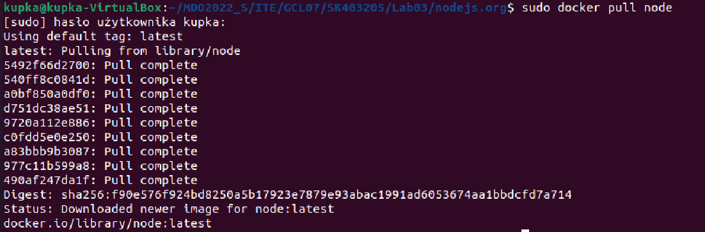
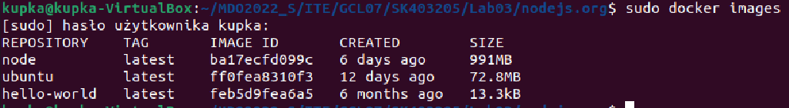
uruchomiono kontener
podłączono do niego TTY celem rozpoczęcia interaktywnej pracy

Pobrano wymagane pakiety oraz uruchomiono build oraz testy nie w kontenerze.
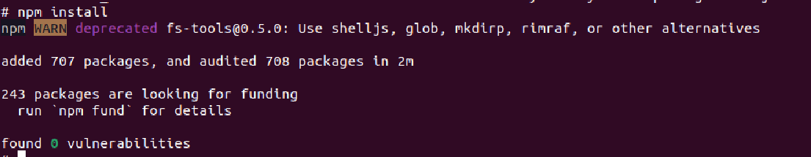
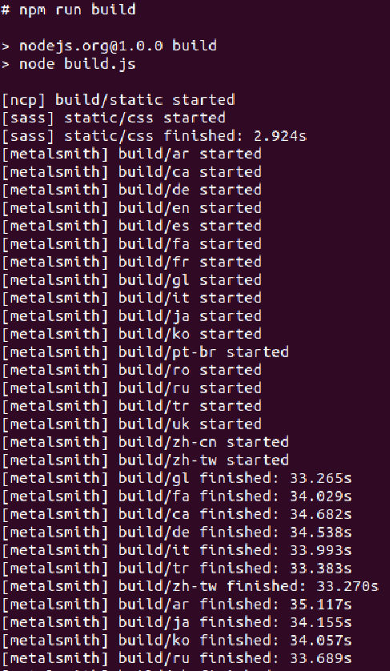
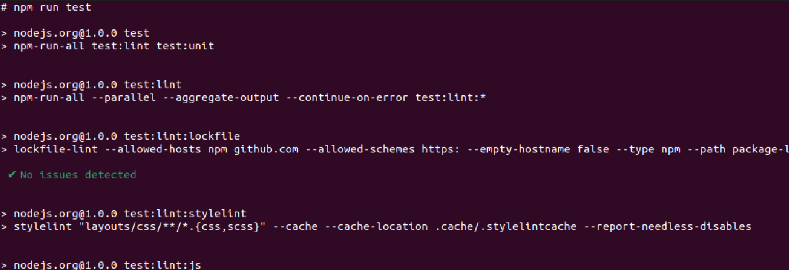
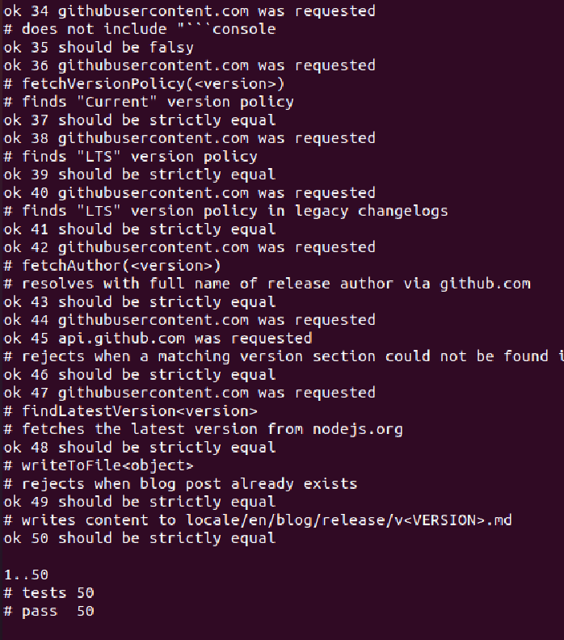

stworzono pilk dockerfile1 oraz sprawdzono poprawnosc dzialania pliku

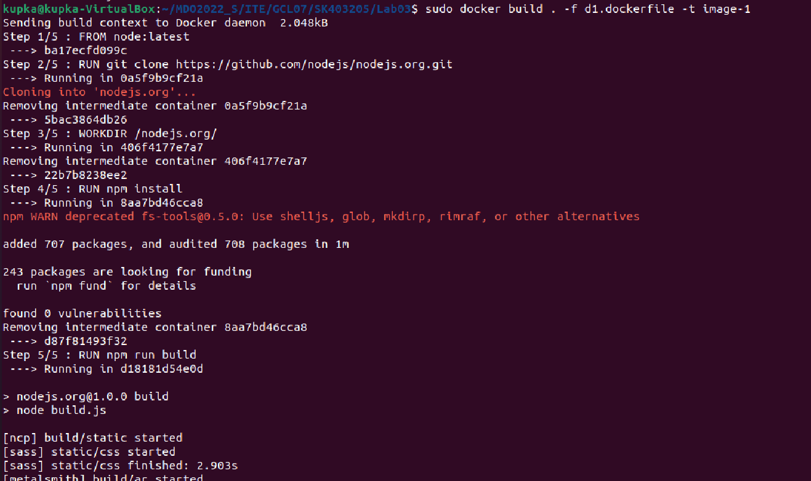
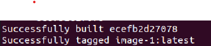
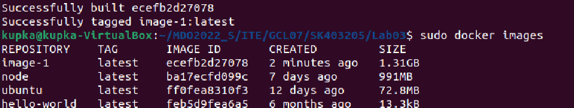
stworzono drugi plik dockerfile bazujacy na pierwszym oraz wykonujący testy
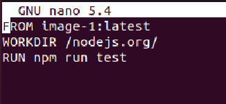
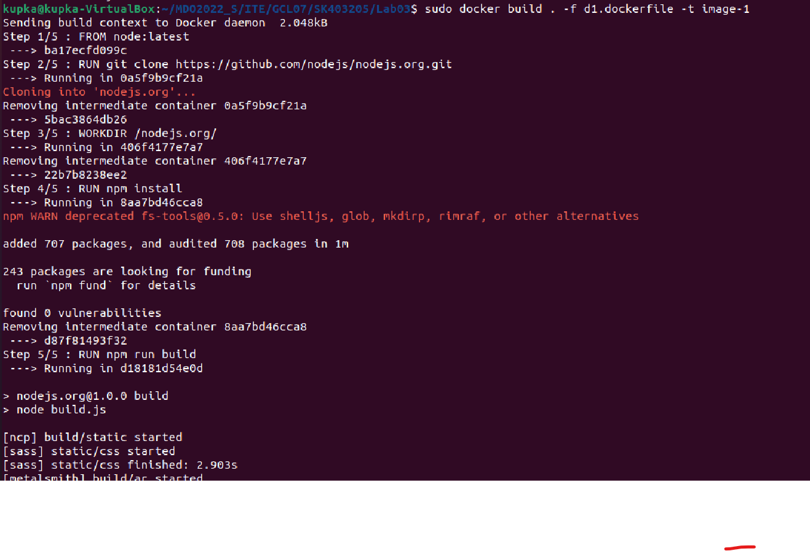
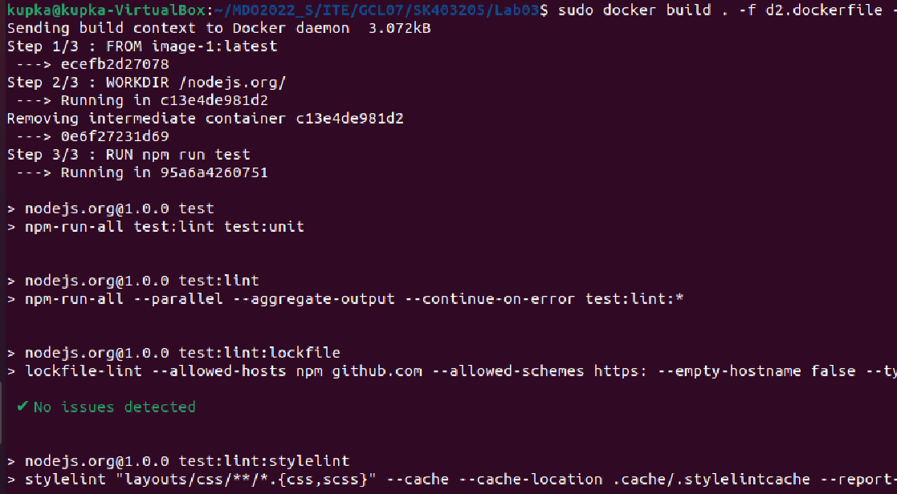
sprawdzenie historii
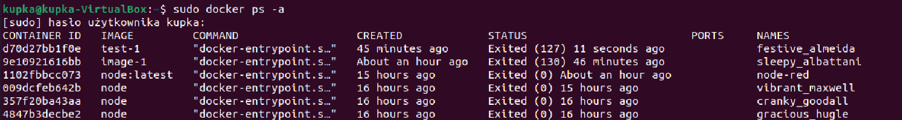
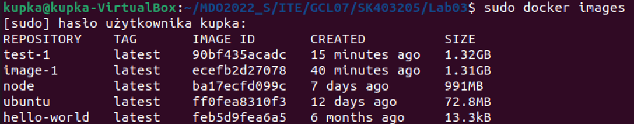
kontener wdraża się i pracuje poprawnie
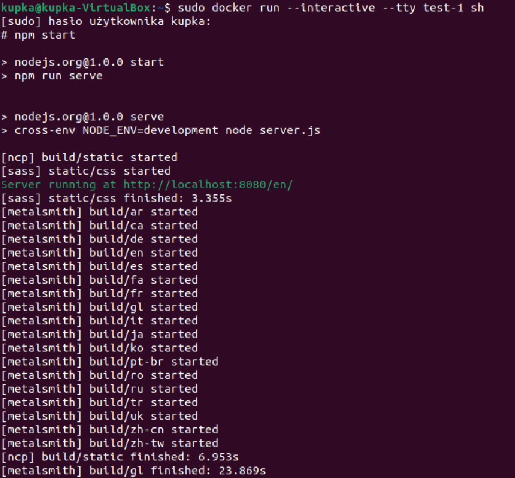
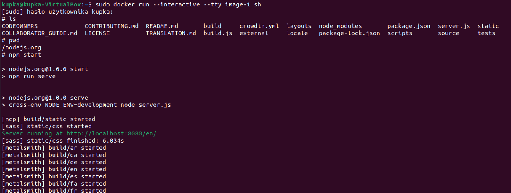


