Przygotowano woluminy wejściowy `vol-in` i wyjściowy `vol-out`

```bash
$ sudo docker volume create --name vol-in
```

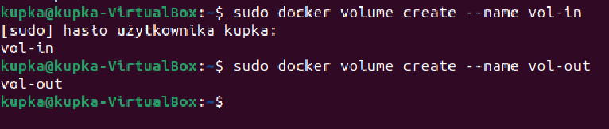

Uruchomiono kontener z woluminami

```bash
$ sudo docker run -it --name node-volume --mount source=vol-in,target=/vin --mount source=vol-out,target=/vout node bash
```
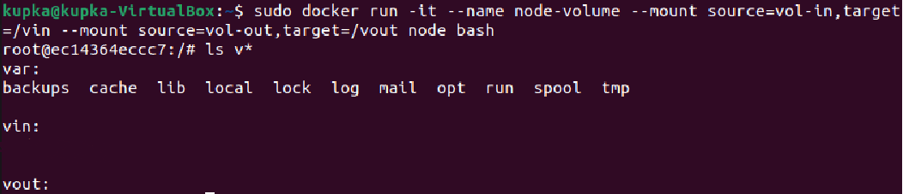

Przejście do "Mountpion" `vol-in` oraz zklonowanie repozytojum
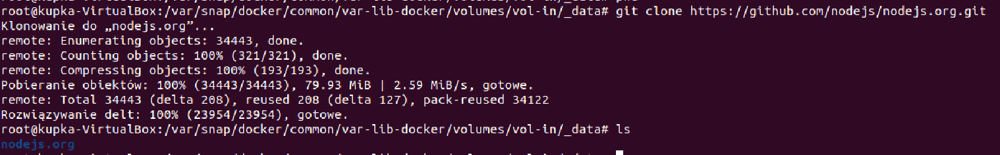

Zainstalowano niezbędne wymagania  `npm install` oraz uruchomiono build w kontenerze `npm run build`
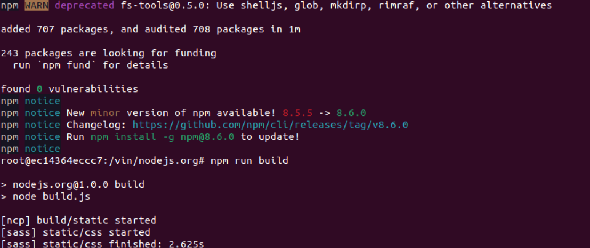
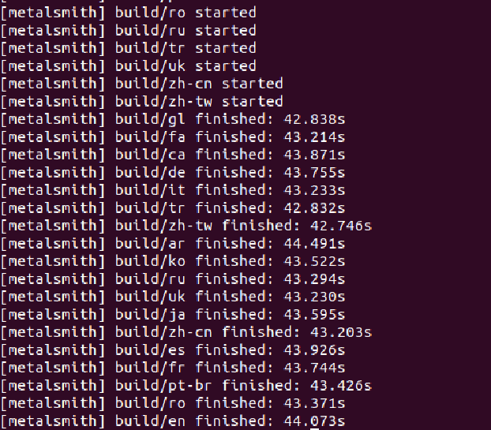


skopiowano plik `build` do katalogu `/vout` / zapisano powstałe pliki na woluminie wyjściowym

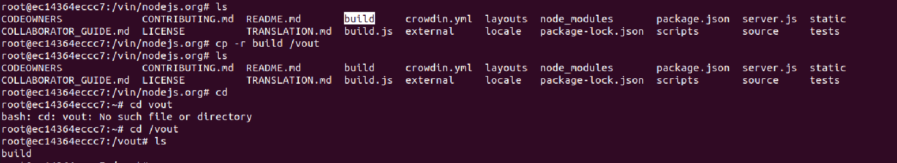


Uruchomienie wewnątrz kontenera serwera iperf (iperf3). 

```bash
$ sudo docker pull networkstatic/iperf3
```
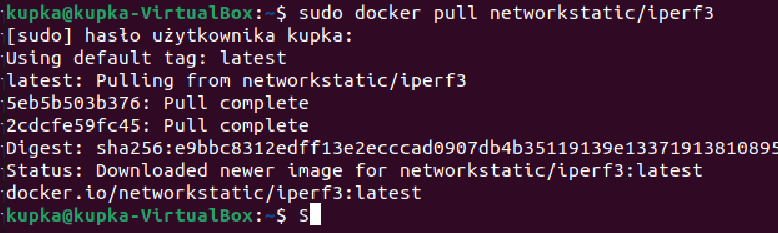

nasłuchiwanie na porcie 5201
```bash
sudo docker run -it --rm --name=iperf3-server -p 5201:5201 networkstatic/iperf3 -s
```

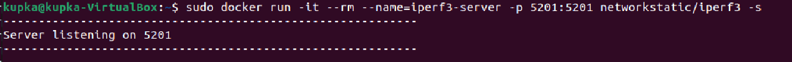

Sprawdzono IP servera

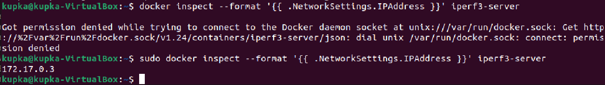

Nawiązanie połaczenia serwerem z innego kontenera


Nawiązanie połaczenia  serwerem klijentem jest host (ubuntu)

```bask
sudo iperf3 -c 172.17.0.3
```

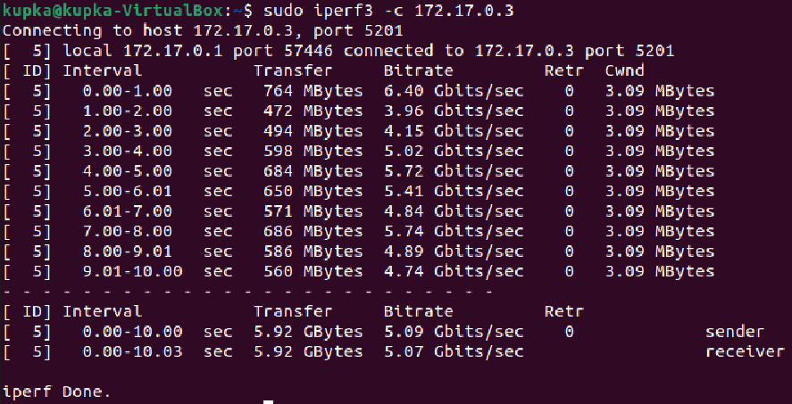

Nie udało sie nawiązać połaczenia z poza hosta
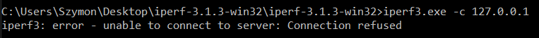


wyciągnieto log z kontenera
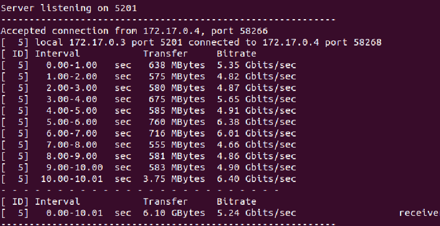
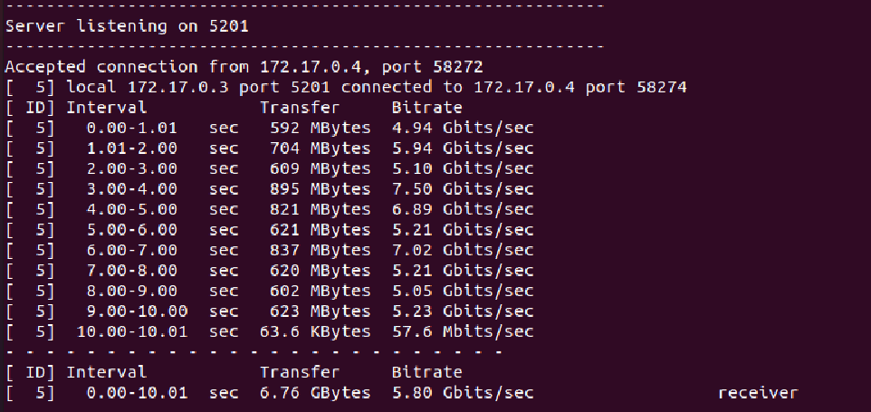
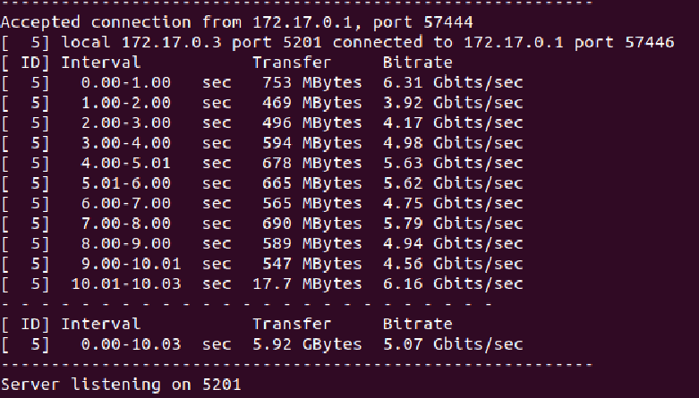

przepustowosc kontener / kontener wynosi 6.76GB
przepustowosc host / kontener wynosi 6.10GB

Utworzono nową sieć dla jenkinsa
```bash
sudo docker network create jenkins
```
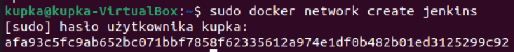

Konfiguracja obraz DIND kontenera

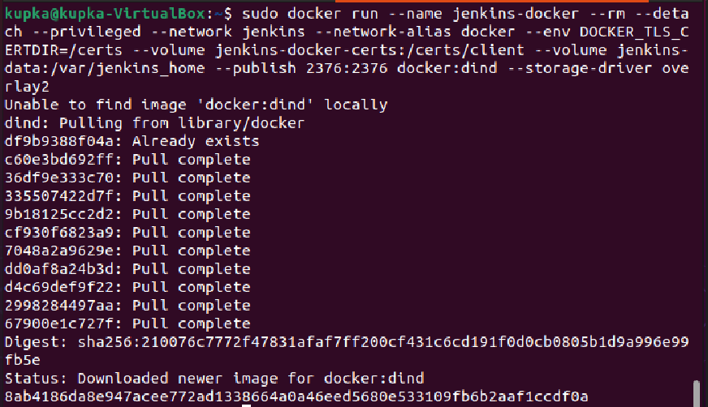

stworzono plik Dockerfile
```bash
FROM jenkins/jenkins:2.332.1-jdk11
USER root
RUN apt-get update && apt-get install -y lsb-release
RUN curl -fsSLo /usr/share/keyrings/docker-archive-keyring.asc \
  https://download.docker.com/linux/debian/gpg
RUN echo "deb [arch=$(dpkg --print-architecture) \
  signed-by=/usr/share/keyrings/docker-archive-keyring.asc] \
  https://download.docker.com/linux/debian \
  $(lsb_release -cs) stable" > /etc/apt/sources.list.d/docker.list
RUN apt-get update && apt-get install -y docker-ce-cli
USER jenkins
RUN jenkins-plugin-cli --plugins "blueocean:1.25.3 docker-workflow:1.28"
```

uruchomiono builda:
`docker build -t myjenkins-blueocean:2.332.1-1 .`
 
 uruchomiono obraz
 

  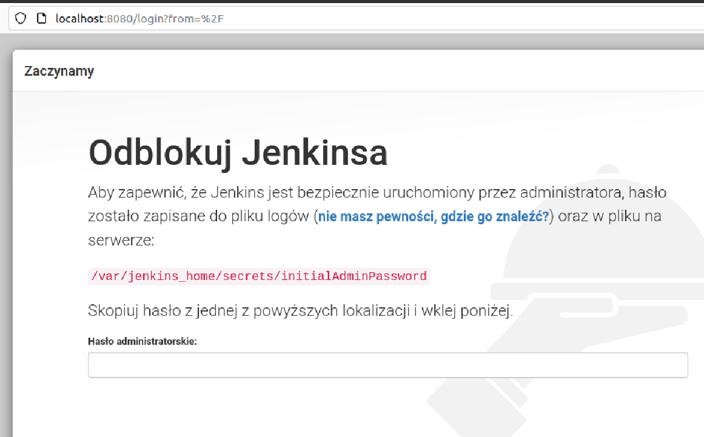
  ekran logowania jenkinsa
   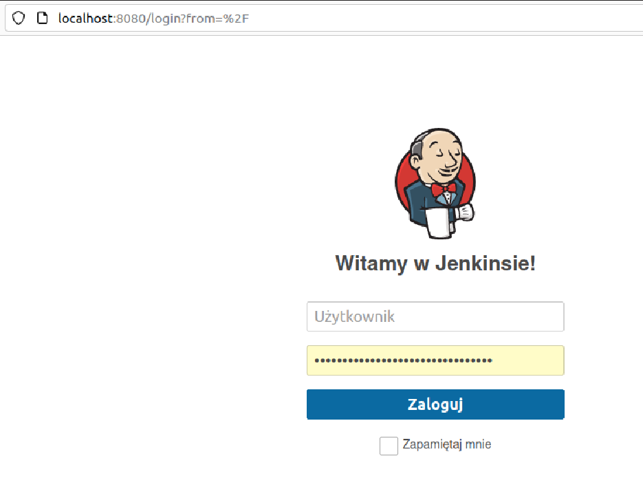


 
