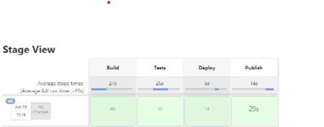

# PIPELINE

Przedstawiony pipeline służy do budowania, testowania, deployu oraz publishu prostej aplikacji napisanej w node.js


## Build
tworzenie obrazu builder, bazując na obrazie node twrzonym  dzieki plikowi dockerfile o nazwie `ockerfile1.dockerfile` :

```docker
FROM node:latest
RUN git clone https://github.com/nodejs/nodejs.org.git
WORKDIR /nodejs.org/
RUN npm install -f
RUN npm run build

```
 Poniżej przedstawiony jest fragment Jenkinsfile'a odnoszący się do tego stagu builda:
 ```bash
 stages{
        stage('Build') {
            steps {
                echo 'BUILD'
                dir('ITE/GCL07/SK403205/Lab05') {
                    sh 'docker build . -f dockerfile1.dockerfile -t builder'
                }
            }
        }
 
```

## Test
Utworzony zostaje obraz tester służący do przeprowadzanie testów  sprawdzających poprawność działania programu, bazując  na obrazie builder.

Poniżej przedstawiony jest dockerfile2, dzięki któremu odbywa się krok Test:

```docker
FROM builder:latest
WORKDIR /nodejs.org/
RUN npm run test
```
Poniżej przedstawiony jest fragment Jenkinsfile'a odnoszący się do tego stagu builda:
 ```bash
 stage('Tests') {
            steps {
                echo 'TESTS'
                dir('ITE/GCL07/SK403205/Lab05') {
                    sh 'docker build . -f dockerfile2.dockerfile -t tester'
                }
            }
        }
  ```

## Deploy
Uruchomiony zostaje obraz builder oraz podłączony zostaje wolumin, na który kopiowane są foldery en oraz static (pochodzące z folderu build), zawierające potrzebne pliki. W kroku Deploy pliki z buildera zostają wyciągnięte (używam woluminu). Ścieżka woluminu prowadzi do workspace, który zawiera folder pipelinu i repozytorium. Tworzony jest obraz deploy, bazujący na serwerze nginx. Na podstawie tego obrazu powstaje kontener hostujący zbuildowane pliki. Aby działał on poprawnie, kopiowany jest folder build do woluminu, a następnie zawartość folderów en oraz static do /usr/share/nginx/html . Na koniec przekierowywane są porty, w celu możliwości wejścia przez localhost na hostowaną stronę.

Poniżej dockerfile3, dzięki któremu odbywa się krok Deploy:
```docker
FROM nginx:stable-alpine

COPY /build/en/ /usr/share/nginx/html
COPY /build/static/ /usr/share/nginx/html
```


Poniżej przedstawiony jest fragment Jenkinsfile'a odnoszący się do tego stagu builda:
```bash
stage('Deploy') {
            steps {
                echo 'DEPLOY'
                sh 'docker run --volume /var/jenkins_home/workspace/pipeline1/ITE/GCL07/SK403205/Lab05:/final builder mv -n build /final'
                dir('ITE/GCL07/SK403205/Lab05') {
                    sh 'docker build . -f dockerfile3.dockerfile -t deploy'
                }
                sh 'docker run --volume /var/jenkins_home/workspace/pipeline1/ITE/GCL07/SK403205/Lab05/build:/build -d -p 3000:80 deploy'
                sh 'docker stop $(docker ps -a -q)'
            }
        }
 ```
 ## Publish
Publikacja programu. program nie wymaga instalatora,  zbuildowane pliki są od razu gotowe do wrzucenia i hostowania w kontenerze.  
Wystąpiły problemy z publikacją:
spakowano build z do pliku TAR.XZ 


```docker
FROM builder:latest

RUN tar cfJ archive.tar.xz build
```
Poniżej przedstawiony jest fragment Jenkinsfile'a odnoszący się do tego stagu builda:
```bash
stage('Publish') {
            steps {
                echo 'PUBLISH'
                dir('ITE/GCL07/SK403205/Lab05') {
                    sh 'docker build . -f dockerfile4.dockerfile -t publisher'
                }
                sh "docker run --volume /var/jenkins_home/workspace/pipeline1/ITE/GCL07/SK403205/Lab05:/final publisher mv archive.tar.xz /final"
            }
        }
    }

```

##   Potwierdzenie poprawności budowny pipeline'u:
