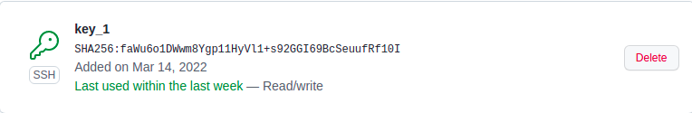
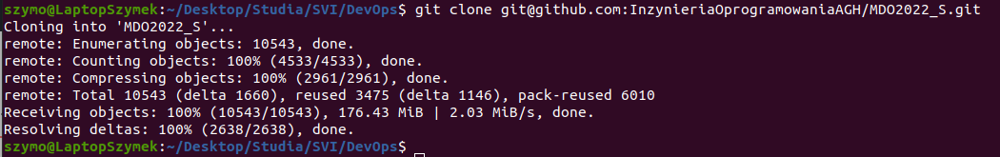
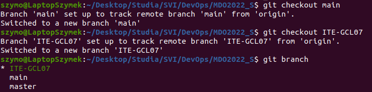
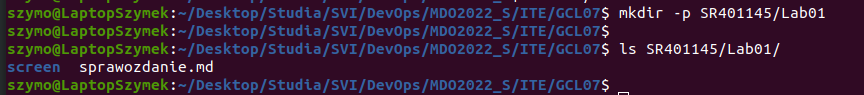

# Sprawozdanie Lab01
# Szymon Rewilak

## Przebieg ćwiczenia
1. Skonfigurowano klucze SSH

2. Sklonowano repozytorium z użyciem SSH
$ git clone git@github.com:InzynieriaOprogramowaniaAGH/MDO2022_S.git

3. Przełączono na gałąź main, później na gałąź ITE-GCL-07

4. Utworzono podkatalogi, w którym umieszczono zrzuty ekranu i sprawozdanie

