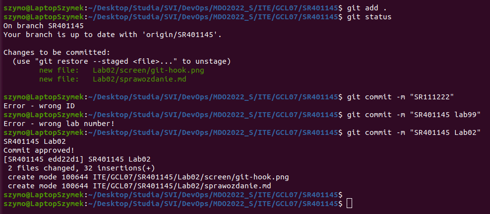
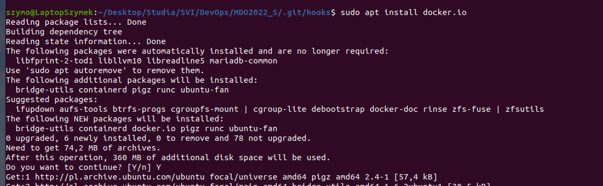
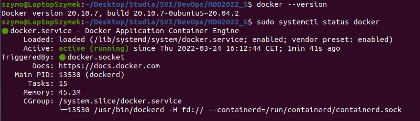
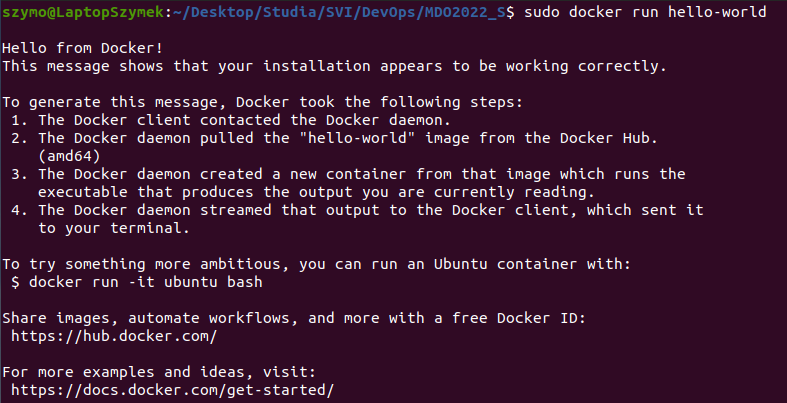
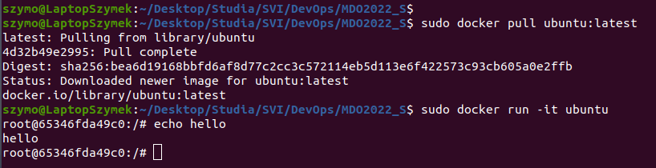

# Sprawozdanie Lab02
# Szymon Rewilak

## Przebieg ćwiczenia
1. Edytowano plik commit-msg znajdujący się w folderze .git/hooks
Napisano skrypt, który sprawdza poprawność notatki dodawanej w commicie.
Aby można było wykonać commita, należy użyć poprawnej nazwy commita (SR401145) oraz poprawny numer laboratorium (LabN)

```
#!/bin/bash
index="SR401145"
lab=".*Lab[0-9]+.*"
title='head -n1 $1'

if ! [[ $(head -n1 $1 | cut -c1-8)  == "$index" ]]; then
	echo "Error - wrong ID"
	exit 1;
fi
if ! grep -E -w -o "$lab" "$1" ; then
	echo "Error - wrong lab number!"
	exit 1
fi

echo "Commit approved!"
exit 0;
```


2. Przetestowano poprawne działanie hooka:



# Środowisko dockerowe
Wykorzystywanym systemem operacyjnym jest Ubuntu, zatem nie była wykorzystywana maszyna wirtualna.

1. Instalacja dockera:
```
$ sudo apt install docker.io
```


2. Przetestowano poprawne działanie dockera 



3. Uruchomiono przykładowy obraz "hello world"
```
$ sudo docker run hello-world
```


4. Pobrano obraz dystrybucji linuksowej i uruchomiono go:
```
$ sudo docker pull ubuntu:latest
$ sudo docker run -it ubuntu
```


# Utworzenie konta na Docker Hub
Utworzono konto na Docker Hub:


